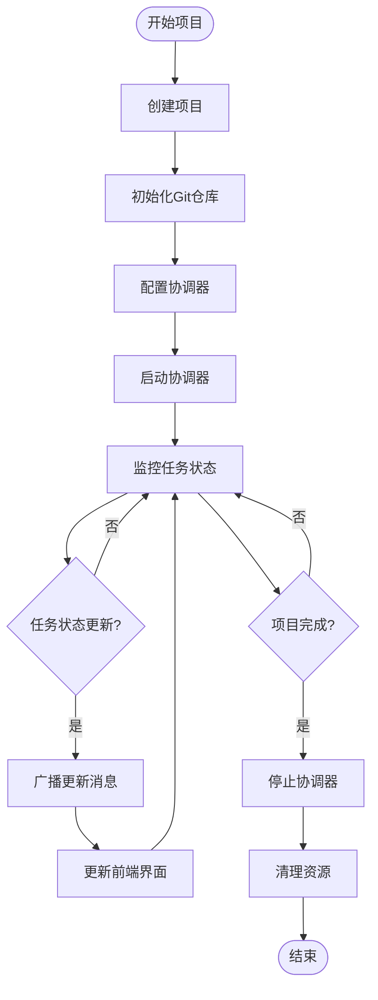

# API服务集成

<cite>
**本文档引用的文件**
- [api.ts](file://dashboard/frontend/src/services/api.ts)
- [websocket.ts](file://dashboard/frontend/src/services/websocket.ts)
- [useWebSocket.ts](file://dashboard/frontend/src/hooks/useWebSocket.ts)
- [index.ts](file://dashboard/frontend/src/types/index.ts)
- [websocket_manager.py](file://dashboard/backend/websocket_manager.py)
- [api.py](file://dashboard/backend/api.py)
- [main.py](file://dashboard/backend/main.py)
- [models.py](file://dashboard/backend/models.py)
- [vite.config.ts](file://dashboard/frontend/vite.config.ts)
</cite>

## 目录
1. [简介](#简介)
2. [项目架构概览](#项目架构概览)
3. [RESTful API服务](#restful-api服务)
4. [WebSocket通信机制](#websocket通信机制)
5. [数据模型与类型安全](#数据模型与类型安全)
6. [通信时序与流程](#通信时序与流程)
7. [错误处理与重连机制](#错误处理与重连机制)
8. [最佳实践与优化建议](#最佳实践与优化建议)
9. [总结](#总结)

## 简介

TaskTree项目采用现代化的前后端分离架构，通过RESTful API和WebSocket两种通信机制实现高效的数据交换。前端使用TypeScript构建，后端基于Python FastAPI框架，提供了完整的任务管理、项目协调和实时通信功能。

本文档详细分析了API服务的集成方式，包括请求封装、错误处理、WebSocket连接管理以及实时数据推送等核心功能。

## 项目架构概览

系统采用分层架构设计，清晰分离前端服务层、业务逻辑层和数据访问层：

**图表来源**
- [main.py](file://dashboard/backend/main.py#L34-L56)
- [api.ts](file://dashboard/frontend/src/services/api.ts#L1-L248)
- [websocket.ts](file://dashboard/frontend/src/services/websocket.ts#L1-L98)

**章节来源**
- [main.py](file://dashboard/backend/main.py#L1-L56)
- [api.ts](file://dashboard/frontend/src/services/api.ts#L1-L248)
- [websocket.ts](file://dashboard/frontend/src/services/websocket.ts#L1-L98)

## RESTful API服务

### API客户端架构

前端API服务采用类封装模式，提供统一的请求管理和错误处理机制：

**图表来源**
- [api.ts](file://dashboard/frontend/src/services/api.ts#L5-L248)
- [index.ts](file://dashboard/frontend/src/types/index.ts#L1-L84)

### 请求封装与错误处理

API服务实现了统一的请求封装机制，包含以下特性：

1. **自动JSON解析**：自动处理响应数据的JSON解析
2. **错误处理**：统一的HTTP错误和解析错误处理
3. **日志记录**：关键操作的日志输出
4. **类型安全**：TypeScript类型约束确保数据完整性

### 核心API方法

系统提供了完整的CRUD操作和业务特定接口：

| 功能分类 | 方法名称 | HTTP方法 | 描述 |
|---------|---------|---------|------|
| 项目管理 | getProjects | GET | 获取所有项目列表 |
| 项目管理 | getProject | GET | 获取单个项目详情 |
| 项目管理 | createProject | POST | 创建新项目 |
| 项目管理 | updateProject | PUT | 更新项目信息 |
| 项目管理 | deleteProject | DELETE | 删除项目 |
| 项目统计 | getProjectStats | GET | 获取项目统计数据 |
| 任务管理 | getTasks | GET | 获取项目任务列表 |
| 任务管理 | createTask | POST | 创建新任务 |
| 任务管理 | updateTask | PUT | 更新任务状态 |
| 任务管理 | deleteTask | DELETE | 删除任务 |
| 任务管理 | mergeTask | POST | 合并完成的任务 |
| 代理管理 | getAgents | GET | 获取项目代理列表 |
| 代理管理 | launchITerm | POST | 启动iTerm会话 |
| 代理管理 | launchAgentMonitor | POST | 启动代理监控 |
| 代理管理 | resetAgentTasks | POST | 重置代理任务 |
| 协调器 | getOrchestratorConfig | GET | 获取配置 |
| 协调器 | updateOrchestratorConfig | PUT | 更新配置 |
| 协调器 | startOrchestrator | POST | 启动协调器 |
| 协调器 | stopOrchestrator | POST | 停止协调器 |
| 计划生成 | generatePlan | POST | 生成项目计划 |
| 计划生成 | generateTaskBreakdown | POST | 生成任务分解 |

**章节来源**
- [api.ts](file://dashboard/frontend/src/services/api.ts#L29-L248)

## WebSocket通信机制

### WebSocket连接管理

后端WebSocket服务采用连接池管理模式，支持多客户端实时通信：

**图表来源**
- [websocket.ts](file://dashboard/frontend/src/services/websocket.ts#L5-L98)
- [websocket_manager.py](file://dashboard/backend/websocket_manager.py#L10-L55)

### WebSocket Hook抽象

前端提供了`useWebSocket` Hook来简化WebSocket事件处理：

**图表来源**
- [useWebSocket.ts](file://dashboard/frontend/src/hooks/useWebSocket.ts#L5-L24)
- [websocket.ts](file://dashboard/frontend/src/services/websocket.ts#L13-L98)

### 消息协议格式

WebSocket消息采用标准化的JSON格式：

| 字段名 | 类型 | 必需 | 描述 |
|--------|------|------|------|
| type | string | 是 | 消息类型标识符 |
| project_id | string | 否 | 关联的项目ID |
| data | any | 是 | 消息负载数据 |
| timestamp | string | 是 | UTC时间戳 |

**章节来源**
- [websocket.ts](file://dashboard/frontend/src/services/websocket.ts#L1-L98)
- [useWebSocket.ts](file://dashboard/frontend/src/hooks/useWebSocket.ts#L1-L24)
- [websocket_manager.py](file://dashboard/backend/websocket_manager.py#L1-L55)

## 数据模型与类型安全

### 前端类型定义

系统采用强类型设计，确保前后端数据一致性：

**图表来源**
- [index.ts](file://dashboard/frontend/src/types/index.ts#L1-L84)

### 后端数据模型

后端使用Pydantic模型确保数据验证和序列化：

| 模型名称 | 用途 | 主要字段 |
|---------|------|---------|
| Project | 项目实体 | id, name, path, max_agents, active |
| Task | 任务实体 | id, title, status, branch, dependencies |
| Agent | 代理实体 | id, session_name, task_id, status, progress |
| ProjectStats | 项目统计 | 各状态任务数量、活跃代理数 |
| OrchestratorConfig | 协调器配置 | 并发限制、合并策略、API设置 |
| WebSocketMessage | WebSocket消息 | type, project_id, data, timestamp |

**章节来源**
- [index.ts](file://dashboard/frontend/src/types/index.ts#L1-L84)
- [models.py](file://dashboard/backend/models.py#L99-L135)

## 通信时序与流程

### 前端请求到后端响应流程

**图表来源**
- [api.ts](file://dashboard/frontend/src/services/api.ts#L6-L27)
- [api.py](file://dashboard/backend/api.py#L94-L136)

### 实时推送流程

**图表来源**
- [websocket.ts](file://dashboard/frontend/src/services/websocket.ts#L13-L47)
- [websocket_manager.py](file://dashboard/backend/websocket_manager.py#L16-L55)

### 项目生命周期管理流程

**图表来源**
- [api.py](file://dashboard/backend/api.py#L94-L136)
- [websocket_manager.py](file://dashboard/backend/websocket_manager.py#L32-L55)

## 错误处理与重连机制

### 前端错误处理策略

API服务实现了多层次的错误处理机制：

**图表来源**
- [api.ts](file://dashboard/frontend/src/services/api.ts#L6-L27)

### WebSocket重连机制

WebSocket服务实现了指数退避重连算法：

**图表来源**
- [websocket.ts](file://dashboard/frontend/src/services/websocket.ts#L50-L67)

### 错误恢复策略

| 错误类型 | 处理策略 | 恢复机制 |
|---------|---------|---------|
| 网络超时 | 自动重试3次 | 指数退避延迟 |
| HTTP 4xx错误 | 显示用户友好提示 | 不自动重试 |
| HTTP 5xx错误 | 自动重试3次 | 固定延迟重试 |
| WebSocket断开 | 指数退避重连 | 最大5次重试 |
| JSON解析错误 | 记录日志并降级处理 | 使用默认值 |
| 认证失败 | 清除缓存并要求重新登录 | 引导用户重新认证 |

**章节来源**
- [api.ts](file://dashboard/frontend/src/services/api.ts#L15-L27)
- [websocket.ts](file://dashboard/frontend/src/services/websocket.ts#L50-L67)

## 最佳实践与优化建议

### 性能优化建议

1. **请求批处理**：对于频繁的API调用，考虑使用批处理减少网络开销
2. **缓存策略**：对静态数据实施客户端缓存机制
3. **连接池管理**：合理配置WebSocket连接池大小
4. **消息压缩**：对大数据量的消息启用压缩传输

### 安全最佳实践

1. **输入验证**：前后端双重验证确保数据安全性
2. **CORS配置**：严格控制跨域请求来源
3. **认证授权**：实施适当的访问控制机制
4. **数据加密**：敏感数据传输使用HTTPS/WSS

### 监控与调试

1. **日志记录**：关键操作添加详细日志
2. **性能监控**：跟踪API响应时间和WebSocket连接状态
3. **错误追踪**：集成错误监控服务
4. **用户行为分析**：收集使用模式优化体验

### 扩展性考虑

1. **微服务架构**：为大型项目考虑服务拆分
2. **消息队列**：引入异步处理机制
3. **CDN加速**：静态资源使用内容分发网络
4. **负载均衡**：多实例部署支持水平扩展

## 总结

TaskTree项目通过精心设计的API服务集成方案，实现了高效的前后端通信。RESTful API提供了完整的CRUD操作和业务逻辑处理，而WebSocket机制则确保了实时数据推送和状态同步。

系统的主要优势包括：

1. **类型安全**：完整的TypeScript类型定义确保数据一致性
2. **错误处理**：多层次的错误处理和恢复机制
3. **实时通信**：可靠的WebSocket连接和消息广播
4. **可扩展性**：模块化的架构设计支持功能扩展
5. **开发体验**：良好的开发工具链和调试支持

通过遵循本文档中的最佳实践和优化建议，可以进一步提升系统的性能、可靠性和用户体验。这种混合通信模式为现代Web应用提供了坚实的技术基础，能够满足复杂业务场景的需求。