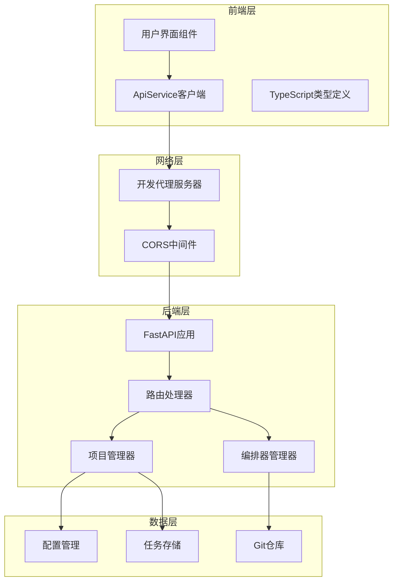
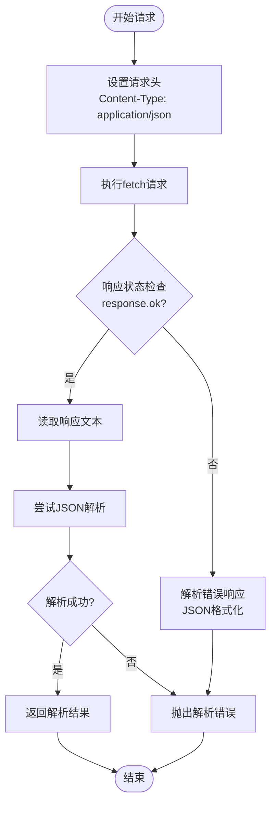
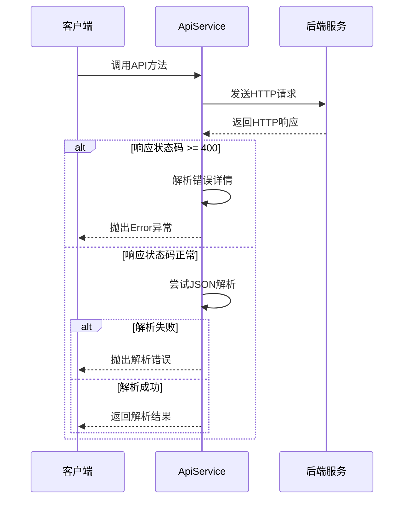
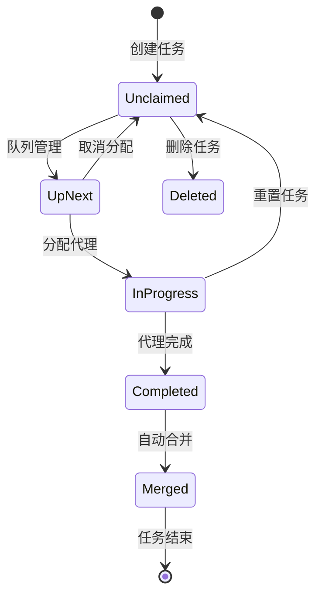
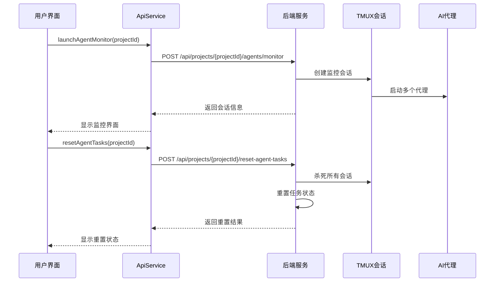
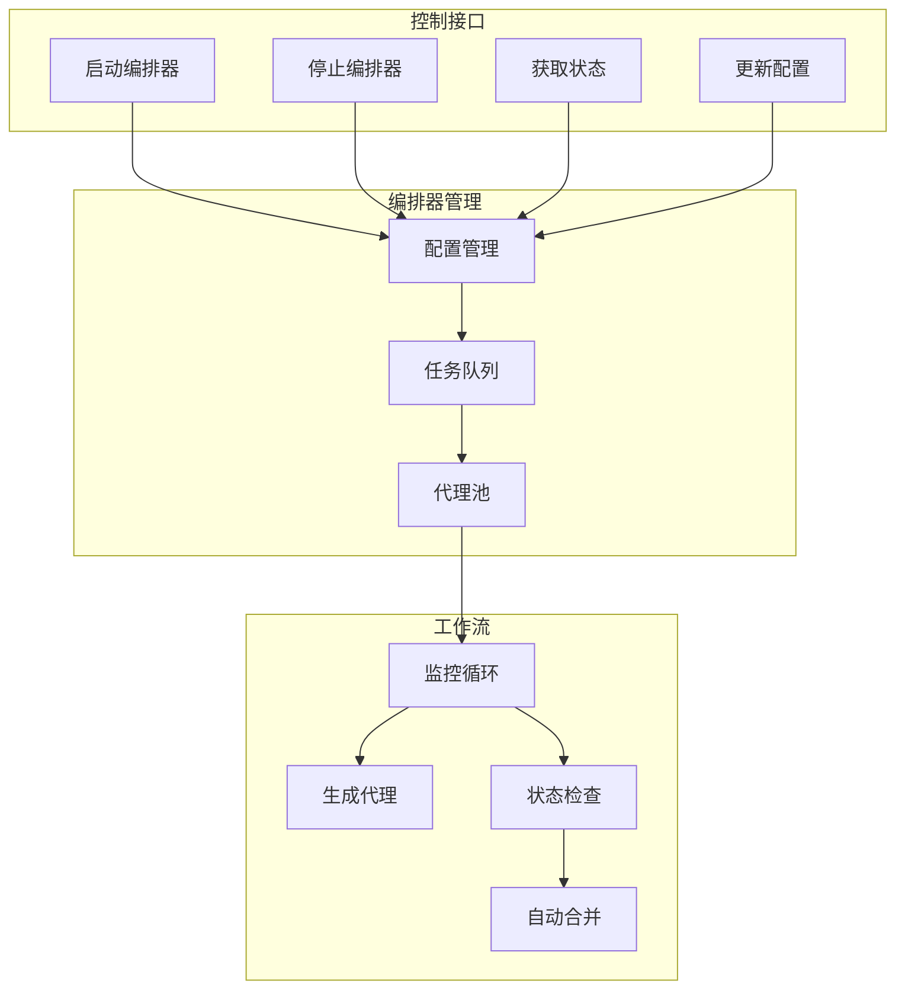
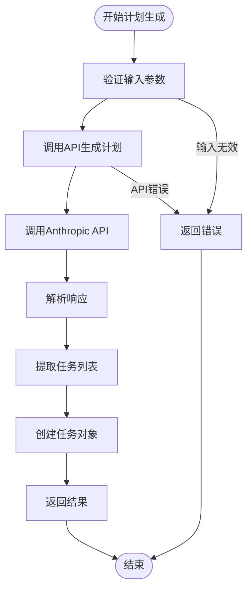
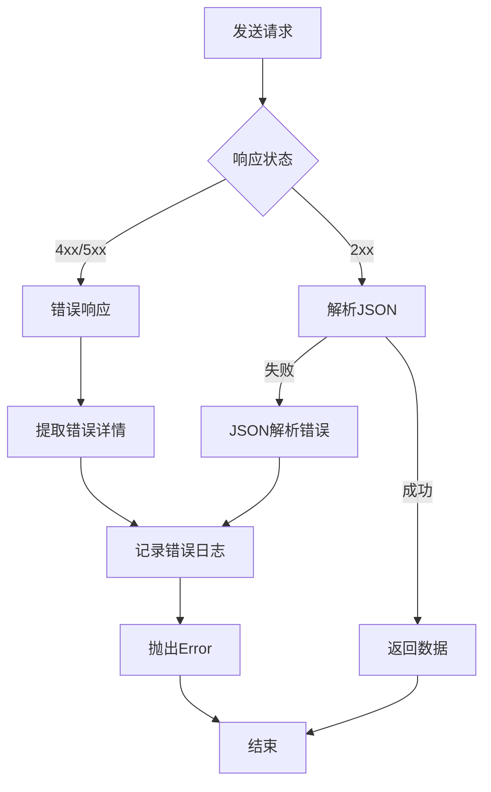

# REST API客户端详细文档

<cite>
**本文档中引用的文件**
- [api.ts](file://dashboard/frontend/src/services/api.ts)
- [main.py](file://dashboard/backend/main.py)
- [api.py](file://dashboard/backend/api.py)
- [orchestrator.py](file://dashboard/backend/orchestrator.py)
- [project_manager.py](file://dashboard/backend/project_manager.py)
- [models.py](file://dashboard/backend/models.py)
- [index.ts](file://dashboard/frontend/src/types/index.ts)
- [requirements.txt](file://requirements.txt)
- [vite.config.ts](file://dashboard/frontend/vite.config.ts)
</cite>

## 目录
1. [简介](#简介)
2. [项目架构概览](#项目架构概览)
3. [ApiService类核心实现](#apiservice类核心实现)
4. [项目管理API](#项目管理api)
5. [任务操作API](#任务操作api)
6. [代理控制API](#代理控制api)
7. [编排器控制API](#编排器控制api)
8. [计划生成功能](#计划生成功能)
9. [错误处理与重试策略](#错误处理与重试策略)
10. [性能优化建议](#性能优化建议)
11. [最佳实践指南](#最佳实践指南)

## 简介

本文档详细介绍了SplitMind Dashboard项目的REST API客户端实现，重点分析了前端`api.ts`文件中的`ApiService`类。该服务提供了统一的HTTP请求封装机制，支持项目管理、任务操作、代理控制、编排器管理和计划生成等功能。

系统采用前后端分离架构：
- **前端**：基于React + TypeScript的单页应用
- **后端**：基于FastAPI的Python REST API服务器
- **通信协议**：HTTP/HTTPS RESTful API + WebSocket实时通信

## 项目架构概览



**图表来源**
- [main.py](file://dashboard/backend/main.py#L34-L56)
- [api.ts](file://dashboard/frontend/src/services/api.ts#L1-L248)

**章节来源**
- [main.py](file://dashboard/backend/main.py#L1-L56)
- [api.ts](file://dashboard/frontend/src/services/api.ts#L1-L248)

## ApiService类核心实现

### 请求封装机制

`ApiService`类的核心是`request`方法，它提供了统一的HTTP请求处理机制：



**图表来源**
- [api.ts](file://dashboard/frontend/src/services/api.ts#L5-L27)

### 类型安全返回机制

系统通过TypeScript泛型确保类型安全：

| 方法签名 | 返回类型 | 描述 |
|---------|---------|------|
| `getProjects()` | `Promise<Project[]>` | 获取所有项目列表 |
| `createProject(project)` | `Promise<Project>` | 创建新项目 |
| `getTasks(projectId)` | `Promise<Task[]>` | 获取项目任务列表 |
| `createTask(projectId, title)` | `Promise<Task>` | 创建新任务 |
| `generatePlan(projectId, data)` | `Promise<PlanResponse>` | 生成项目计划 |

### 错误处理流程



**图表来源**
- [api.ts](file://dashboard/frontend/src/services/api.ts#L15-L26)

**章节来源**
- [api.ts](file://dashboard/frontend/src/services/api.ts#L5-L27)

## 项目管理API

### 核心项目操作

| API方法 | HTTP方法 | URL路径 | 参数 | 返回类型 | 功能描述 |
|---------|---------|---------|------|---------|----------|
| `getProjects()` | GET | `/api/projects` | 无 | `Promise<Project[]>` | 获取所有项目列表 |
| `getProject(id)` | GET | `/api/projects/{id}` | `id: string` | `Promise<Project>` | 获取指定项目详情 |
| `createProject(project)` | POST | `/api/projects` | `project: Partial<Project>` | `Promise<Project>` | 创建新项目 |
| `updateProject(id, updates)` | PUT | `/api/projects/{id}` | `id: string, updates: Partial<Project>` | `Promise<Project>` | 更新项目信息 |
| `deleteProject(id)` | DELETE | `/api/projects/{id}` | `id: string` | `Promise<void>` | 删除项目（可选清理文件） |
| `getProjectStats(id)` | GET | `/api/projects/{id}/stats` | `id: string` | `Promise<ProjectStats>` | 获取项目统计信息 |

### 项目重置功能

| API方法 | HTTP方法 | URL路径 | 参数 | 返回类型 | 功能描述 |
|---------|---------|---------|------|---------|----------|
| `resetProject(id)` | POST | `/api/projects/{id}/reset` | `id: string` | `Promise<{message: string}>` | 重置项目状态 |

### 实际使用示例

```typescript
// 创建新项目
const newProject = await api.createProject({
  name: "My Awesome Project",
  path: "/Users/me/projects/my-project",
  max_agents: 3
});

// 获取项目统计
const stats = await api.getProjectStats(newProject.id);
console.log(`总任务数: ${stats.total_tasks}`);
console.log(`进行中任务: ${stats.in_progress_tasks}`);
```

**章节来源**
- [api.ts](file://dashboard/frontend/src/services/api.ts#L29-L62)
- [api.py](file://dashboard/backend/api.py#L94-L166)

## 任务操作API

### 任务生命周期管理



**图表来源**
- [models.py](file://dashboard/backend/models.py#L10-L17)

### 任务操作接口

| API方法 | HTTP方法 | URL路径 | 参数 | 返回类型 | 功能描述 |
|---------|---------|---------|------|---------|----------|
| `getTasks(projectId)` | GET | `/api/projects/{projectId}/tasks` | `projectId: string` | `Promise<Task[]>` | 获取项目所有任务 |
| `createTask(projectId, title, description?)` | POST | `/api/projects/{projectId}/tasks` | `projectId: string, title: string, description?: string` | `Promise<Task>` | 创建新任务 |
| `updateTask(projectId, taskId, updates)` | PUT | `/api/projects/{projectId}/tasks/{taskId}` | `projectId: string, taskId: string, updates: Partial<Task>` | `Promise<Task>` | 更新任务信息 |
| `deleteTask(projectId, taskId)` | DELETE | `/api/projects/{projectId}/tasks/{taskId}` | `projectId: string, taskId: string` | `Promise<void>` | 删除任务 |
| `mergeTask(projectId, taskId)` | POST | `/api/projects/{projectId}/tasks/{taskId}/merge` | `projectId: string, taskId: string` | `Promise<void>` | 手动合并已完成任务 |

### 高级任务功能

| API方法 | HTTP方法 | URL路径 | 参数 | 返回类型 | 功能描述 |
|---------|---------|---------|------|---------|----------|
| `getProjectStats(id)` | GET | `/api/projects/{id}/stats` | `id: string` | `Promise<ProjectStats>` | 获取项目统计信息 |

### 依赖关系管理

任务支持复杂的依赖关系：

```typescript
// 创建有依赖的任务
const parentTask = await api.createTask(projectId, "实现核心功能");
const childTask = await api.createTask(projectId, "编写单元测试", {
  dependencies: [parentTask.id],
  priority: 1
});
```

**章节来源**
- [api.ts](file://dashboard/frontend/src/services/api.ts#L64-L96)
- [api.py](file://dashboard/backend/api.py#L377-L589)

## 代理控制API

### 代理生命周期管理



**图表来源**
- [api.ts](file://dashboard/frontend/src/services/api.ts#L108-L124)
- [api.py](file://dashboard/backend/api.py#L629-L737)

### 代理控制接口

| API方法 | HTTP方法 | URL路径 | 参数 | 返回类型 | 功能描述 |
|---------|---------|---------|------|---------|----------|
| `getAgents(projectId)` | GET | `/api/projects/{projectId}/agents` | `projectId: string` | `Promise<Agent[]>` | 获取项目运行中的代理列表 |
| `launchAgentMonitor(projectId)` | POST | `/api/projects/{projectId}/agents/monitor` | `projectId: string` | `Promise<{message: string, sessions: string[]}>` | 启动代理监控界面 |
| `resetAgentTasks(projectId)` | POST | `/api/projects/{projectId}/reset-agent-tasks` | `projectId: string` | `Promise<ResetResult>` | 重置代理任务状态 |
| `launchITerm(projectId, agentId)` | POST | `/api/projects/{projectId}/agents/{agentId}/launch-iterm` | `projectId: string, agentId: string` | `Promise<void>` | 在iTerm中启动代理会话 |

### 重置结果类型

```typescript
interface ResetResult {
  success: boolean;
  reset_count: number;
  killed_sessions: string[];
  message: string;
}
```

### 使用示例

```typescript
// 获取项目代理
const agents = await api.getAgents(projectId);
console.log(`当前运行代理: ${agents.length}`);

// 启动代理监控
const monitorResult = await api.launchAgentMonitor(projectId);
console.log(`监控界面已启动，包含 ${monitorResult.sessions.length} 个会话`);

// 重置所有代理任务
const resetResult = await api.resetAgentTasks(projectId);
console.log(`重置了 ${resetResult.reset_count} 个任务，杀死了 ${resetResult.killed_sessions.length} 个会话`);
```

**章节来源**
- [api.ts](file://dashboard/frontend/src/services/api.ts#L98-L124)
- [api.py](file://dashboard/backend/api.py#L595-L737)

## 编排器控制API

### 编排器架构



**图表来源**
- [orchestrator.py](file://dashboard/backend/orchestrator.py#L25-L120)

### 编排器控制接口

| API方法 | HTTP方法 | URL路径 | 参数 | 返回类型 | 功能描述 |
|---------|---------|---------|------|---------|----------|
| `getOrchestratorConfig()` | GET | `/api/orchestrator/config` | 无 | `Promise<OrchestratorConfig>` | 获取编排器配置 |
| `updateOrchestratorConfig(config)` | PUT | `/api/orchestrator/config` | `config: OrchestratorConfig` | `Promise<OrchestratorConfig>` | 更新编排器配置 |
| `startOrchestrator(projectId)` | POST | `/api/orchestrator/start` | `projectId: string` | `Promise<void>` | 启动编排器 |
| `stopOrchestrator()` | POST | `/api/orchestrator/stop` | 无 | `Promise<void>` | 停止编排器 |
| `getOrchestratorStatus()` | GET | `/api/orchestrator/status` | 无 | `Promise<{running: boolean, current_project?: string}>` | 获取编排器状态 |

### 编排器配置详解

```typescript
interface OrchestratorConfig {
  max_concurrent_agents: number;    // 最大并发代理数
  auto_merge: boolean;             // 是否自动合并
  merge_strategy: string;          // 合并策略：merge/squash/ff
  auto_spawn_interval: number;     // 自动生成间隔（秒）
  enabled: boolean;                // 是否启用
  api_provider: string;           // API提供商：anthropic/openai/azure
  api_model: string;              // 使用的模型
  api_key?: string;               // API密钥
  api_base_url?: string;          // API基础URL
}
```

### 使用示例

```typescript
// 获取当前配置
const config = await api.getOrchestratorConfig();
console.log(`最大并发代理数: ${config.max_concurrent_agents}`);

// 更新配置
await api.updateOrchestratorConfig({
  ...config,
  max_concurrent_agents: 8,
  auto_merge: true
});

// 启动编排器
await api.startOrchestrator(projectId);

// 检查状态
const status = await api.getOrchestratorStatus();
console.log(`编排器运行状态: ${status.running}`);
```

**章节来源**
- [api.ts](file://dashboard/frontend/src/services/api.ts#L132-L158)
- [api.py](file://dashboard/backend/api.py#L743-L791)

## 计划生成功能

### 计划生成流程



**图表来源**
- [api.ts](file://dashboard/frontend/src/services/api.ts#L160-L188)

### 计划生成接口

| API方法 | HTTP方法 | URL路径 | 参数 | 返回类型 | 功能描述 |
|---------|---------|---------|------|---------|----------|
| `generatePlan(projectId, data)` | POST | `/api/projects/{projectId}/generate-plan` | `projectId: string, data: PlanData` | `Promise<PlanResponse>` | 生成完整项目计划 |
| `generateTaskBreakdown(projectId, data)` | POST | `/api/projects/{projectId}/generate-task-breakdown` | `projectId: string, data: TaskData` | `Promise<TaskResponse>` | 生成任务分解方案 |

### 计划生成数据结构

```typescript
interface PlanData {
  project_overview: string;    // 项目概述
  initial_prompt: string;      // 初始提示
  dart_workspace?: string;     // Dart工作区
  dart_dartboard?: string;     // Dart面板
}

interface PlanResponse {
  plan: string;                // 生成的计划文本
  tasks_created: number;       // 创建的任务数量
  message: string;             // 操作消息
  cost_info?: any;            // 成本信息
  usage?: any;                // 使用统计
}
```

### 使用示例

```typescript
// 生成项目计划
const planResult = await api.generatePlan(projectId, {
  project_overview: "开发一个现代化的电商网站",
  initial_prompt: "需要实现用户认证、商品管理、购物车和支付功能",
  dart_workspace: "/path/to/workspace"
});

console.log(`生成了 ${planResult.tasks_created} 个任务`);
console.log(planResult.plan);

// 生成任务分解
const breakdownResult = await api.generateTaskBreakdown(projectId, {
  project_overview: "电商网站开发",
  initial_prompt: "实现用户认证模块"
});

console.log("任务分解:", breakdownResult.task_breakdown);
```

**章节来源**
- [api.ts](file://dashboard/frontend/src/services/api.ts#L160-L188)
- [models.py](file://dashboard/backend/models.py#L116-L127)

## 错误处理与重试策略

### 错误处理机制



**图表来源**
- [api.ts](file://dashboard/frontend/src/services/api.ts#L15-L26)

### 错误类型分类

| 错误类型 | HTTP状态码范围 | 处理策略 | 示例场景 |
|---------|-------------|---------|----------|
| 网络错误 | - | 自动重试 | 网络连接中断 |
| 服务器错误 | 500-599 | 指数退避重试 | 服务暂时不可用 |
| 客户端错误 | 400-499 | 不重试，显示错误 | 参数验证失败 |
| JSON解析错误 | - | 记录日志，抛出异常 | 响应格式不正确 |

### 重试策略实现

```typescript
class RetryableApiService extends ApiService {
  private async retryRequest<T>(
    url: string, 
    options: RequestInit, 
    retries = 3
  ): Promise<T> {
    try {
      return await this.request<T>(url, options);
    } catch (error) {
      if (retries > 0 && this.isRetryableError(error)) {
        await this.delay(1000 * (4 - retries)); // 指数退避
        return this.retryRequest(url, options, retries - 1);
      }
      throw error;
    }
  }

  private isRetryableError(error: any): boolean {
    return error instanceof TypeError || 
           (error.message && error.message.includes('NetworkError'));
  }

  private delay(ms: number): Promise<void> {
    return new Promise(resolve => setTimeout(resolve, ms));
  }
}
```

### 错误处理最佳实践

1. **用户友好的错误消息**
```typescript
try {
  const result = await api.createProject(invalidData);
} catch (error) {
  if (error.message.includes('Missing required field')) {
    showErrorToast('请填写所有必填字段');
  } else {
    showErrorToast('操作失败，请稍后重试');
  }
}
```

2. **优雅降级**
```typescript
async function loadProjectData(projectId: string) {
  try {
    const [project, tasks, agents] = await Promise.all([
      api.getProject(projectId),
      api.getTasks(projectId),
      api.getAgents(projectId)
    ]);
    return { project, tasks, agents };
  } catch (error) {
    // 即使部分数据加载失败，也返回可用的数据
    const project = await api.getProject(projectId);
    return { project, tasks: [], agents: [] };
  }
}
```

**章节来源**
- [api.ts](file://dashboard/frontend/src/services/api.ts#L15-L26)

## 性能优化建议

### 请求优化策略

1. **批量操作**
```typescript
// 推荐：批量更新任务
const updates = tasks.map(task => ({
  id: task.id,
  updates: { status: 'completed' }
}));

// 避免：逐个更新
tasks.forEach(async task => {
  await api.updateTask(projectId, task.id, { status: 'completed' });
});
```

2. **缓存策略**
```typescript
class CachedApiService extends ApiService {
  private cache = new Map<string, { data: any, timestamp: number }>();
  private readonly CACHE_TTL = 30000; // 30秒

  async getCached<T>(url: string): Promise<T> {
    const cached = this.cache.get(url);
    if (cached && Date.now() - cached.timestamp < this.CACHE_TTL) {
      return cached.data;
    }

    const data = await this.request<T>(url);
    this.cache.set(url, { data, timestamp: Date.now() });
    return data;
  }
}
```

3. **并发控制**
```typescript
class ThrottledApiService extends ApiService {
  private semaphore = new Semaphore(5); // 最多5个并发请求

  async throttledRequest<T>(url: string, options?: RequestInit): Promise<T> {
    await this.semaphore.acquire();
    try {
      return await this.request<T>(url, options);
    } finally {
      this.semaphore.release();
    }
  }
}
```

### 前端性能优化

1. **虚拟滚动**
```typescript
// 对于大量任务列表使用虚拟滚动
<VirtualList
  items={tasks}
  renderItem={(task) => <TaskItem task={task} />}
  height={400}
/>
```

2. **懒加载**
```typescript
// 延迟加载非关键资源
const [agents, setAgents] = useState<Agent[]>([]);
useEffect(() => {
  if (showAgents) {
    api.getAgents(projectId).then(setAgents);
  }
}, [showAgents]);
```

3. **状态管理优化**
```typescript
// 使用状态选择器避免不必要的重新渲染
const projectStats = useSelector(state => 
  selectProjectStats(state, projectId)
);
```

### 后端性能优化

1. **数据库索引**
```python
# 在项目管理器中添加索引查询
class ProjectManager:
    def get_tasks_by_status(self, project_id: str, status: TaskStatus):
        # 使用数据库索引加速查询
        return self.db.query(Task).filter(
            Task.project_id == project_id,
            Task.status == status
        ).all()
```

2. **异步处理**
```python
# 使用异步操作避免阻塞
@app.post("/api/projects/{project_id}/reset")
async def reset_project_async(project_id: str):
    # 异步执行重置操作
    await asyncio.create_task(reset_project_background(project_id))
    return {"message": "Reset initiated"}
```

## 最佳实践指南

### API调用模式

1. **统一错误处理**
```typescript
class ApiClient {
  async safeCall<T>(operation: () => Promise<T>): Promise<T | null> {
    try {
      return await operation();
    } catch (error) {
      this.handleError(error);
      return null;
    }
  }

  private handleError(error: any): void {
    console.error('API Error:', error);
    // 显示用户友好的错误消息
    showNotification('操作失败，请稍后重试', 'error');
  }
}
```

2. **请求拦截器**
```typescript
class InterceptorApiService extends ApiService {
  constructor() {
    super();
    this.setupInterceptors();
  }

  private setupInterceptors(): void {
    // 添加请求时间戳
    this.request = async (url, options) => {
      const startTime = Date.now();
      
      try {
        const response = await this.makeRequest(url, options);
        const duration = Date.now() - startTime;
        this.logPerformance(url, duration);
        return response;
      } catch (error) {
        this.logError(url, error);
        throw error;
      }
    };
  }
}
```

3. **响应验证**
```typescript
class ValidatedApiService extends ApiService {
  async validatedRequest<T>(
    url: string, 
    options: RequestInit,
    validator: (data: any) => data is T
  ): Promise<T> {
    const response = await this.request(url, options);
    
    if (!validator(response)) {
      throw new ValidationError(`Invalid response format for ${url}`);
    }
    
    return response;
  }
}
```

### 开发环境配置

1. **代理配置**
```typescript
// vite.config.ts
export default defineConfig({
  server: {
    proxy: {
      '/api': {
        target: 'http://localhost:8000',
        changeOrigin: true,
        rewrite: (path) => path.replace(/^\/api/, ''),
      }
    }
  }
});
```

2. **类型安全开发**
```typescript
// 在开发环境中启用严格类型检查
// tsconfig.json
{
  "compilerOptions": {
    "strict": true,
    "noImplicitAny": true,
    "strictNullChecks": true
  }
}
```

### 测试策略

1. **单元测试**
```typescript
describe('ApiService', () => {
  let api: ApiService;

  beforeEach(() => {
    api = new ApiService();
  });

  it('should handle successful requests', async () => {
    const mockResponse = { id: '1', name: 'Test Project' };
    global.fetch = jest.fn().mockResolvedValue({
      ok: true,
      json: () => Promise.resolve(mockResponse),
      text: () => Promise.resolve(JSON.stringify(mockResponse))
    });

    const result = await api.request('/test');
    expect(result).toEqual(mockResponse);
  });

  it('should handle network errors', async () => {
    global.fetch = jest.fn().mockRejectedValue(new Error('Network error'));

    await expect(api.request('/test')).rejects.toThrow('Network error');
  });
});
```

2. **集成测试**
```typescript
describe('Full API Workflow', () => {
  let api: ApiService;
  let projectId: string;

  beforeAll(async () => {
    api = new ApiService();
  });

  it('should create and manage projects', async () => {
    // 创建项目
    const project = await api.createProject({
      name: 'Test Project',
      path: '/tmp/test-project'
    });
    projectId = project.id;

    // 获取项目
    const fetchedProject = await api.getProject(projectId);
    expect(fetchedProject.id).toBe(projectId);

    // 更新项目
    const updatedProject = await api.updateProject(projectId, {
      name: 'Updated Test Project'
    });
    expect(updatedProject.name).toBe('Updated Test Project');

    // 删除项目
    await api.deleteProject(projectId);
    await expect(api.getProject(projectId)).rejects.toThrow();
  });
});
```

### 监控和调试

1. **请求日志**
```typescript
class LoggingApiService extends ApiService {
  protected async request<T>(url: string, options?: RequestInit): Promise<T> {
    console.log(`[API] ${options?.method || 'GET'} ${url}`, options);
    
    const startTime = performance.now();
    try {
      const response = await super.request<T>(url, options);
      const duration = performance.now() - startTime;
      console.log(`[API] ✓ ${url} (${duration.toFixed(2)}ms)`);
      return response;
    } catch (error) {
      const duration = performance.now() - startTime;
      console.error(`[API] ✗ ${url} (${duration.toFixed(2)}ms)`, error);
      throw error;
    }
  }
}
```

2. **性能指标收集**
```typescript
class MetricsApiService extends ApiService {
  private metrics = {
    requests: 0,
    errors: 0,
    averageDuration: 0
  };

  protected async request<T>(url: string, options?: RequestInit): Promise<T> {
    this.metrics.requests++;
    
    const startTime = Date.now();
    try {
      const result = await super.request<T>(url, options);
      this.recordSuccess(Date.now() - startTime);
      return result;
    } catch (error) {
      this.recordError();
      throw error;
    }
  }

  getMetrics() {
    return { ...this.metrics };
  }
}
```

**章节来源**
- [api.ts](file://dashboard/frontend/src/services/api.ts#L1-L248)
- [vite.config.ts](file://dashboard/frontend/vite.config.ts#L1-L25)