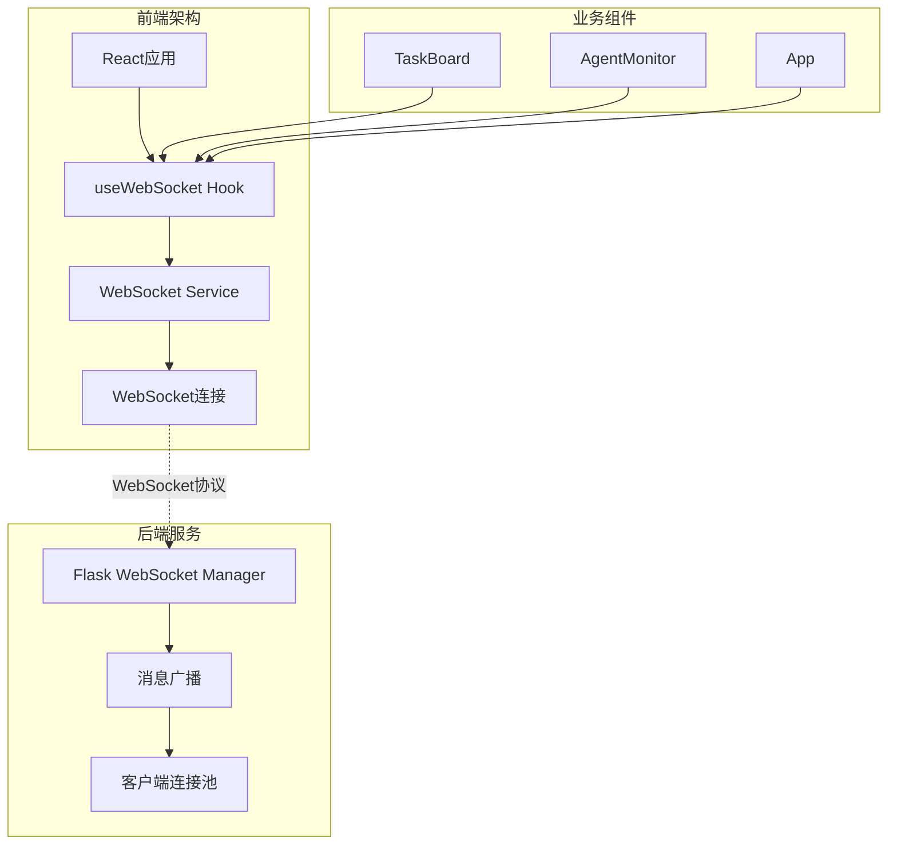
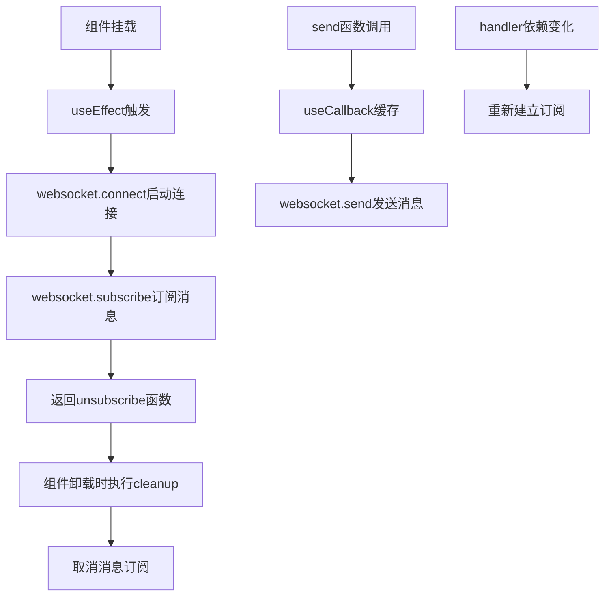
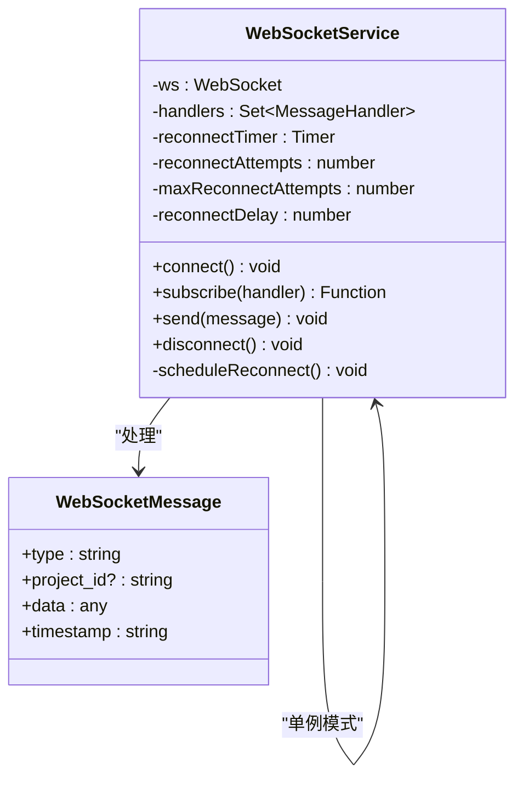
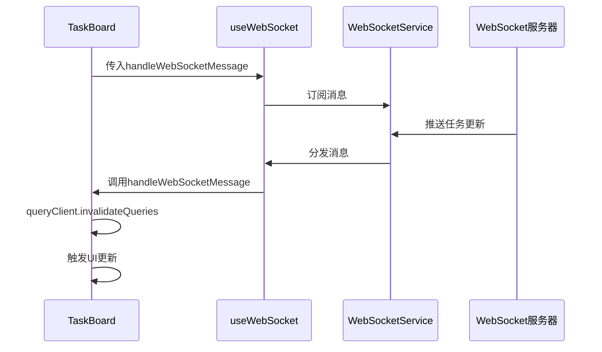
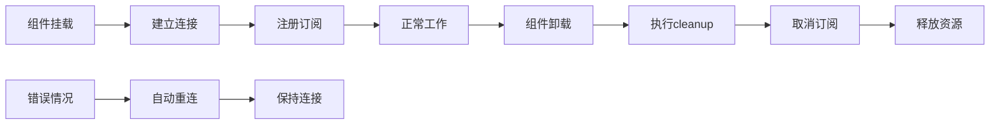

# React Hook集成：useWebSocket自定义Hook详细文档

<cite>
**本文档引用的文件**
- [useWebSocket.ts](file://dashboard/frontend/src/hooks/useWebSocket.ts)
- [websocket.ts](file://dashboard/frontend/src/services/websocket.ts)
- [TaskBoard.tsx](file://dashboard/frontend/src/components/TaskBoard.tsx)
- [AgentMonitor.tsx](file://dashboard/frontend/src/components/AgentMonitor.tsx)
- [App.tsx](file://dashboard/frontend/src/App.tsx)
- [index.ts](file://dashboard/frontend/src/types/index.ts)
</cite>

## 目录
1. [简介](#简介)
2. [项目架构概览](#项目架构概览)
3. [核心组件分析](#核心组件分析)
4. [useWebSocket Hook详细解析](#usewebsocket-hook详细解析)
5. [WebSocket服务层设计](#websocket服务层设计)
6. [实际应用示例](#实际应用示例)
7. [性能优化与最佳实践](#性能优化与最佳实践)
8. [常见问题与解决方案](#常见问题与解决方案)
9. [总结](#总结)

## 简介

本文档深入分析了TaskTree项目中`useWebSocket`自定义Hook的设计与实现，该Hook为React组件提供了简洁而强大的WebSocket通信能力。通过封装底层的WebSocket连接管理、消息处理和生命周期控制，`useWebSocket`实现了实时数据同步的核心功能，支持任务状态更新、代理监控等关键业务场景。

## 项目架构概览

TaskTree采用前后端分离架构，前端基于React构建，后端使用Python Flask框架。WebSocket通信作为实时更新的重要组成部分，在整个系统中发挥着关键作用。



**图表来源**
- [useWebSocket.ts](file://dashboard/frontend/src/hooks/useWebSocket.ts#L1-L24)
- [websocket.ts](file://dashboard/frontend/src/services/websocket.ts#L1-L98)

## 核心组件分析

### 组件关系图

```mermaid
classDiagram
class useWebSocket {
+handler : MessageHandler
+useEffect() void
+useCallback() Function
+return : {send}
}
class WebSocketService {
-ws : WebSocket
-handlers : Set~MessageHandler~
-reconnectTimer : Timer
+connect() void
+subscribe(handler) Function
+send(message) void
+disconnect() void
}
class TaskBoard {
+projectId : string
+handleWebSocketMessage() void
+useWebSocket() void
+queryClient : QueryClient
}
class AgentMonitor {
+projectId : string
+agents : Agent[]
+handleResetAll() void
}
useWebSocket --> WebSocketService : "使用"
TaskBoard --> useWebSocket : "调用"
AgentMonitor --> useWebSocket : "调用"
WebSocketService --> TaskBoard : "推送消息"
WebSocketService --> AgentMonitor : "推送消息"
```

**图表来源**
- [useWebSocket.ts](file://dashboard/frontend/src/hooks/useWebSocket.ts#L5-L24)
- [websocket.ts](file://dashboard/frontend/src/services/websocket.ts#L5-L98)
- [TaskBoard.tsx](file://dashboard/frontend/src/components/TaskBoard.tsx#L27-L63)
- [AgentMonitor.tsx](file://dashboard/frontend/src/components/AgentMonitor.tsx#L17-L60)

## useWebSocket Hook详细解析

### Hook结构与设计理念

`useWebSocket`是一个精心设计的自定义Hook，它封装了WebSocket连接的完整生命周期管理，包括连接建立、消息订阅、事件清理和性能优化。



**图表来源**
- [useWebSocket.ts](file://dashboard/frontend/src/hooks/useWebSocket.ts#L6-L17)
- [useWebSocket.ts](file://dashboard/frontend/src/hooks/useWebSocket.ts#L19-L21)

### 核心实现机制

#### 1. useEffect生命周期管理

Hook使用`useEffect`确保组件挂载时自动建立WebSocket连接，并在组件卸载时清理资源：

- **连接建立**：当组件首次渲染时，`useEffect`会调用`websocket.connect()`建立WebSocket连接
- **订阅管理**：通过`websocket.subscribe(handler)`建立消息订阅，返回一个取消订阅的函数
- **资源清理**：在组件卸载时，`useEffect`的cleanup函数会调用`unsubscribe()`，防止内存泄漏

#### 2. useCallback性能优化

`send`函数使用`useCallback`进行缓存优化：

- **函数稳定性**：即使父组件重新渲染，`send`函数也不会生成新的实例
- **依赖数组为空**：因为`send`只依赖于外部的`websocket.send`，不需要响应内部状态变化
- **性能提升**：避免不必要的子组件重渲染，特别是在高频消息传输场景下

#### 3. 依赖注入设计

Hook接受`handler`作为参数，体现了函数式编程的设计理念：

- **灵活性**：不同的组件可以传入不同的消息处理器
- **解耦性**：Hook本身不关心具体的业务逻辑，只负责消息传递
- **可测试性**：便于单元测试和模拟

**章节来源**
- [useWebSocket.ts](file://dashboard/frontend/src/hooks/useWebSocket.ts#L5-L24)

## WebSocket服务层设计

### 服务架构模式

WebSocket服务采用单例模式设计，确保全局只有一个WebSocket连接实例：



**图表来源**
- [websocket.ts](file://dashboard/frontend/src/services/websocket.ts#L5-L98)

### 连接管理策略

#### 自动重连机制

服务实现了智能重连策略，包括指数退避算法：

- **重连计数**：最多尝试5次重连
- **延迟计算**：使用指数退避算法，延迟时间逐渐增加
- **状态跟踪**：记录当前重连尝试次数和状态

#### 消息分发系统

服务维护了一个消息处理器集合，支持多组件同时订阅：

- **处理器注册**：通过`subscribe`方法添加消息处理器
- **批量通知**：收到消息时，向所有注册的处理器广播
- **优雅移除**：通过返回的取消函数安全移除处理器

**章节来源**
- [websocket.ts](file://dashboard/frontend/src/services/websocket.ts#L13-L98)

## 实际应用示例

### TaskBoard组件集成

TaskBoard展示了如何在复杂业务组件中使用`useWebSocket`实现实时任务状态更新：

#### 消息处理器设计



**图表来源**
- [TaskBoard.tsx](file://dashboard/frontend/src/components/TaskBoard.tsx#L34-L53)
- [useWebSocket.ts](file://dashboard/frontend/src/hooks/useWebSocket.ts#L6-L17)

#### 实时更新策略

TaskBoard的消息处理器根据消息类型执行不同的更新策略：

- **任务变更**：`task_created`, `task_updated`, `task_deleted`, `tasks_reset`, `task_status_changed`
- **代理状态**：`agent_status_update`, `agent_spawned`
- **查询失效**：统一调用`queryClient.invalidateQueries`触发数据重新获取

### AgentMonitor组件应用

AgentMonitor展示了如何在代理监控场景中使用WebSocket：

#### 实时状态监控

- **进度更新**：接收代理进度百分比更新
- **状态切换**：监控代理从运行到完成的状态变化
- **日志流**：实时显示代理执行日志

**章节来源**
- [TaskBoard.tsx](file://dashboard/frontend/src/components/TaskBoard.tsx#L27-L63)
- [AgentMonitor.tsx](file://dashboard/frontend/src/components/AgentMonitor.tsx#L17-L60)

## 性能优化与最佳实践

### React.memo优化策略

为了进一步提升性能，建议在使用`useWebSocket`的组件上应用`React.memo`：

```typescript
// 推荐的优化模式
const OptimizedTaskBoard = memo(TaskBoard);
```

这种优化可以：
- 防止因WebSocket消息导致的不必要重渲染
- 在组件树较深时显著提升性能
- 特别适用于频繁更新的任务列表界面

### 依赖管理最佳实践

#### 正确的依赖数组配置

Hook的`useEffect`依赖数组包含`handler`，这是正确的做法：

- **避免重复订阅**：当`handler`发生变化时，重新建立订阅
- **保持一致性**：确保消息处理器的一致性
- **防止内存泄漏**：及时清理旧的订阅

#### useCallback的合理使用

在消息处理器中，应该使用`useCallback`来稳定依赖：

```typescript
const handleMessage = useCallback((message: WebSocketMessage) => {
    // 处理逻辑
}, [dependencies]); // 确保依赖稳定
```

### 内存泄漏防护

#### 清理机制的重要性



**图表来源**
- [useWebSocket.ts](file://dashboard/frontend/src/hooks/useWebSocket.ts#L14-L16)
- [websocket.ts](file://dashboard/frontend/src/services/websocket.ts#L69-L81)

## 常见问题与解决方案

### 问题1：未正确依赖handler导致的重复订阅

**症状**：组件多次渲染时出现重复消息处理

**原因**：`useEffect`依赖数组中缺少`handler`

**解决方案**：
```typescript
// 错误做法
useEffect(() => {
    const unsubscribe = websocket.subscribe(handler);
    return unsubscribe;
}, []); // 缺少handler依赖

// 正确做法
useEffect(() => {
    const unsubscribe = websocket.subscribe(handler);
    return unsubscribe;
}, [handler]); // 包含handler依赖
```

### 问题2：复杂组件树中的性能问题

**症状**：WebSocket消息导致整个应用频繁重渲染

**解决方案**：
```typescript
// 使用React.memo包装组件
const MemoizedComponent = memo(Component, (prevProps, nextProps) => {
    // 只比较必要的props
    return prevProps.importantProp === nextProps.importantProp;
});

// 或者在消息处理器中使用useCallback
const handleMessage = useCallback((message) => {
    // 处理逻辑
}, [stableDependencies]);
```

### 问题3：消息处理器的闭包陷阱

**症状**：消息处理器访问过期的组件状态

**解决方案**：
```typescript
// 使用ref保存最新状态
const latestState = useRef(state);
latestState.current = state;

const handleMessage = useCallback((message) => {
    // 使用latestState.current而不是直接使用state
    console.log(latestState.current);
}, []);

// 或者使用useSyncExternalStore同步外部状态
```

### 问题4：WebSocket连接状态管理

**症状**：无法准确知道WebSocket是否连接成功

**解决方案**：
```typescript
// 在组件中维护连接状态
const [isConnected, setIsConnected] = useState(false);

useEffect(() => {
    // WebSocket服务自动处理重连
    setIsConnected(true);
}, []);

// 显示连接状态给用户
<Badge variant={isConnected ? "glow" : "destructive"}>
    {isConnected ? 'Live' : 'Offline'}
</Badge>
```

**章节来源**
- [useWebSocket.ts](file://dashboard/frontend/src/hooks/useWebSocket.ts#L6-L17)
- [TaskBoard.tsx](file://dashboard/frontend/src/components/TaskBoard.tsx#L32-L60)

## 总结

`useWebSocket`自定义Hook展现了现代React开发中优秀的抽象设计原则：

### 设计优势

1. **简洁易用**：仅需传入消息处理器即可实现完整的WebSocket通信
2. **自动管理**：内置连接生命周期管理和资源清理
3. **性能优化**：通过useCallback缓存提升渲染性能
4. **类型安全**：完整的TypeScript类型定义确保开发体验
5. **错误处理**：内置重连机制和错误恢复

### 应用价值

该Hook在TaskTree项目中成功支撑了以下核心功能：
- **实时任务状态更新**：TaskBoard组件能够即时响应任务状态变化
- **代理监控**：AgentMonitor提供实时的代理状态和进度信息
- **全局消息同步**：App组件处理跨项目的全局消息

### 最佳实践总结

1. **合理使用memo**：在复杂组件上应用React.memo优化性能
2. **稳定依赖管理**：使用useCallback确保消息处理器的稳定性
3. **正确的生命周期管理**：依赖数组配置要准确反映组件需求
4. **状态同步策略**：结合React Query的invalidate机制实现数据同步

通过深入理解和正确使用`useWebSocket` Hook，开发者可以构建出响应迅速、用户体验优秀的实时Web应用程序。