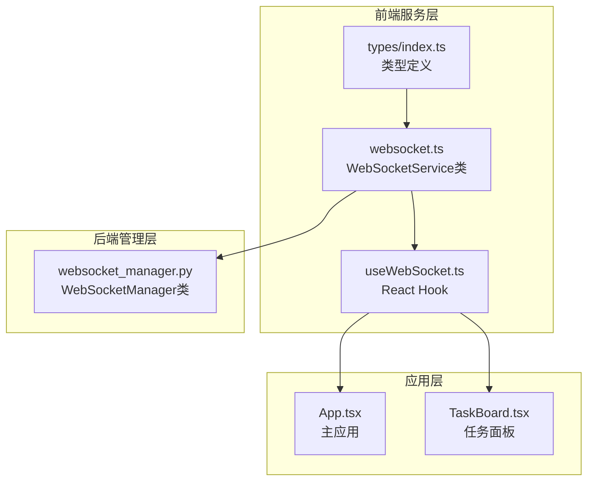
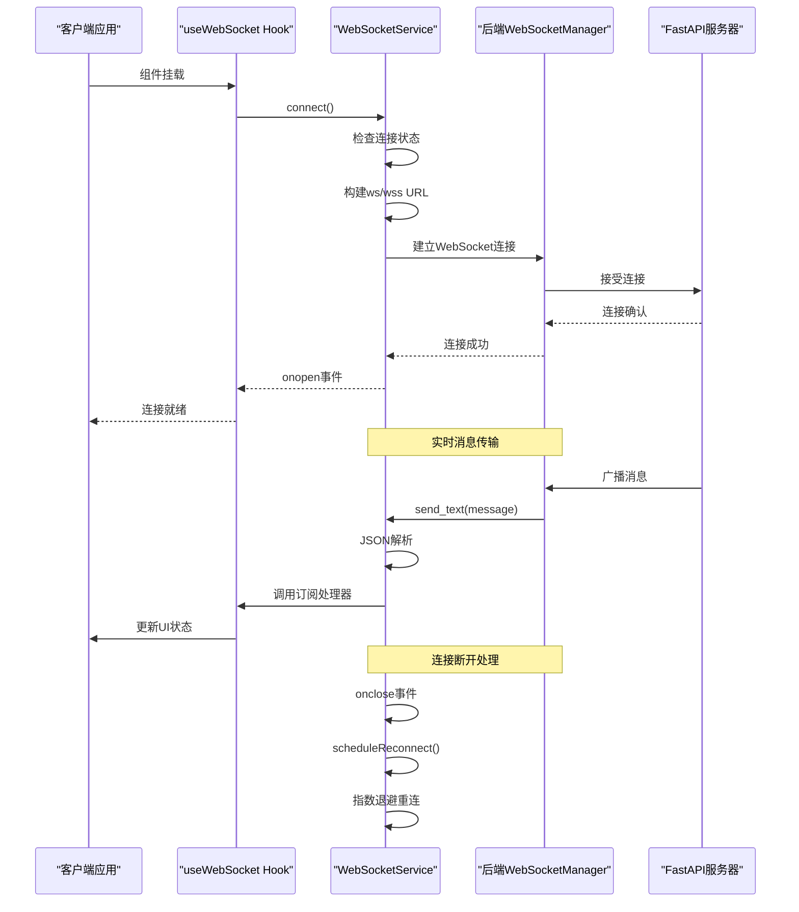
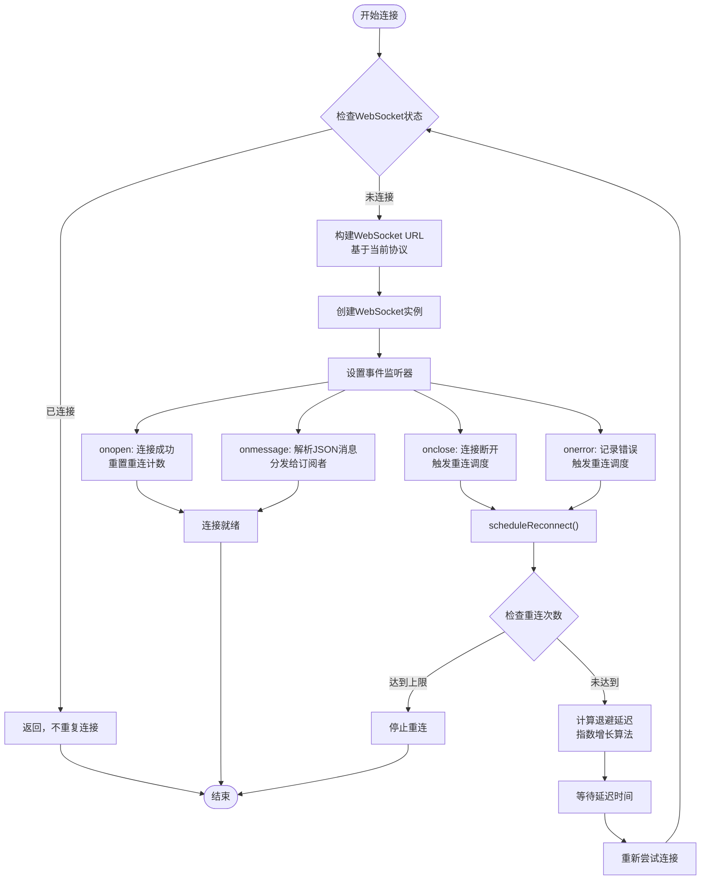
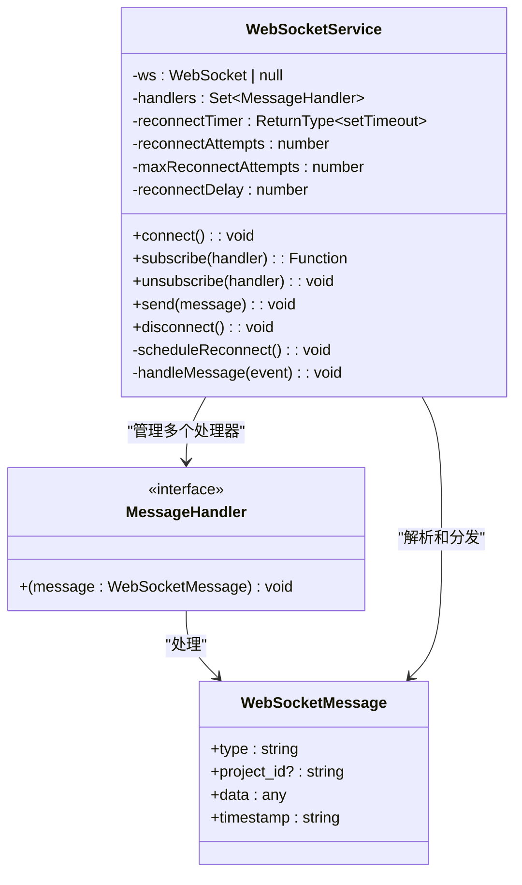
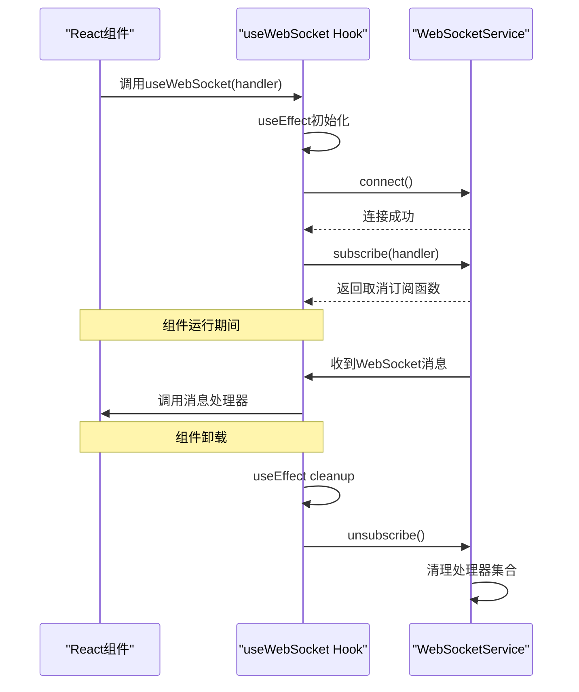
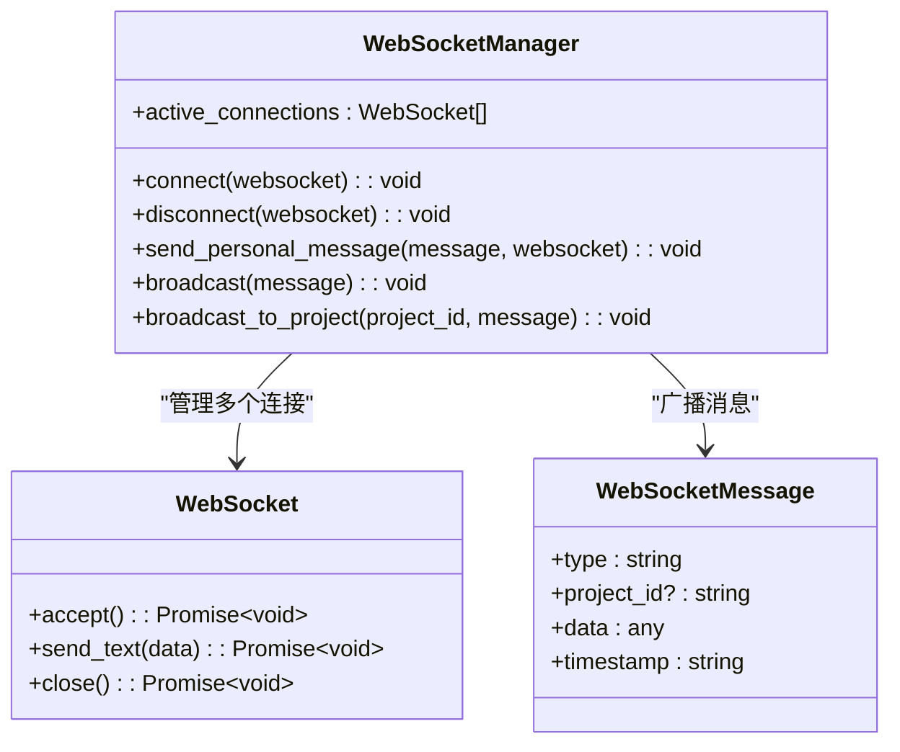
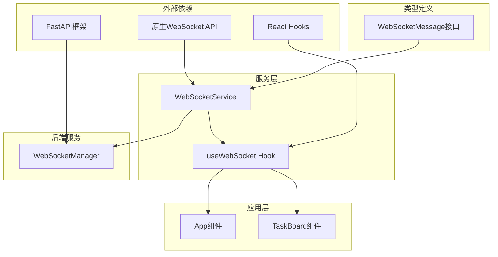
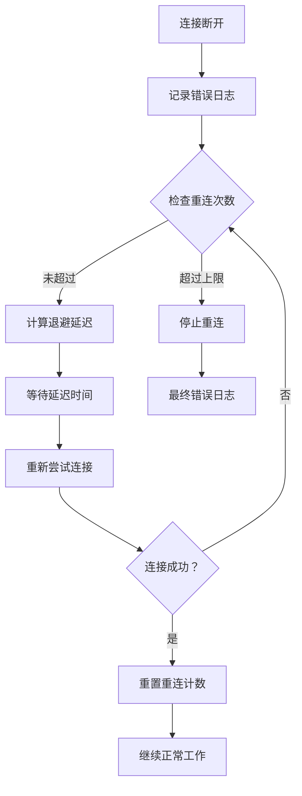

# WebSocket实时服务

<cite>
**本文档中引用的文件**
- [websocket.ts](file://dashboard/frontend/src/services/websocket.ts)
- [useWebSocket.ts](file://dashboard/frontend/src/hooks/useWebSocket.ts)
- [index.ts](file://dashboard/frontend/src/types/index.ts)
- [App.tsx](file://dashboard/frontend/src/App.tsx)
- [TaskBoard.tsx](file://dashboard/frontend/src/components/TaskBoard.tsx)
- [websocket_manager.py](file://dashboard/backend/websocket_manager.py)
</cite>

## 目录
1. [简介](#简介)
2. [项目结构](#项目结构)
3. [核心组件](#核心组件)
4. [架构概览](#架构概览)
5. [详细组件分析](#详细组件分析)
6. [依赖关系分析](#依赖关系分析)
7. [性能考虑](#性能考虑)
8. [故障排除指南](#故障排除指南)
9. [结论](#结论)

## 简介

WebSocket实时服务是TaskTree项目的核心通信基础设施，负责在前端和后端之间建立持久的双向通信通道。该服务采用客户端-服务器架构，支持实时数据同步、状态更新和事件通知。系统包含两个主要组件：WebSocketService类用于底层连接管理和消息处理，以及useWebSocket自定义Hook用于React组件的集成。

## 项目结构

WebSocket实时服务的文件组织遵循清晰的分层架构：

**图表来源**
- [websocket.ts](file://dashboard/frontend/src/services/websocket.ts#L1-L98)
- [useWebSocket.ts](file://dashboard/frontend/src/hooks/useWebSocket.ts#L1-L24)
- [websocket_manager.py](file://dashboard/backend/websocket_manager.py#L1-L55)

**章节来源**
- [websocket.ts](file://dashboard/frontend/src/services/websocket.ts#L1-L98)
- [useWebSocket.ts](file://dashboard/frontend/src/hooks/useWebSocket.ts#L1-L24)
- [websocket_manager.py](file://dashboard/backend/websocket_manager.py#L1-L55)

## 核心组件

### WebSocketService类

WebSocketService是实时通信的核心引擎，提供完整的连接生命周期管理：

- **连接管理**：自动检测当前页面协议（ws/wss），动态构建WebSocket URL
- **状态监听**：完整覆盖onopen、onmessage、onclose、onerror事件
- **自动重连**：基于指数退避算法的智能重连策略
- **消息处理**：JSON解析和订阅者模式的消息分发
- **资源清理**：优雅断开连接和内存释放

### useWebSocket Hook

React Hook封装了WebSocketService的功能，提供组件级别的连接管理：

- **生命周期管理**：自动连接和清理
- **事件订阅**：安全的消息处理器注册
- **发送功能**：便捷的消息发送接口
- **依赖优化**：useCallback确保性能优化

**章节来源**
- [websocket.ts](file://dashboard/frontend/src/services/websocket.ts#L5-L98)
- [useWebSocket.ts](file://dashboard/frontend/src/hooks/useWebSocket.ts#L5-L24)

## 架构概览

WebSocket实时服务采用分层架构设计，确保高可用性和可维护性：

**图表来源**
- [websocket.ts](file://dashboard/frontend/src/services/websocket.ts#L13-L47)
- [websocket_manager.py](file://dashboard/backend/websocket_manager.py#L16-L55)

## 详细组件分析

### WebSocketService连接管理机制

WebSocketService实现了智能的连接管理策略，确保系统的稳定性和可靠性：

**图表来源**
- [websocket.ts](file://dashboard/frontend/src/services/websocket.ts#L13-L67)

#### 协议自动检测机制

系统根据当前页面协议自动选择合适的WebSocket协议：

- **HTTPS环境**：使用`wss:`协议确保加密通信
- **HTTP环境**：使用`ws:`协议提供性能优化

#### 指数退避重连算法

重连策略采用指数退避算法防止过度请求：

- **初始延迟**：1秒
- **退避公式**：`delay = base_delay * 2^(attempts - 1)`
- **最大重试**：5次
- **防重复**：使用定时器避免并发重连

**章节来源**
- [websocket.ts](file://dashboard/frontend/src/services/websocket.ts#L13-L67)

### 消息处理流程

WebSocketService的消息处理采用订阅者模式，支持多处理器注册：

**图表来源**
- [websocket.ts](file://dashboard/frontend/src/services/websocket.ts#L3-L98)
- [index.ts](file://dashboard/frontend/src/types/index.ts#L78-L83)

#### 消息解析与验证

消息处理流程包含严格的验证机制：

1. **JSON解析**：尝试将接收到的数据字符串转换为JavaScript对象
2. **类型检查**：确保消息符合WebSocketMessage接口
3. **错误处理**：捕获解析异常并记录错误日志
4. **订阅者分发**：遍历所有注册的处理器并调用

**章节来源**
- [websocket.ts](file://dashboard/frontend/src/services/websocket.ts#L27-L34)

### useWebSocket Hook实现

React Hook提供了简洁的组件集成接口：

**图表来源**
- [useWebSocket.ts](file://dashboard/frontend/src/hooks/useWebSocket.ts#L5-L24)

#### 生命周期管理

Hook实现了完整的组件生命周期管理：

- **挂载时**：自动连接WebSocket并订阅消息
- **更新时**：保持现有连接，仅重新订阅新处理器
- **卸载时**：清理订阅和连接资源

#### 性能优化

使用useCallback确保发送函数的稳定性：

- **记忆化**：避免不必要的重新渲染
- **依赖优化**：空依赖数组确保函数稳定性
- **异步安全**：确保发送操作的原子性

**章节来源**
- [useWebSocket.ts](file://dashboard/frontend/src/hooks/useWebSocket.ts#L5-L24)

### 后端WebSocketManager

后端服务负责管理多个客户端连接和广播消息：

**图表来源**
- [websocket_manager.py](file://dashboard/backend/websocket_manager.py#L10-L55)

**章节来源**
- [websocket_manager.py](file://dashboard/backend/websocket_manager.py#L10-L55)

## 依赖关系分析

WebSocket实时服务的依赖关系呈现清晰的层次结构：

**图表来源**
- [websocket.ts](file://dashboard/frontend/src/services/websocket.ts#L1)
- [useWebSocket.ts](file://dashboard/frontend/src/hooks/useWebSocket.ts#L1)
- [websocket_manager.py](file://dashboard/backend/websocket_manager.py#L1)

### 内部依赖

- **类型依赖**：WebSocketMessage接口定义了消息格式
- **服务依赖**：Hook依赖Service提供的核心功能
- **组件依赖**：应用组件通过Hook集成WebSocket功能

### 外部依赖

- **React生态系统**：使用标准的React Hooks API
- **Web标准**：依赖浏览器原生WebSocket API
- **后端框架**：FastAPI提供WebSocket路由和管理

**章节来源**
- [websocket.ts](file://dashboard/frontend/src/services/websocket.ts#L1-L98)
- [useWebSocket.ts](file://dashboard/frontend/src/hooks/useWebSocket.ts#L1-L24)
- [websocket_manager.py](file://dashboard/backend/websocket_manager.py#L1-L55)

## 性能考虑

### 连接池管理

WebSocketService实现了高效的连接池管理策略：

- **连接复用**：避免频繁的连接/断开操作
- **内存优化**：及时清理断开的连接引用
- **资源限制**：设置最大重连次数防止资源耗尽

### 消息处理优化

- **批量处理**：单次消息处理避免多次DOM更新
- **错误隔离**：单个消息解析失败不影响其他消息
- **内存泄漏防护**：及时清理事件监听器和定时器

### 网络优化

- **协议选择**：自动选择最优的WebSocket协议
- **压缩支持**：支持消息压缩减少带宽占用
- **心跳机制**：定期发送心跳包维持连接活跃

## 故障排除指南

### 常见连接问题

#### 连接失败诊断

1. **检查网络连接**
   - 验证客户端网络可达性
   - 检查防火墙和代理设置
   - 确认WebSocket端口开放

2. **协议兼容性**
   - 确认服务器支持ws/wss协议
   - 检查SSL证书有效性（wss）
   - 验证CORS配置

3. **认证问题**
   - 检查WebSocket握手认证
   - 验证会话令牌有效性
   - 确认用户权限状态

#### 重连机制调试

当连接断开时，系统会自动触发重连机制：

**图表来源**
- [websocket.ts](file://dashboard/frontend/src/services/websocket.ts#L50-L67)

### 消息处理问题

#### 消息解析失败

当接收到无法解析的消息时：

1. **检查消息格式**：确认消息符合WebSocketMessage接口
2. **验证JSON语法**：使用浏览器开发者工具检查消息内容
3. **错误边界**：系统会捕获解析异常并记录日志

#### 订阅者处理异常

如果某个消息处理器抛出异常：

- **异常隔离**：不会影响其他处理器的执行
- **错误恢复**：系统继续正常处理后续消息
- **日志记录**：详细的错误信息便于调试

### 性能监控建议

#### 关键指标监控

- **连接状态**：监控WebSocket连接的打开/关闭状态
- **消息延迟**：测量从发送到接收的时间间隔
- **重连频率**：跟踪自动重连的发生频率
- **内存使用**：监控WebSocketService的内存占用

#### 调试工具

1. **浏览器开发者工具**
   - Network面板查看WebSocket连接
   - Console面板监控日志输出
   - Application面板检查存储状态

2. **日志分析**
   - 连接事件日志
   - 错误信息记录
   - 性能指标统计

**章节来源**
- [websocket.ts](file://dashboard/frontend/src/services/websocket.ts#L22-L43)
- [websocket.ts](file://dashboard/frontend/src/services/websocket.ts#L50-L67)

## 结论

WebSocket实时服务为TaskTree项目提供了可靠、高效的实时通信能力。通过精心设计的架构和完善的错误处理机制，系统能够在各种网络环境下保持稳定的连接状态。

### 主要优势

- **自动化管理**：智能的连接管理和自动重连机制
- **组件集成**：简洁的React Hook接口
- **类型安全**：完整的TypeScript类型定义
- **错误处理**：健壮的异常处理和恢复机制
- **性能优化**：指数退避算法和资源管理

### 最佳实践建议

1. **合理使用重连机制**：根据业务需求调整重连参数
2. **消息处理优化**：避免在消息处理器中执行耗时操作
3. **错误监控**：建立完善的日志和监控体系
4. **性能测试**：定期进行压力测试和性能评估
5. **安全考虑**：确保WebSocket连接的安全性和认证机制

该WebSocket实时服务为TaskTree项目提供了坚实的技术基础，支持复杂的实时协作和状态同步需求，是现代Web应用不可或缺的核心组件。