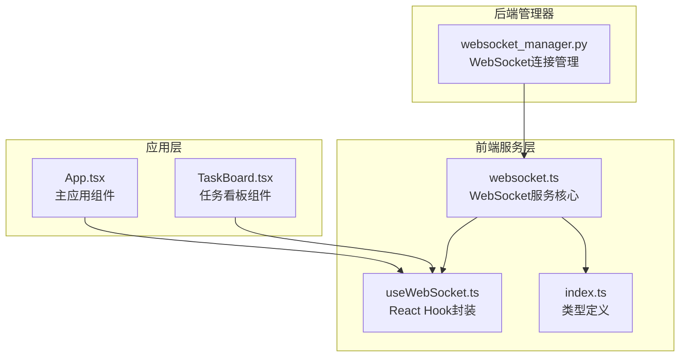
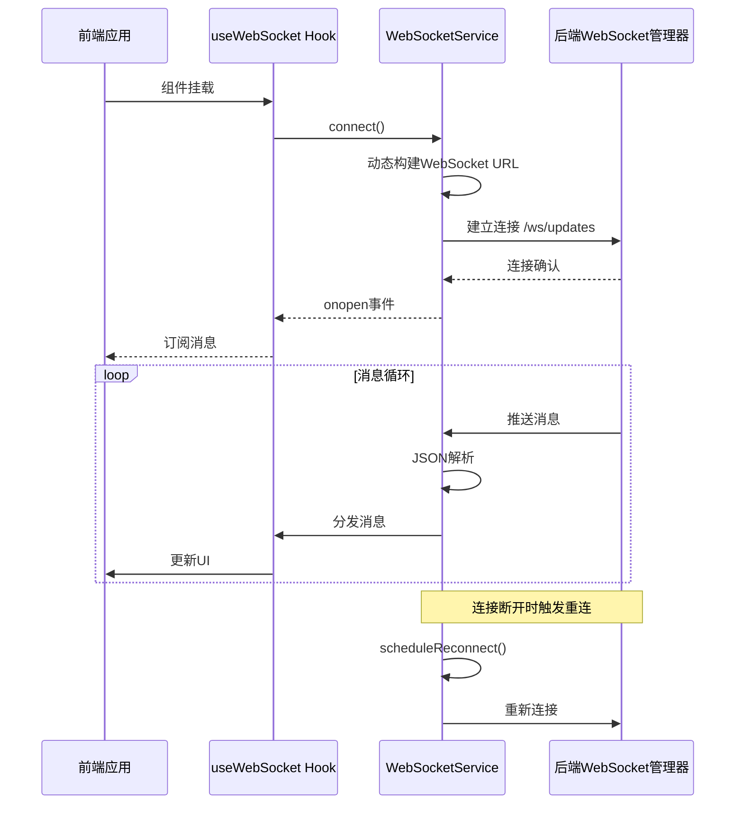
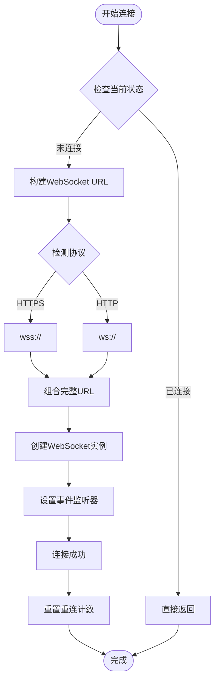
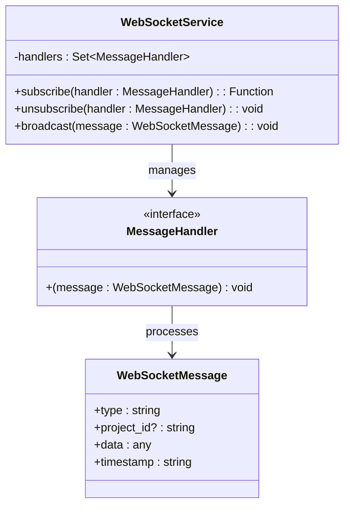
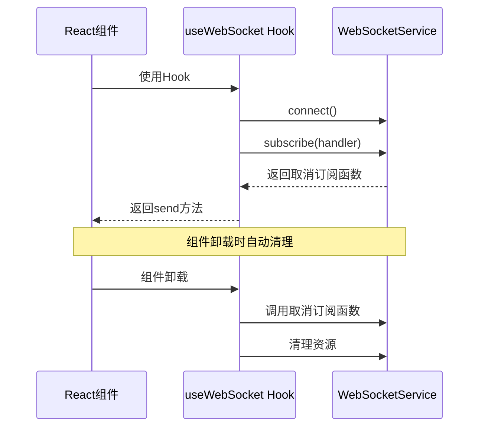
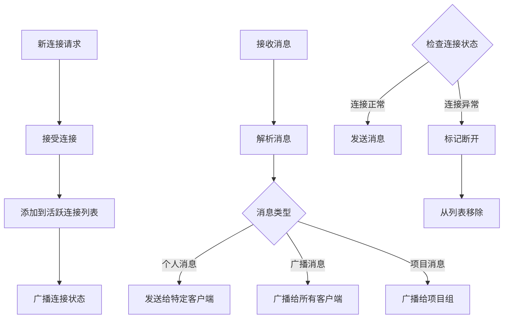
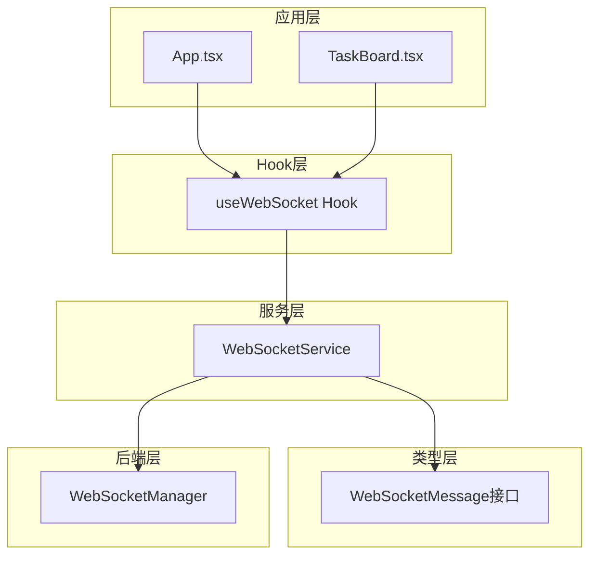

# WebSocket服务核心

<cite>
**本文档中引用的文件**
- [websocket.ts](file://dashboard/frontend/src/services/websocket.ts)
- [useWebSocket.ts](file://dashboard/frontend/src/hooks/useWebSocket.ts)
- [index.ts](file://dashboard/frontend/src/types/index.ts)
- [App.tsx](file://dashboard/frontend/src/App.tsx)
- [TaskBoard.tsx](file://dashboard/frontend/src/components/TaskBoard.tsx)
- [websocket_manager.py](file://dashboard/backend/websocket_manager.py)
</cite>

## 目录
1. [简介](#简介)
2. [项目结构](#项目结构)
3. [核心组件](#核心组件)
4. [架构概览](#架构概览)
5. [详细组件分析](#详细组件分析)
6. [依赖关系分析](#依赖关系分析)
7. [性能考虑](#性能考虑)
8. [故障排除指南](#故障排除指南)
9. [结论](#结论)

## 简介

WebSocket服务核心是TaskTree项目实时通信系统的核心组件，负责在前端与后端之间建立持久的双向通信通道。该服务实现了完整的WebSocket连接管理机制，包括自动重连策略、消息订阅分发、错误处理和资源清理等功能。

本文档深入分析WebSocketService类的实现细节，涵盖连接管理、事件处理、重连机制、消息处理等关键功能模块，并提供实际使用场景和最佳实践指导。

## 项目结构

WebSocket服务相关的文件组织结构如下：



**图表来源**
- [websocket.ts](file://dashboard/frontend/src/services/websocket.ts#L1-L98)
- [useWebSocket.ts](file://dashboard/frontend/src/hooks/useWebSocket.ts#L1-L24)
- [websocket_manager.py](file://dashboard/backend/websocket_manager.py#L1-L55)

**章节来源**
- [websocket.ts](file://dashboard/frontend/src/services/websocket.ts#L1-L98)
- [useWebSocket.ts](file://dashboard/frontend/src/hooks/useWebSocket.ts#L1-L24)
- [websocket_manager.py](file://dashboard/backend/websocket_manager.py#L1-L55)

## 核心组件

WebSocket服务核心由以下关键组件构成：

### WebSocketService类
主要的WebSocket连接管理类，提供连接建立、消息处理、自动重连和资源管理功能。

### useWebSocket Hook
React Hook封装，简化WebSocket服务在组件中的使用。

### WebSocketMessage类型
标准化的消息格式定义，确保前后端消息交互的一致性。

**章节来源**
- [websocket.ts](file://dashboard/frontend/src/services/websocket.ts#L5-L98)
- [useWebSocket.ts](file://dashboard/frontend/src/hooks/useWebSocket.ts#L5-L24)
- [index.ts](file://dashboard/frontend/src/types/index.ts#L77-L83)

## 架构概览

WebSocket服务采用分层架构设计，从底层的WebSocket连接到上层的业务逻辑，形成了清晰的职责分离：



**图表来源**
- [websocket.ts](file://dashboard/frontend/src/services/websocket.ts#L13-L47)
- [useWebSocket.ts](file://dashboard/frontend/src/hooks/useWebSocket.ts#L6-L16)
- [websocket_manager.py](file://dashboard/backend/websocket_manager.py#L16-L26)

## 详细组件分析

### WebSocketService类实现

WebSocketService类是整个WebSocket服务的核心，提供了完整的连接生命周期管理。

#### 连接管理机制

连接管理的核心在于动态URL构建和连接状态检测：



**图表来源**
- [websocket.ts](file://dashboard/frontend/src/services/websocket.ts#L13-L47)

#### 事件处理逻辑

WebSocketService实现了完整的事件处理机制，每个事件都有明确的处理逻辑：

| 事件类型 | 处理逻辑 | 关键功能 |
|---------|---------|---------|
| onopen | 连接成功日志记录，重连计数重置 | 确认连接状态，准备接收消息 |
| onmessage | JSON解析，订阅者模式分发 | 解析消息内容，通知所有订阅者 |
| onclose | 触发重连调度，记录断开状态 | 自动恢复连接，保持服务可用性 |
| onerror | 错误日志记录 | 调试和问题诊断 |

**章节来源**
- [websocket.ts](file://dashboard/frontend/src/services/websocket.ts#L22-L43)

#### 自动重连策略

重连机制采用指数退避算法，确保在网络不稳定时能够有效恢复连接：

```mermaid
flowchart TD
Disconnect[连接断开] --> CheckAttempts{检查重连尝试次数}
CheckAttempts --> |达到最大次数| MaxReached[停止重连]
CheckAttempts --> |未达到最大次数| CheckTimer{检查现有定时器}
CheckTimer --> |存在定时器| Skip[跳过本次重连]
CheckTimer --> |无定时器| IncrementAttempts[增加重连计数]
IncrementAttempts --> CalcDelay[计算延迟时间<br/>delay × 2^(attempts-1)]
CalcDelay --> LogReconnect[记录重连信息]
LogReconnect --> SetTimer[设置重连定时器]
SetTimer --> Wait[等待延迟]
Wait --> RetryConnect[重新调用connect]
RetryConnect --> Start
MaxReached --> End([结束])
Skip --> End
```

**图表来源**
- [websocket.ts](file://dashboard/frontend/src/services/websocket.ts#L50-L66)

#### 订阅者模式的消息分发

消息分发采用订阅者模式，支持多个组件同时监听WebSocket消息：



**图表来源**
- [websocket.ts](file://dashboard/frontend/src/services/websocket.ts#L3-L4)
- [websocket.ts](file://dashboard/frontend/src/services/websocket.ts#L83-L85)
- [index.ts](file://dashboard/frontend/src/types/index.ts#L77-L83)

**章节来源**
- [websocket.ts](file://dashboard/frontend/src/services/websocket.ts#L50-L86)

### useWebSocket Hook封装

useWebSocket Hook为React组件提供了简洁的WebSocket集成方式：

#### Hook使用模式



**图表来源**
- [useWebSocket.ts](file://dashboard/frontend/src/hooks/useWebSocket.ts#L6-L16)

**章节来源**
- [useWebSocket.ts](file://dashboard/frontend/src/hooks/useWebSocket.ts#L5-L24)

### 后端WebSocket管理器

后端的WebSocketManager提供了完整的连接管理和消息广播功能：

#### 连接管理流程



**图表来源**
- [websocket_manager.py](file://dashboard/backend/websocket_manager.py#L16-L55)

**章节来源**
- [websocket_manager.py](file://dashboard/backend/websocket_manager.py#L10-L55)

## 依赖关系分析

WebSocket服务的依赖关系体现了清晰的分层架构：



**图表来源**
- [websocket.ts](file://dashboard/frontend/src/services/websocket.ts#L1)
- [useWebSocket.ts](file://dashboard/frontend/src/hooks/useWebSocket.ts#L2)
- [websocket_manager.py](file://dashboard/backend/websocket_manager.py#L5)

**章节来源**
- [websocket.ts](file://dashboard/frontend/src/services/websocket.ts#L1-L98)
- [useWebSocket.ts](file://dashboard/frontend/src/hooks/useWebSocket.ts#L1-L24)
- [websocket_manager.py](file://dashboard/backend/websocket_manager.py#L1-L55)

## 性能考虑

### 连接池管理

WebSocket服务实现了智能的连接池管理策略：

- **连接复用**：避免频繁创建和销毁WebSocket连接
- **自动重连**：网络中断时自动恢复连接，保证服务连续性
- **资源清理**：及时释放断开连接的资源，防止内存泄漏

### 消息处理优化

- **异步处理**：消息解析和分发采用异步模式，避免阻塞主线程
- **错误隔离**：单个消息解析失败不影响其他消息处理
- **批量处理**：支持消息队列化处理，提高吞吐量

### 网络优化策略

- **指数退避**：重连延迟采用指数增长算法，减少服务器压力
- **最大重试次数**：防止无限重连导致资源耗尽
- **连接状态监控**：实时监控连接状态，快速响应网络变化

## 故障排除指南

### 常见连接失败原因

| 错误类型 | 可能原因 | 解决方案 |
|---------|---------|---------|
| 协议不匹配 | 前端使用ws但后端需要wss | 检查HTTPS配置，确保协议一致 |
| 端口被占用 | /ws/updates端点不可访问 | 检查后端服务配置和防火墙设置 |
| 跨域问题 | CORS策略阻止连接 | 配置正确的CORS头信息 |
| 认证失败 | 缺少必要的认证信息 | 实现WebSocket认证机制 |

### 重连机制调试

重连机制的调试可以通过以下方式进行：

1. **日志监控**：观察控制台输出的连接状态日志
2. **网络检查**：使用浏览器开发者工具监控WebSocket连接
3. **计数器验证**：确认重连尝试次数不超过最大限制
4. **延迟测试**：验证指数退避算法的延迟计算正确性

### 性能优化建议

1. **减少不必要的消息广播**：只向相关项目组发送消息
2. **优化消息格式**：使用紧凑的JSON格式减少传输数据量
3. **连接复用**：避免频繁断开和重连
4. **错误处理**：实现完善的错误恢复机制

**章节来源**
- [websocket.ts](file://dashboard/frontend/src/services/websocket.ts#L45-L47)
- [websocket.ts](file://dashboard/frontend/src/services/websocket.ts#L51-L54)

## 结论

WebSocket服务核心作为TaskTree项目实时通信的基础组件，展现了优秀的架构设计和实现质量。通过WebSocketService类的完整功能实现，包括动态连接管理、智能重连策略、订阅者模式的消息分发等特性，为整个应用提供了稳定可靠的实时通信能力。

该服务的设计充分考虑了生产环境的需求，具备良好的可维护性和扩展性。通过useWebSocket Hook的封装，简化了在React组件中的使用，而后端WebSocketManager则提供了完整的连接管理和消息广播功能。

对于开发者而言，理解WebSocket服务的核心原理和使用方法，有助于更好地利用实时通信功能，构建更加响应式的用户界面。同时，掌握故障排除和性能优化的方法，可以确保应用在各种网络环境下都能稳定运行。