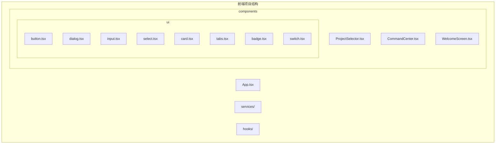
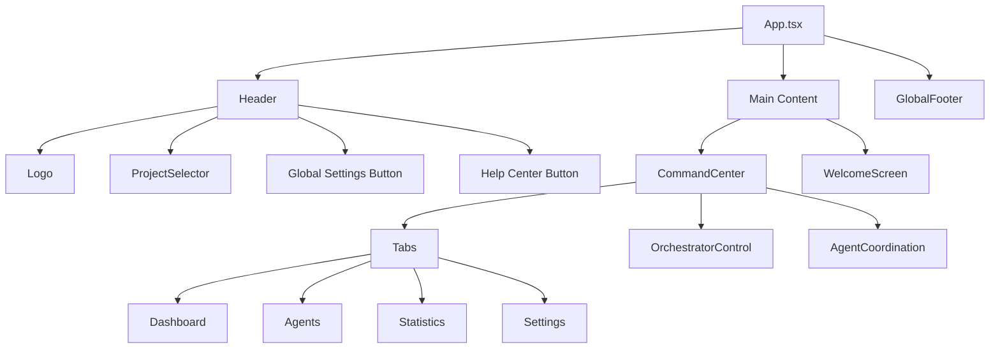
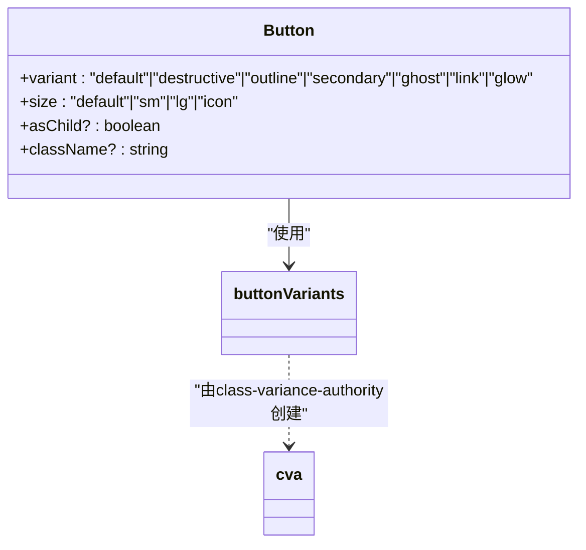
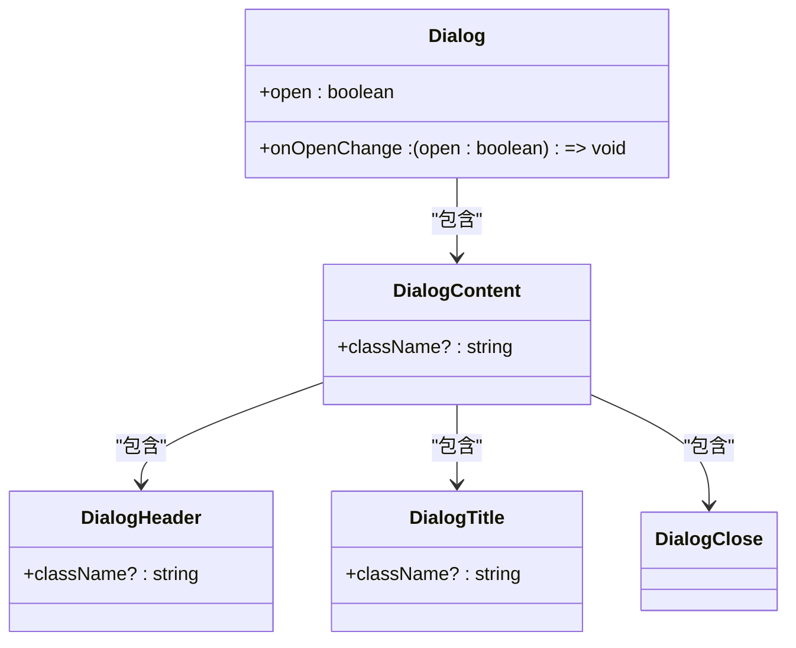
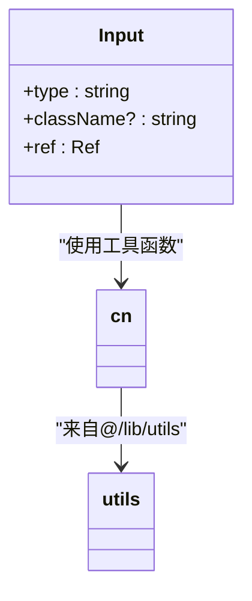
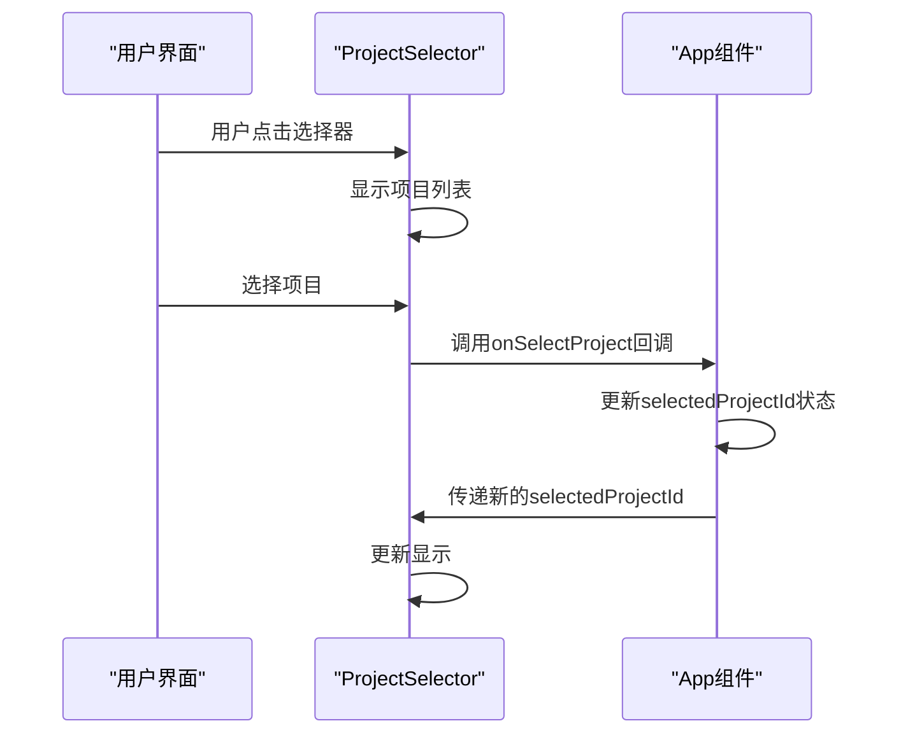
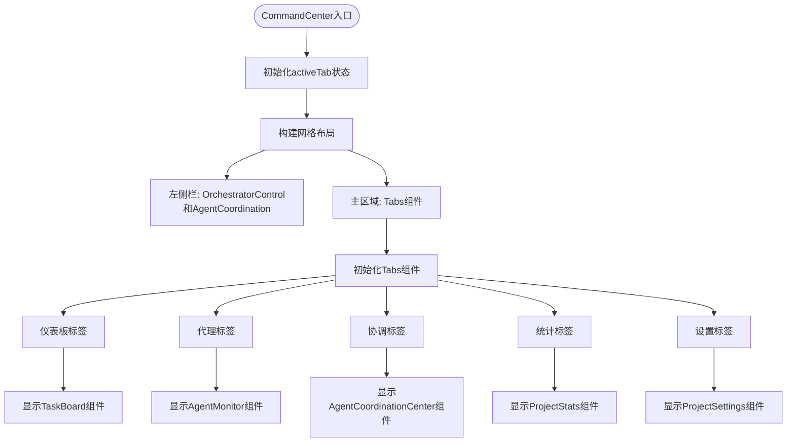
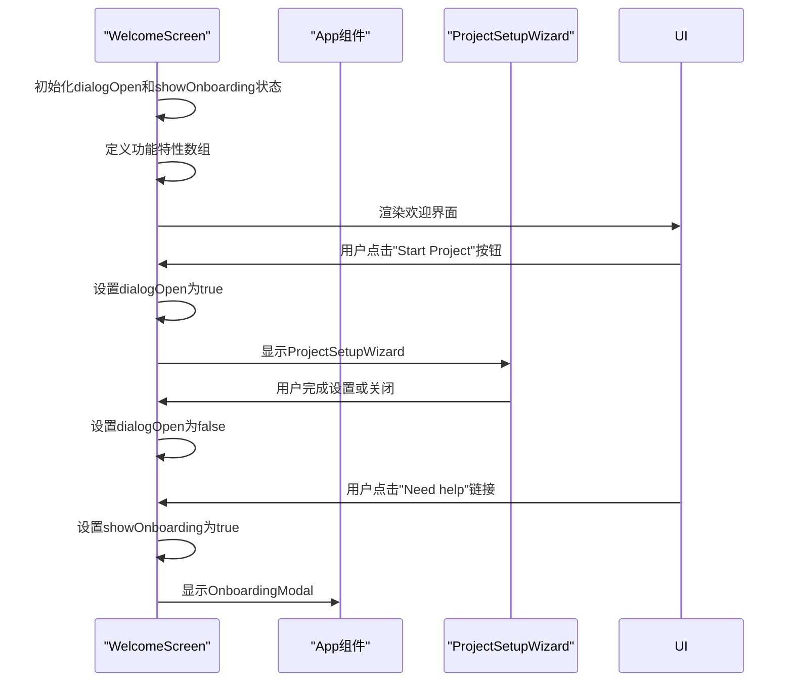
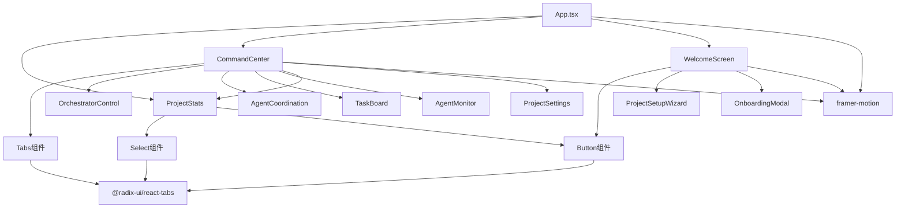

# UI组件

<cite>
**本文档中引用的文件**   
- [App.tsx](file://dashboard/frontend/src/App.tsx)
- [button.tsx](file://dashboard/frontend/src/components/ui/button.tsx)
- [dialog.tsx](file://dashboard/frontend/src/components/ui/dialog.tsx)
- [input.tsx](file://dashboard/frontend/src/components/ui/input.tsx)
- [select.tsx](file://dashboard/frontend/src/components/ui/select.tsx)
- [card.tsx](file://dashboard/frontend/src/components/ui/card.tsx)
- [tabs.tsx](file://dashboard/frontend/src/components/ui/tabs.tsx)
- [alert.tsx](file://dashboard/frontend/src/components/ui/alert.tsx)
- [badge.tsx](file://dashboard/frontend/src/components/ui/badge.tsx)
- [switch.tsx](file://dashboard/frontend/src/components/ui/switch.tsx)
- [progress.tsx](file://dashboard/frontend/src/components/ui/progress.tsx)
- [scroll-area.tsx](file://dashboard/frontend/src/components/ui/scroll-area.tsx)
- [label.tsx](file://dashboard/frontend/src/components/ui/label.tsx)
- [textarea.tsx](file://dashboard/frontend/src/components/ui/textarea.tsx)
- [ProjectSelector.tsx](file://dashboard/frontend/src/components/ProjectSelector.tsx)
- [CommandCenter.tsx](file://dashboard/frontend/src/components/CommandCenter.tsx)
- [WelcomeScreen.tsx](file://dashboard/frontend/src/components/WelcomeScreen.tsx)
- [tailwind.config.js](file://dashboard/frontend/tailwind.config.js)
</cite>

## 目录
1. [简介](#简介)
2. [项目结构](#项目结构)
3. [核心组件](#核心组件)
4. [架构概述](#架构概述)
5. [详细组件分析](#详细组件分析)
6. [依赖分析](#依赖分析)
7. [性能考虑](#性能考虑)
8. [故障排除指南](#故障排除指南)
9. [结论](#结论)

## 简介
本文档详细描述了TaskTree项目的UI组件体系，重点关注基于Radix UI构建的原子化组件库和核心功能组件。文档涵盖了从基础UI组件到复杂功能组件的完整实现细节，包括组件组合模式、样式架构、响应式设计和动画集成。

## 项目结构
TaskTree的前端项目采用模块化结构，将UI组件分为原子化基础组件和复合功能组件。项目结构清晰地分离了基础UI元素和业务逻辑组件。

**图示来源**
- [App.tsx](file://dashboard/frontend/src/App.tsx)
- [ProjectSelector.tsx](file://dashboard/frontend/src/components/ProjectSelector.tsx)

**章节来源**
- [App.tsx](file://dashboard/frontend/src/App.tsx)
- [project-structure](file://dashboard/frontend/src/components/ui)

## 核心组件
本文档的核心是分析基于Radix UI构建的原子化组件库和关键功能组件。这些组件构成了TaskTree用户界面的基础，提供了可访问、可复用且一致的用户体验。

**章节来源**
- [App.tsx](file://dashboard/frontend/src/App.tsx#L1-L197)
- [ui/components](file://dashboard/frontend/src/components/ui)

## 架构概述
TaskTree的UI架构采用分层设计模式，将基础UI组件与业务逻辑组件分离。整个系统以App.tsx为根组件，通过状态管理和事件回调机制协调各个子组件。

**图示来源**
- [App.tsx](file://dashboard/frontend/src/App.tsx#L70-L197)
- [CommandCenter.tsx](file://dashboard/frontend/src/components/CommandCenter.tsx#L21-L98)

## 详细组件分析
对TaskTree中的关键组件进行深入分析，包括原子化UI组件和复合功能组件的实现细节。

### 原子化UI组件库分析
TaskTree基于Radix UI构建了一套完整的原子化UI组件库，这些组件具有高度的可访问性和可定制性。

#### 按钮组件分析
按钮组件是系统中最常用的交互元素，支持多种变体和尺寸，确保在不同场景下的一致性。

**图示来源**
- [button.tsx](file://dashboard/frontend/src/components/ui/button.tsx#L7-L35)
- [App.tsx](file://dashboard/frontend/src/App.tsx#L88-L98)

#### 对话框组件分析
对话框组件提供模态交互功能，支持嵌套和可访问性特性，确保符合WCAG标准。

**图示来源**
- [dialog.tsx](file://dashboard/frontend/src/components/ui/dialog.tsx#L7-L120)
- [App.tsx](file://dashboard/frontend/src/App.tsx#L163-L192)

#### 输入组件分析
输入组件提供一致的表单输入体验，集成Tailwind CSS样式和可访问性特性。

**图示来源**
- [input.tsx](file://dashboard/frontend/src/components/ui/input.tsx#L8-L25)
- [ui/components](file://dashboard/frontend/src/components/ui)

### ProjectSelector组件分析
ProjectSelector组件实现了项目选择功能和状态同步机制，是用户导航的核心组件。

**图示来源**
- [ProjectSelector.tsx](file://dashboard/frontend/src/components/ProjectSelector.tsx#L1-L67)
- [App.tsx](file://dashboard/frontend/src/App.tsx#L82-L87)

**章节来源**
- [ProjectSelector.tsx](file://dashboard/frontend/src/components/ProjectSelector.tsx#L1-L67)
- [App.tsx](file://dashboard/frontend/src/App.tsx#L21-L22)

### CommandCenter组件分析
CommandCenter作为核心工作区，采用标签页布局管理多个功能模块。

**图示来源**
- [CommandCenter.tsx](file://dashboard/frontend/src/components/CommandCenter.tsx#L1-L98)
- [App.tsx](file://dashboard/frontend/src/App.tsx#L141-L142)

**章节来源**
- [CommandCenter.tsx](file://dashboard/frontend/src/components/CommandCenter.tsx#L1-L98)
- [App.tsx](file://dashboard/frontend/src/App.tsx#L141-L142)

### WelcomeScreen组件分析
WelcomeScreen组件提供引导界面设计，通过动画和交互引导新用户开始使用系统。

**图示来源**
- [WelcomeScreen.tsx](file://dashboard/frontend/src/components/WelcomeScreen.tsx#L1-L120)
- [App.tsx](file://dashboard/frontend/src/App.tsx#L144-L145)

**章节来源**
- [WelcomeScreen.tsx](file://dashboard/frontend/src/components/WelcomeScreen.tsx#L1-L120)
- [App.tsx](file://dashboard/frontend/src/App.tsx#L144-L145)

## 依赖分析
分析UI组件之间的依赖关系和架构模式，确保组件间的松耦合和高内聚。

**图示来源**
- [App.tsx](file://dashboard/frontend/src/App.tsx#L1-L197)
- [package.json](file://dashboard/frontend/package.json)

**章节来源**
- [App.tsx](file://dashboard/frontend/src/App.tsx#L1-L197)
- [ui/components](file://dashboard/frontend/src/components/ui)

## 性能考虑
虽然本文档主要关注UI组件架构，但性能优化在组件设计中也得到了充分考虑。通过使用React的memoization、懒加载和高效的动画实现，确保了用户界面的流畅性。

## 故障排除指南
当遇到UI组件相关问题时，可以参考以下常见问题的解决方案：

1. **组件不渲染**：检查父组件的状态传递和props是否正确
2. **样式丢失**：确认Tailwind CSS配置正确且类名拼写无误
3. **交互失效**：验证事件回调函数是否正确定义和传递
4. **动画卡顿**：检查framer-motion的动画配置是否过于复杂

**章节来源**
- [App.tsx](file://dashboard/frontend/src/App.tsx#L21-L26)
- [CommandCenter.tsx](file://dashboard/frontend/src/components/CommandCenter.tsx#L19-L20)

## 结论
TaskTree的UI组件体系展示了现代前端开发的最佳实践，通过原子化设计、清晰的组件层次和高效的架构模式，创建了一个可维护、可扩展且用户体验优秀的界面系统。基于Radix UI的组件库确保了可访问性和一致性，而复合组件则通过合理的状态管理和事件传递实现了复杂的功能需求。