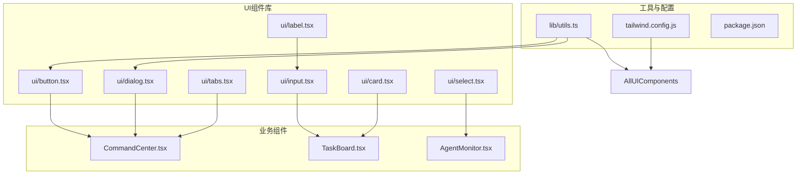
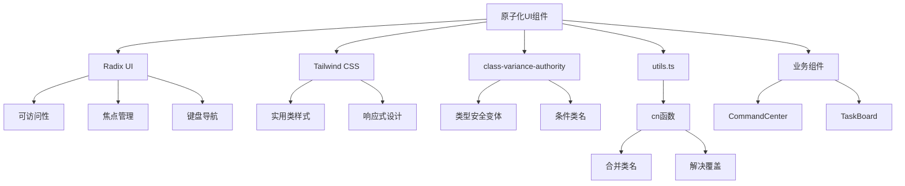
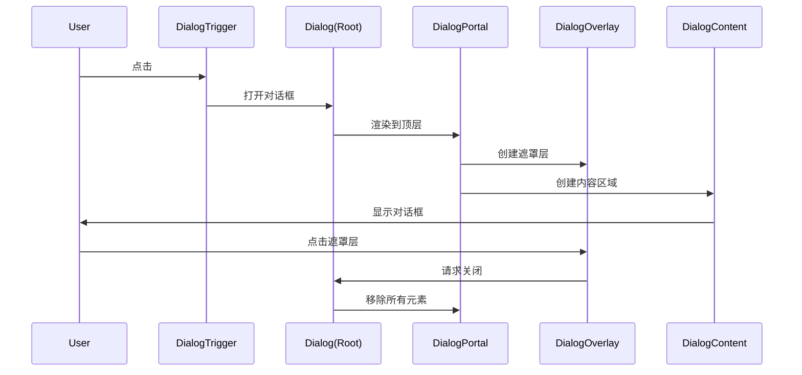
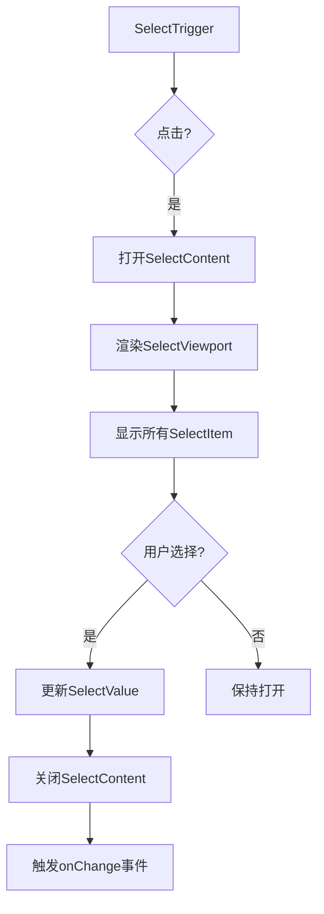
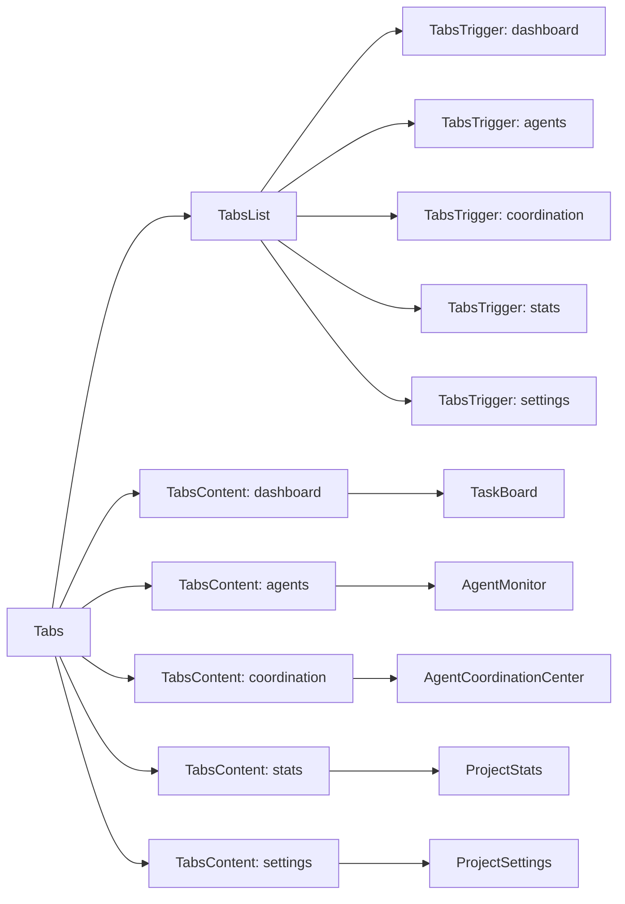
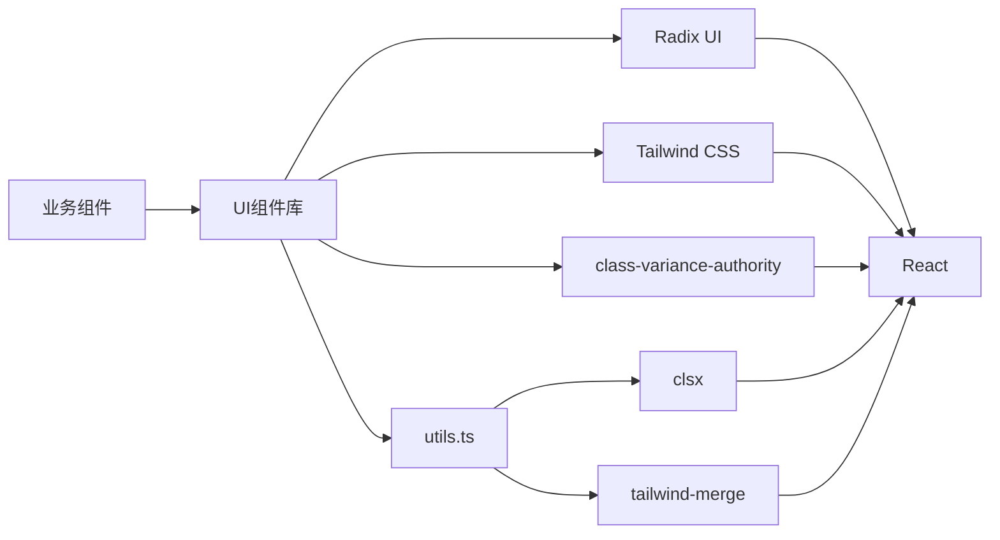

# 原子化UI组件

<cite>
**本文档引用文件**  
- [button.tsx](file://dashboard/frontend/src/components/ui/button.tsx)
- [dialog.tsx](file://dashboard/frontend/src/components/ui/dialog.tsx)
- [input.tsx](file://dashboard/frontend/src/components/ui/input.tsx)
- [select.tsx](file://dashboard/frontend/src/components/ui/select.tsx)
- [tabs.tsx](file://dashboard/frontend/src/components/ui/tabs.tsx)
- [utils.ts](file://dashboard/frontend/src/lib/utils.ts)
- [tailwind.config.js](file://dashboard/frontend/tailwind.config.js)
- [CommandCenter.tsx](file://dashboard/frontend/src/components/CommandCenter.tsx)
- [card.tsx](file://dashboard/frontend/src/components/ui/card.tsx)
- [label.tsx](file://dashboard/frontend/src/components/ui/label.tsx)
- [textarea.tsx](file://dashboard/frontend/src/components/ui/textarea.tsx)
</cite>

## 目录
1. [简介](#简介)
2. [项目结构](#项目结构)
3. [核心组件](#核心组件)
4. [架构概览](#架构概览)
5. [详细组件分析](#详细组件分析)
6. [依赖分析](#依赖分析)
7. [性能考虑](#性能考虑)
8. [故障排除指南](#故障排除指南)
9. [结论](#结论)

## 简介
TaskTree原子化UI组件库是一套基于Radix UI构建的可复用、可访问的基础组件集合，旨在为前端界面提供一致的视觉风格和交互体验。该组件库通过封装Radix UI的底层可访问性功能，结合Tailwind CSS的实用类系统，实现了高度可定制且语义化的UI元素。核心组件包括Button、Dialog、Input、Select和Tabs等，均遵循原子设计原则，支持无障碍访问，并通过`class-variance-authority`实现灵活的变体系统。这些组件在TaskTree的CommandCenter等业务界面中广泛使用，确保了跨功能模块的界面一致性。

## 项目结构
TaskTree的前端项目结构遵循标准的React应用模式，UI组件库位于`src/components/ui/`目录下，采用独立的原子化组件文件组织方式。每个组件（如Button、Dialog等）都有自己的`.tsx`文件，包含其所有子组件和变体定义。业务组件位于`src/components/`根目录下，通过相对路径导入UI组件库。样式系统基于Tailwind CSS，配置文件`tailwind.config.js`定义了项目特定的颜色（如`deep-indigo`、`electric-cyan`）和动画效果。工具函数`cn`用于安全地合并Tailwind CSS类名，确保样式优先级正确。



**Diagram sources**
- [button.tsx](file://dashboard/frontend/src/components/ui/button.tsx)
- [dialog.tsx](file://dashboard/frontend/src/components/ui/dialog.tsx)
- [tabs.tsx](file://dashboard/frontend/src/components/ui/tabs.tsx)
- [CommandCenter.tsx](file://dashboard/frontend/src/components/CommandCenter.tsx)
- [tailwind.config.js](file://dashboard/frontend/tailwind.config.js)

**Section sources**
- [button.tsx](file://dashboard/frontend/src/components/ui/button.tsx)
- [dialog.tsx](file://dashboard/frontend/src/components/ui/dialog.tsx)
- [tabs.tsx](file://dashboard/frontend/src/components/ui/tabs.tsx)
- [CommandCenter.tsx](file://dashboard/frontend/src/components/CommandCenter.tsx)

## 核心组件
TaskTree的原子化UI组件库提供了多个基础构建块，这些组件均以可访问性为首要设计原则，利用Radix UI处理焦点管理、键盘导航和ARIA属性，同时通过Tailwind CSS实现样式定制。`button.tsx`实现了多变体和尺寸的按钮系统；`dialog.tsx`提供了模态对话框的完整解决方案，包括遮罩层、内容区域和关闭按钮；`input.tsx`和`textarea.tsx`封装了原生输入元素，确保一致的样式和无障碍支持；`select.tsx`构建了一个功能完整的下拉选择器，支持滚动按钮和项目指示器；`tabs.tsx`则实现了标签页导航，支持内容的按需渲染。所有组件都通过`cn`工具函数合并类名，保证了样式的可扩展性和一致性。

**Section sources**
- [button.tsx](file://dashboard/frontend/src/components/ui/button.tsx)
- [dialog.tsx](file://dashboard/frontend/src/components/ui/dialog.tsx)
- [input.tsx](file://dashboard/frontend/src/components/ui/input.tsx)
- [select.tsx](file://dashboard/frontend/src/components/ui/select.tsx)
- [tabs.tsx](file://dashboard/frontend/src/components/ui/tabs.tsx)
- [textarea.tsx](file://dashboard/frontend/src/components/ui/textarea.tsx)

## 架构概览
该UI组件库的架构建立在三个核心库之上：Radix UI提供无样式的、可访问的原语；Tailwind CSS提供原子化的CSS实用类；`class-variance-authority`（CVA）提供类型安全的变体系统。组件通过`forwardRef`正确传递引用，确保父组件可以访问底层DOM节点。`utils.ts`中的`cn`函数是样式合并的关键，它结合了`clsx`和`tailwind-merge`，解决了Tailwind类名的覆盖问题。这种架构实现了关注点分离：Radix处理行为和可访问性，Tailwind处理视觉样式，CVA处理变体逻辑，从而创建出既强大又易于使用的组件。



**Diagram sources**
- [button.tsx](file://dashboard/frontend/src/components/ui/button.tsx)
- [dialog.tsx](file://dashboard/frontend/src/components/ui/dialog.tsx)
- [utils.ts](file://dashboard/frontend/src/lib/utils.ts)
- [tailwind.config.js](file://dashboard/frontend/tailwind.config.js)

## 详细组件分析

### Button组件分析
Button组件是UI库中最常用的交互元素，其实现展示了变体系统的设计模式。

#### 变体与尺寸实现机制
Button组件使用`class-variance-authority`（CVA）的`cva`函数定义了一个名为`buttonVariants`的变体对象。该对象包含`variant`和`size`两个维度的变体：
- **variant变体**：包括`default`、`destructive`、`outline`、`secondary`、`ghost`、`link`和`glow`。每个变体定义了一组Tailwind CSS类，用于控制背景色、文本色和悬停效果。例如，`glow`变体应用了`border-electric-cyan`和`hover:shadow-[0_0_15px_rgba(0,255,255,0.5)]`来创建发光效果。
- **size变体**：包括`default`、`sm`、`lg`和`icon`。它们通过调整`h`（高度）、`px`（水平内边距）和`rounded`（圆角）等类来控制尺寸。

`defaultVariants`指定了默认的`variant`为`default`，`size`为`default`。在`Button`组件中，通过`buttonVariants({ variant, size, className })`调用生成最终的类名字符串，并通过`cn`函数与传入的`className`合并。

```mermaid
classDiagram
class ButtonProps {
+asChild? : boolean
+variant? : "default" | "destructive" | "outline" | "secondary" | "ghost" | "link" | "glow"
+size? : "default" | "sm" | "lg" | "icon"
}
class buttonVariants {
+variants : { variant : { ... }, size : { ... } }
+defaultVariants : { variant : "default", size : "default" }
}
class Button {
+forwardRef<HTMLButtonElement, ButtonProps>
+displayName : "Button"
}
ButtonProps <.. Button : implements
buttonVariants <.. Button : uses
Button --> "Slot | button" : renders as
```

**Diagram sources**
- [button.tsx](file://dashboard/frontend/src/components/ui/button.tsx)

**Section sources**
- [button.tsx](file://dashboard/frontend/src/components/ui/button.tsx)

### Dialog组件分析
Dialog组件实现了模态对话框的复杂交互，其设计体现了内容与行为的分离。

#### 模态行为与内容分离设计
Dialog组件由多个部分组成，均基于`@radix-ui/react-dialog`的原语构建：
- `Dialog`是根组件，管理打开/关闭状态。
- `DialogTrigger`是触发器，点击后打开对话框。
- `DialogContent`是对话框内容区域，通过`DialogPortal`渲染到DOM树的顶层，确保其位于其他内容之上。
- `DialogOverlay`是半透明的遮罩层，点击可关闭对话框，并阻止与下方内容的交互。
- `DialogHeader`、`DialogFooter`、`DialogTitle`和`DialogDescription`是布局和语义化组件，用于结构化对话框内容。

这种设计将状态管理（`Dialog`）、触发机制（`DialogTrigger`）、视觉层（`DialogOverlay`）、内容容器（`DialogContent`）和语义结构（标题、描述等）完全分离，使得开发者可以自由组合这些部分，创建出符合不同场景需求的对话框。



**Diagram sources**
- [dialog.tsx](file://dashboard/frontend/src/components/ui/dialog.tsx)

**Section sources**
- [dialog.tsx](file://dashboard/frontend/src/components/ui/dialog.tsx)

### Select组件分析
Select组件提供了一个功能完整的下拉选择器，超越了原生`<select>`元素的限制。

#### 项目选择交互逻辑
Select组件基于`@radix-ui/react-select`构建，其交互逻辑如下：
1. `SelectTrigger`显示当前选中的值或占位符，并包含一个下拉箭头图标。
2. 点击`SelectTrigger`会打开`SelectContent`，其中包含一个可滚动的`SelectViewport`。
3. `SelectItem`代表下拉列表中的每一项。选中时，`SelectPrimitive.ItemIndicator`会显示一个勾选图标（由`Check`图标构成）。
4. 组件支持`SelectScrollUpButton`和`SelectScrollDownButton`，当选项过多时提供显式的滚动控件。
5. `SelectValue`用于显示选中的值，而`SelectLabel`和`SelectSeparator`可用于对选项进行分组。

这种实现方式允许完全自定义下拉菜单的样式和行为，同时保留了原生选择器的键盘导航（如使用方向键）和屏幕阅读器支持。



**Diagram sources**
- [select.tsx](file://dashboard/frontend/src/components/ui/select.tsx)

**Section sources**
- [select.tsx](file://dashboard/frontend/src/components/ui/select.tsx)

### Tabs组件分析
Tabs组件实现了标签页导航，其在CommandCenter中的应用是其典型用例。

#### CommandCenter中的标签页导航应用
在`CommandCenter.tsx`中，`Tabs`组件被用来组织不同的功能区域：
- `TabsList`作为标签页的容器，包含五个`TabsTrigger`：Dashboard、Agents、Coordination、Statistics和Settings。
- 每个`TabsTrigger`通过`value`属性与一个`TabsContent`关联。
- `activeTab`状态变量由`useState`管理，`Tabs`组件的`onValueChange`回调会更新此状态。
- 每个`TabsContent`根据其`value`属性决定是否显示对应的内容，如`TaskBoard`、`AgentMonitor`等。

这种设计实现了单页应用中的局部内容切换，避免了页面刷新，提升了用户体验。通过使用`data-[state=active]`的Tailwind CSS变体，可以轻松地为激活的标签页应用不同的样式（如背景色）。



**Diagram sources**
- [tabs.tsx](file://dashboard/frontend/src/components/ui/tabs.tsx)
- [CommandCenter.tsx](file://dashboard/frontend/src/components/CommandCenter.tsx)

**Section sources**
- [tabs.tsx](file://dashboard/frontend/src/components/ui/tabs.tsx)
- [CommandCenter.tsx](file://dashboard/frontend/src/components/CommandCenter.tsx)

## 依赖分析
原子化UI组件库的依赖关系清晰且分层明确。



**Diagram sources**
- [package.json](file://dashboard/frontend/package.json)
- [button.tsx](file://dashboard/frontend/src/components/ui/button.tsx)
- [utils.ts](file://dashboard/frontend/src/lib/utils.ts)

**Section sources**
- [package.json](file://dashboard/frontend/package.json)
- [button.tsx](file://dashboard/frontend/src/components/ui/button.tsx)
- [utils.ts](file://dashboard/frontend/src/lib/utils.ts)

## 性能考虑
该组件库在性能方面表现良好。Radix UI组件经过优化，仅在必要时进行渲染。Tailwind CSS的JIT模式确保了生成的CSS文件体积最小化。`forwardRef`的使用避免了不必要的包装器组件。`cva`的变体系统在编译时生成类名，运行时开销极小。对于复杂的`Select`和`Dialog`组件，内容的渲染是惰性的，只有在打开时才会被挂载到DOM中，这有助于减少初始加载时间。

## 故障排除指南
- **组件样式未生效**：检查`tailwind.config.js`的`content`配置是否包含了组件文件路径。
- **无障碍功能失效**：确保没有错误地覆盖了Radix组件的ARIA属性或事件处理器。
- **类型错误**：确认`VariantProps<typeof componentVariants>`的导入和使用是否正确。
- **动画不工作**：检查`tailwind.config.js`中是否正确配置了`plugins: [require("tailwindcss-animate")]`。

**Section sources**
- [tailwind.config.js](file://dashboard/frontend/tailwind.config.js)
- [button.tsx](file://dashboard/frontend/src/components/ui/button.tsx)
- [dialog.tsx](file://dashboard/frontend/src/components/ui/dialog.tsx)

## 结论
TaskTree的原子化UI组件库通过结合Radix UI、Tailwind CSS和CVA，成功创建了一套可复用、可访问且高度一致的UI组件。这些组件不仅简化了前端开发，还确保了整个应用的用户体验一致性。Button的变体系统、Dialog的模态行为、Select的交互逻辑和Tabs的导航模式都展示了现代React组件设计的最佳实践。通过遵循此文档中的模式，开发者可以高效地构建新的业务组件，同时维护项目的整体设计语言。