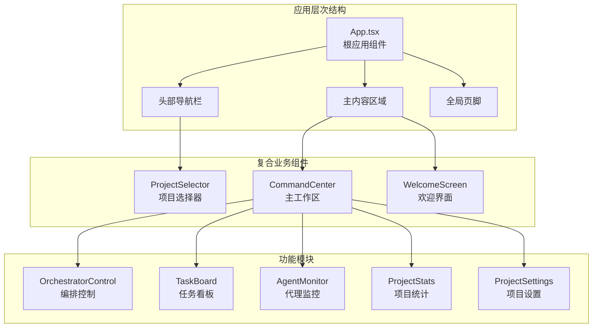
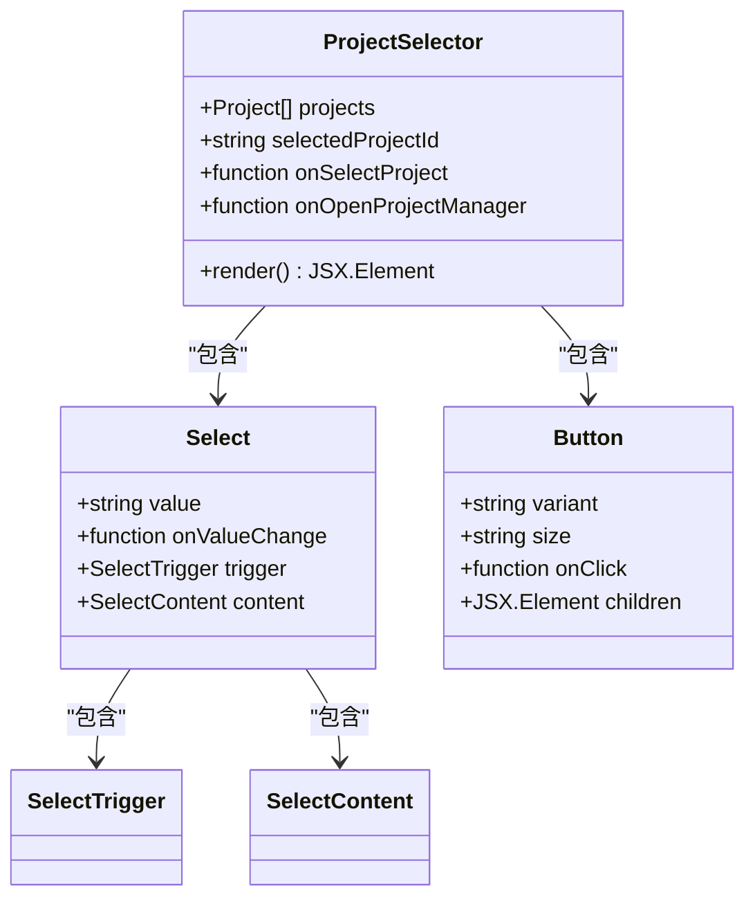
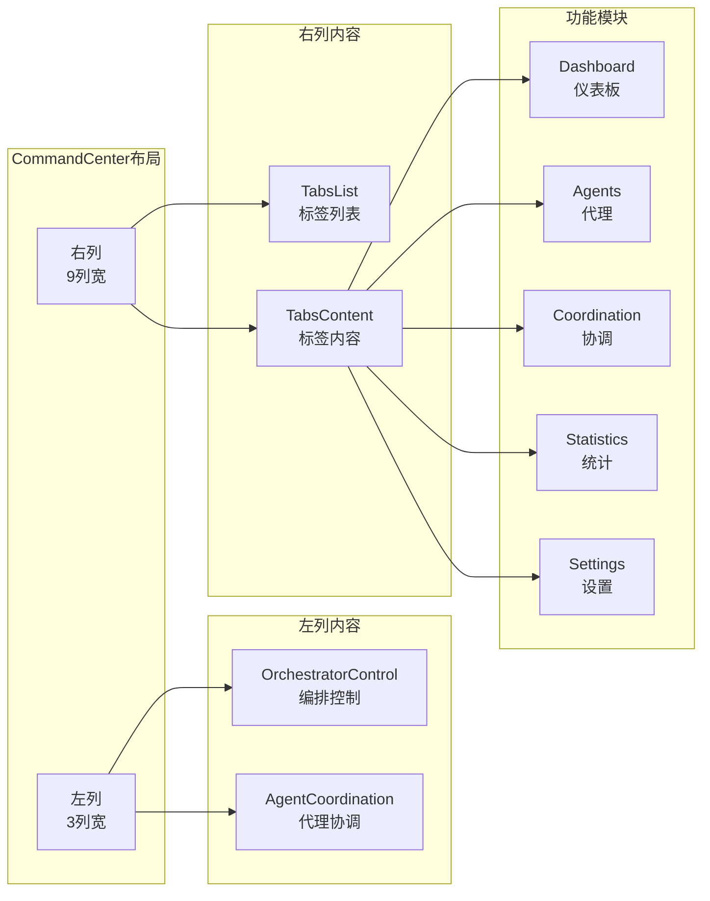
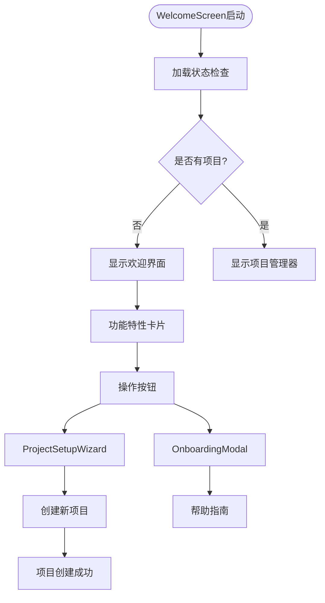
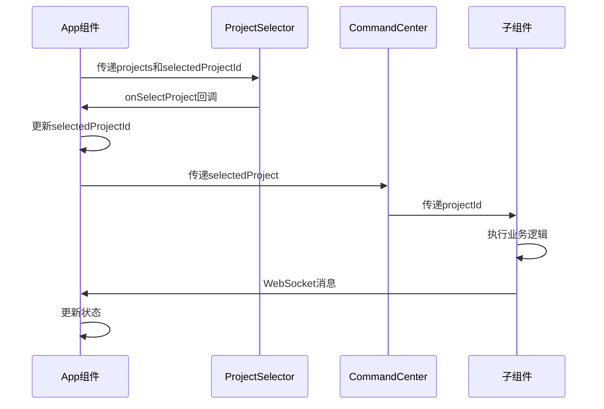

# 复合业务组件

<cite>
**本文档中引用的文件**
- [App.tsx](file://dashboard/frontend/src/App.tsx)
- [ProjectSelector.tsx](file://dashboard/frontend/src/components/ProjectSelector.tsx)
- [CommandCenter.tsx](file://dashboard/frontend/src/components/CommandCenter.tsx)
- [WelcomeScreen.tsx](file://dashboard/frontend/src/components/WelcomeScreen.tsx)
- [select.tsx](file://dashboard/frontend/src/components/ui/select.tsx)
- [tabs.tsx](file://dashboard/frontend/src/components/ui/tabs.tsx)
- [OrchestratorControl.tsx](file://dashboard/frontend/src/components/OrchestratorControl.tsx)
- [TaskBoard.tsx](file://dashboard/frontend/src/components/TaskBoard.tsx)
- [AgentMonitor.tsx](file://dashboard/frontend/src/components/AgentMonitor.tsx)
- [ProjectSetupWizard.tsx](file://dashboard/frontend/src/components/ProjectSetupWizard.tsx)
- [ProjectStats.tsx](file://dashboard/frontend/src/components/ProjectStats.tsx)
- [ProjectSettings.tsx](file://dashboard/frontend/src/components/ProjectSettings.tsx)
- [AgentCoordination.tsx](file://dashboard/frontend/src/components/AgentCoordination.tsx)
- [types/index.ts](file://dashboard/frontend/src/types/index.ts)
</cite>

## 目录
1. [引言](#引言)
2. [项目结构概览](#项目结构概览)
3. [核心复合业务组件](#核心复合业务组件)
4. [ProjectSelector组件深度分析](#projectselector组件深度分析)
5. [CommandCenter主工作区架构](#commandcenter主工作区架构)
6. [WelcomeScreen引导界面设计](#welcomescreen引导界面设计)
7. [组件间协作机制](#组件间协作机制)
8. [状态管理与数据流](#状态管理与数据流)
9. [性能优化策略](#性能优化策略)
10. [总结](#总结)

## 引言

TaskTree是一个基于React的AI驱动项目管理平台，采用了高度模块化的复合业务组件架构。本文档深入分析了三个核心复合业务组件：ProjectSelector项目选择器、CommandCenter主工作区和WelcomeScreen引导界面，探讨它们如何协同构建完整的用户界面体系。

## 项目结构概览

TaskTree采用分层架构设计，前端组件按功能模块组织：



**图表来源**
- [App.tsx](file://dashboard/frontend/src/App.tsx#L70-L146)
- [CommandCenter.tsx](file://dashboard/frontend/src/components/CommandCenter.tsx#L18-L98)

**章节来源**
- [App.tsx](file://dashboard/frontend/src/App.tsx#L1-L197)

## 核心复合业务组件

### 组件架构特点

TaskTree的复合业务组件具有以下核心特征：

1. **组合模式**：每个复合组件由多个基础UI组件和业务逻辑组件组合而成
2. **状态隔离**：各组件维护独立的状态，避免状态污染
3. **事件传播**：通过props传递回调函数实现父子组件通信
4. **响应式设计**：支持动态内容更新和实时状态同步

### 主要复合组件列表

| 组件名称 | 功能描述 | 核心特性 |
|---------|---------|---------|
| ProjectSelector | 项目选择与状态同步 | Select+Button组合，状态同步机制 |
| CommandCenter | 主工作区布局架构 | Tabs组织五大功能模块 |
| WelcomeScreen | 引导界面设计 | framer-motion动效，多步骤向导 |

## ProjectSelector组件深度分析

### 组件结构与实现

ProjectSelector是TaskTree中最复杂的复合业务组件之一，它巧妙地将Select下拉选择器和Button按钮组合在一起，实现了项目选择与状态同步的功能。



**图表来源**
- [ProjectSelector.tsx](file://dashboard/frontend/src/components/ProjectSelector.tsx#L12-L67)
- [select.tsx](file://dashboard/frontend/src/components/ui/select.tsx#L1-L158)

### Props传递机制

ProjectSelector通过清晰的props接口实现与父组件App的数据交互：

```typescript
interface ProjectSelectorProps {
  projects: Project[];
  selectedProjectId: string | null;
  onSelectProject: (projectId: string) => void;
  onOpenProjectManager?: () => void;
}
```

这种设计遵循了React的最佳实践：
- **单向数据流**：父组件通过props向下传递数据
- **回调函数**：子组件通过回调通知父组件状态变化
- **可选属性**：使用可选参数处理不同场景

### 状态同步机制

ProjectSelector实现了智能的状态同步机制：

1. **本地状态管理**：维护当前选中的项目ID
2. **外部状态绑定**：通过onSelectProject回调同步到父组件
3. **条件渲染**：根据项目数量决定显示不同的UI元素

### 与App组件的集成

在App组件中，ProjectSelector的使用展示了典型的复合组件集成模式：

```typescript
// App.tsx中的使用示例
{projects.length > 0 ? (
  <ProjectSelector
    projects={projects}
    selectedProjectId={selectedProjectId}
    onSelectProject={setSelectedProjectId}
    onOpenProjectManager={() => setShowProjectManager(true)}
  />
) : (
  <Button
    variant="outline"
    size="sm"
    onClick={() => setShowProjectManager(true)}
  >
    <Settings className="w-4 h-4 mr-2" />
    Project Manager
  </Button>
)}
```

**章节来源**
- [ProjectSelector.tsx](file://dashboard/frontend/src/components/ProjectSelector.tsx#L1-L67)
- [App.tsx](file://dashboard/frontend/src/App.tsx#L81-L98)

## CommandCenter主工作区架构

### 布局架构设计

CommandCenter作为TaskTree的主工作区，采用了创新的网格布局架构，将左侧的控制面板与右侧的功能模块有机结合。



**图表来源**
- [CommandCenter.tsx](file://dashboard/frontend/src/components/CommandCenter.tsx#L22-L98)

### Tabs组织五大功能模块

CommandCenter使用Tabs组件实现了五大功能模块的组织：

| 模块名称 | 图标 | 路径组件 | 功能描述 |
|---------|------|----------|----------|
| Dashboard | LayoutGrid | TaskBoard | 任务看板管理 |
| Agents | Cpu | AgentMonitor | AI代理监控 |
| Coordination | Network | AgentCoordinationCenter | 代理协调中心 |
| Statistics | BarChart3 | ProjectStats | 项目统计分析 |
| Settings | Settings | ProjectSettings | 项目配置设置 |

### 子组件集成关系

CommandCenter通过props传递机制与各个子组件建立连接：

```typescript
// CommandCenter.tsx中的集成示例
<Tabs value={activeTab} onValueChange={setActiveTab} className="space-y-4">
  <TabsContent value="dashboard" className="space-y-6">
    <TaskBoard projectId={project.id} />
  </TabsContent>
  <TabsContent value="agents" className="space-y-6">
    <AgentMonitor projectId={project.id} />
  </TabsContent>
  <!-- 其他模块 -->
</Tabs>
```

### 动画与过渡效果

CommandCenter利用framer-motion为各个模块添加了流畅的动画效果：

```typescript
// 动画配置示例
<motion.div 
  initial={{ opacity: 0, x: -20 }}
  animate={{ opacity: 1, x: 0 }}
  transition={{ delay: 0.1 }}
>
  <OrchestratorControl projectId={project.id} />
</motion.div>
```

**章节来源**
- [CommandCenter.tsx](file://dashboard/frontend/src/components/CommandCenter.tsx#L1-L98)

## WelcomeScreen引导界面设计

### 引导界面架构

WelcomeScreen采用了现代化的引导界面设计，通过framer-motion提供了丰富的动效体验。



**图表来源**
- [WelcomeScreen.tsx](file://dashboard/frontend/src/components/WelcomeScreen.tsx#L1-L120)
- [ProjectSetupWizard.tsx](file://dashboard/frontend/src/components/ProjectSetupWizard.tsx#L1-L671)

### 动效实现机制

WelcomeScreen大量使用framer-motion实现流畅的动效：

1. **入场动画**：使用`initial`和`animate`属性控制元素进入
2. **延迟动画**：通过`transition={{ delay: 0.x }}`实现序列动画
3. **悬停效果**：使用`whileHover`和`whileTap`增强交互性
4. **弹性动画**：利用`type: "spring"`实现自然的物理效果

### 功能特性展示布局

WelcomeScreen通过网格布局展示三大核心功能特性：

```typescript
const features = [
  { icon: <Code2 className="w-8 h-8" />, title: 'AI-Powered Development', desc: 'Spawn multiple AI agents to work on tasks' },
  { icon: <GitBranch className="w-8 h-8" />, title: 'Git Worktree Isolation', desc: 'Each agent works in its own branch' },
  { icon: <Cpu className="w-8 h-8" />, title: 'Parallel Execution', desc: 'Run multiple agents simultaneously' },
];
```

### ProjectSetupWizard触发逻辑

WelcomeScreen通过状态管理控制ProjectSetupWizard的显示：

```typescript
const [dialogOpen, setDialogOpen] = useState(false);

<Button 
  variant="glow" 
  size="lg"
  onClick={() => setDialogOpen(true)}
>
  <Rocket className="w-5 h-5 mr-2 group-hover:animate-bounce" />
  Start Your First Project
</Button>

<ProjectSetupWizard 
  open={dialogOpen} 
  onOpenChange={setDialogOpen}
/>
```

**章节来源**
- [WelcomeScreen.tsx](file://dashboard/frontend/src/components/WelcomeScreen.tsx#L1-L120)
- [ProjectSetupWizard.tsx](file://dashboard/frontend/src/components/ProjectSetupWizard.tsx#L1-L671)

## 组件间协作机制

### 数据流向分析

TaskTree的组件间协作遵循单向数据流原则：



**图表来源**
- [App.tsx](file://dashboard/frontend/src/App.tsx#L20-L68)
- [ProjectSelector.tsx](file://dashboard/frontend/src/components/ProjectSelector.tsx#L19-L67)

### 事件传播机制

组件间的事件传播通过以下模式实现：

1. **Props Down**：父组件通过props向下传递数据
2. **Callback Up**：子组件通过回调函数向上通知
3. **Context Provider**：共享状态通过React Context管理
4. **Event Bus**：全局事件通过WebSocket服务处理

### 状态同步策略

TaskTree采用多种策略确保状态同步：

- **即时更新**：通过React状态管理实现即时响应
- **防抖处理**：对频繁操作进行防抖优化
- **缓存策略**：使用React Query进行数据缓存
- **实时同步**：通过WebSocket实现实时状态更新

**章节来源**
- [App.tsx](file://dashboard/frontend/src/App.tsx#L40-L68)

## 状态管理与数据流

### React Query集成

TaskTree广泛使用React Query进行状态管理和数据获取：

```typescript
// 项目查询示例
const { data: projects = [], refetch: refetchProjects } = useQuery({
  queryKey: ['projects'],
  queryFn: api.getProjects,
  staleTime: 5000,
});

// 实时数据更新
useWebSocket((message: WebSocketMessage) => {
  if (message.type.includes('task') || message.type.includes('agent')) {
    refetchProjects();
  }
});
```

### WebSocket实时通信

WebSocket服务负责处理实时数据更新：

```typescript
// WebSocket消息处理
useWebSocket((message: WebSocketMessage) => {
  switch (message.type) {
    case 'task_created':
    case 'task_updated':
    case 'task_deleted':
      queryClient.invalidateQueries({ queryKey: ['tasks', projectId] });
      break;
    case 'agent_status_update':
      queryClient.invalidateQueries({ queryKey: ['agents', projectId] });
      break;
  }
});
```

### 状态持久化

TaskTree实现了多层次的状态持久化：

1. **浏览器存储**：使用localStorage保存用户偏好
2. **缓存管理**：React Query自动管理查询缓存
3. **会话状态**：通过React状态管理临时数据
4. **服务器同步**：通过API保持数据一致性

**章节来源**
- [App.tsx](file://dashboard/frontend/src/App.tsx#L27-L48)

## 性能优化策略

### 组件懒加载

TaskTree采用按需加载策略优化性能：

```typescript
// 动态导入实现懒加载
const LazyComponent = React.lazy(() => import('./LazyComponent'));

<React.Suspense fallback={<div>Loading...</div>}>
  <LazyComponent />
</React.Suspense>
```

### 渲染优化

- **Memoization**：使用React.memo防止不必要的重渲染
- **Virtual Scrolling**：对大量数据使用虚拟滚动
- **代码分割**：按路由分割代码包
- **图片优化**：使用现代图片格式和懒加载

### 内存管理

- **清理机制**：及时清理定时器和订阅
- **状态压缩**：避免存储冗余数据
- **垃圾回收**：主动释放不需要的资源

## 总结

TaskTree的复合业务组件架构展现了现代React应用开发的最佳实践：

1. **模块化设计**：每个复合组件都有明确的职责边界
2. **状态管理**：采用React Query和WebSocket实现高效状态管理
3. **用户体验**：通过framer-motion提供流畅的动效体验
4. **性能优化**：多层次的性能优化策略确保应用流畅运行
5. **可维护性**：清晰的组件层次和数据流向便于维护

这种架构不仅满足了TaskTree的功能需求，也为未来的扩展奠定了坚实的基础。通过合理的组件拆分和状态管理，开发者可以轻松地添加新功能或修改现有逻辑，同时保持代码的可读性和可维护性。