# 指挥中心

<cite>
**本文档中引用的文件**
- [CommandCenter.tsx](file://dashboard/frontend/src/components/CommandCenter.tsx)
- [tabs.tsx](file://dashboard/frontend/src/components/ui/tabs.tsx)
- [OrchestratorControl.tsx](file://dashboard/frontend/src/components/OrchestratorControl.tsx)
- [AgentCoordination.tsx](file://dashboard/frontend/src/components/AgentCoordination.tsx)
- [TaskBoard.tsx](file://dashboard/frontend/src/components/TaskBoard.tsx)
- [AgentMonitor.tsx](file://dashboard/frontend/src/components/AgentMonitor.tsx)
- [ProjectStats.tsx](file://dashboard/frontend/src/components/ProjectStats.tsx)
- [ProjectSettings.tsx](file://dashboard/frontend/src/components/ProjectSettings.tsx)
- [AgentCoordinationCenter.tsx](file://dashboard/frontend/src/components/AgentCoordinationCenter.tsx)
- [index.ts](file://dashboard/frontend/src/types/index.ts)
- [api.ts](file://dashboard/frontend/src/services/api.ts)
- [tailwind.config.js](file://dashboard/frontend/tailwind.config.js)
</cite>

## 目录
1. [简介](#简介)
2. [项目结构概览](#项目结构概览)
3. [核心架构分析](#核心架构分析)
4. [五维功能导航系统](#五维功能导航系统)
5. [网格布局与空间分配](#网格布局与空间分配)
6. [核心功能组件详解](#核心功能组件详解)
7. [状态管理与响应机制](#状态管理与响应机制)
8. [Motion动画配置](#motion动画配置)
9. [数据绑定与projectId属性](#数据绑定与projectId属性)
10. [性能优化考虑](#性能优化考虑)
11. [总结](#总结)

## 简介

CommandCenter组件是TaskTree项目主工作区的核心控制器，采用基于React和Framer Motion的现代化前端架构。该组件通过五维功能导航系统（Dashboard、Agents、Coordination、Statistics、Settings）提供统一的项目管理界面，实现了复杂的AI Agent协调管理和任务监控功能。

## 项目结构概览

CommandCenter组件位于TaskTree项目的前端组件层次结构中，作为顶级容器组件协调各个子功能模块：

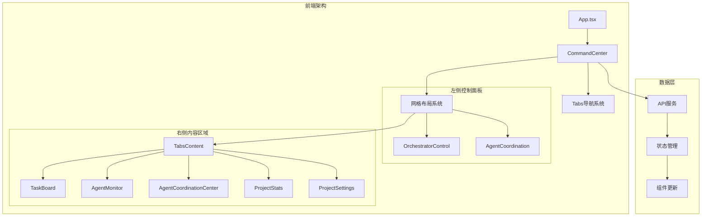

**图表来源**
- [CommandCenter.tsx](file://dashboard/frontend/src/components/CommandCenter.tsx#L1-L98)
- [api.ts](file://dashboard/frontend/src/services/api.ts#L1-L248)

**章节来源**
- [CommandCenter.tsx](file://dashboard/frontend/src/components/CommandCenter.tsx#L1-L98)

## 核心架构分析

CommandCenter组件采用了分层架构设计，通过状态提升和属性传递实现组件间的通信：

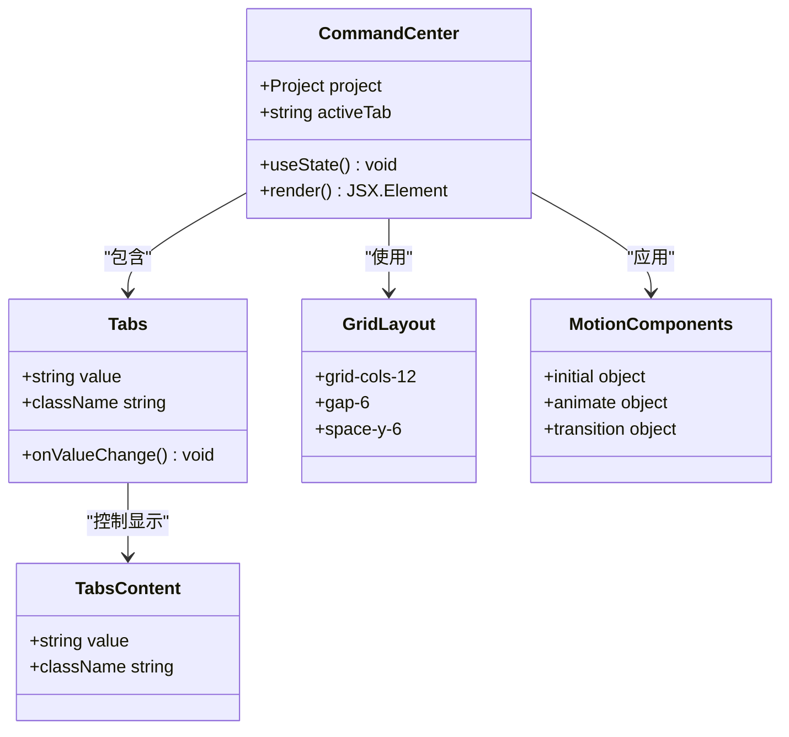

**图表来源**
- [CommandCenter.tsx](file://dashboard/frontend/src/components/CommandCenter.tsx#L18-L98)
- [tabs.tsx](file://dashboard/frontend/src/components/ui/tabs.tsx#L1-L53)

**章节来源**
- [CommandCenter.tsx](file://dashboard/frontend/src/components/CommandCenter.tsx#L1-L98)
- [tabs.tsx](file://dashboard/frontend/src/components/ui/tabs.tsx#L1-L53)

## 五维功能导航系统

CommandCenter实现了基于Tabs组件的五维功能导航系统，每个标签页对应不同的功能领域：

### 导航系统架构

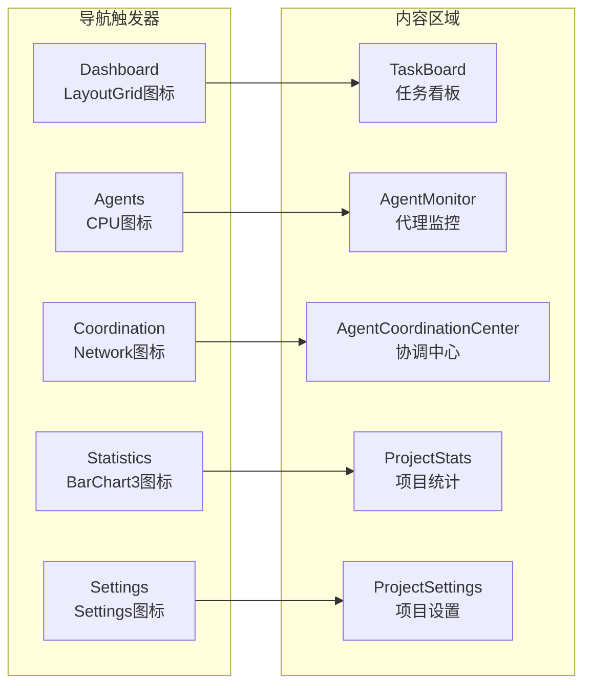

**图表来源**
- [CommandCenter.tsx](file://dashboard/frontend/src/components/CommandCenter.tsx#L50-L92)

### 导航触发器配置

每个导航触发器都包含了特定的视觉标识和交互行为：

| 触发器 | 图标 | 值 | 功能描述 |
|--------|------|----|----------|
| Dashboard | LayoutGrid | "dashboard" | 主任务看板界面 |
| Agents | CPU | "agents" | AI代理监控和管理 |
| Coordination | Network | "coordination" | 代理间协调监控 |
| Statistics | BarChart3 | "stats" | 项目进度和统计分析 |
| Settings | Settings | "settings" | 项目配置和参数设置 |

**章节来源**
- [CommandCenter.tsx](file://dashboard/frontend/src/components/CommandCenter.tsx#L50-L92)

## 网格布局与空间分配

CommandCenter采用12列网格布局系统，通过Tailwind CSS的grid类实现灵活的空间分配：

### 布局结构分析

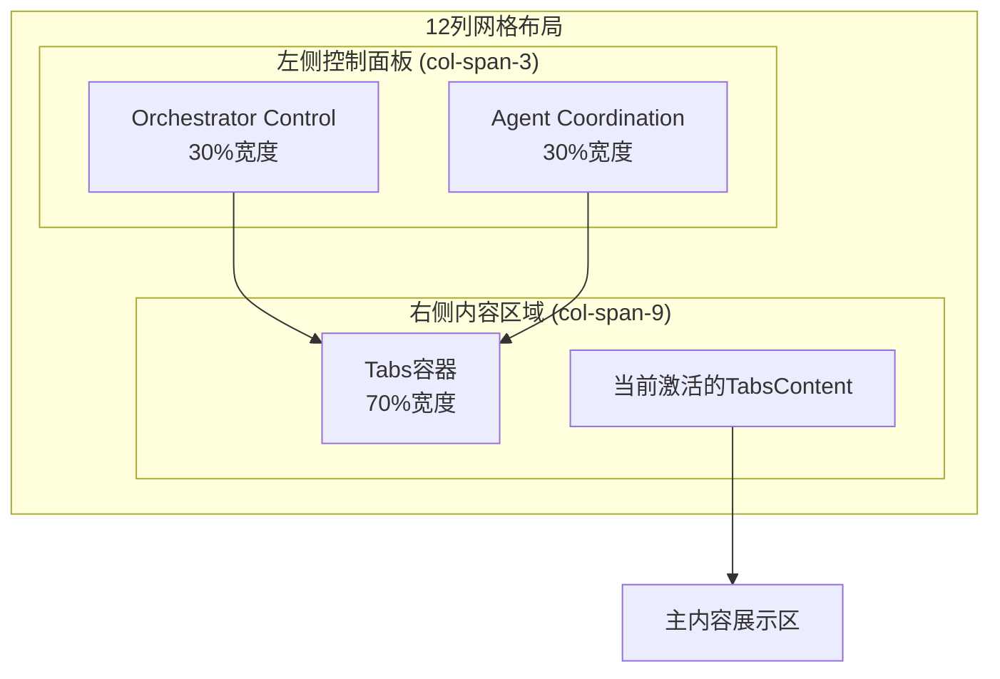

**图表来源**
- [CommandCenter.tsx](file://dashboard/frontend/src/components/CommandCenter.tsx#L23-L94)

### 空间分配策略

网格布局采用了以下空间分配原则：

1. **左侧控制面板 (3/12)**：提供稳定的控制区域，包含OrchestratorControl和AgentCoordination组件
2. **右侧内容区域 (9/12)**：为主功能区域，根据激活的标签页动态调整内容
3. **间距管理 (gap-6)**：确保组件间有适当的视觉间隔
4. **垂直间距 (space-y-6)**：在左侧面板内部保持一致的垂直间距

**章节来源**
- [CommandCenter.tsx](file://dashboard/frontend/src/components/CommandCenter.tsx#L23-L94)

## 核心功能组件详解

### TaskBoard - 任务看板

TaskBoard是Dashboard标签页的核心组件，提供了可视化的任务管理界面：

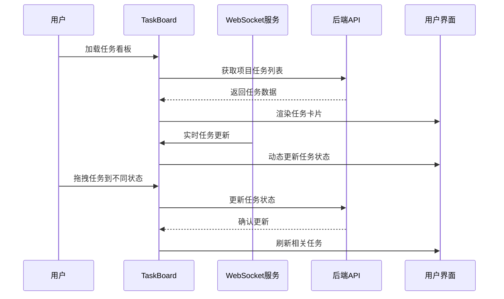

**图表来源**
- [TaskBoard.tsx](file://dashboard/frontend/src/components/TaskBoard.tsx#L1-L257)

TaskBoard的主要特性包括：
- **五状态任务管理**：UNCLAIMED、UP_NEXT、IN_PROGRESS、COMPLETED、MERGED
- **拖拽式状态变更**：直观的任务状态转换
- **实时数据同步**：通过WebSocket实现实时更新
- **优先级排序**：支持任务优先级和创建时间排序

**章节来源**
- [TaskBoard.tsx](file://dashboard/frontend/src/components/TaskBoard.tsx#L1-L257)

### AgentMonitor - 代理监控

AgentMonitor提供了AI代理的实时监控和管理功能：

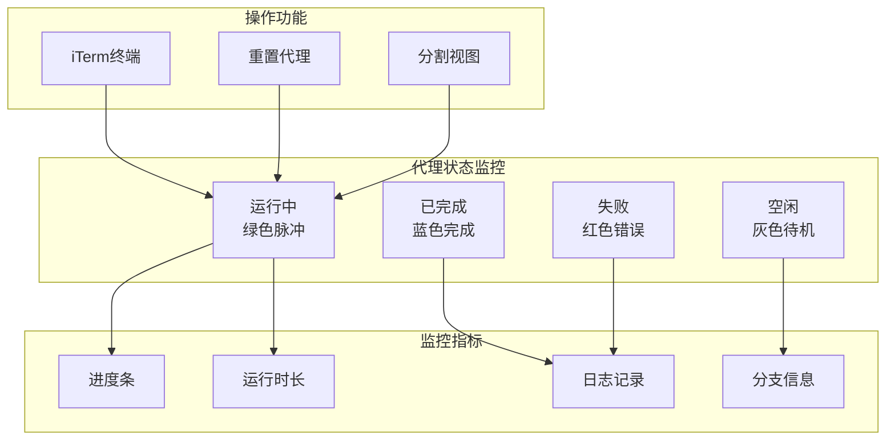

**图表来源**
- [AgentMonitor.tsx](file://dashboard/frontend/src/components/AgentMonitor.tsx#L1-L283)

**章节来源**
- [AgentMonitor.tsx](file://dashboard/frontend/src/components/AgentMonitor.tsx#L1-L283)

### AgentCoordinationCenter - 协调中心

AgentCoordinationCenter提供了高级的代理间协调监控功能：

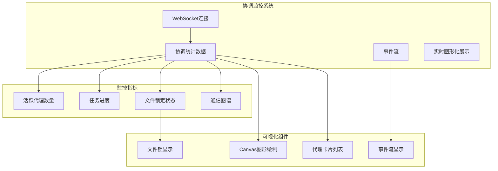

**图表来源**
- [AgentCoordinationCenter.tsx](file://dashboard/frontend/src/components/AgentCoordinationCenter.tsx#L1-L453)

**章节来源**
- [AgentCoordinationCenter.tsx](file://dashboard/frontend/src/components/AgentCoordinationCenter.tsx#L1-L453)

### ProjectStats - 项目统计

ProjectStats提供了全面的项目进度和性能分析：

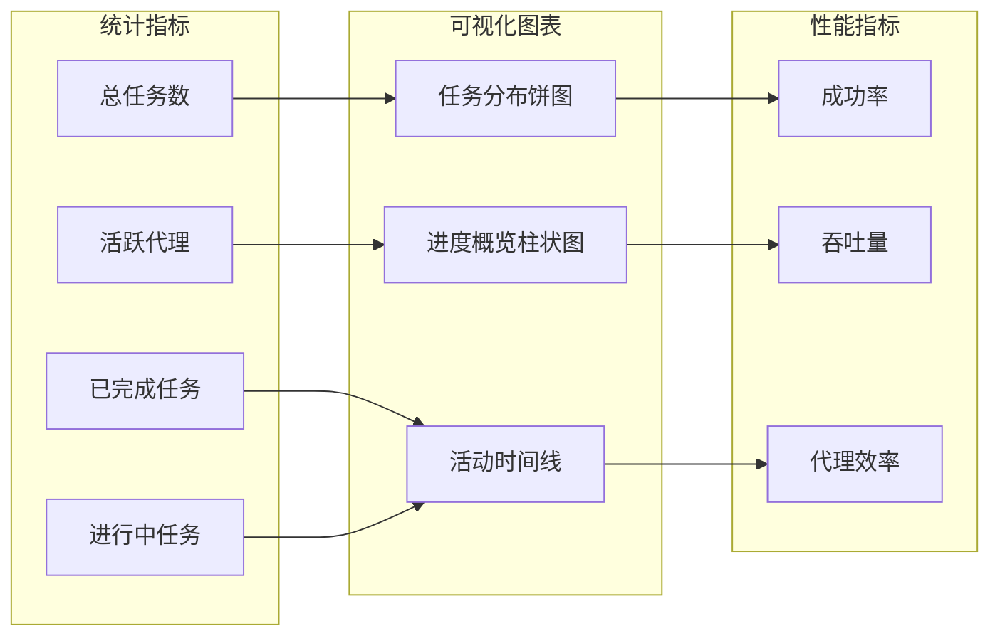

**图表来源**
- [ProjectStats.tsx](file://dashboard/frontend/src/components/ProjectStats.tsx#L1-L231)

**章节来源**
- [ProjectStats.tsx](file://dashboard/frontend/src/components/ProjectStats.tsx#L1-L231)

### ProjectSettings - 项目设置

ProjectSettings提供了项目级别的配置管理功能：

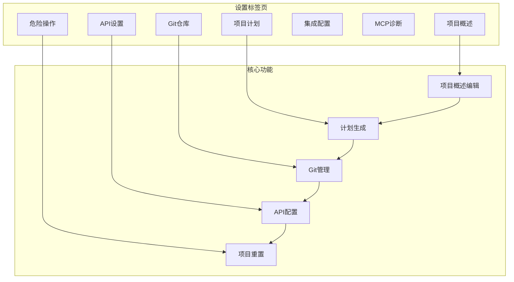

**图表来源**
- [ProjectSettings.tsx](file://dashboard/frontend/src/components/ProjectSettings.tsx#L1-L634)

**章节来源**
- [ProjectSettings.tsx](file://dashboard/frontend/src/components/ProjectSettings.tsx#L1-L634)

## 状态管理与响应机制

CommandCenter通过React的useState Hook管理activeTab状态，实现了简洁而高效的状态管理模式：

### 状态管理流程

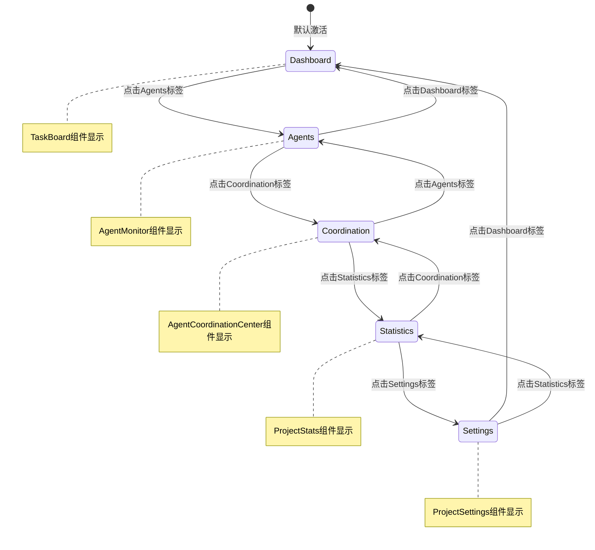

**图表来源**
- [CommandCenter.tsx](file://dashboard/frontend/src/components/CommandCenter.tsx#L19-L20)

### 页面切换响应机制

页面切换通过以下机制实现：

1. **状态更新**：当用户点击不同的标签时，activeTab状态立即更新
2. **条件渲染**：TabsContent组件根据当前activeTab值决定渲染哪个内容
3. **平滑过渡**：配合Framer Motion实现页面切换的动画效果

**章节来源**
- [CommandCenter.tsx](file://dashboard/frontend/src/components/CommandCenter.tsx#L19-L20)

## Motion动画配置

CommandCenter广泛使用Framer Motion实现流畅的动画效果，提升用户体验：

### 动画配置分析

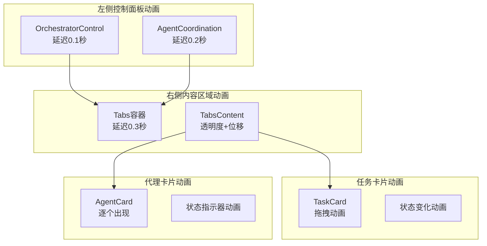

**图表来源**
- [CommandCenter.tsx](file://dashboard/frontend/src/components/CommandCenter.tsx#L26-L48)
- [TaskBoard.tsx](file://dashboard/frontend/src/components/TaskBoard.tsx#L158-L186)
- [AgentMonitor.tsx](file://dashboard/frontend/src/components/AgentMonitor.tsx#L118-L127)

### 动画效果详解

| 组件 | 动画类型 | 配置参数 | 用户体验价值 |
|------|----------|----------|--------------|
| 左侧面板 | 透明度+位移 | opacity: 0→1, x: -20→0 | 渐入效果，引导注意力 |
| 右侧面板 | 透明度+位移 | opacity: 0→1, x: 20→0 | 对比左侧动画方向 |
| 任务卡片 | 弹性动画 | spring: stiffness=350, damping=25 | 自然的物理反馈 |
| 代理卡片 | 顺序动画 | delay: 0.1秒递增 | 层次感和节奏感 |
| 状态指示器 | 脉冲动画 | animate-pulse | 实时状态反馈 |

**章节来源**
- [CommandCenter.tsx](file://dashboard/frontend/src/components/CommandCenter.tsx#L26-L48)
- [TaskBoard.tsx](file://dashboard/frontend/src/components/TaskBoard.tsx#L158-L186)
- [AgentMonitor.tsx](file://dashboard/frontend/src/components/AgentMonitor.tsx#L118-L127)

## 数据绑定与projectId属性

projectId属性贯穿整个CommandCenter组件树，实现了统一的数据绑定和状态管理：

### 数据流架构

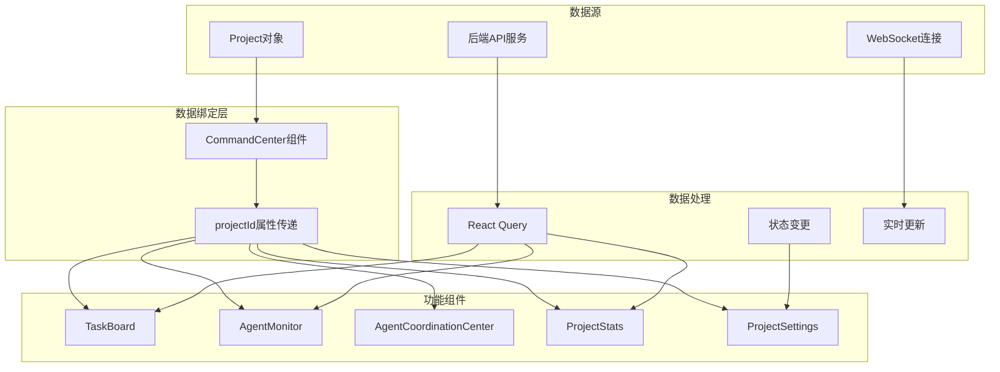

**图表来源**
- [CommandCenter.tsx](file://dashboard/frontend/src/components/CommandCenter.tsx#L14-L16)
- [api.ts](file://dashboard/frontend/src/services/api.ts#L1-L248)

### projectId属性的应用场景

projectId属性在各个组件中的具体应用：

1. **TaskBoard**：获取指定项目的任务列表
2. **AgentMonitor**：监控特定项目的代理状态
3. **AgentCoordinationCenter**：实时监控项目代理协调
4. **ProjectStats**：计算项目统计指标
5. **ProjectSettings**：保存项目配置更改

**章节来源**
- [CommandCenter.tsx](file://dashboard/frontend/src/components/CommandCenter.tsx#L14-L16)
- [api.ts](file://dashboard/frontend/src/services/api.ts#L1-L248)

## 性能优化考虑

CommandCenter在设计时充分考虑了性能优化，采用了多种策略确保良好的用户体验：

### 优化策略

1. **懒加载**：TabsContent组件仅在激活时渲染对应内容
2. **状态缓存**：React Query提供智能缓存和自动刷新
3. **WebSocket复用**：单一WebSocket连接处理所有实时更新
4. **条件渲染**：根据数据状态选择性渲染组件
5. **动画优化**：使用CSS transform而非布局重排

### 性能监控指标

| 指标 | 监控方法 | 优化目标 |
|------|----------|----------|
| 首次渲染时间 | React DevTools Profiler | < 200ms |
| 内存使用 | 浏览器开发者工具 | 稳定增长 |
| WebSocket连接 | 控制台日志 | 断线重连 |
| API请求频率 | 网络面板 | 5秒轮询 |
| 动画帧率 | Performance面板 | 60fps |

## 总结

CommandCenter组件作为TaskTree项目的核心工作区，展现了现代前端架构的最佳实践：

### 架构优势

1. **模块化设计**：清晰的功能分离和组件边界
2. **响应式布局**：灵活的网格系统适应不同屏幕尺寸
3. **状态管理**：简洁的React状态模式
4. **动画体验**：流畅的Framer Motion动画
5. **数据绑定**：统一的projectId属性传递

### 技术特色

- **五维导航系统**：涵盖任务管理、代理监控、协调控制、统计分析、项目设置
- **实时数据同步**：WebSocket实现实时更新
- **可视化监控**：丰富的图表和图形化展示
- **用户友好**：直观的操作界面和反馈机制

### 扩展性考虑

CommandCenter的设计具有良好的扩展性，可以轻松添加新的功能模块和导航标签，为TaskTree项目的未来发展奠定了坚实的基础。