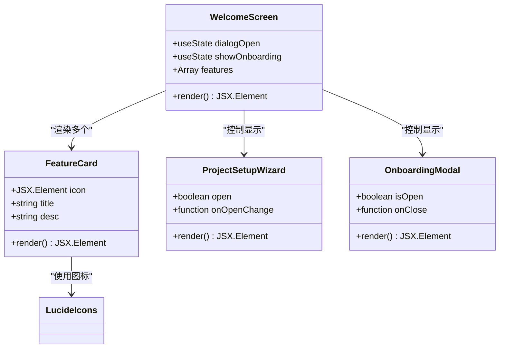

# 欢迎界面

<cite>
**本文档中引用的文件**
- [WelcomeScreen.tsx](file://dashboard/frontend/src/components/WelcomeScreen.tsx)
- [OnboardingModal.tsx](file://dashboard/frontend/src/components/OnboardingModal.tsx)
- [ProjectSetupWizard.tsx](file://dashboard/frontend/src/components/ProjectSetupWizard.tsx)
- [dialog.tsx](file://dashboard/frontend/src/components/ui/dialog.tsx)
- [Logo.tsx](file://dashboard/frontend/src/components/Logo.tsx)
- [index.css](file://dashboard/frontend/src/index.css)
- [tailwind.config.js](file://dashboard/frontend/tailwind.config.js)
</cite>

## 目录
1. [简介](#简介)
2. [项目结构](#项目结构)
3. [核心组件架构](#核心组件架构)
4. [多阶段动画流程](#多阶段动画流程)
5. [三大核心功能特性](#三大核心功能特性)
6. [模态框控制系统](#模态框控制系统)
7. [视觉元素技术实现](#视觉元素技术实现)
8. [用户体验考量](#用户体验考量)
9. [总结](#总结)

## 简介

WelcomeScreen组件是SplitMind Command Center的新用户引导入口，采用现代化的UI设计理念，通过framer-motion实现流畅的多阶段动画效果，为用户提供直观的初次使用体验。该组件不仅展示了平台的核心功能特性，还通过精心设计的交互流程帮助用户快速上手。

## 项目结构

WelcomeScreen组件位于前端组件树的根目录下，与其他核心组件协同工作：


**图表来源**
- [WelcomeScreen.tsx](file://dashboard/frontend/src/components/WelcomeScreen.tsx#L1-L120)
- [ProjectSetupWizard.tsx](file://dashboard/frontend/src/components/ProjectSetupWizard.tsx#L1-L50)
- [OnboardingModal.tsx](file://dashboard/frontend/src/components/OnboardingModal.tsx#L1-L50)

**章节来源**
- [WelcomeScreen.tsx](file://dashboard/frontend/src/components/WelcomeScreen.tsx#L1-L120)

## 核心组件架构

WelcomeScreen组件采用了模块化的架构设计，主要包含以下核心部分：



**图表来源**
- [WelcomeScreen.tsx](file://dashboard/frontend/src/components/WelcomeScreen.tsx#L8-L120)
- [ProjectSetupWizard.tsx](file://dashboard/frontend/src/components/ProjectSetupWizard.tsx#L46-L671)
- [OnboardingModal.tsx](file://dashboard/frontend/src/components/OnboardingModal.tsx#L29-L502)

**章节来源**
- [WelcomeScreen.tsx](file://dashboard/frontend/src/components/WelcomeScreen.tsx#L8-L120)

## 多阶段动画流程

WelcomeScreen组件通过framer-motion实现了精心设计的多阶段动画流程，每个阶段都有特定的视觉效果和用户体验目标：

### 动画阶段序列

```mermaid
sequenceDiagram
participant User as 用户
participant Logo as Logo动画
participant Title as 标题动画
participant Features as 功能卡片动画
participant Buttons as 按钮动画
User->>Logo : 页面加载
Logo->>Logo : 缩放动画 (scale : 0→1)
Logo->>Title : 渐显动画 (opacity : 0→1)
Title->>Features : 逐个入场 (delay : 0.4s+0.1s×index)
Features->>Buttons : 最后显示 (delay : 0.8s)
Note over Logo,Buttons : 总时长约2秒，创造流畅的视觉体验
```

**图表来源**
- [WelcomeScreen.tsx](file://dashboard/frontend/src/components/WelcomeScreen.tsx#L19-L118)

### 动画配置详解

| 阶段 | 组件 | 初始状态 | 目标状态 | 过渡时间 | 特殊效果 |
|------|------|----------|----------|----------|----------|
| 1 | Logo容器 | scale: 0 | scale: 1 | 0.5s | spring类型，弹性效果 |
| 2 | Logo内容 | opacity: 0 | opacity: 1 | 0.5s | 无延迟 |
| 3 | 标题 | opacity: 0 | opacity: 1 | 0.5s | 延迟0.2s |
| 4 | 功能卡片 | opacity: 0, y: 20 | opacity: 1, y: 0 | 0.5s | 延迟0.4s+0.1s×index |
| 5 | 按钮区域 | opacity: 0 | opacity: 1 | 0.5s | 延迟0.8s |

**章节来源**
- [WelcomeScreen.tsx](file://dashboard/frontend/src/components/WelcomeScreen.tsx#L19-L118)

## 三大核心功能特性

WelcomeScreen组件展示了SplitMind的三大核心功能特性，每个特性都通过精心设计的卡片布局呈现：

### AI-Powered Development

**功能描述**: 支持Spawn多个AI代理并行处理任务
**视觉设计**: 使用Code2图标，强调代码和开发概念
**交互效果**: 卡片悬停时有轻微放大和边框高亮效果

### Git Worktree Isolation

**功能描述**: 每个代理在独立分支中工作
**视觉设计**: 使用GitBranch图标，突出版本控制概念
**技术优势**: 确保开发过程的隔离性和安全性

### Parallel Execution

**功能描述**: 同时运行多个代理提高效率
**视觉设计**: 使用Cpu图标，体现计算和并发概念
**性能优势**: 显著提升开发速度和项目交付能力


**图表来源**
- [WelcomeScreen.tsx](file://dashboard/frontend/src/components/WelcomeScreen.tsx#L12-L16)
- [WelcomeScreen.tsx](file://dashboard/frontend/src/components/WelcomeScreen.tsx#L62-L76)

**章节来源**
- [WelcomeScreen.tsx](file://dashboard/frontend/src/components/WelcomeScreen.tsx#L12-L16)
- [WelcomeScreen.tsx](file://dashboard/frontend/src/components/WelcomeScreen.tsx#L62-L76)

## 模态框控制系统

WelcomeScreen组件通过两个关键的状态变量控制模态框的显示与隐藏：

### ProjectSetupWizard 控制机制


**图表来源**
- [WelcomeScreen.tsx](file://dashboard/frontend/src/components/WelcomeScreen.tsx#L84-L97)

### OnboardingModal 控制机制


**图表来源**
- [WelcomeScreen.tsx](file://dashboard/frontend/src/components/WelcomeScreen.tsx#L101-L109)

### 状态管理对比

| 模态框类型 | 状态变量 | 控制方式 | 生命周期 |
|------------|----------|----------|----------|
| ProjectSetupWizard | dialogOpen | 直接控制 | 项目创建流程 |
| OnboardingModal | showOnboarding | 引导控制 | 新手学习流程 |

**章节来源**
- [WelcomeScreen.tsx](file://dashboard/frontend/src/components/WelcomeScreen.tsx#L9-L10)
- [WelcomeScreen.tsx](file://dashboard/frontend/src/components/WelcomeScreen.tsx#L84-L109)

## 视觉元素技术实现

WelcomeScreen组件运用了多种现代Web视觉技术，创造出独特的科技感和品牌识别度：

### 背景渐变色系统

**技术实现**: 使用Tailwind CSS的渐变工具类
**颜色配置**: `bg-gradient-to-r from-electric-cyan to-accent`
**视觉效果**: 创建从电光蓝到蓝色的平滑过渡

### 霓虹效果实现

**技术原理**: `text-transparent` + `bg-clip-text`
**CSS属性**: 
- `text-transparent`: 使文字透明
- `bg-clip-text`: 将背景裁剪为文字形状
- `background-image`: 应用渐变背景

### 脉冲光晕效果

**技术实现**: `animate-pulse` + 自定义keyframes
**动画配置**: 
- `animate-pulse`: 内置脉冲动画
- 自定义keyframes: `glow-pulse` (2s循环)
- 颜色变化: 从浅蓝到深蓝的动态效果


**图表来源**
- [WelcomeScreen.tsx](file://dashboard/frontend/src/components/WelcomeScreen.tsx#L32-L36)
- [WelcomeScreen.tsx](file://dashboard/frontend/src/components/WelcomeScreen.tsx#L38-L45)
- [tailwind.config.js](file://dashboard/frontend/tailwind.config.js#L63-L85)

### 主题色彩系统

| 颜色名称 | HEX值 | 用途 | 效果 |
|----------|-------|------|------|
| electric-cyan | #00ffff | 主色调 | 霓虹效果、高亮 |
| deep-indigo | #1a1f3a | 背景色 | 深邃科技感 |
| accent | #3b82f6 | 辅助色 | 渐变终点色 |
| dark-bg | #0a0e1a | 主背景 | 整体氛围 |

**章节来源**
- [WelcomeScreen.tsx](file://dashboard/frontend/src/components/WelcomeScreen.tsx#L32-L36)
- [WelcomeScreen.tsx](file://dashboard/frontend/src/components/WelcomeScreen.tsx#L38-L45)
- [tailwind.config.js](file://dashboard/frontend/tailwind.config.js#L20-L48)
- [index.css](file://dashboard/frontend/src/index.css#L62-L84)

## 用户体验考量

WelcomeScreen组件在设计时充分考虑了用户体验的各个方面：

### 信息层级设计


**图表来源**
- [WelcomeScreen.tsx](file://dashboard/frontend/src/components/WelcomeScreen.tsx#L38-L118)

### 交互反馈设计

| 交互元素 | 反馈效果 | 实现方式 | 用户价值 |
|----------|----------|----------|----------|
| 功能卡片 | 悬停放大 | `whileHover={{ scale: 1.05 }}` | 增强可点击性感知 |
| 开始项目按钮 | 火箭图标跳动 | `group-hover:animate-bounce` | 提供视觉激励 |
| 需要帮助链接 | 文字颜色变化 | `hover:text-white` | 明确交互状态 |

### 响应式设计策略

**移动端优化**:
- 单列布局 (`grid-cols-1`)
- 增大触摸目标尺寸
- 优化字体大小和间距

**桌面端优化**:
- 三列布局 (`md:grid-cols-3`)
- 增强视觉层次
- 更精细的动画控制

**章节来源**
- [WelcomeScreen.tsx](file://dashboard/frontend/src/components/WelcomeScreen.tsx#L56-L76)
- [WelcomeScreen.tsx](file://dashboard/frontend/src/components/WelcomeScreen.tsx#L84-L109)

## 总结

WelcomeScreen组件作为SplitMind Command Center的新用户引导入口，成功地将现代UI设计理念与功能性需求相结合。通过framer-motion实现的多阶段动画流程创造了流畅的视觉体验，三大核心功能特性的展示清晰传达了平台的价值主张，而精心设计的模态框控制系统确保了良好的用户体验。

该组件不仅展示了技术实现的精妙之处，更体现了对用户体验的深度思考。从视觉元素的技术实现到交互设计的细节考量，每一个方面都经过精心打磨，为用户提供了既美观又实用的初次使用体验。

通过分析这个组件，我们可以看到现代Web应用开发中动画效果、响应式设计和用户体验设计的最佳实践，这些经验对于构建高质量的用户界面具有重要的参考价值。