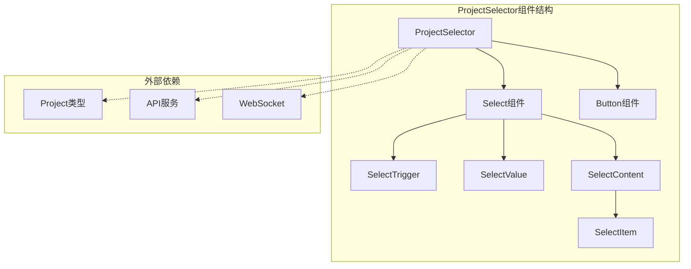
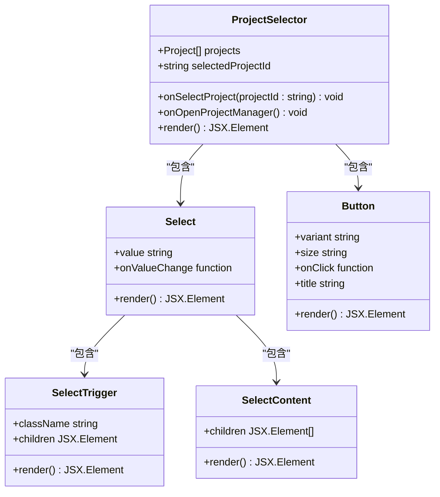
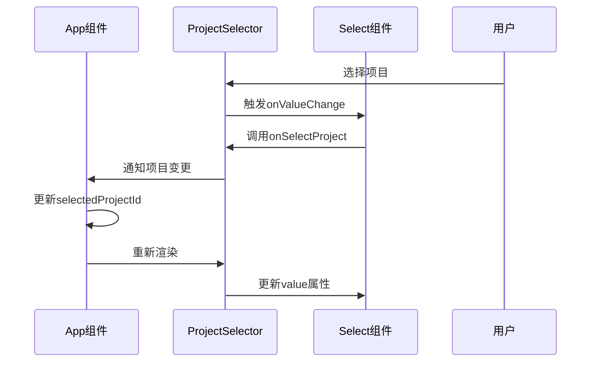
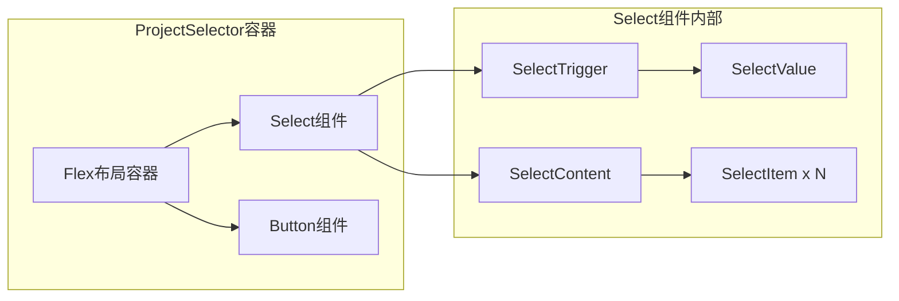
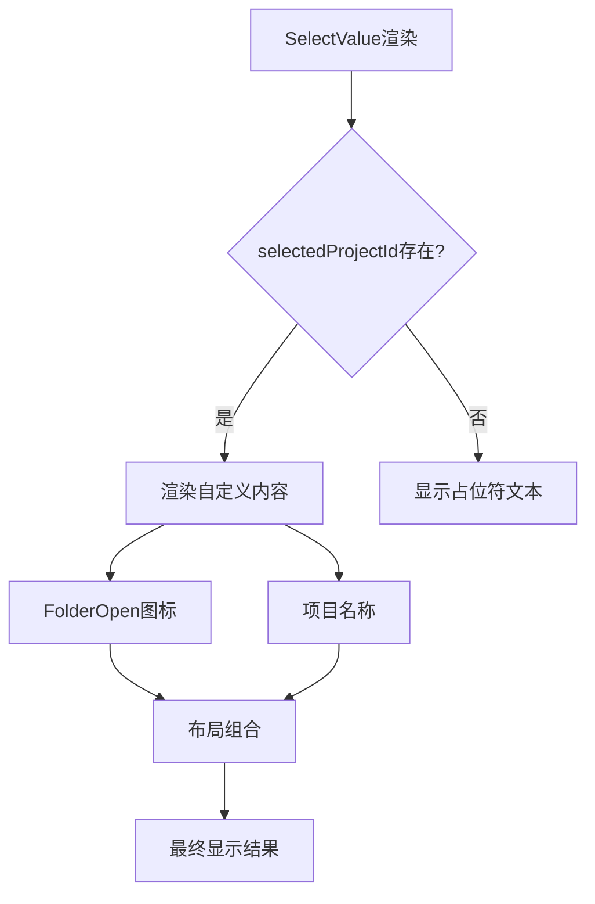
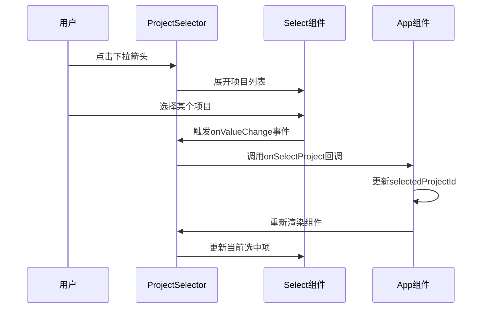
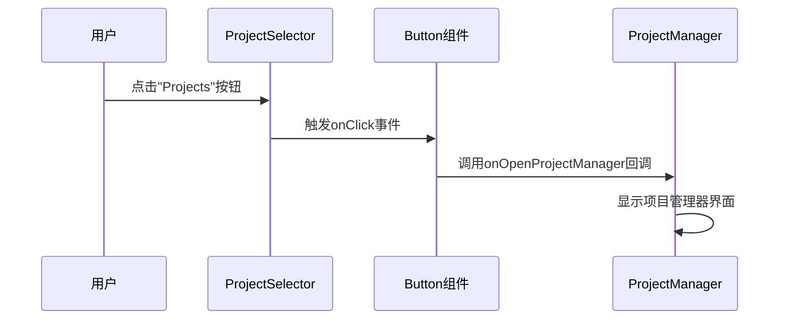
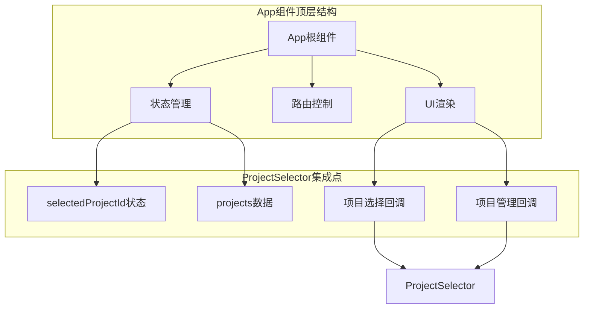

# 项目选择器组件深度解析

<cite>
**本文档中引用的文件**
- [ProjectSelector.tsx](file://dashboard/frontend/src/components/ProjectSelector.tsx)
- [select.tsx](file://dashboard/frontend/src/components/ui/select.tsx)
- [button.tsx](file://dashboard/frontend/src/components/ui/button.tsx)
- [App.tsx](file://dashboard/frontend/src/App.tsx)
- [ProjectManager.tsx](file://dashboard/frontend/src/components/ProjectManager.tsx)
- [index.ts](file://dashboard/frontend/src/types/index.ts)
</cite>

## 目录
1. [组件概述](#组件概述)
2. [核心架构分析](#核心架构分析)
3. [Props接口设计](#props接口设计)
4. [状态管理机制](#状态管理机制)
5. [UI组件组合模式](#ui组件组合模式)
6. [自定义渲染逻辑](#自定义渲染逻辑)
7. [交互流程分析](#交互流程分析)
8. [在App组件中的集成](#在app组件中的集成)
9. [性能优化考虑](#性能优化考虑)
10. [最佳实践建议](#最佳实践建议)

## 组件概述

ProjectSelector是一个复合UI组件，专门用于在SplitMind应用中提供项目选择功能。它巧妙地结合了Select下拉选择器和Button按钮组件，为用户提供直观的项目切换体验。该组件不仅实现了基本的项目选择功能，还提供了项目管理器访问入口，是整个应用状态管理系统中的关键节点。



**图表来源**
- [ProjectSelector.tsx](file://dashboard/frontend/src/components/ProjectSelector.tsx#L12-L67)
- [select.tsx](file://dashboard/frontend/src/components/ui/select.tsx#L7-L158)
- [button.tsx](file://dashboard/frontend/src/components/ui/button.tsx#L37-L57)

## 核心架构分析

ProjectSelector采用组合式架构设计，通过组合两个基础UI组件构建复杂的功能界面。这种设计模式体现了React生态系统中"组合优于继承"的设计哲学。

### 架构层次结构



**图表来源**
- [ProjectSelector.tsx](file://dashboard/frontend/src/components/ProjectSelector.tsx#L19-L67)
- [select.tsx](file://dashboard/frontend/src/components/ui/select.tsx#L13-L30)
- [button.tsx](file://dashboard/frontend/src/components/ui/button.tsx#L43-L56)

**章节来源**
- [ProjectSelector.tsx](file://dashboard/frontend/src/components/ProjectSelector.tsx#L1-L67)

## Props接口设计

ProjectSelector的Props接口设计体现了清晰的职责分离和类型安全原则。每个属性都有明确的用途和类型约束。

### Props接口详解

| 属性名 | 类型 | 必需 | 描述 |
|--------|------|------|------|
| `projects` | `Project[]` | 是 | 项目列表数组，包含所有可用的项目信息 |
| `selectedProjectId` | `string \| null` | 是 | 当前选中的项目ID，null表示未选择任何项目 |
| `onSelectProject` | `(projectId: string) => void` | 是 | 项目选择回调函数，当用户选择不同项目时调用 |
| `onOpenProjectManager` | `() => void` | 否 | 可选的项目管理器打开回调函数 |

### 类型定义分析

Project类型定义展示了项目的完整结构，包含了项目的基本信息、配置参数和状态数据：

```typescript
interface Project {
  id: string;           // 唯一标识符
  name: string;         // 项目名称
  path: string;         // 项目路径
  description?: string; // 可选描述
  max_agents: number;   // 最大代理数量
  active: boolean;      // 活跃状态
  created_at: string;   // 创建时间
  updated_at: string;   // 更新时间
}
```

**章节来源**
- [ProjectSelector.tsx](file://dashboard/frontend/src/components/ProjectSelector.tsx#L12-L17)
- [index.ts](file://dashboard/frontend/src/types/index.ts#L1-L15)

## 状态管理机制

ProjectSelector采用受控组件模式，将状态管理委托给父组件App。这种设计遵循了React的最佳实践，确保了状态的一致性和可预测性。

### 状态同步机制



**图表来源**
- [ProjectSelector.tsx](file://dashboard/frontend/src/components/ProjectSelector.tsx#L28-L30)
- [App.tsx](file://dashboard/frontend/src/App.tsx#L21-L21)

### 状态流转过程

1. **初始渲染阶段**：App组件初始化selectedProjectId状态，传递给ProjectSelector
2. **用户交互阶段**：用户从下拉菜单选择不同项目，触发onSelectProject回调
3. **状态更新阶段**：App组件更新selectedProjectId，触发重新渲染
4. **UI同步阶段**：ProjectSelector根据新的selectedProjectId更新显示内容

**章节来源**
- [ProjectSelector.tsx](file://dashboard/frontend/src/components/ProjectSelector.tsx#L19-L30)
- [App.tsx](file://dashboard/frontend/src/App.tsx#L21-L21)

## UI组件组合模式

ProjectSelector展现了优秀的组件组合模式，通过合理组织多个基础UI组件，创造出功能丰富的复合组件。

### 组合关系图



**图表来源**
- [ProjectSelector.tsx](file://dashboard/frontend/src/components/ProjectSelector.tsx#L27-L64)
- [select.tsx](file://dashboard/frontend/src/components/ui/select.tsx#L13-L30)

### 组件层次分析

1. **外层容器**：使用flex布局实现水平排列，space-x-2提供间距
2. **Select组件**：负责项目选择的核心功能
3. **Button组件**：提供项目管理器访问入口

**章节来源**
- [ProjectSelector.tsx](file://dashboard/frontend/src/components/ProjectSelector.tsx#L27-L64)

## 自定义渲染逻辑

ProjectSelector的自定义渲染逻辑是其核心特色，特别是在SelectValue和SelectItem的自定义内容渲染方面。

### SelectValue自定义渲染



**图表来源**
- [ProjectSelector.tsx](file://dashboard/frontend/src/components/ProjectSelector.tsx#L31-L38)

### 自定义渲染实现细节

1. **条件渲染**：只有在selectedProjectId存在时才渲染自定义内容
2. **图标集成**：使用FolderOpen图标增强视觉识别度
3. **动态内容**：通过projects.find查找对应项目获取名称
4. **样式控制**：使用flex布局实现图标与文本的对齐

### SelectItem自定义渲染

每个项目选项都采用相同的自定义渲染模式：
- 图标：FolderOpen图标保持视觉一致性
- 文本：项目名称直接显示
- 布局：统一的flex布局设计

**章节来源**
- [ProjectSelector.tsx](file://dashboard/frontend/src/components/ProjectSelector.tsx#L31-L48)

## 交互流程分析

ProjectSelector的交互流程涵盖了项目选择和项目管理器访问两个主要场景。

### 项目选择流程



**图表来源**
- [ProjectSelector.tsx](file://dashboard/frontend/src/components/ProjectSelector.tsx#L28-L30)
- [App.tsx](file://dashboard/frontend/src/App.tsx#L82-L87)

### 项目管理器访问流程



**图表来源**
- [ProjectSelector.tsx](file://dashboard/frontend/src/components/ProjectSelector.tsx#L53-L64)
- [App.tsx](file://dashboard/frontend/src/App.tsx#L86-L86)

**章节来源**
- [ProjectSelector.tsx](file://dashboard/frontend/src/components/ProjectSelector.tsx#L28-L64)

## 在App组件中的集成

ProjectSelector在App组件中扮演着导航和状态管理的核心角色，其集成方式体现了现代React应用的最佳实践。

### 集成架构



**图表来源**
- [App.tsx](file://dashboard/frontend/src/App.tsx#L20-L197)

### 集成特点分析

1. **状态提升**：selectedProjectId状态在App组件中管理
2. **数据流**：projects数据通过React Query获取并传递给ProjectSelector
3. **回调处理**：onSelectProject和onOpenProjectManager回调函数在App中实现
4. **条件渲染**：根据projects数量决定是否显示ProjectSelector

### 应用状态管理中的作用

ProjectSelector在应用状态管理体系中具有以下重要作用：

1. **项目导航中心**：作为用户在不同项目间切换的主要入口
2. **状态同步点**：确保全局项目状态的一致性
3. **用户体验优化**：提供直观的项目选择界面
4. **功能扩展入口**：通过项目管理器按钮支持高级功能

**章节来源**
- [App.tsx](file://dashboard/frontend/src/App.tsx#L20-L197)
- [ProjectSelector.tsx](file://dashboard/frontend/src/components/ProjectSelector.tsx#L19-L67)

## 性能优化考虑

ProjectSelector在设计时充分考虑了性能优化，采用了多种策略来确保良好的用户体验。

### 渲染优化策略

1. **受控组件模式**：避免不必要的内部状态管理
2. **条件渲染**：onOpenProjectManager按钮仅在有回调函数时渲染
3. **高效查找**：使用projects.find方法查找项目信息
4. **样式优化**：利用Tailwind CSS类名实现高效的样式控制

### 内存管理

1. **事件处理器**：使用箭头函数避免重复创建函数实例
2. **依赖注入**：通过props传递回调函数而非在组件内定义
3. **条件渲染**：减少不必要的DOM元素创建

### 数据处理优化

1. **对象查找**：使用find方法而非forEach循环提高查找效率
2. **类型检查**：通过TypeScript确保类型安全，减少运行时错误
3. **空值处理**：合理处理null和undefined值

## 最佳实践建议

基于ProjectSelector的实现，可以总结出以下最佳实践建议：

### 组件设计原则

1. **单一职责**：ProjectSelector专注于项目选择功能，不承担其他职责
2. **组合优先**：通过组合基础UI组件构建复杂功能
3. **类型安全**：充分利用TypeScript确保类型安全
4. **可扩展性**：预留扩展点（如onOpenProjectManager）

### 开发模式建议

1. **受控组件**：对于需要精确控制状态的场景，使用受控组件模式
2. **回调函数**：通过回调函数实现父子组件通信
3. **条件渲染**：合理使用条件渲染减少不必要的计算
4. **样式隔离**：使用CSS-in-JS或CSS模块确保样式不会冲突

### 用户体验优化

1. **视觉反馈**：提供清晰的视觉指示器（如FolderOpen图标）
2. **交互响应**：确保用户操作有及时的视觉反馈
3. **无障碍支持**：考虑键盘导航和屏幕阅读器支持
4. **错误处理**：优雅处理各种边界情况

### 测试策略

1. **单元测试**：测试组件的渲染逻辑和交互行为
2. **集成测试**：验证组件与父组件的协作
3. **端到端测试**：测试完整的用户操作流程
4. **性能测试**：监控组件的渲染性能

ProjectSelector组件展现了现代React应用开发中的优秀实践，通过合理的架构设计、清晰的接口定义和高效的实现方式，为用户提供了优质的项目选择体验。其设计理念和实现方式值得在类似的项目选择场景中借鉴和应用。