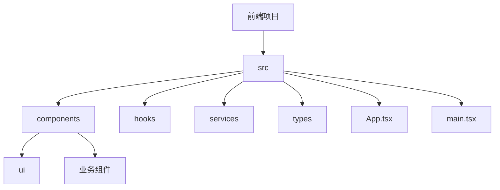
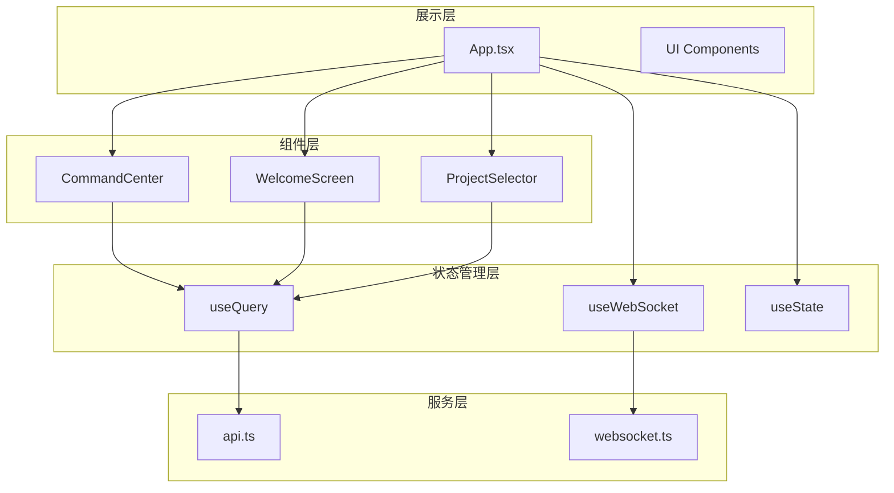
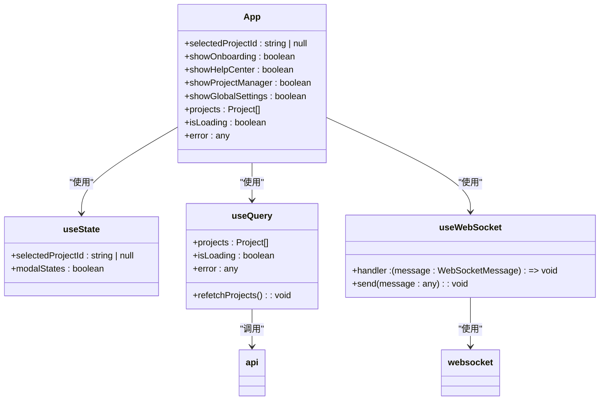
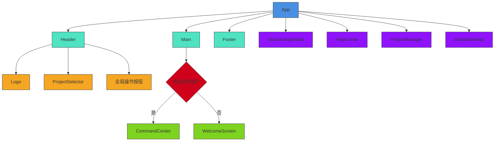
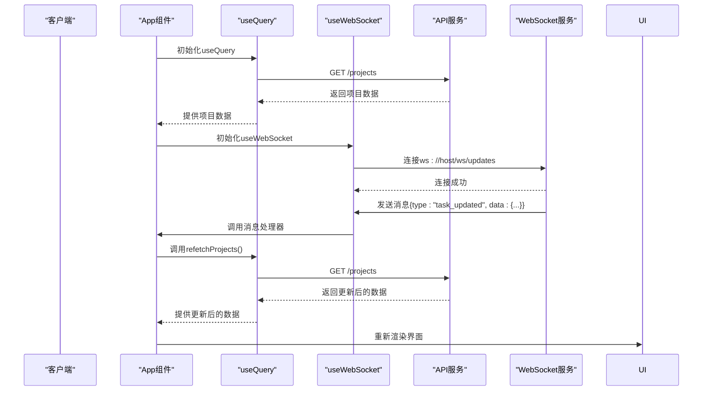
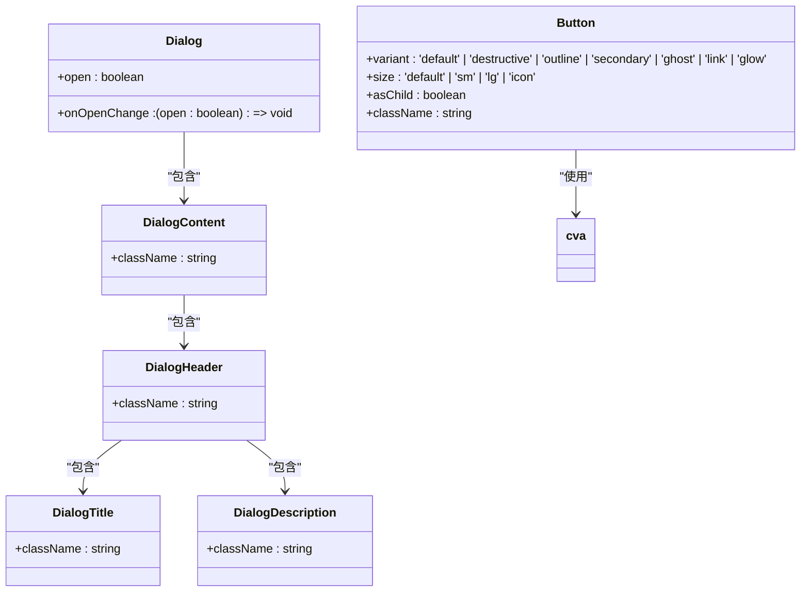

# 前端架构

<cite>
**本文档中引用的文件**  
- [App.tsx](file://dashboard/frontend/src/App.tsx)
- [main.tsx](file://dashboard/frontend/src/main.tsx)
- [useWebSocket.ts](file://dashboard/frontend/src/hooks/useWebSocket.ts)
- [api.ts](file://dashboard/frontend/src/services/api.ts)
- [websocket.ts](file://dashboard/frontend/src/services/websocket.ts)
- [index.ts](file://dashboard/frontend/src/types/index.ts)
- [CommandCenter.tsx](file://dashboard/frontend/src/components/CommandCenter.tsx)
- [WelcomeScreen.tsx](file://dashboard/frontend/src/components/WelcomeScreen.tsx)
- [ProjectSelector.tsx](file://dashboard/frontend/src/components/ProjectSelector.tsx)
- [GlobalFooter.tsx](file://dashboard/frontend/src/components/GlobalFooter.tsx)
- [dialog.tsx](file://dashboard/frontend/src/components/ui/dialog.tsx)
- [button.tsx](file://dashboard/frontend/src/components/ui/button.tsx)
</cite>

## 目录
1. [简介](#简介)
2. [项目结构](#项目结构)
3. [核心组件](#核心组件)
4. [架构概览](#架构概览)
5. [详细组件分析](#详细组件分析)
6. [依赖分析](#依赖分析)
7. [性能考虑](#性能考虑)
8. [故障排除指南](#故障排除指南)
9. [结论](#结论)

## 简介
TaskTree前端架构以App.tsx为入口，构建了一个现代化的React应用，采用React Query进行数据流管理，WebSocket实现实时更新，并通过多模态交互设计提升用户体验。应用整体布局清晰，包含Header、Main区域和Footer三个主要部分。状态管理机制完善，使用useState管理选中项目，useQuery缓存项目数据，useWebSocket处理实时消息并触发refetch。UI组件基于Radix UI构建，确保可访问性和一致性，通过Dialog、Button等组件实现ProjectManager、HelpCenter等模态框。响应式设计和动画（framer-motion）的实现进一步提升了应用的视觉效果和交互体验。

## 项目结构
TaskTree前端项目采用标准的React项目结构，src目录下包含components、hooks、services、types等核心目录。components目录存放所有UI组件，包括基础UI组件（ui子目录）和业务组件；hooks目录存放自定义Hook，如useWebSocket；services目录存放API和服务逻辑；types目录定义应用类型。项目使用Vite作为构建工具，TypeScript作为开发语言，Tailwind CSS进行样式设计。



**Diagram sources**
- [App.tsx](file://dashboard/frontend/src/App.tsx#L1-L197)
- [main.tsx](file://dashboard/frontend/src/main.tsx#L1-L25)

**Section sources**
- [App.tsx](file://dashboard/frontend/src/App.tsx#L1-L197)
- [main.tsx](file://dashboard/frontend/src/main.tsx#L1-L25)

## 核心组件
App.tsx作为应用的根组件，负责整体布局和状态管理。它使用useState管理选中项目ID，useQuery从API获取项目数据并缓存，useWebSocket订阅WebSocket消息。根据应用状态，Main区域动态显示WelcomeScreen或CommandCenter。Header包含Logo、ProjectSelector和全局操作按钮，Footer提供全局信息和链接。多个模态框（OnboardingModal、HelpCenter、ProjectManager、GlobalSettings）通过状态控制显示和隐藏，实现多模态交互。

**Section sources**
- [App.tsx](file://dashboard/frontend/src/App.tsx#L1-L197)
- [WelcomeScreen.tsx](file://dashboard/frontend/src/components/WelcomeScreen.tsx#L1-L120)
- [CommandCenter.tsx](file://dashboard/frontend/src/components/CommandCenter.tsx#L1-L98)

## 架构概览
TaskTree前端架构采用分层设计，从下到上分为服务层、状态管理层、组件层和展示层。服务层（services）封装API调用和WebSocket连接；状态管理层（hooks）提供自定义Hook管理应用状态；组件层（components）构建可复用的UI组件；展示层（App.tsx）组合所有组件形成完整应用。数据流清晰，从API获取数据后由React Query缓存，组件通过Hook访问数据，WebSocket消息触发数据更新。



**Diagram sources**
- [App.tsx](file://dashboard/frontend/src/App.tsx#L1-L197)
- [useWebSocket.ts](file://dashboard/frontend/src/hooks/useWebSocket.ts#L1-L24)
- [api.ts](file://dashboard/frontend/src/services/api.ts#L1-L248)
- [websocket.ts](file://dashboard/frontend/src/services/websocket.ts#L1-L98)

## 详细组件分析
### App组件分析
App组件是应用的入口点，负责协调所有子组件和状态管理。它使用多个状态变量控制模态框的显示，通过useQuery获取项目数据，使用useWebSocket监听实时消息。组件结构清晰，分为Header、Main和Footer三个主要区域，每个区域包含相应的子组件。

#### 状态管理机制


**Diagram sources**
- [App.tsx](file://dashboard/frontend/src/App.tsx#L21-L48)
- [api.ts](file://dashboard/frontend/src/services/api.ts#L1-L248)
- [websocket.ts](file://dashboard/frontend/src/services/websocket.ts#L1-L98)

#### UI组件架构


**Diagram sources**
- [App.tsx](file://dashboard/frontend/src/App.tsx#L75-L193)
- [ProjectSelector.tsx](file://dashboard/frontend/src/components/ProjectSelector.tsx#L1-L67)
- [WelcomeScreen.tsx](file://dashboard/frontend/src/components/WelcomeScreen.tsx#L1-L120)
- [CommandCenter.tsx](file://dashboard/frontend/src/components/CommandCenter.tsx#L1-L98)

**Section sources**
- [App.tsx](file://dashboard/frontend/src/App.tsx#L1-L197)
- [ProjectSelector.tsx](file://dashboard/frontend/src/components/ProjectSelector.tsx#L1-L67)
- [WelcomeScreen.tsx](file://dashboard/frontend/src/components/WelcomeScreen.tsx#L1-L120)

### 状态管理分析
React Query和WebSocket的集成是TaskTree前端架构的核心。useQuery负责从API获取项目数据并进行缓存管理，staleTime和gcTime配置确保数据的新鲜度和内存效率。useWebSocket自定义Hook封装了WebSocket连接、消息订阅和重连逻辑，当收到特定类型的消息时触发refetch，实现数据的实时更新。



**Diagram sources**
- [App.tsx](file://dashboard/frontend/src/App.tsx#L28-L48)
- [useWebSocket.ts](file://dashboard/frontend/src/hooks/useWebSocket.ts#L1-L24)
- [api.ts](file://dashboard/frontend/src/services/api.ts#L1-L248)
- [websocket.ts](file://dashboard/frontend/src/services/websocket.ts#L1-L98)

**Section sources**
- [App.tsx](file://dashboard/frontend/src/App.tsx#L28-L48)
- [useWebSocket.ts](file://dashboard/frontend/src/hooks/useWebSocket.ts#L1-L24)

### UI组件分析
基于Radix UI构建的原子化组件确保了应用的可访问性和一致性。Button组件通过class-variance-authority定义多种变体，包括标准的default、outline、secondary等，以及自定义的glow变体。Dialog组件封装了模态框的打开、关闭和内容展示逻辑，支持标题、描述和页脚等结构化内容。



**Diagram sources**
- [button.tsx](file://dashboard/frontend/src/components/ui/button.tsx#L1-L57)
- [dialog.tsx](file://dashboard/frontend/src/components/ui/dialog.tsx#L1-L120)

**Section sources**
- [button.tsx](file://dashboard/frontend/src/components/ui/button.tsx#L1-L57)
- [dialog.tsx](file://dashboard/frontend/src/components/ui/dialog.tsx#L1-L120)

## 依赖分析
TaskTree前端项目依赖于多个关键库，包括React、React Query、Framer Motion、Radix UI和Tailwind CSS。React Query负责数据获取和缓存，Framer Motion提供动画支持，Radix UI提供可访问的UI组件，Tailwind CSS进行样式设计。这些依赖通过package.json管理，确保版本一致性和可重复构建。

```mermaid
graph TD
A[TaskTree前端] --> B[React]
A --> C[React Query]
A --> D[Framer Motion]
A --> E[Radix UI]
A --> F[Tailwind CSS]
A --> G[TypeScript]
A --> H[Vite]
B --> I[React DOM]
C --> J[@tanstack/react-query]
E --> K[@radix-ui/react-*]
F --> L[tailwindcss]
style A fill:#4A90E2,stroke:#333
style B fill:#61DAFB,stroke:#333
style C fill:#FF4154,stroke:#333
style D fill:#FF4154,stroke:#333
style E fill:#1F1F1F,stroke:#333
style F fill:#38B2AC,stroke:#333
style G fill:#3178C6,stroke:#333
style H fill:#646CFF,stroke:#333
```

**Diagram sources**
- [package.json](file://dashboard/frontend/package.json#L1-L54)
- [tsconfig.json](file://dashboard/frontend/tsconfig.json#L1-L31)

**Section sources**
- [package.json](file://dashboard/frontend/package.json#L1-L54)
- [tsconfig.json](file://dashboard/frontend/tsconfig.json#L1-L31)

## 性能考虑
TaskTree前端架构在性能方面做了多项优化。React Query的缓存机制减少了不必要的API调用，staleTime和gcTime配置平衡了数据新鲜度和内存使用。Framer Motion的动画优化确保了流畅的用户体验，避免了不必要的重渲染。WebSocket的增量更新机制只在数据变化时触发界面更新，提高了响应效率。代码分割和懒加载（虽然未在当前代码中体现）可以进一步优化初始加载性能。

## 故障排除指南
当遇到前端问题时，可以按照以下步骤进行排查：首先检查网络连接和API服务是否正常；其次查看浏览器控制台是否有JavaScript错误；然后检查WebSocket连接状态；最后验证React Query的缓存和数据状态。对于UI问题，检查Tailwind CSS类名是否正确应用，组件属性是否正确传递。

**Section sources**
- [App.tsx](file://dashboard/frontend/src/App.tsx#L35-L36)
- [websocket.ts](file://dashboard/frontend/src/services/websocket.ts#L23-L43)
- [api.ts](file://dashboard/frontend/src/services/api.ts#L15-L26)

## 结论
TaskTree前端架构设计合理，采用了现代化的React技术栈，通过React Query和WebSocket实现了高效的数据流管理和实时更新。组件化设计和原子化UI确保了代码的可维护性和可扩展性。状态管理清晰，数据流单向，便于调试和测试。整体架构为应用的持续发展奠定了坚实的基础，未来可以在此基础上添加更多功能和优化。