# 实时状态同步

<cite>
**本文档引用的文件**
- [useWebSocket.ts](file://dashboard/frontend/src/hooks/useWebSocket.ts)
- [websocket.ts](file://dashboard/frontend/src/services/websocket.ts)
- [App.tsx](file://dashboard/frontend/src/App.tsx)
- [websocket_manager.py](file://dashboard/backend/websocket_manager.py)
- [index.ts](file://dashboard/frontend/src/types/index.ts)
- [TaskBoard.tsx](file://dashboard/frontend/src/components/TaskBoard.tsx)
- [AgentCoordinationCenter.tsx](file://dashboard/frontend/src/components/AgentCoordinationCenter.tsx)
- [api.ts](file://dashboard/frontend/src/services/api.ts)
</cite>

## 目录
1. [概述](#概述)
2. [系统架构](#系统架构)
3. [核心组件分析](#核心组件分析)
4. [WebSocket连接管理](#websocket连接管理)
5. [消息处理机制](#消息处理机制)
6. [React Query集成](#react-query集成)
7. [消息流转时序](#消息流转时序)
8. [错误处理与重连机制](#错误处理与重连机制)
9. [性能优化策略](#性能优化策略)
10. [故障排除指南](#故障排除指南)

## 概述

TaskTree前端采用基于WebSocket的实时状态同步机制，通过自定义的`useWebSocket` Hook实现与后端的双向通信。该系统能够实时响应项目状态变化，包括任务更新、代理状态变更、项目配置修改等，确保用户界面始终显示最新的项目状态。

### 核心特性

- **实时性**：毫秒级状态同步，支持即时通知
- **可靠性**：自动重连机制，保证连接稳定性
- **可扩展性**：支持多种消息类型的灵活处理
- **性能优化**：智能缓存管理和增量更新

## 系统架构

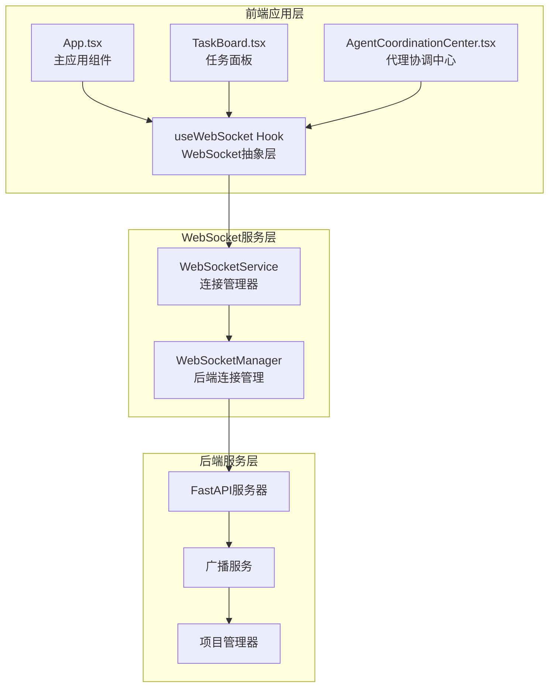

**图表来源**
- [App.tsx](file://dashboard/frontend/src/App.tsx#L1-L197)
- [useWebSocket.ts](file://dashboard/frontend/src/hooks/useWebSocket.ts#L1-L24)
- [websocket.ts](file://dashboard/frontend/src/services/websocket.ts#L1-L98)

## 核心组件分析

### useWebSocket自定义Hook

`useWebSocket`是整个实时同步机制的核心抽象层，提供了简洁的API来管理WebSocket连接和消息处理。

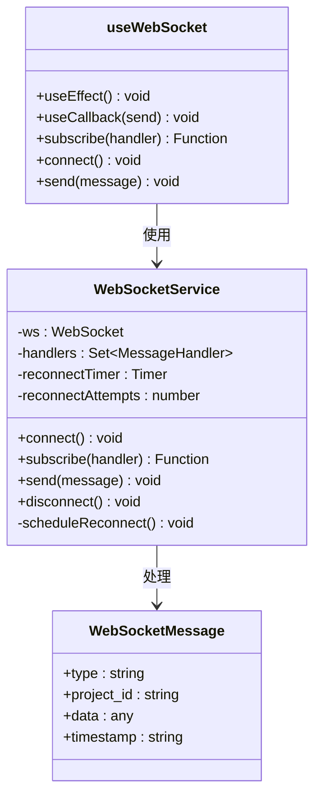

**图表来源**
- [useWebSocket.ts](file://dashboard/frontend/src/hooks/useWebSocket.ts#L5-L24)
- [websocket.ts](file://dashboard/frontend/src/services/websocket.ts#L5-L98)
- [index.ts](file://dashboard/frontend/src/types/index.ts#L78-L83)

#### Hook实现细节

1. **连接建立**：在`useEffect`中自动调用`websocket.connect()`建立连接
2. **消息订阅**：通过`websocket.subscribe(handler)`注册消息处理器
3. **资源清理**：在组件卸载时自动取消订阅，防止内存泄漏
4. **消息发送**：提供`send`方法用于向后端发送指令

**章节来源**
- [useWebSocket.ts](file://dashboard/frontend/src/hooks/useWebSocket.ts#L5-L24)

### WebSocketService类

WebSocketService是一个单例类，负责管理底层WebSocket连接的所有细节。

#### 连接生命周期管理

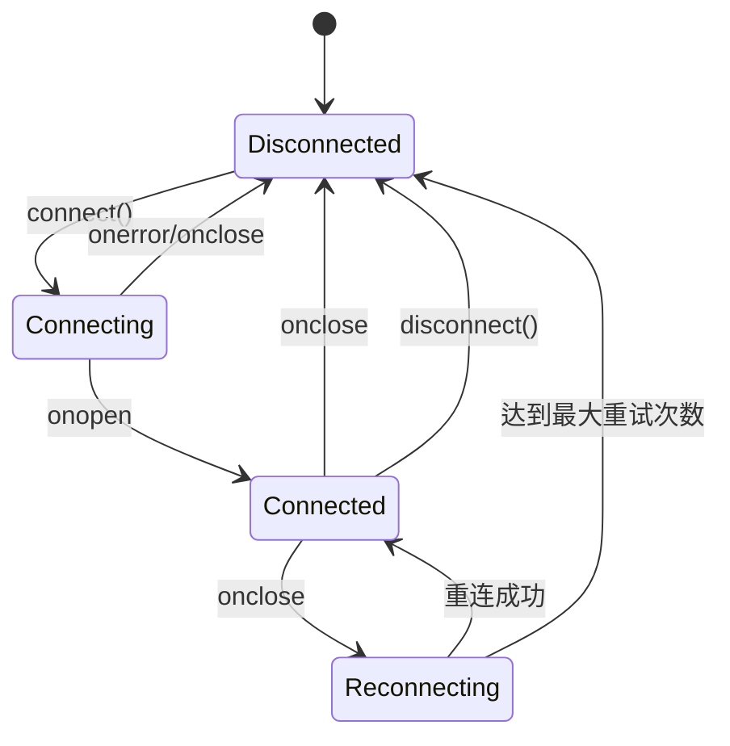

**图表来源**
- [websocket.ts](file://dashboard/frontend/src/services/websocket.ts#L13-L47)

#### 自动重连机制

WebSocketService实现了指数退避重连算法：

- **初始延迟**：1秒
- **退避策略**：2^n倍延迟（n为重试次数）
- **最大重试**：5次
- **失败处理**：停止重连并记录错误

**章节来源**
- [websocket.ts](file://dashboard/frontend/src/services/websocket.ts#L50-L67)

## WebSocket连接管理

### 前端连接建立

前端WebSocket连接通过以下流程建立：

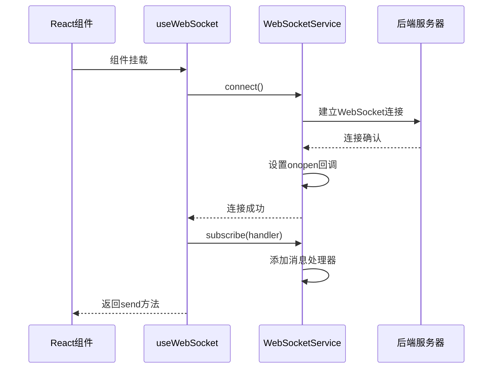

**图表来源**
- [useWebSocket.ts](file://dashboard/frontend/src/hooks/useWebSocket.ts#L6-L16)
- [websocket.ts](file://dashboard/frontend/src/services/websocket.ts#L13-L47)

### 后端连接管理

后端使用WebSocketManager类管理所有活跃连接：

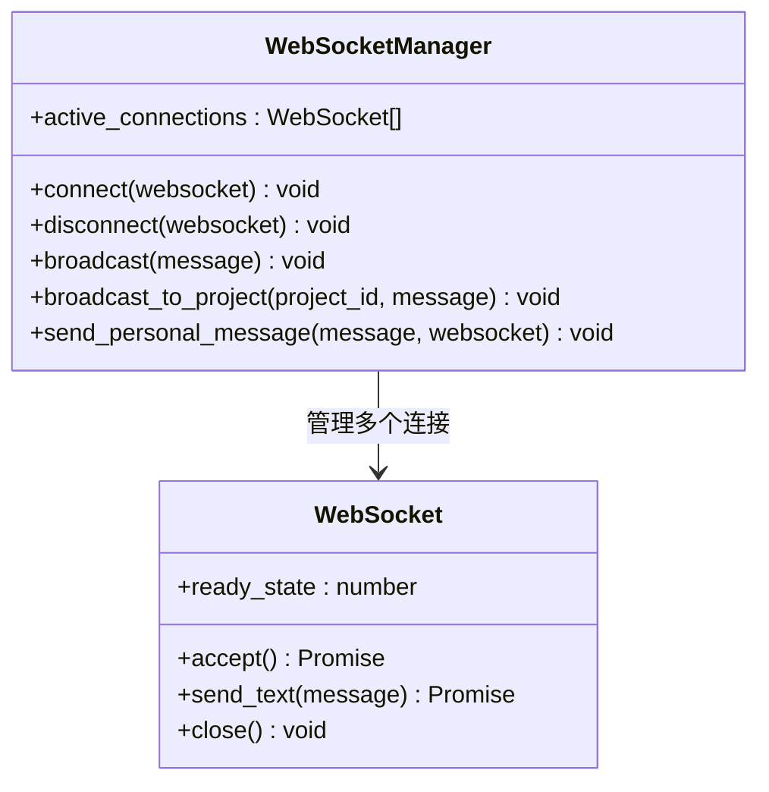

**图表来源**
- [websocket_manager.py](file://dashboard/backend/websocket_manager.py#L10-L55)

**章节来源**
- [websocket_manager.py](file://dashboard/backend/websocket_manager.py#L10-L55)

## 消息处理机制

### 消息类型识别

系统支持多种消息类型，每种类型对应不同的业务逻辑：

| 消息类型 | 触发条件 | 处理方式 | 影响范围 |
|---------|---------|---------|---------|
| `task_*` | 任务相关操作 | 刷新任务查询缓存 | 任务列表、任务详情 |
| `agent_*` | 代理状态变更 | 刷新任务查询缓存 | 代理监控、任务分配 |
| `project_*` | 项目配置修改 | 刷新项目查询缓存 | 项目列表、项目设置 |
| `plan_generated` | 计划生成完成 | 刷新项目查询缓存 | 项目概览、任务板 |

### 消息处理器实现

#### App.tsx中的全局消息处理

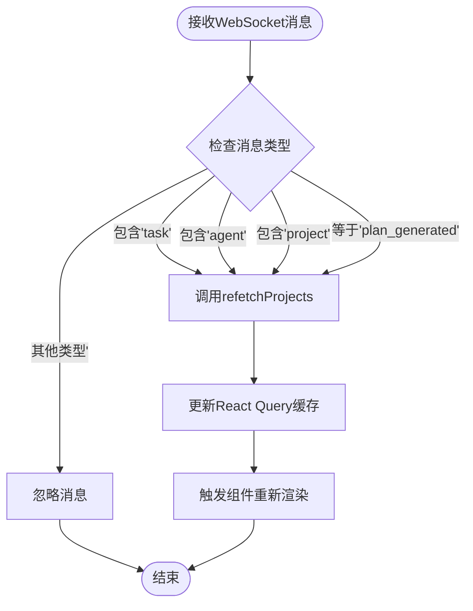

**图表来源**
- [App.tsx](file://dashboard/frontend/src/App.tsx#L41-L47)

#### TaskBoard中的项目特定处理

TaskBoard实现了更细粒度的消息处理：

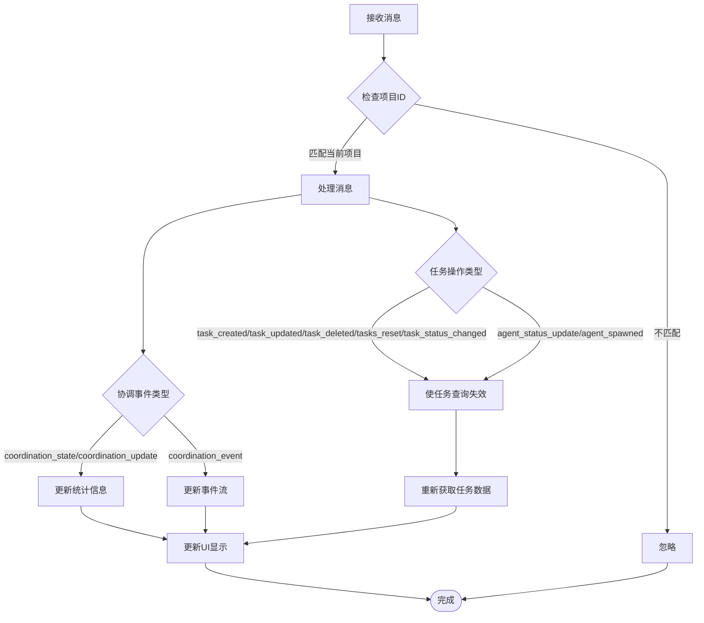

**图表来源**
- [TaskBoard.tsx](file://dashboard/frontend/src/components/TaskBoard.tsx#L35-L52)

**章节来源**
- [App.tsx](file://dashboard/frontend/src/App.tsx#L41-L47)
- [TaskBoard.tsx](file://dashboard/frontend/src/components/TaskBoard.tsx#L35-L52)

## React Query集成

### 缓存管理策略

TaskTree使用React Query进行状态管理，WebSocket消息触发缓存更新：

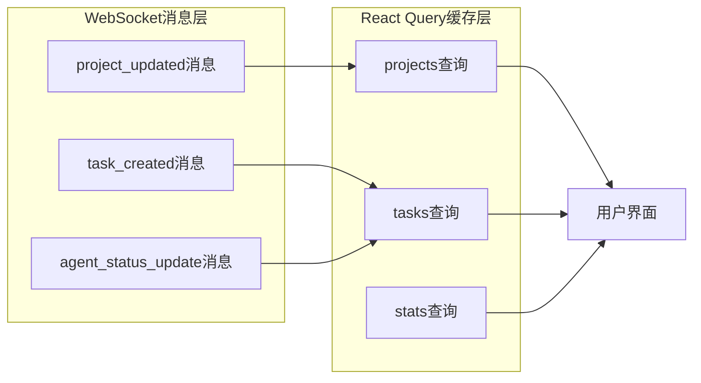

### 查询失效机制

系统采用智能查询失效策略：

1. **精确失效**：针对特定项目的查询失效
2. **批量失效**：涉及多个相关查询的批量更新
3. **延迟失效**：避免频繁的重复查询

**章节来源**
- [App.tsx](file://dashboard/frontend/src/App.tsx#L28-L33)
- [TaskBoard.tsx](file://dashboard/frontend/src/components/TaskBoard.tsx#L45-L50)

## 消息流转时序

### 完整的消息流转路径

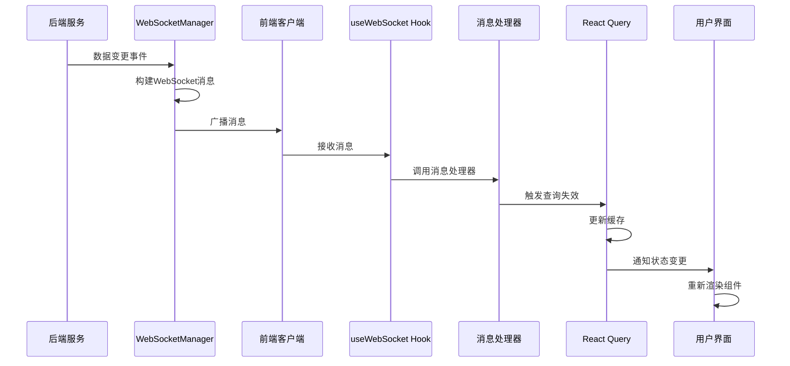

**图表来源**
- [websocket_manager.py](file://dashboard/backend/websocket_manager.py#L32-L55)
- [websocket.ts](file://dashboard/frontend/src/services/websocket.ts#L27-L30)
- [useWebSocket.ts](file://dashboard/frontend/src/hooks/useWebSocket.ts#L5-L16)

### 具体场景示例

以任务创建为例的消息流转：

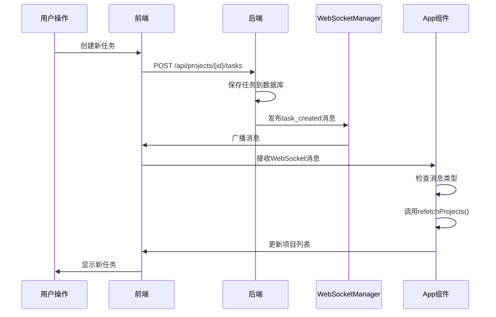

**图表来源**
- [App.tsx](file://dashboard/frontend/src/App.tsx#L41-L47)
- [api.ts](file://dashboard/frontend/src/services/api.ts#L65-L76)

## 错误处理与重连机制

### 前端错误处理

WebSocketService实现了多层次的错误处理：

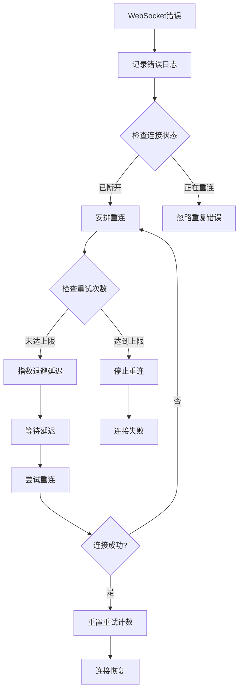

**图表来源**
- [websocket.ts](file://dashboard/frontend/src/services/websocket.ts#L50-L67)

### 后端连接管理

后端WebSocketManager自动处理断开连接：

1. **检测断开**：捕获连接异常
2. **清理资源**：移除无效连接
3. **广播通知**：通知其他客户端连接状态
4. **维护一致性**：确保连接池状态正确

**章节来源**
- [websocket.ts](file://dashboard/frontend/src/services/websocket.ts#L50-L67)
- [websocket_manager.py](file://dashboard/backend/websocket_manager.py#L22-L26)

## 性能优化策略

### 连接复用

- **单例模式**：WebSocketService作为单例，避免重复连接
- **连接池管理**：后端维护活跃连接池
- **心跳检测**：定期发送心跳包保持连接活跃

### 消息过滤

- **项目隔离**：只处理相关项目的消息
- **类型过滤**：根据消息类型决定是否处理
- **频率控制**：避免过于频繁的状态更新

### 缓存优化

- **智能失效**：只失效必要的查询
- **增量更新**：支持局部状态更新
- **预加载策略**：提前加载可能需要的数据

## 故障排除指南

### 常见问题诊断

| 问题症状 | 可能原因 | 解决方案 |
|---------|---------|---------|
| 连接频繁断开 | 网络不稳定 | 检查网络连接，启用自动重连 |
| 消息丢失 | 消息处理器未注册 | 确认useWebSocket正确使用 |
| 状态不同步 | 查询缓存未更新 | 检查refetch调用时机 |
| 内存泄漏 | 订阅未清理 | 确保组件卸载时清理订阅 |

### 调试工具

1. **浏览器开发者工具**：监控WebSocket连接状态
2. **控制台日志**：查看连接和错误信息
3. **React DevTools**：检查组件状态和props
4. **网络面板**：分析WebSocket帧传输

### 监控指标

- **连接成功率**：WebSocket连接建立的成功率
- **消息延迟**：从后端到前端的消息传输时间
- **重连次数**：自动重连的频率和成功率
- **缓存命中率**：React Query缓存的有效性

**章节来源**
- [websocket.ts](file://dashboard/frontend/src/services/websocket.ts#L22-L47)
- [websocket_manager.py](file://dashboard/backend/websocket_manager.py#L32-L55)

## 总结

TaskTree的实时状态同步机制通过精心设计的WebSocket架构，实现了高效、可靠的实时通信。自定义的`useWebSocket` Hook简化了连接管理，React Query提供了强大的缓存管理能力，而完善的错误处理和重连机制确保了系统的稳定性。

该架构不仅满足了当前的功能需求，还具备良好的扩展性，可以轻松支持更多的实时功能和消息类型。通过合理的性能优化策略，系统能够在各种网络环境下稳定运行，为用户提供流畅的实时体验。