# 数据缓存与异步状态管理架构文档

<cite>
**本文档引用的文件**
- [App.tsx](file://dashboard/frontend/src/App.tsx)
- [api.ts](file://dashboard/frontend/src/services/api.ts)
- [main.tsx](file://dashboard/frontend/src/main.tsx)
- [websocket.ts](file://dashboard/frontend/src/services/websocket.ts)
- [useWebSocket.ts](file://dashboard/frontend/src/hooks/useWebSocket.ts)
- [package.json](file://dashboard/frontend/package.json)
- [index.ts](file://dashboard/frontend/src/types/index.ts)
</cite>

## 目录
1. [项目概述](#项目概述)
2. [React Query架构概览](#react-query架构概览)
3. [核心组件分析](#核心组件分析)
4. [缓存策略详解](#缓存策略详解)
5. [数据流与生命周期](#数据流与生命周期)
6. [错误处理与重试机制](#错误处理与重试机制)
7. [性能优化特性](#性能优化特性)
8. [WebSocket集成](#websocket集成)
9. [最佳实践与建议](#最佳实践与建议)
10. [总结](#总结)

## 项目概述

TaskTree是一个基于React的现代化任务管理系统，采用React Query作为核心的数据缓存与异步状态管理解决方案。该项目展示了如何通过React Query实现高效的数据同步、缓存管理和实时更新功能。

### 技术栈概览

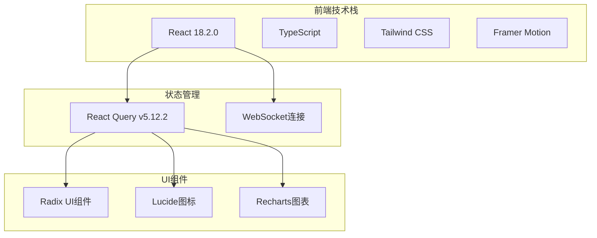

**图表来源**
- [package.json](file://dashboard/frontend/package.json#L12-L35)
- [main.tsx](file://dashboard/frontend/src/main.tsx#L1-L25)

**章节来源**
- [package.json](file://dashboard/frontend/package.json#L1-L54)
- [main.tsx](file://dashboard/frontend/src/main.tsx#L1-L25)

## React Query架构概览

### 查询客户端配置

项目在应用入口处配置了全局的React Query客户端，设置了默认的查询行为：

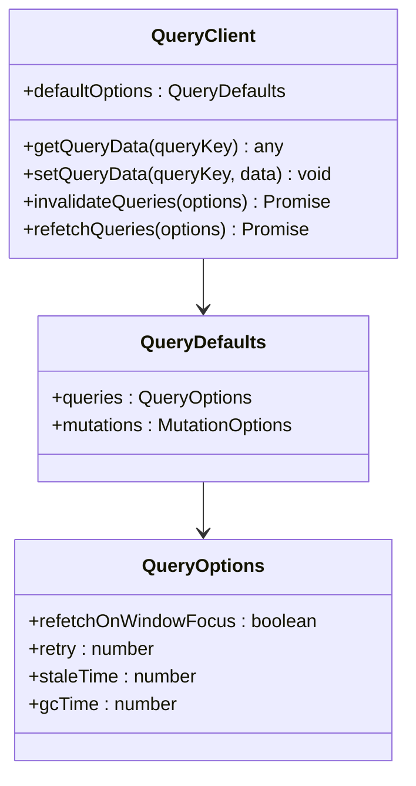

**图表来源**
- [main.tsx](file://dashboard/frontend/src/main.tsx#L8-L14)

### 核心配置参数

| 配置项 | 值 | 说明 |
|--------|-----|------|
| `refetchOnWindowFocus` | `false` | 禁用窗口焦点时自动刷新，避免不必要的网络请求 |
| `retry` | `1` | 失败后最多重试1次 |
| `staleTime` | `5000ms` | 数据认为新鲜的时间为5秒 |
| `gcTime` | `600000ms` | 缓存保留时间为10分钟 |

**章节来源**
- [main.tsx](file://dashboard/frontend/src/main.tsx#L8-L14)

## 核心组件分析

### App.tsx中的项目列表查询

在App组件中，`useQuery` hook被用于获取项目列表数据：

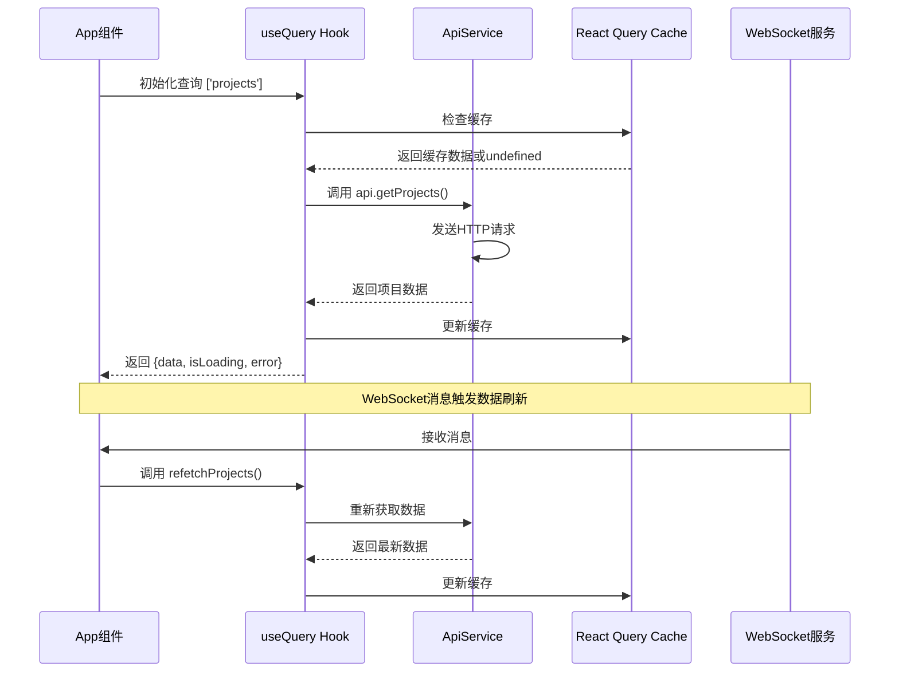

**图表来源**
- [App.tsx](file://dashboard/frontend/src/App.tsx#L27-L68)
- [api.ts](file://dashboard/frontend/src/services/api.ts#L29-L35)

### 查询配置详解

项目中的`useQuery`配置包含以下关键参数：

| 参数 | 值 | 作用 |
|------|-----|------|
| `queryKey` | `['projects']` | 唯一标识此查询的键值 |
| `queryFn` | `api.getProjects` | 执行数据获取的函数 |
| `staleTime` | `5000` | 数据新鲜度时间（5秒） |
| `gcTime` | `600000` | 缓存垃圾回收时间（10分钟） |

**章节来源**
- [App.tsx](file://dashboard/frontend/src/App.tsx#L27-L33)

## 缓存策略详解

### 缓存时间配置的影响

#### staleTime（新鲜度时间）

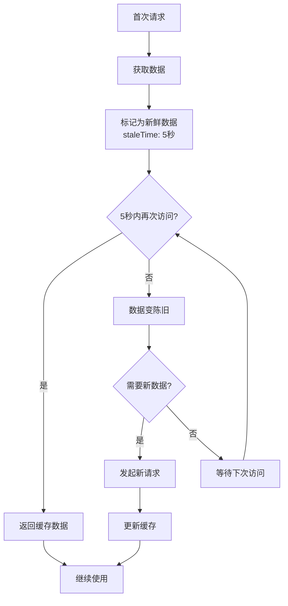

#### gcTime（垃圾回收时间）

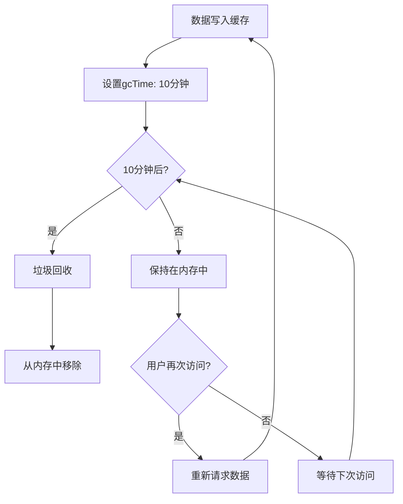

### 缓存策略的优势

1. **减少网络请求**：相同查询在staleTime内不会重复请求
2. **提升用户体验**：即时响应已缓存数据
3. **节省带宽**：避免不必要的数据传输
4. **智能过期**：自动清理长时间未使用的数据

**章节来源**
- [App.tsx](file://dashboard/frontend/src/App.tsx#L30-L32)

## 数据流与生命周期

### 完整的数据生命周期

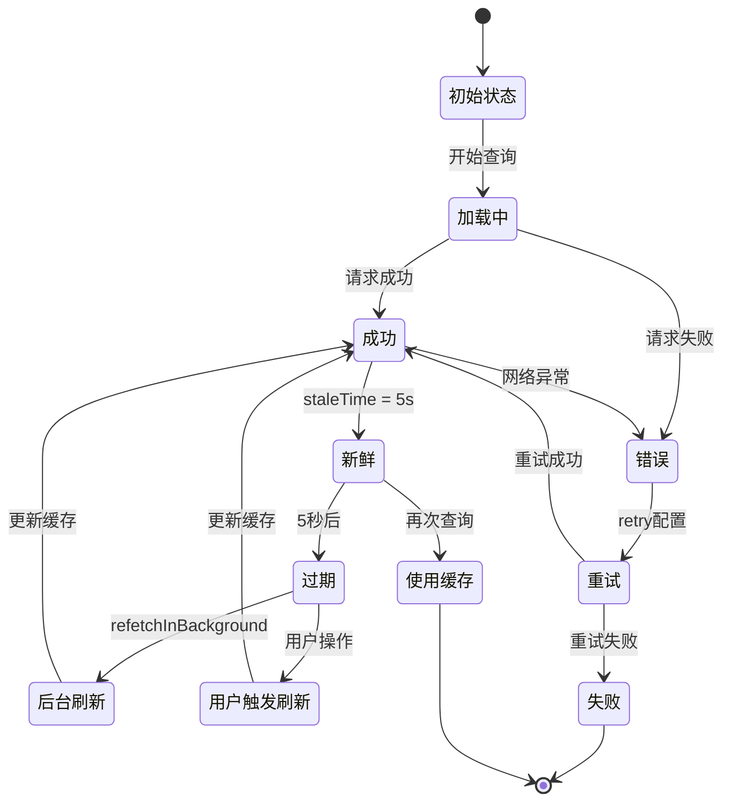

### 自动重新获取机制

项目实现了基于WebSocket的消息驱动的自动重新获取：

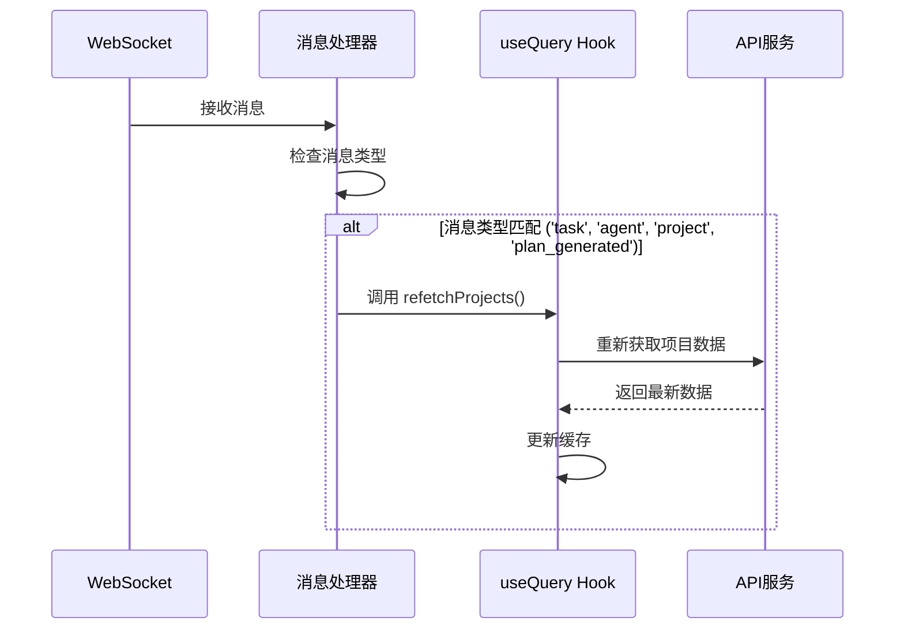

**图表来源**
- [App.tsx](file://dashboard/frontend/src/App.tsx#L40-L47)
- [useWebSocket.ts](file://dashboard/frontend/src/hooks/useWebSocket.ts#L1-L24)

**章节来源**
- [App.tsx](file://dashboard/frontend/src/App.tsx#L40-L47)

## 错误处理与重试机制

### API层错误处理

ApiService类提供了完整的错误处理机制：

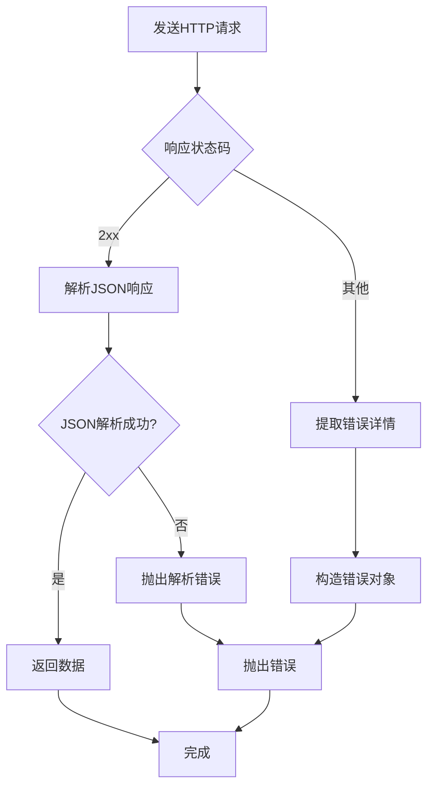

**图表来源**
- [api.ts](file://dashboard/frontend/src/services/api.ts#L6-L26)

### 错误处理特性

| 错误类型 | 处理方式 | 用户体验 |
|----------|----------|----------|
| 网络错误 | 自动重试1次 | 显示加载状态 |
| HTTP错误 | 提取错误详情 | 显示错误提示 |
| JSON解析错误 | 记录日志并抛出 | 显示通用错误 |
| 超时错误 | 终止请求 | 显示超时提示 |

### WebSocket错误恢复

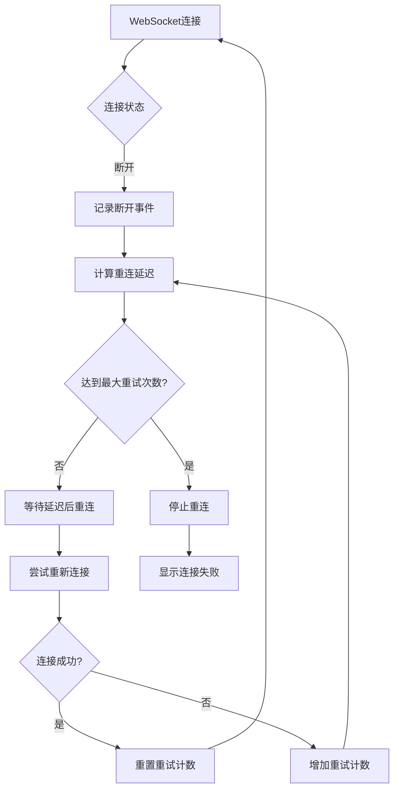

**图表来源**
- [websocket.ts](file://dashboard/frontend/src/services/websocket.ts#L50-L67)

**章节来源**
- [api.ts](file://dashboard/frontend/src/services/api.ts#L15-L26)
- [websocket.ts](file://dashboard/frontend/src/services/websocket.ts#L36-L47)

## 性能优化特性

### 减少重复请求

React Query通过多种机制避免重复请求：

1. **查询去重**：相同queryKey的查询会被合并
2. **并发控制**：同时发起的相同查询只会执行一次
3. **智能缓存**：基于staleTime的智能缓存策略

### 自动重试机制

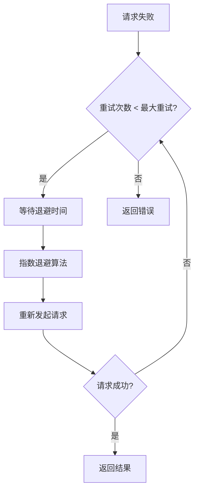

### 后台同步

项目支持后台数据同步，即使用户切换到其他标签页也能保持数据更新：

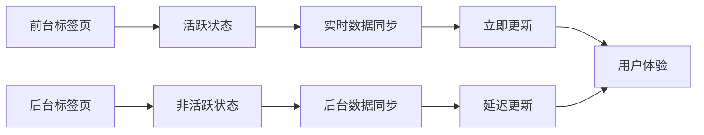

**章节来源**
- [main.tsx](file://dashboard/frontend/src/main.tsx#L11-L12)

## WebSocket集成

### 实时数据更新架构

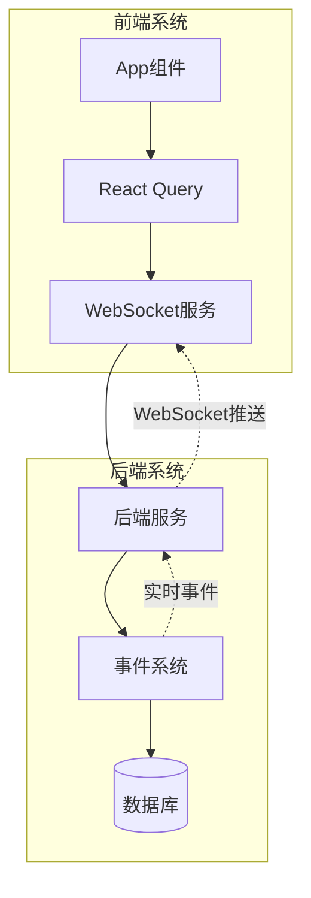

**图表来源**
- [App.tsx](file://dashboard/frontend/src/App.tsx#L40-L47)
- [websocket.ts](file://dashboard/frontend/src/services/websocket.ts#L1-L98)

### 消息类型处理

项目根据不同的WebSocket消息类型决定是否触发数据刷新：

| 消息类型 | 触发条件 | 影响范围 |
|----------|----------|----------|
| `task_*` | 包含'task'的类型 | 任务相关数据 |
| `agent_*` | 包含'agent'的类型 | 代理相关数据 |
| `project_*` | 包含'project'的类型 | 项目相关数据 |
| `plan_generated` | 特定类型消息 | 计划生成事件 |

### 连接管理

WebSocket服务实现了完整的连接生命周期管理：

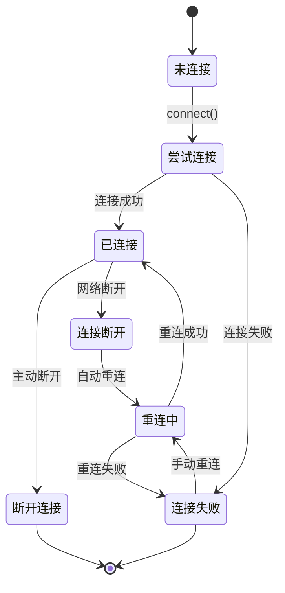

**章节来源**
- [App.tsx](file://dashboard/frontend/src/App.tsx#L40-L47)
- [websocket.ts](file://dashboard/frontend/src/services/websocket.ts#L13-L47)

## 最佳实践与建议

### 查询设计原则

1. **唯一性**：每个查询应有唯一的queryKey
2. **粒度控制**：合理划分查询粒度，避免过度拆分
3. **缓存策略**：根据数据特性选择合适的staleTime和gcTime
4. **错误处理**：提供清晰的错误边界和用户反馈

### 缓存优化建议

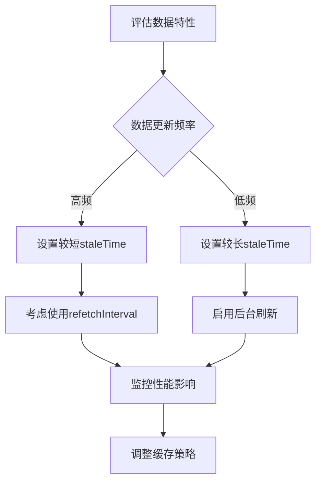

### 实时更新策略

1. **WebSocket优先**：优先使用WebSocket实现实时更新
2. **轮询降级**：WebSocket断开时使用轮询作为备选方案
3. **智能刷新**：只在必要时触发数据刷新
4. **用户体验**：提供清晰的加载状态和错误提示

### 性能监控

建议实施以下监控指标：

| 指标类型 | 监控内容 | 优化目标 |
|----------|----------|----------|
| 查询性能 | 请求响应时间 | < 2秒 |
| 缓存命中率 | 缓存使用效率 | > 80% |
| 错误率 | API调用成功率 | < 5% |
| 内存使用 | 缓存占用空间 | 合理控制 |

## 总结

TaskTree项目通过React Query构建了一个高效、可靠的前端数据管理架构。该架构具有以下核心优势：

### 架构优势

1. **统一的数据管理**：通过React Query实现集中化的数据状态管理
2. **智能缓存策略**：基于staleTime和gcTime的灵活缓存配置
3. **实时数据同步**：结合WebSocket和轮询的双重数据更新机制
4. **完善的错误处理**：多层次的错误捕获和用户友好的错误提示
5. **性能优化**：自动重试、去重查询和智能缓存等性能优化特性

### 技术亮点

- **声明式API**：简洁的useQuery和useMutation API
- **类型安全**：完整的TypeScript类型定义
- **开发体验**：丰富的调试工具和开发者友好特性
- **社区生态**：活跃的社区支持和丰富的插件生态

### 应用价值

该架构不仅解决了前端数据管理的核心问题，还为构建复杂的SPA应用提供了可扩展的基础。通过合理的配置和最佳实践的应用，能够显著提升应用的性能和用户体验。

对于类似的项目，建议参考TaskTree的架构设计，在数据缓存、实时更新和错误处理等方面建立标准化的解决方案，从而提高开发效率和应用质量。