# 本地状态管理

<cite>
**本文档中引用的文件**
- [App.tsx](file://dashboard/frontend/src/App.tsx)
- [main.tsx](file://dashboard/frontend/src/main.tsx)
- [ProjectSelector.tsx](file://dashboard/frontend/src/components/ProjectSelector.tsx)
- [ProjectManager.tsx](file://dashboard/frontend/src/components/ProjectManager.tsx)
- [WelcomeScreen.tsx](file://dashboard/frontend/src/components/WelcomeScreen.tsx)
- [useWebSocket.ts](file://dashboard/frontend/src/hooks/useWebSocket.ts)
- [api.ts](file://dashboard/frontend/src/services/api.ts)
- [index.ts](file://dashboard/frontend/src/types/index.ts)
</cite>

## 目录
1. [简介](#简介)
2. [项目结构概览](#项目结构概览)
3. [核心状态管理架构](#核心状态管理架构)
4. [selectedProjectId状态详解](#selectedprojectid状态详解)
5. [UI状态管理机制](#ui状态管理机制)
6. [状态初始化与持久化](#状态初始化与持久化)
7. [组件间状态传递模式](#组件间状态传递模式)
8. [状态生命周期分析](#状态生命周期分析)
9. [性能优化策略](#性能优化策略)
10. [故障排除指南](#故障排除指南)
11. [总结](#总结)

## 简介

TaskTree前端采用React的useState Hook进行本地状态管理，构建了一个层次化的状态管理系统。该系统通过精心设计的状态管理模式，实现了全局项目上下文管理、UI状态协调以及用户交互响应等功能。本文档将深入分析这些状态管理机制的实现细节和最佳实践。

## 项目结构概览

TaskTree前端采用模块化的组件架构，状态管理分布在多个层级中：

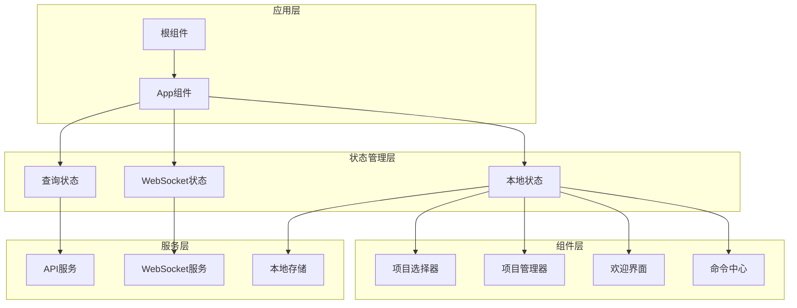

**图表来源**
- [App.tsx](file://dashboard/frontend/src/App.tsx#L20-L197)
- [main.tsx](file://dashboard/frontend/src/main.tsx#L17-L24)

**章节来源**
- [App.tsx](file://dashboard/frontend/src/App.tsx#L1-L197)
- [main.tsx](file://dashboard/frontend/src/main.tsx#L1-L25)

## 核心状态管理架构

TaskTree的状态管理采用了分层架构，包含以下核心组件：

### 状态类型分类

| 状态类型 | 管理方式 | 持久化 | 示例 |
|---------|---------|--------|------|
| 全局项目状态 | useState | localStorage | selectedProjectId |
| UI模态状态 | useState | 内存 | showOnboarding, showHelpCenter |
| 加载状态 | useState | 内存 | showLoading |
| 查询状态 | @tanstack/react-query | 缓存 | projects数据 |

### 状态管理流程

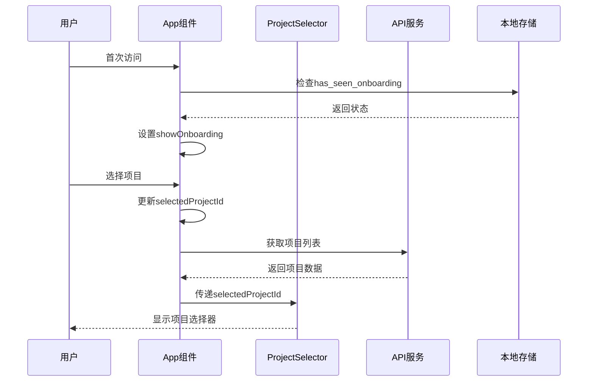

**图表来源**
- [App.tsx](file://dashboard/frontend/src/App.tsx#L50-L68)
- [ProjectSelector.tsx](file://dashboard/frontend/src/components/ProjectSelector.tsx#L19-L67)

**章节来源**
- [App.tsx](file://dashboard/frontend/src/App.tsx#L20-L68)

## selectedProjectId状态详解

### 声明与初始化

selectedProjectId是TaskTree中最核心的全局状态，它在App组件中通过useState Hook声明：

```typescript
const [selectedProjectId, setSelectedProjectId] = useState<string | null>(null);
```

这个状态具有以下特性：
- **类型安全**：明确指定为string或null类型
- **初始值**：设置为null，表示未选择任何项目
- **可变性**：通过setSelectedProjectId函数进行更新

### 状态作用域

selectedProjectId作为全局项目上下文，在整个应用中发挥重要作用：

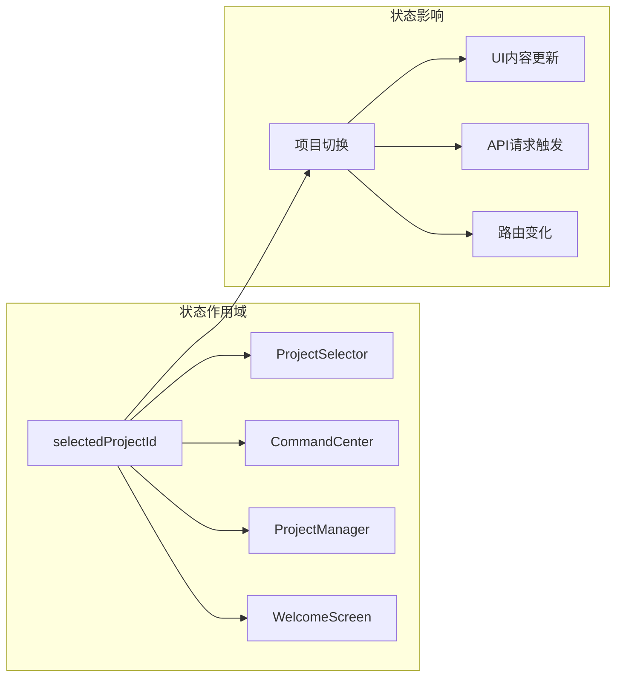

**图表来源**
- [App.tsx](file://dashboard/frontend/src/App.tsx#L21-L25)
- [ProjectSelector.tsx](file://dashboard/frontend/src/components/ProjectSelector.tsx#L14-L16)

### 状态更新机制

selectedProjectId的更新遵循严格的回调模式：

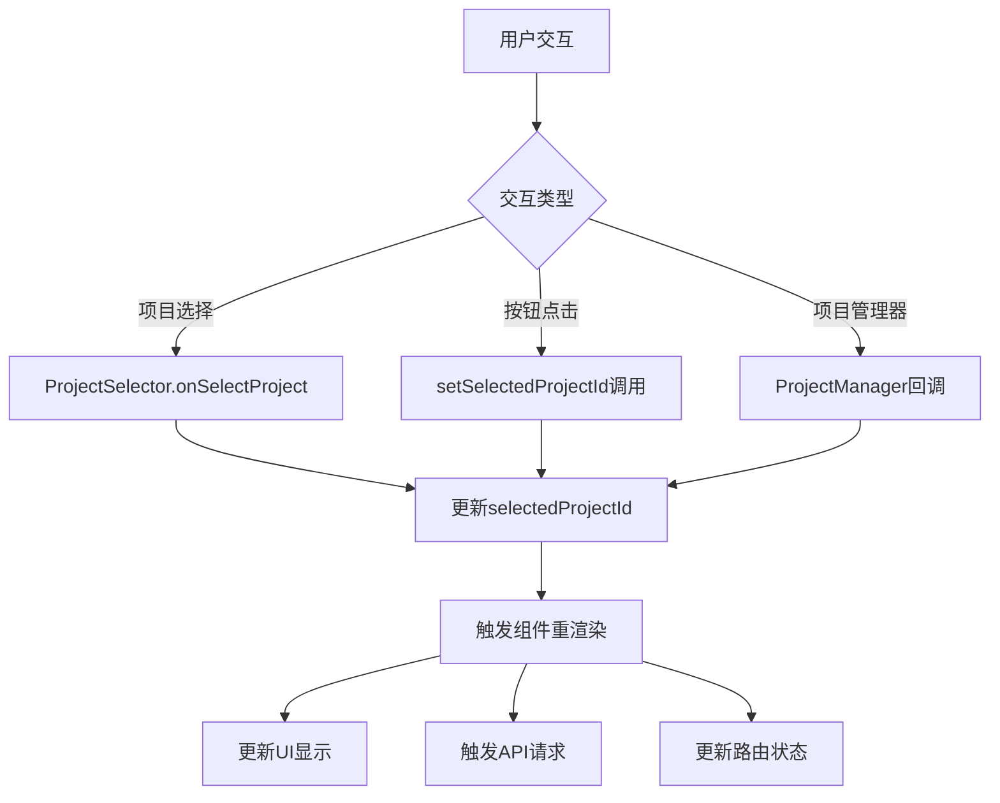

**图表来源**
- [App.tsx](file://dashboard/frontend/src/App.tsx#L82-L87)
- [ProjectManager.tsx](file://dashboard/frontend/src/components/ProjectManager.tsx#L173-L176)

**章节来源**
- [App.tsx](file://dashboard/frontend/src/App.tsx#L21-L25)
- [ProjectSelector.tsx](file://dashboard/frontend/src/components/ProjectSelector.tsx#L19-L67)

## UI状态管理机制

### 多状态协调

App组件维护了多个UI状态，每个状态都有特定的用途和生命周期：

| 状态变量 | 类型 | 默认值 | 用途 |
|---------|------|--------|------|
| showOnboarding | boolean | false | 引导模态框显示控制 |
| showHelpCenter | boolean | false | 帮助中心显示控制 |
| showProjectManager | boolean | false | 项目管理器显示控制 |
| showGlobalSettings | boolean | false | 全局设置显示控制 |

### 状态初始化逻辑

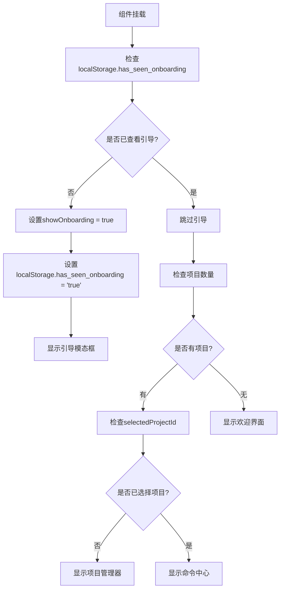

**图表来源**
- [App.tsx](file://dashboard/frontend/src/App.tsx#L50-L68)

### 状态生命周期

UI状态的生命周期与组件的挂载、更新和卸载紧密相关：

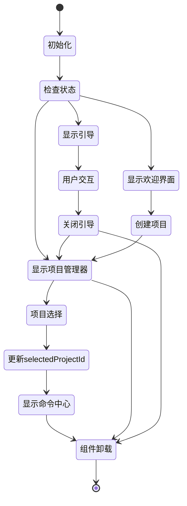

**图表来源**
- [App.tsx](file://dashboard/frontend/src/App.tsx#L50-L68)
- [WelcomeScreen.tsx](file://dashboard/frontend/src/components/WelcomeScreen.tsx#L8-L10)

**章节来源**
- [App.tsx](file://dashboard/frontend/src/App.tsx#L21-L25)
- [WelcomeScreen.tsx](file://dashboard/frontend/src/components/WelcomeScreen.tsx#L8-L10)

## 状态初始化与持久化

### localStorage集成

TaskTree巧妙地利用localStorage实现状态的持久化：

#### 引导状态持久化

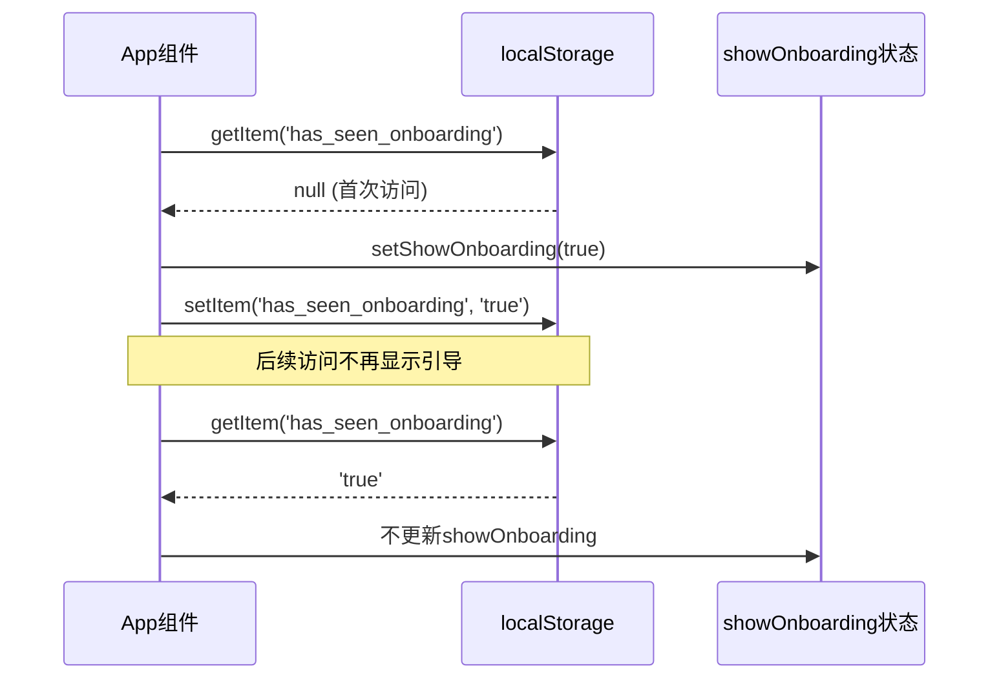

**图表来源**
- [App.tsx](file://dashboard/frontend/src/App.tsx#L61-L68)

#### 状态恢复机制

```typescript
// 状态初始化示例
const hasSeenOnboarding = localStorage.getItem('has_seen_onboarding');
if (!hasSeenOnboarding && !showLoading) {
  setShowOnboarding(true);
  localStorage.setItem('has_seen_onboarding', 'true');
}
```

### 边界条件处理

系统对各种边界条件进行了周密的处理：

| 边界情况 | 处理策略 | 实现位置 |
|---------|---------|----------|
| 首次访问 | 显示引导界面 | useEffect钩子 |
| 无项目状态 | 显示欢迎界面 | 条件渲染 |
| 加载状态 | 显示加载动画 | showLoading标志 |
| 错误状态 | 显示错误信息 | 错误边界 |

### 默认行为机制

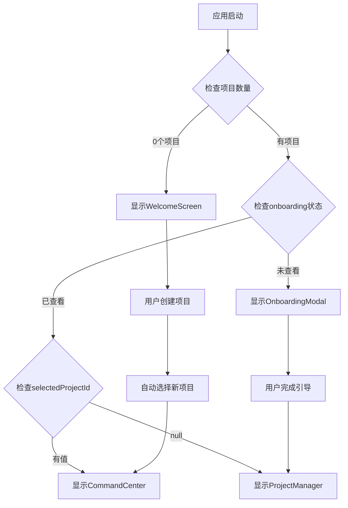

**图表来源**
- [App.tsx](file://dashboard/frontend/src/App.tsx#L126-L145)
- [WelcomeScreen.tsx](file://dashboard/frontend/src/components/WelcomeScreen.tsx#L8-L10)

**章节来源**
- [App.tsx](file://dashboard/frontend/src/App.tsx#L50-L68)
- [WelcomeScreen.tsx](file://dashboard/frontend/src/components/WelcomeScreen.tsx#L8-L10)

## 组件间状态传递模式

### 回调函数传递模式

TaskTree广泛采用回调函数模式在组件间传递状态更新：

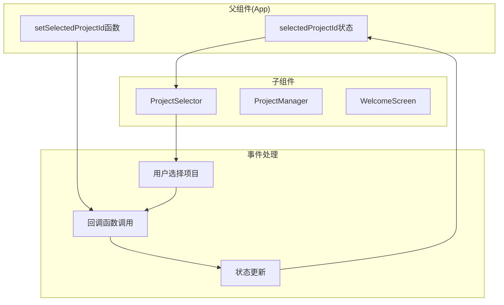

**图表来源**
- [App.tsx](file://dashboard/frontend/src/App.tsx#L82-L87)
- [ProjectSelector.tsx](file://dashboard/frontend/src/components/ProjectSelector.tsx#L28-L29)

### 状态提升模式

在某些场景下，TaskTree采用了状态提升模式：

```typescript
// ProjectManager中的状态提升示例
const handleSelectProject = (projectId: string) => {
  setSelectedProjectId(projectId);
  setShowProjectManager(false);
};
```

### 属性传递模式

对于简单的状态控制，采用属性传递模式：

```typescript
// 模态框显示控制示例
<OnboardingModal 
  isOpen={showOnboarding} 
  onClose={() => setShowOnboarding(false)} 
/>
```

### 状态传递流程

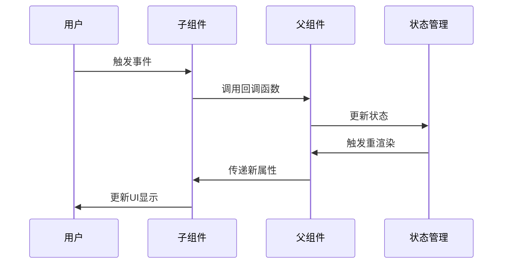

**图表来源**
- [App.tsx](file://dashboard/frontend/src/App.tsx#L173-L176)
- [ProjectManager.tsx](file://dashboard/frontend/src/components/ProjectManager.tsx#L173-L176)

**章节来源**
- [App.tsx](file://dashboard/frontend/src/App.tsx#L82-L87)
- [ProjectManager.tsx](file://dashboard/frontend/src/components/ProjectManager.tsx#L173-L176)

## 状态生命周期分析

### 组件挂载阶段

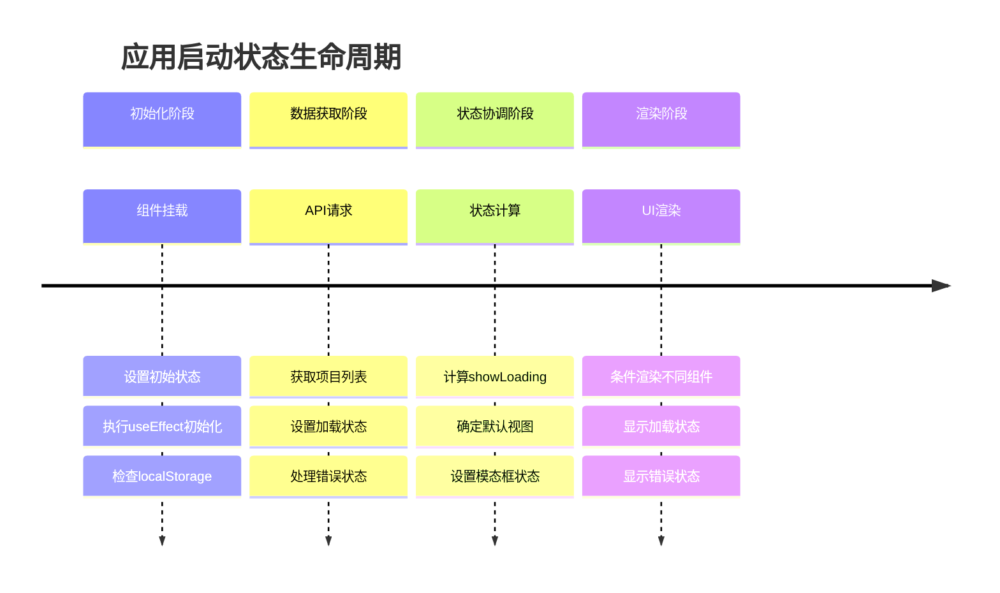

**图表来源**
- [App.tsx](file://dashboard/frontend/src/App.tsx#L27-L68)

### 用户交互触发的状态变更

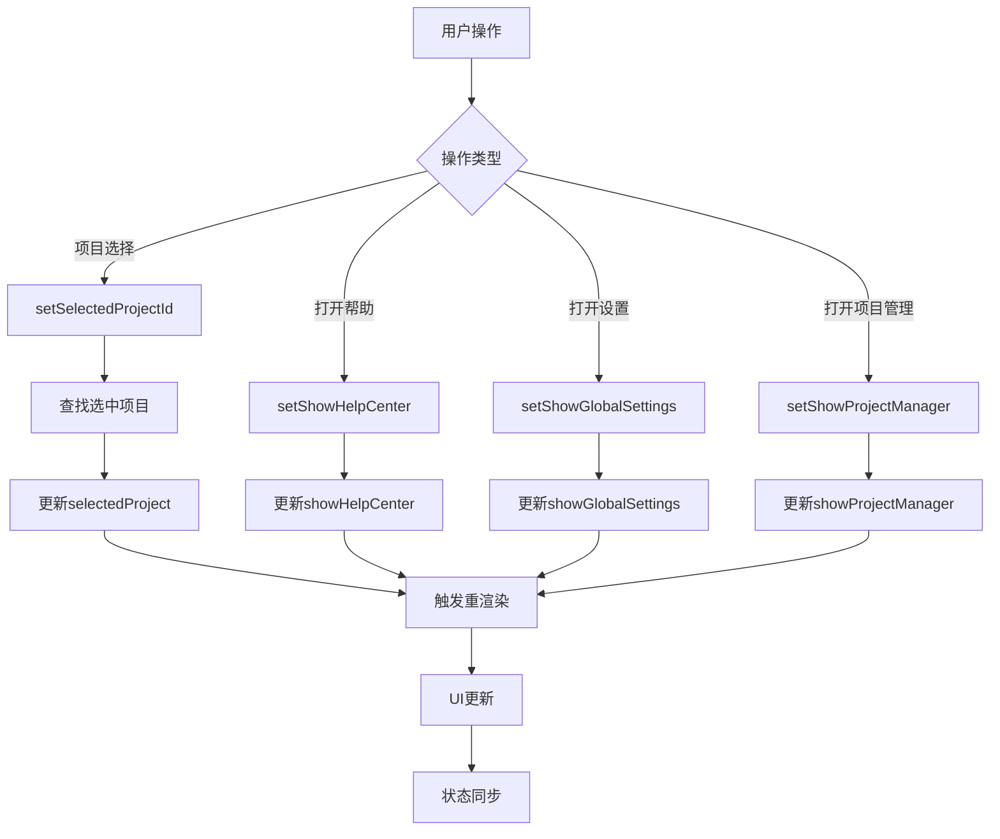

**图表来源**
- [App.tsx](file://dashboard/frontend/src/App.tsx#L102-L119)
- [App.tsx](file://dashboard/frontend/src/App.tsx#L152-L161)

### 状态更新的副作用

状态更新不仅影响UI，还会触发一系列副作用：

| 状态变更 | 副作用 | 影响范围 |
|---------|-------|----------|
| selectedProjectId | 切换项目视图 | CommandCenter组件 |
| showOnboarding | 控制模态框显示 | 整个应用 |
| showHelpCenter | 切换帮助界面 | 帮助中心组件 |
| showProjectManager | 切换项目管理 | 项目管理器组件 |

### 状态同步机制

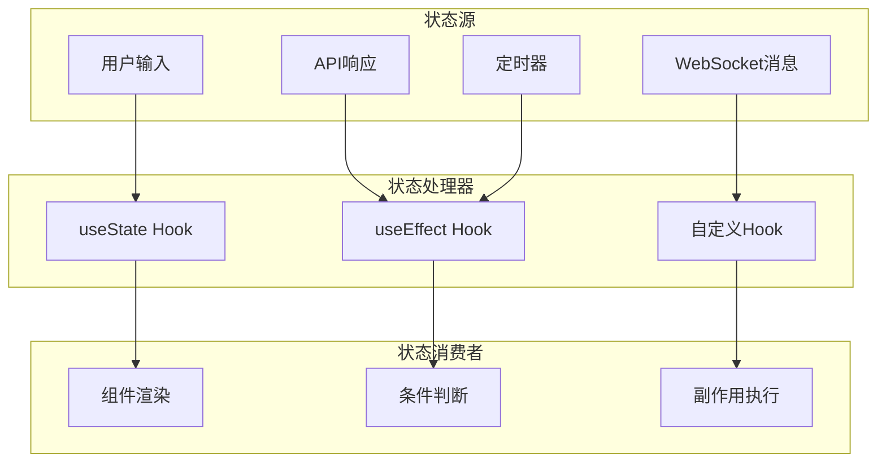

**图表来源**
- [App.tsx](file://dashboard/frontend/src/App.tsx#L40-L48)
- [useWebSocket.ts](file://dashboard/frontend/src/hooks/useWebSocket.ts#L1-L24)

**章节来源**
- [App.tsx](file://dashboard/frontend/src/App.tsx#L27-L68)
- [useWebSocket.ts](file://dashboard/frontend/src/hooks/useWebSocket.ts#L1-L24)

## 性能优化策略

### 状态更新优化

TaskTree采用了多种性能优化策略：

#### 1. 状态分离原则

将不同类型的状态分离管理：
- **项目状态**：通过selectedProjectId管理
- **UI状态**：通过独立的布尔状态管理
- **加载状态**：通过计算属性生成

#### 2. 条件渲染优化

```typescript
// 高效的条件渲染示例
{showLoading ? (
  <div className="flex items-center justify-center min-h-[400px]">
    <div className="animate-spin rounded-full h-12 w-12 border-b-2 border-electric-cyan"></div>
  </div>
) : selectedProject ? (
  <CommandCenter project={selectedProject} />
) : (
  <WelcomeScreen />
)}
```

#### 3. 状态更新频率控制

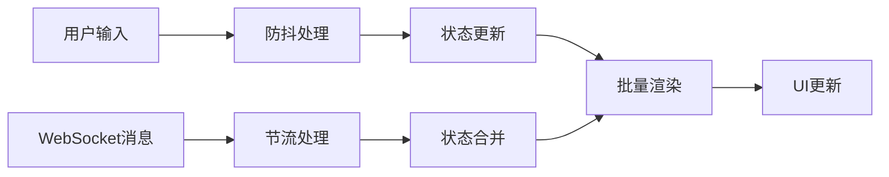

**图表来源**
- [App.tsx](file://dashboard/frontend/src/App.tsx#L126-L145)

### 内存管理

#### 状态清理机制

```typescript
// 组件卸载时的状态清理
useEffect(() => {
  return () => {
    // 清理副作用
    // 取消网络请求
    // 清理定时器
  };
}, []);
```

#### 缓存策略

TaskTree利用@tanstack/react-query的缓存机制：
- **staleTime**: 5秒内认为数据新鲜
- **gcTime**: 10分钟内保持缓存
- **refetchOnWindowFocus**: 禁用窗口焦点时的自动刷新

**章节来源**
- [App.tsx](file://dashboard/frontend/src/App.tsx#L27-L33)

## 故障排除指南

### 常见状态问题

#### 1. 状态不更新问题

**症状**：状态改变后UI没有相应更新

**可能原因**：
- 状态更新函数未正确调用
- 状态值未发生变化（React状态比较）
- 组件未正确订阅状态变化

**解决方案**：
```typescript
// 确保状态更新函数正确调用
const handleProjectSelect = (projectId: string) => {
  setSelectedProjectId(projectId); // 确保这行代码被执行
};

// 使用对象解构确保状态更新
const updateProject = (updates: Partial<Project>) => {
  setEditForm(prev => ({ ...prev, ...updates }));
};
```

#### 2. 状态丢失问题

**症状**：页面刷新后状态重置

**可能原因**：
- 状态未正确持久化
- localStorage访问失败
- 状态初始化逻辑错误

**解决方案**：
```typescript
// 添加状态持久化检查
useEffect(() => {
  try {
    const savedProject = localStorage.getItem('last_selected_project');
    if (savedProject && !selectedProjectId) {
      setSelectedProjectId(savedProject);
    }
  } catch (error) {
    console.warn('Failed to restore project selection:', error);
  }
}, []);
```

#### 3. 状态冲突问题

**症状**：多个状态同时更新导致竞态条件

**解决方案**：
```typescript
// 使用状态更新函数避免竞态条件
const handleMultipleUpdates = () => {
  // 错误做法：直接赋值可能导致竞态
  // setShowOnboarding(true);
  // setShowHelpCenter(false);
  
  // 正确做法：使用状态更新函数
  setState(prev => ({
    ...prev,
    showOnboarding: true,
    showHelpCenter: false
  }));
};
```

### 调试技巧

#### 1. 状态日志记录

```typescript
// 在关键状态更新处添加日志
const logStateChange = (stateName: string, newValue: any) => {
  console.log(`[${stateName}] changed to:`, newValue);
};

const setSelectedProjectId = (projectId: string | null) => {
  logStateChange('selectedProjectId', projectId);
  // 实际的状态更新逻辑
};
```

#### 2. 状态快照工具

```typescript
// 开发环境下的状态监控
if (process.env.NODE_ENV === 'development') {
  useEffect(() => {
    console.group('App State Snapshot');
    console.log('selectedProjectId:', selectedProjectId);
    console.log('showOnboarding:', showOnboarding);
    console.log('showHelpCenter:', showHelpCenter);
    console.log('projects length:', projects.length);
    console.groupEnd();
  }, [selectedProjectId, showOnboarding, showHelpCenter, projects]);
}
```

**章节来源**
- [App.tsx](file://dashboard/frontend/src/App.tsx#L35-L36)
- [App.tsx](file://dashboard/frontend/src/App.tsx#L27-L33)

## 总结

TaskTree前端的本地状态管理体现了现代React应用的最佳实践。通过精心设计的状态架构，实现了：

### 核心优势

1. **清晰的状态分离**：将全局项目状态与UI状态有效分离
2. **可靠的持久化机制**：利用localStorage确保用户体验的一致性
3. **高效的组件通信**：通过回调函数模式实现组件间的松耦合通信
4. **完善的生命周期管理**：全面覆盖状态的创建、更新、销毁过程

### 设计亮点

- **selectedProjectId作为全局上下文**：统一管理项目选择状态
- **多状态协调机制**：合理分配不同状态的职责
- **边界条件处理**：全面考虑各种使用场景
- **性能优化策略**：通过条件渲染和缓存机制提升性能

### 最佳实践

1. **状态提升与下沉**：根据实际需求选择合适的状态管理模式
2. **副作用管理**：通过useEffect正确处理状态变更的副作用
3. **错误边界处理**：确保状态管理的健壮性
4. **开发调试支持**：提供良好的开发体验和调试工具

这种状态管理模式为TaskTree提供了稳定、高效且易于维护的前端架构基础，值得在类似项目中借鉴和应用。