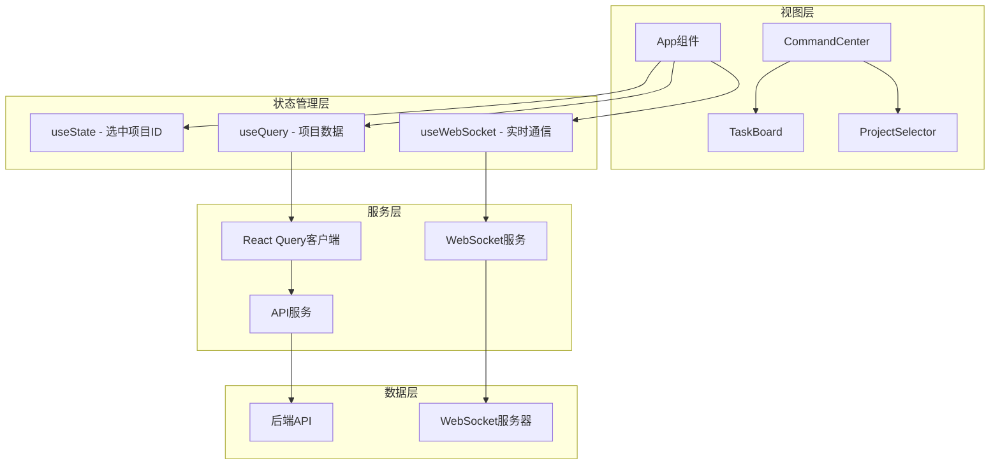
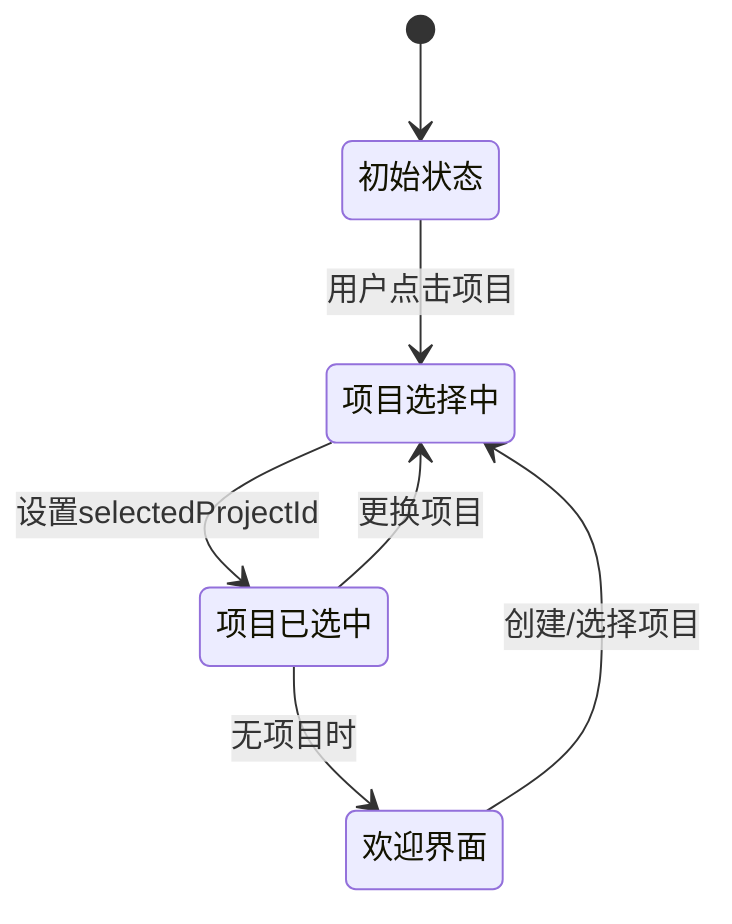
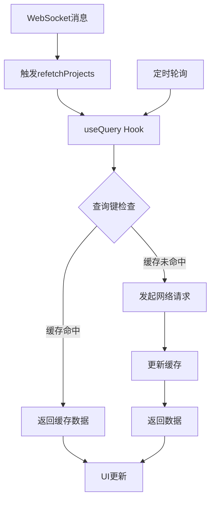
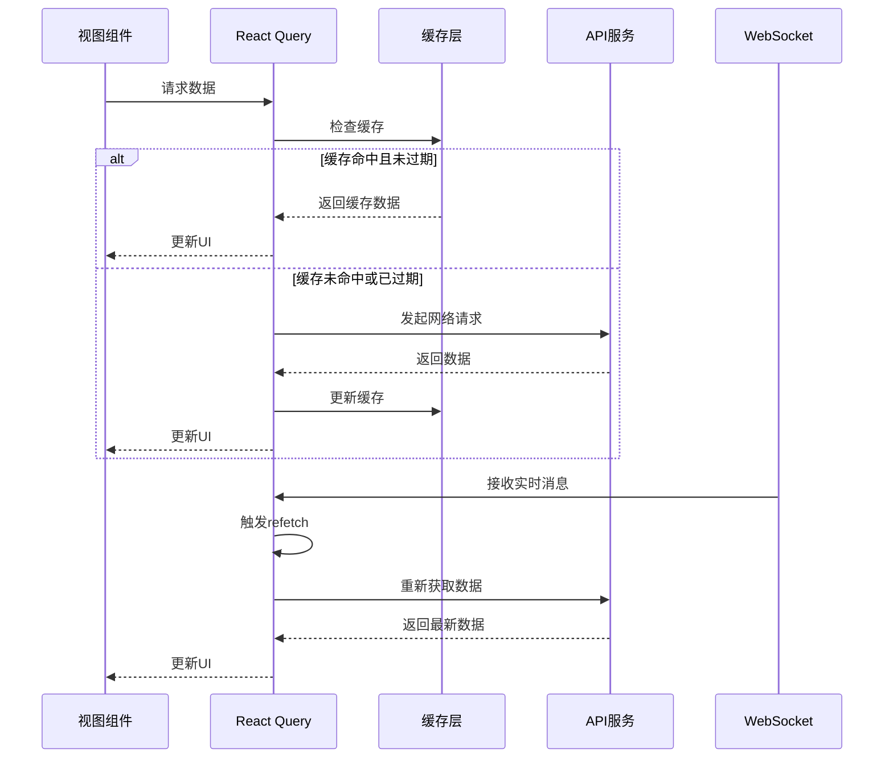
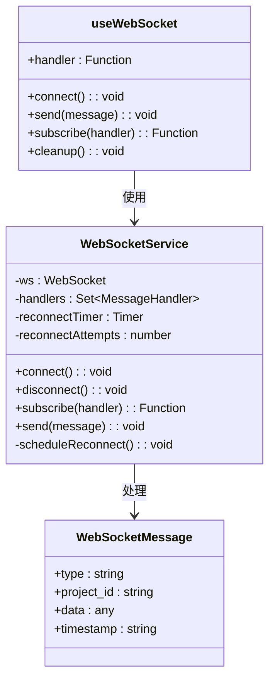
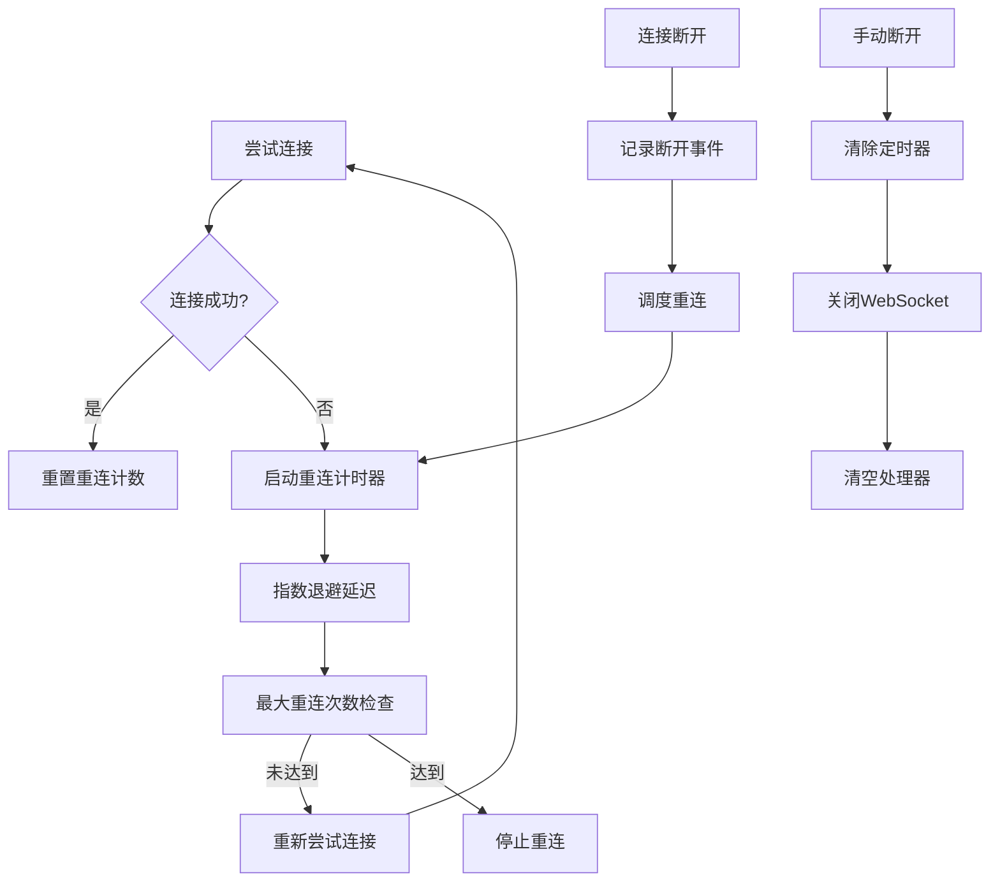
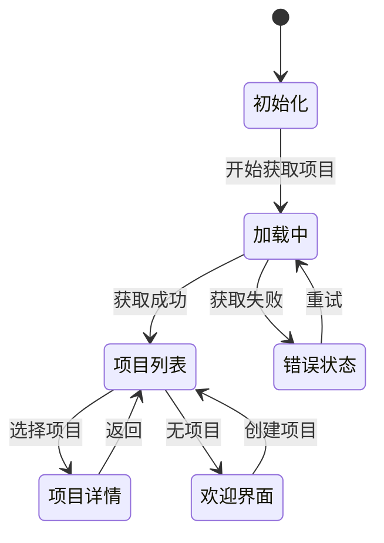
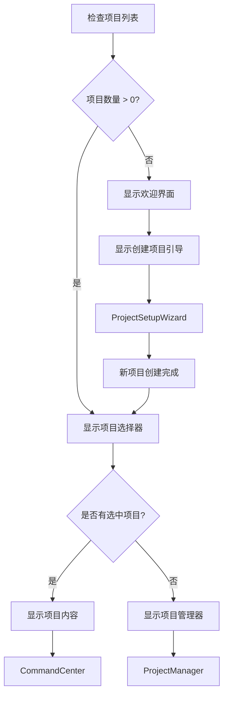
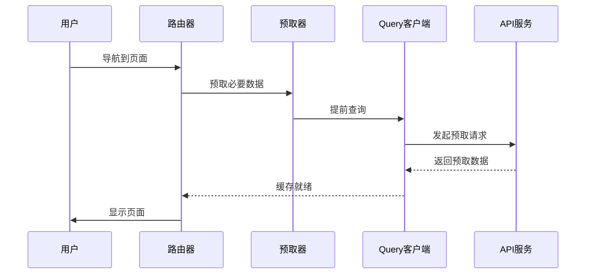
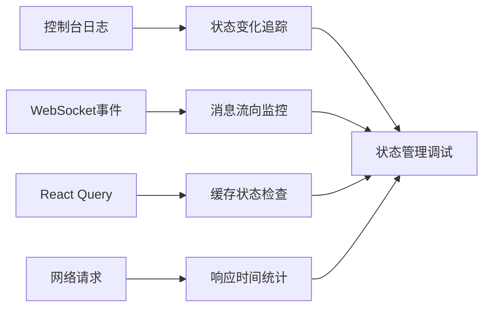

# TaskTree前端状态管理机制深度解析

<cite>
**本文档引用的文件**
- [App.tsx](file://dashboard/frontend/src/App.tsx)
- [useWebSocket.ts](file://dashboard/frontend/src/hooks/useWebSocket.ts)
- [websocket.ts](file://dashboard/frontend/src/services/websocket.ts)
- [api.ts](file://dashboard/frontend/src/services/api.ts)
- [index.ts](file://dashboard/frontend/src/types/index.ts)
- [ProjectSelector.tsx](file://dashboard/frontend/src/components/ProjectSelector.tsx)
- [ProjectManager.tsx](file://dashboard/frontend/src/components/ProjectManager.tsx)
- [TaskBoard.tsx](file://dashboard/frontend/src/components/TaskBoard.tsx)
- [CommandCenter.tsx](file://dashboard/frontend/src/components/CommandCenter.tsx)
</cite>

## 目录
1. [引言](#引言)
2. [系统架构概览](#系统架构概览)
3. [核心状态管理组件](#核心状态管理组件)
4. [React Query异步数据管理](#react-query异步数据管理)
5. [WebSocket实时通信机制](#websocket实时通信机制)
6. [状态流转与边界条件](#状态流转与边界条件)
7. [性能优化策略](#性能优化策略)
8. [故障排除指南](#故障排除指南)
9. [总结](#总结)

## 引言

TaskTree前端采用现代化的状态管理架构，结合React Query进行异步数据管理、自定义WebSocket Hook实现实时通信，以及useState处理局部状态。这种混合架构确保了应用具有良好的响应性、数据一致性和用户体验。

## 系统架构概览

TaskTree前端状态管理采用分层架构设计，主要包含以下层次：

**图表来源**
- [App.tsx](file://dashboard/frontend/src/App.tsx#L20-L197)
- [useWebSocket.ts](file://dashboard/frontend/src/hooks/useWebSocket.ts#L5-L24)
- [websocket.ts](file://dashboard/frontend/src/services/websocket.ts#L5-L98)

## 核心状态管理组件

### 局部状态管理 - useState

在App组件中，useState用于管理选中项目的局部状态：

**图表来源**
- [App.tsx](file://dashboard/frontend/src/App.tsx#L21-L26)

**节来源**
- [App.tsx](file://dashboard/frontend/src/App.tsx#L21-L26)

### 全局状态管理 - React Query

React Query负责管理所有异步数据状态，包括项目列表、任务数据等：

**图表来源**
- [App.tsx](file://dashboard/frontend/src/App.tsx#L28-L33)
- [TaskBoard.tsx](file://dashboard/frontend/src/components/TaskBoard.tsx#L66-L71)

**节来源**
- [App.tsx](file://dashboard/frontend/src/App.tsx#L28-L33)
- [TaskBoard.tsx](file://dashboard/frontend/src/components/TaskBoard.tsx#L66-L71)

## React Query异步数据管理

### 查询配置与缓存策略

TaskTree使用精心配置的React Query策略来优化性能和用户体验：

| 配置项 | 值 | 作用 | 边界条件处理 |
|--------|-----|------|-------------|
| staleTime | 5000ms | 数据新鲜度保持时间 | 首次加载时忽略此设置 |
| gcTime | 10分钟 | 缓存垃圾回收时间 | 内存压力下自动清理 |
| refetchInterval | 5000ms | 轮询间隔 | 后台标签页降低频率 |
| refetchOnWindowFocus | true | 窗口焦点重取 | 多标签页数据同步 |

### 数据获取流程

**图表来源**
- [App.tsx](file://dashboard/frontend/src/App.tsx#L28-L33)
- [TaskBoard.tsx](file://dashboard/frontend/src/components/TaskBoard.tsx#L66-L71)
- [websocket.ts](file://dashboard/frontend/src/services/websocket.ts#L27-L30)

**节来源**
- [App.tsx](file://dashboard/frontend/src/App.tsx#L28-L33)
- [TaskBoard.tsx](file://dashboard/frontend/src/components/TaskBoard.tsx#L66-L71)

## WebSocket实时通信机制

### 自定义Hook设计

useWebSocket Hook提供了简洁的WebSocket抽象层：

**图表来源**
- [useWebSocket.ts](file://dashboard/frontend/src/hooks/useWebSocket.ts#L5-L24)
- [websocket.ts](file://dashboard/frontend/src/services/websocket.ts#L5-L98)
- [index.ts](file://dashboard/frontend/src/types/index.ts#L78-L83)

### 连接管理与重连机制

WebSocket服务实现了智能重连策略：

**图表来源**
- [websocket.ts](file://dashboard/frontend/src/services/websocket.ts#L13-L47)
- [websocket.ts](file://dashboard/frontend/src/services/websocket.ts#L50-L67)

### 消息类型处理与数据同步

WebSocket消息处理遵循类型驱动的数据同步模式：

| 消息类型 | 触发操作 | 影响范围 | 竞态处理 |
|----------|----------|----------|----------|
| task_* | refetchProjects | 所有项目数据 | 防抖处理 |
| agent_* | refetchProjects | 所有项目数据 | 防抖处理 |
| project_* | refetchProjects | 所有项目数据 | 防抖处理 |
| plan_generated | refetchProjects | 所有项目数据 | 防抖处理 |
| task_created/updated/deleted | invalidateTasks | 当前项目任务 | 即时更新 |

**节来源**
- [useWebSocket.ts](file://dashboard/frontend/src/hooks/useWebSocket.ts#L5-L24)
- [websocket.ts](file://dashboard/frontend/src/services/websocket.ts#L13-L98)
- [App.tsx](file://dashboard/frontend/src/App.tsx#L41-L47)

## 状态流转与边界条件

### 首次加载状态处理

应用在不同加载阶段有不同的UI表现：

**图表来源**
- [App.tsx](file://dashboard/frontend/src/App.tsx#L37-L39)
- [App.tsx](file://dashboard/frontend/src/App.tsx#L127-L133)

### 项目为空时的逻辑分支

当项目列表为空时，应用采用不同的用户引导策略：

**图表来源**
- [App.tsx](file://dashboard/frontend/src/App.tsx#L81-L98)
- [App.tsx](file://dashboard/frontend/src/App.tsx#L144-L145)

**节来源**
- [App.tsx](file://dashboard/frontend/src/App.tsx#L37-L39)
- [App.tsx](file://dashboard/frontend/src/App.tsx#L81-L98)
- [App.tsx](file://dashboard/frontend/src/App.tsx#L144-L145)

### 竞态条件处理

应用通过多种机制避免竞态条件：

1. **防抖重取**: WebSocket消息触发的refetch使用防抖机制
2. **乐观更新**: 本地状态优先，等待服务器确认
3. **版本控制**: 使用时间戳和项目ID确保消息匹配
4. **错误恢复**: 网络异常时的自动重试和降级处理

**节来源**
- [App.tsx](file://dashboard/frontend/src/App.tsx#L41-L47)
- [TaskBoard.tsx](file://dashboard/frontend/src/components/TaskBoard.tsx#L35-L53)

## 性能优化策略

### 缓存策略优化

TaskTree采用多层次缓存策略：

| 缓存层级 | 存储位置 | 生命周期 | 清理策略 |
|----------|----------|----------|----------|
| 内存缓存 | React Query | gcTime | 定期清理 |
| 浏览器缓存 | LocalStorage | 持久化 | 手动清理 |
| 网络缓存 | 浏览器 | HTTP头控制 | 浏览器管理 |

### 数据预取与懒加载

**节来源**
- [App.tsx](file://dashboard/frontend/src/App.tsx#L28-L33)
- [TaskBoard.tsx](file://dashboard/frontend/src/components/TaskBoard.tsx#L66-L71)

## 故障排除指南

### 常见问题诊断

| 问题症状 | 可能原因 | 解决方案 | 预防措施 |
|----------|----------|----------|----------|
| 数据不刷新 | 缓存过期时间过长 | 调整staleTime或手动刷新 | 合理设置缓存策略 |
| WebSocket断连 | 网络不稳定 | 自动重连机制 | 监控连接状态 |
| 状态不一致 | 竞态条件 | 防抖和乐观更新 | 代码审查和测试 |
| 内存泄漏 | 事件监听器未清理 | 正确的cleanup函数 | 组件生命周期管理 |

### 调试工具与监控

应用内置了丰富的调试功能：

**节来源**
- [websocket.ts](file://dashboard/frontend/src/services/websocket.ts#L23-L46)
- [App.tsx](file://dashboard/frontend/src/App.tsx#L35-L36)

## 总结

TaskTree前端状态管理机制展现了现代React应用的最佳实践：

1. **模块化设计**: 清晰的职责分离，每个Hook和服务都有明确的边界
2. **实时性保障**: WebSocket + React Query的组合确保了数据的实时同步
3. **性能优化**: 智能缓存策略和预取机制提升了用户体验
4. **错误处理**: 完善的重连机制和降级策略保证了系统的稳定性
5. **可维护性**: 类型安全的设计和清晰的架构便于长期维护

这种混合状态管理模式为TaskTree提供了强大的数据管理能力，支持复杂的实时协作场景，同时保持了良好的开发体验和用户交互质量。