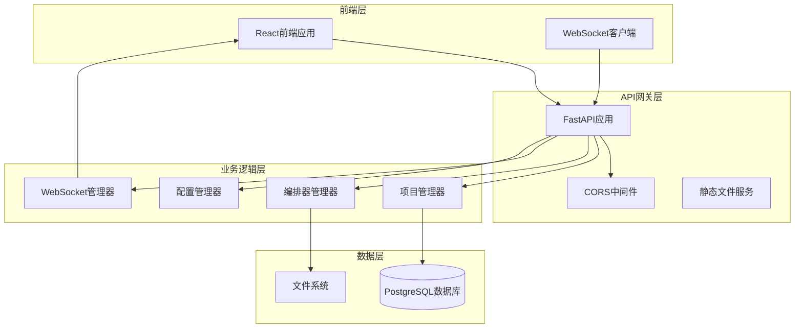
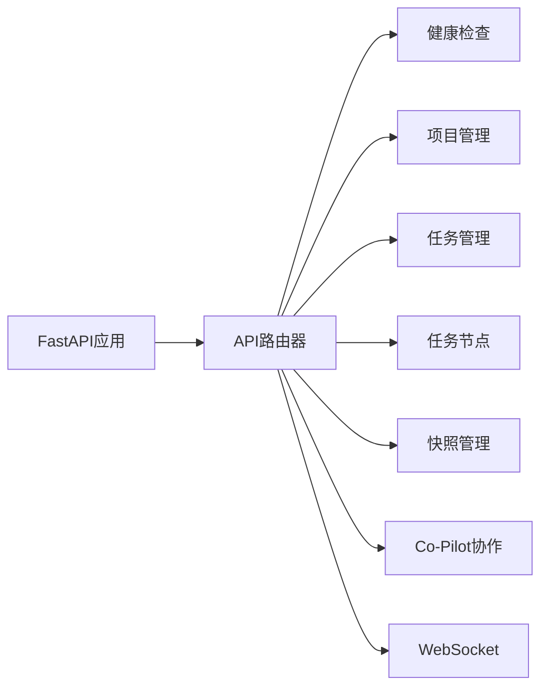
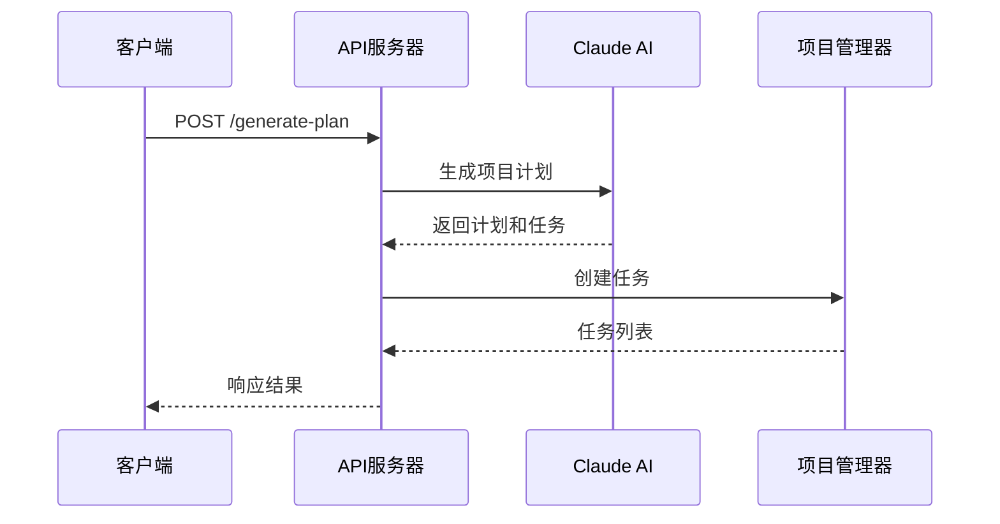
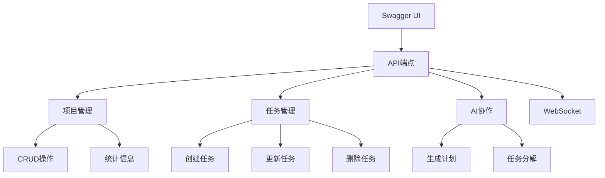
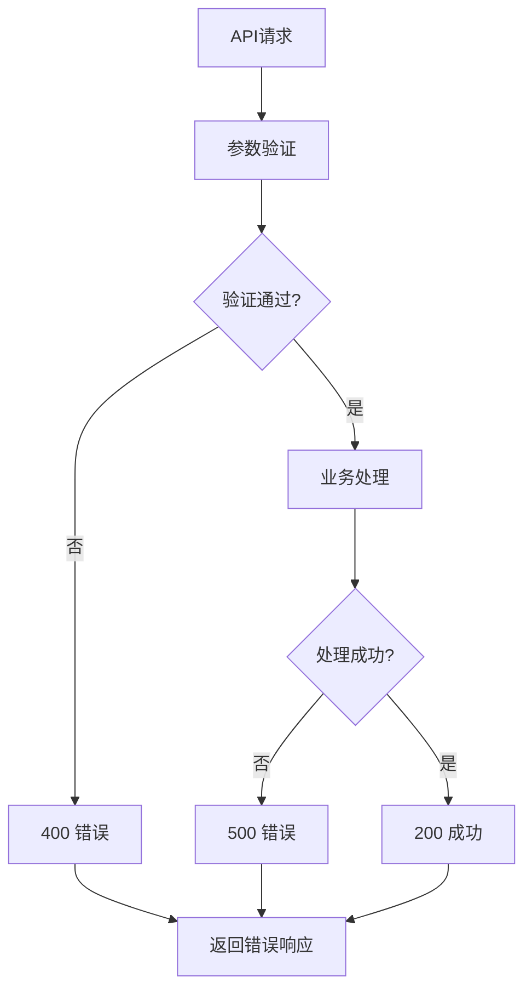

# TaskTree后端API设计文档

<cite>
**本文档中引用的文件**
- [main.py](file://dashboard/backend/main.py)
- [api.py](file://dashboard/backend/api.py)
- [models.py](file://dashboard/backend/models.py)
- [websocket_manager.py](file://dashboard/backend/websocket_manager.py)
- [mission-control-summary.md](file://Doc/features/mission-control-summary.md)
- [README.md](file://Doc/features/README.md)
</cite>

## 目录
1. [简介](#简介)
2. [项目架构概览](#项目架构概览)
3. [核心API路由器](#核心api路由器)
4. [健康检查端点](#健康检查端点)
5. [项目管理API](#项目管理api)
6. [任务管理API](#任务管理api)
7. [AI协作API](#ai协作api)
8. [快照管理API](#快照管理api)
9. [Co-Pilot协作API](#co-pilot协作api)
10. [WebSocket实时通信](#websocket实时通信)
11. [Pydantic数据验证](#pydantic数据验证)
12. [API版本兼容策略](#api版本兼容策略)
13. [Swagger UI文档](#swagger-ui文档)
14. [错误处理机制](#错误处理机制)
15. [扩展新API端点指南](#扩展新api端点指南)

## 简介

TaskTree是一个基于FastAPI构建的智能项目编排系统，采用Mission Control架构，支持树形任务结构、严格状态机和AI协作功能。本文档详细说明了后端API的设计与实现，包括RESTful接口、WebSocket实时通信和数据验证机制。

## 项目架构概览

TaskTree后端采用模块化设计，主要包含以下核心组件：



**图表来源**
- [main.py](file://dashboard/backend/main.py#L34-L56)
- [api.py](file://dashboard/backend/api.py#L1-L50)

**章节来源**
- [main.py](file://dashboard/backend/main.py#L1-L56)
- [mission-control-summary.md](file://Doc/features/mission-control-summary.md#L150-L171)

## 核心API路由器

TaskTree的API路由由`api_router`统一管理，位于主应用中：



**图表来源**
- [main.py](file://dashboard/backend/main.py#L49-L51)
- [api.py](file://dashboard/backend/api.py#L1-L50)

**章节来源**
- [main.py](file://dashboard/backend/main.py#L49-L51)
- [api.py](file://dashboard/backend/api.py#L1-L50)

## 健康检查端点

系统提供简单的健康检查端点，用于监控服务状态：

### 端点定义
- **路径**: `/health`
- **方法**: GET
- **响应**: `{"status": "healthy"}`

### 实现特点
- 无需认证
- 返回简单状态信息
- 用于负载均衡器和服务监控

**章节来源**
- [main.py](file://dashboard/backend/main.py#L53-L56)

## 项目管理API

项目管理API提供了完整的CRUD操作，支持Mission Control架构的项目管理需求。

### 项目列表查询
- **路径**: `/api/projects`
- **方法**: GET
- **响应**: `List[Project]`
- **描述**: 获取所有项目列表

### 创建项目
- **路径**: `/api/projects`
- **方法**: POST
- **请求体**: `dict` 包含项目基本信息
- **响应**: `Project`
- **验证**: 必须包含id、name、path字段

### 获取特定项目
- **路径**: `/api/projects/{project_id}`
- **方法**: GET
- **响应**: `Project`
- **错误**: 404 Not Found

### 更新项目
- **路径**: `/api/projects/{project_id}`
- **方法**: PUT
- **请求体**: `dict` 包含更新字段
- **响应**: `Project`

### 删除项目
- **路径**: `/api/projects/{project_id}`
- **方法**: DELETE
- **参数**: `cleanup_files: bool = False`
- **响应**: `{"message": "Project deleted"}`

### 重置项目
- **路径**: `/api/projects/{project_id}/reset`
- **方法**: POST
- **描述**: 清除所有任务和工作树

### 获取项目统计
- **路径**: `/api/projects/{project_id}/stats`
- **方法**: GET
- **响应**: `ProjectStats`

**章节来源**
- [api.py](file://dashboard/backend/api.py#L94-L372)

## 任务管理API

任务管理API支持传统的任务操作，为向Mission Control迁移提供兼容性。

### 获取项目任务
- **路径**: `/api/projects/{project_id}/tasks`
- **方法**: GET
- **响应**: `List[Task]`

### 创建任务
- **路径**: `/api/projects/{project_id}/tasks`
- **方法**: POST
- **参数**: 
  - `title: str`
  - `description: Optional[str] = None`
  - `prompt: Optional[str] = None`
  - `priority: int = 0`
  - `dependencies: Optional[List[str]] = None`
- **响应**: `Task`

### 更新任务
- **路径**: `/api/projects/{project_id}/tasks/{task_id}`
- **方法**: PUT
- **请求体**: `dict` 包含更新字段
- **响应**: `Task`

### 删除任务
- **路径**: `/api/projects/{project_id}/tasks/{task_id}`
- **方法**: DELETE
- **响应**: `{"message": "Task deleted"}`

### 合并任务
- **路径**: `/api/projects/{project_id}/tasks/{task_id}/merge`
- **方法**: POST
- **参数**: `force: bool = False`
- **响应**: `{"message": "Task merged successfully"}`

**章节来源**
- [api.py](file://dashboard/backend/api.py#L378-L589)

## AI协作API

AI协作API集成了Claude AI服务，提供智能任务规划和分解功能。

### 生成项目计划
- **路径**: `/api/projects/{project_id}/generate-plan`
- **方法**: POST
- **请求体**: 
  ```typescript
  {
    "project_overview": string,
    "initial_prompt": string,
    "dart_workspace": string,
    "dart_dartboard": string
  }
  ```
- **响应**: 
  ```typescript
  {
    "plan": string,
    "tasks_created": number,
    "message": string,
    "cost_info": any,
    "usage": any
  }
  ```

### 生成任务分解
- **路径**: `/api/projects/{project_id}/generate-task-breakdown`
- **方法**: POST
- **请求体**: `{ "project_overview": string, "initial_prompt": string }`
- **响应**: 类似生成计划的响应格式

### 计划生成流程


**图表来源**
- [api.py](file://dashboard/backend/api.py#L810-L928)

**章节来源**
- [api.py](file://dashboard/backend/api.py#L810-L1049)

## 快照管理API

快照管理API支持项目状态的时间旅行功能，但当前实现可能需要进一步完善。

### 快照相关端点
- **路径**: `/api/v3/missions/{id}/snapshots/*`
- **描述**: 新版API的快照管理端点
- **兼容性**: 向后兼容旧版API

**章节来源**
- [mission-control-summary.md](file://Doc/features/mission-control-summary.md#L295-L296)

## Co-Pilot协作API

Co-Pilot协作API提供AI辅助功能，支持任务拆解和提示优化。

### Co-Pilot相关端点
- **路径**: `/api/v3/missions/{id}/co-pilot/*`
- **描述**: 新版API的Co-Pilot功能端点
- **功能**: 任务拆解、提示优化、Token预估

**章节来源**
- [mission-control-summary.md](file://Doc/features/mission-control-summary.md#L295)

## WebSocket实时通信

TaskTree使用WebSocket实现实时通信，支持项目状态更新和事件通知。

### WebSocket连接
- **路径**: `/ws/updates`
- **功能**: 实时项目更新推送
- **消息类型**: `WebSocketMessage`

### WebSocket消息格式
```typescript
interface WebSocketMessage {
  type: string;           // 事件类型
  project_id?: string;    // 项目ID
  data: any;             // 事件数据
  timestamp: string;     // 时间戳
}
```

### 实时事件类型
- `project_created`: 项目创建
- `project_updated`: 项目更新
- `project_deleted`: 项目删除
- `task_created`: 任务创建
- `task_updated`: 任务更新
- `task_deleted`: 任务删除
- `task_merged`: 任务合并
- `plan_generated`: 计划生成
- `git_initialized`: Git初始化

**章节来源**
- [websocket_manager.py](file://dashboard/backend/websocket_manager.py#L1-L55)
- [api.py](file://dashboard/backend/api.py#L1218-L1228)

## Pydantic数据验证

TaskTree使用Pydantic模型进行请求和响应的数据验证。

### 核心数据模型

#### 任务状态枚举
```typescript
enum TaskStatus {
  UNCLAIMED = "unclaimed",
  UP_NEXT = "up_next", 
  IN_PROGRESS = "in_progress",
  COMPLETED = "completed",
  MERGED = "merged"
}
```

#### 项目统计模型
```typescript
interface ProjectStats {
  total_tasks: number;
  unclaimed_tasks: number;
  up_next_tasks: number;
  in_progress_tasks: number;
  completed_tasks: number;
  merged_tasks: number;
  active_agents: number;
  total_agents_run: number;
}
```

#### 编排器配置模型
```typescript
interface OrchestratorConfig {
  max_concurrent_agents: number;
  auto_merge: boolean;
  merge_strategy: string;
  auto_spawn_interval: number;
  enabled: boolean;
  api_provider: string;
  api_key?: string;
  api_model: string;
  api_base_url?: string;
  api_version?: string;
}
```

### 数据验证特点
- **自动序列化**: 支持datetime字段的JSON序列化
- **类型安全**: 强类型检查和默认值设置
- **错误处理**: 详细的验证错误信息

**章节来源**
- [models.py](file://dashboard/backend/models.py#L1-L135)

## API版本兼容策略

TaskTree采用渐进式迁移策略，同时支持新旧API版本。

### 版本映射关系

| 旧版API | 新版API | 描述 |
|---------|---------|------|
| `/api/projects` | `/api/v3/missions` | 项目管理 |
| `/api/projects/{id}/tasks` | `/api/v3/missions/{id}/nodes` | 任务节点管理 |
| `/api/v3/missions/{id}/co-pilot/*` | 新增 | Co-Pilot协作 |
| `/api/v3/missions/{id}/snapshots/*` | 新增 | 快照管理 |

### 迁移策略
1. **并存阶段**: v2和v3 API同时运行
2. **渐进迁移**: 逐步将客户端迁移到v3
3. **自动适配**: 保持向后兼容性
4. **分阶段发布**: 灰度发布新功能

**章节来源**
- [mission-control-summary.md](file://Doc/features/mission-control-summary.md#L292-L297)

## Swagger UI文档

FastAPI自动生成API文档，可通过以下方式访问：

### 访问方式
- **开发环境**: `http://localhost:8000/docs`
- **生产环境**: `http://your-domain.com/docs`

### 文档特性
- **交互式API测试**: 直接在浏览器中测试API
- **请求/响应示例**: 自动生成的示例代码
- **参数验证**: 实时参数验证提示
- **认证支持**: 支持API密钥认证

### 文档结构


**章节来源**
- [main.py](file://dashboard/backend/main.py#L34-L56)

## 错误处理机制

TaskTree实现了完善的错误处理机制，提供清晰的错误信息。

### HTTP状态码
- **200 OK**: 请求成功
- **400 Bad Request**: 请求参数错误
- **404 Not Found**: 资源不存在
- **500 Internal Server Error**: 服务器内部错误

### 错误响应格式
```typescript
interface ErrorResponse {
  detail: string;
  status_code: number;
  type?: string;
}
```

### 错误处理流程


**图表来源**
- [api.py](file://dashboard/backend/api.py#L100-L135)

**章节来源**
- [api.py](file://dashboard/backend/api.py#L100-L135)

## 扩展新API端点指南

### 添加新端点步骤

1. **导入必要的模块**
```python
from fastapi import APIRouter, HTTPException
from typing import List, Optional
from .models import Project, Task
```

2. **创建路由实例**
```python
router = APIRouter(prefix="/api/v3", tags=["new-endpoints"])
```

3. **定义端点函数**
```python
@router.get("/missions/{mission_id}/custom-operation")
async def custom_operation(mission_id: str):
    """自定义操作说明"""
    try:
        # 业务逻辑实现
        return {"result": "success"}
    except Exception as e:
        raise HTTPException(status_code=500, detail=str(e))
```

4. **注册路由**
```python
from .api import app
app.include_router(router)
```

### 最佳实践

#### 1. 参数验证
```python
from pydantic import BaseModel, Field

class CustomRequest(BaseModel):
    param1: str = Field(..., min_length=1)
    param2: Optional[int] = Field(default=None, ge=0)
```

#### 2. 错误处理
```python
try:
    # 业务逻辑
    pass
except ValueError as e:
    raise HTTPException(status_code=400, detail=str(e))
except Exception as e:
    raise HTTPException(status_code=500, detail="Internal server error")
```

#### 3. 响应模型
```python
from pydantic import BaseModel

class CustomResponse(BaseModel):
    success: bool
    data: dict
    message: str
```

#### 4. 文档注释
```python
async def new_endpoint(param: str) -> CustomResponse:
    """
    新端点功能说明
    
    Args:
        param: 参数说明
        
    Returns:
        CustomResponse: 响应数据
        
    Raises:
        HTTPException: 参数验证失败或业务错误
    """
```

### 示例：添加新的任务状态转换端点

```python
@router.post("/missions/{mission_id}/nodes/{node_id}/transition")
async def transition_task_state(
    mission_id: str, 
    node_id: str,
    state_change: StateChangeRequest
) -> TaskNode:
    """转换任务节点状态"""
    try:
        # 验证状态转换
        if not StateTransitionHandler.can_transition(node_id, state_change.to_state):
            raise HTTPException(
                status_code=400, 
                detail=f"Cannot transition from {state_change.from_state} to {state_change.to_state}"
            )
        
        # 执行状态转换
        updated_node = await StateTransitionHandler.transition(
            node_id, 
            state_change.to_state,
            state_change.metadata
        )
        
        # 广播状态变化
        await ws_manager.broadcast(WebSocketMessage(
            type="task_state_changed",
            project_id=mission_id,
            data=updated_node.dict()
        ))
        
        return updated_node
        
    except ValueError as e:
        raise HTTPException(status_code=404, detail=str(e))
    except Exception as e:
        raise HTTPException(status_code=500, detail=str(e))
```

**章节来源**
- [api.py](file://dashboard/backend/api.py#L1-L50)