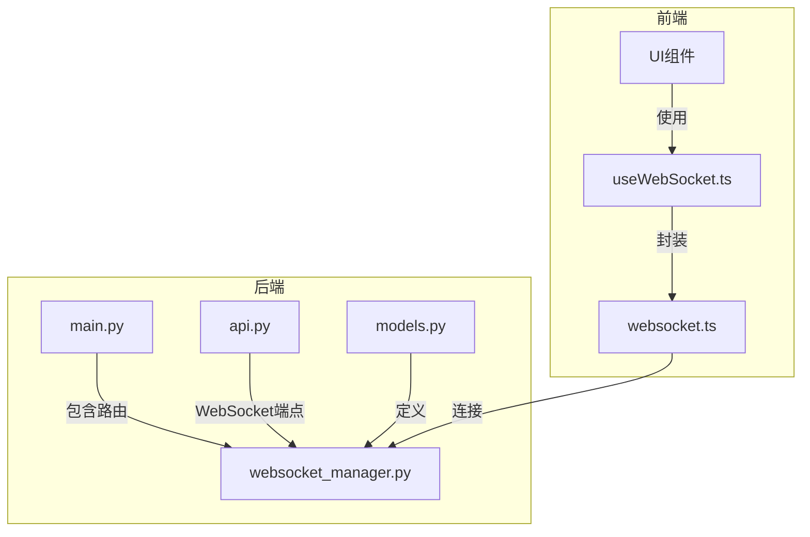
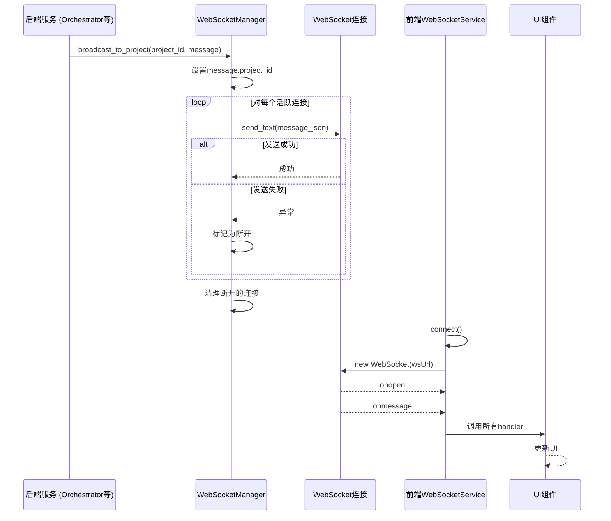
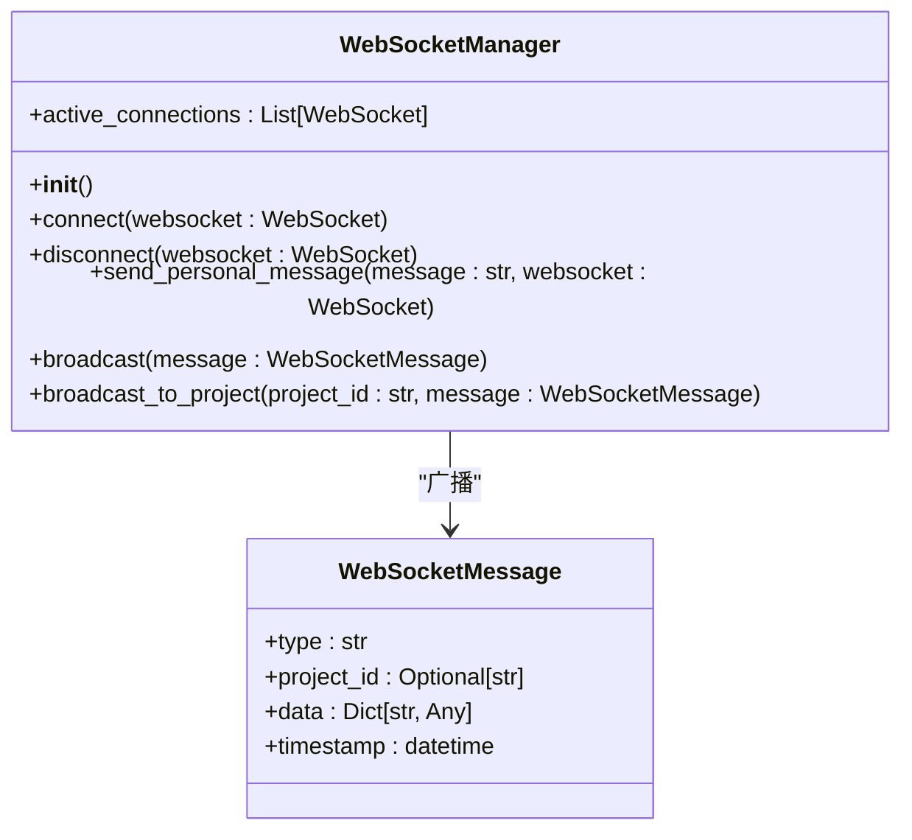
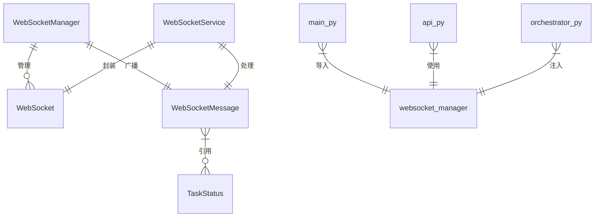

# WebSocket服务

<cite>
**本文档引用的文件**  
- [websocket_manager.py](file://dashboard/backend/websocket_manager.py)
- [websocket.ts](file://dashboard/frontend/src/services/websocket.ts)
- [useWebSocket.ts](file://dashboard/frontend/src/hooks/useWebSocket.ts)
- [models.py](file://dashboard/backend/models.py)
- [main.py](file://dashboard/backend/main.py)
- [api.py](file://dashboard/backend/api.py)
- [a2amcp_orchestrator.py](file://dashboard/backend/a2amcp_orchestrator.py)
- [orchestrator.py](file://dashboard/backend/orchestrator.py)
- [mission-control-summary.md](file://Doc/features/mission-control-summary.md)
</cite>

## 目录
1. [简介](#简介)
2. [项目结构](#项目结构)
3. [核心组件](#核心组件)
4. [架构概述](#架构概述)
5. [详细组件分析](#详细组件分析)
6. [依赖分析](#依赖分析)
7. [性能考虑](#性能考虑)
8. [故障排除指南](#故障排除指南)
9. [结论](#结论)

## 简介
本文档深入解析TaskTree实时通信系统，以`websocket_manager.py`中的`WebSocketManager`类为核心，全面阐述其连接管理、广播机制和项目级消息推送（`broadcast_to_project`）的实现。文档详细说明WebSocket连接如何通过`/ws/updates`端点建立，以及消息如何以JSON格式在前后端之间传输。结合前端`websocket.ts`中的重连策略（指数退避）和消息处理机制，完整描述了实时通信的生命周期。文档列举了所有支持的WebSocket事件类型（如`node_update`, `mission_snapshot`, `state_transition`），并提供了每个事件的消息结构定义。同时，解释了异常处理机制，包括连接断开后的自动清理和错误传播，并提供了性能优化建议。

## 项目结构
TaskTree项目的WebSocket服务系统由后端和前端两部分构成。后端位于`dashboard/backend/`目录下，核心是`websocket_manager.py`文件，它定义了`WebSocketManager`类来管理所有连接和广播。前端位于`dashboard/frontend/src/`目录下，`services/websocket.ts`文件实现了客户端的WebSocket服务，而`hooks/useWebSocket.ts`提供了React Hook来简化组件中的WebSocket使用。



**Diagram sources**
- [websocket_manager.py](file://dashboard/backend/websocket_manager.py)
- [main.py](file://dashboard/backend/main.py)
- [api.py](file://dashboard/backend/api.py)
- [websocket.ts](file://dashboard/frontend/src/services/websocket.ts)

**Section sources**
- [websocket_manager.py](file://dashboard/backend/websocket_manager.py)
- [websocket.ts](file://dashboard/frontend/src/services/websocket.ts)

## 核心组件
核心组件是`WebSocketManager`类，它负责管理所有WebSocket连接的生命周期。该类维护一个`active_connections`列表，用于存储所有活跃的连接。`connect`方法用于接受新的连接并将其添加到列表中，而`disconnect`方法则负责在连接断开时将其移除。`broadcast`方法实现了向所有客户端广播消息的核心功能，它会遍历所有活跃连接并发送消息，同时处理发送失败的连接。`broadcast_to_project`方法是`broadcast`的增强版，它会先将消息与特定的`project_id`关联，再进行广播，实现了项目级别的消息推送。

**Section sources**
- [websocket_manager.py](file://dashboard/backend/websocket_manager.py#L10-L55)

## 架构概述
TaskTree的WebSocket架构是一个典型的发布-订阅（Pub-Sub）模式。后端的`WebSocketManager`作为消息代理，管理所有客户端的连接。当系统中有状态更新（如任务状态改变、代理启动等）时，后端服务（如`Orchestrator`）会调用`WebSocketManager`的`broadcast`或`broadcast_to_project`方法来发送消息。前端的`WebSocketService`实例化一个WebSocket连接，并通过`subscribe`方法注册消息处理函数。当消息到达时，`onmessage`事件处理器会解析JSON数据并通知所有订阅者。



**Diagram sources**
- [websocket_manager.py](file://dashboard/backend/websocket_manager.py#L10-L55)
- [websocket.ts](file://dashboard/frontend/src/services/websocket.ts#L5-L97)

## 详细组件分析

### WebSocketManager分析
`WebSocketManager`类是整个实时通信系统的核心。它的`active_connections`字段是一个`List[WebSocket]`，用于存储所有活跃的连接。`connect`方法首先调用`websocket.accept()`来接受WebSocket握手，然后将连接对象添加到列表中，并打印连接日志。`disconnect`方法则从列表中移除指定的连接。

`broadcast`方法是关键的性能和健壮性保障。它首先检查是否有活跃连接，如果没有则直接返回。然后，它将`WebSocketMessage`对象序列化为JSON字符串。在发送过程中，它使用一个`disconnected`列表来收集发送失败的连接，而不是在遍历过程中直接修改`active_connections`，这避免了在迭代过程中修改列表的潜在问题。最后，它统一调用`disconnect`方法来清理这些失效连接。

`broadcast_to_project`方法通过修改消息的`project_id`字段，实现了基于项目的广播，使得前端可以轻松过滤出与当前项目相关的消息。



**Diagram sources**
- [websocket_manager.py](file://dashboard/backend/websocket_manager.py#L10-L55)
- [models.py](file://dashboard/backend/models.py#L129-L135)

**Section sources**
- [websocket_manager.py](file://dashboard/backend/websocket_manager.py#L10-L55)

### 前端WebSocket服务分析
前端的`WebSocketService`类封装了原生WebSocket API，提供了更易用的接口。`connect`方法负责建立连接，它会根据当前页面的协议（http/https）选择`ws/wss`，并连接到`/ws/updates`端点。`onopen`、`onmessage`、`onclose`和`onerror`事件处理器分别处理连接建立、消息接收、连接关闭和错误事件。

`scheduleReconnect`方法实现了指数退避重连策略。当连接断开时，它会根据`reconnectAttempts`的次数计算延迟时间（`delay = reconnectDelay * 2^(attempts-1)`），并在达到最大重试次数后停止重连。这可以防止在网络不稳定时对服务器造成过大的连接压力。

`subscribe`方法允许UI组件订阅消息，它返回一个取消订阅的函数，便于在组件卸载时进行清理。`send`方法用于向前端发送消息，但目前的实现仅检查连接状态，未处理发送失败的情况。

```mermaid
flowchart TD
Start([connect()]) --> CheckState["检查连接状态"]
CheckState --> |已连接| End([连接已存在])
CheckState --> |未连接| CreateWS["创建WebSocket实例"]
CreateWS --> SetEvents["设置事件处理器"]
SetEvents --> OnOpen["onopen: 重置重试次数"]
SetEvents --> OnMessage["onmessage: 解析JSON并通知订阅者"]
OnMessage --> |解析成功| Notify["handlers.forEach(handler)"]
OnMessage --> |解析失败| LogError["记录错误"]
SetEvents --> OnClose["onclose: scheduleReconnect()"]
SetEvents --> OnError["onerror: 记录错误"]
OnClose --> ScheduleReconnect["scheduleReconnect()"]
ScheduleReconnect --> |未达最大重试| CalculateDelay["计算延迟: delay * 2^(attempts-1)"]
CalculateDelay --> SetTimer["设置setTimeout"]
SetTimer --> Wait["等待"]
Wait --> Connect["connect()"]
ScheduleReconnect --> |已达最大重试| LogMax["记录最大重试错误"]
```

**Diagram sources**
- [websocket.ts](file://dashboard/frontend/src/services/websocket.ts#L5-L97)

**Section sources**
- [websocket.ts](file://dashboard/frontend/src/services/websocket.ts#L5-L97)
- [useWebSocket.ts](file://dashboard/frontend/src/hooks/useWebSocket.ts#L5-L24)

### WebSocket消息类型
根据代码分析，系统支持多种WebSocket事件类型，每种类型都有其特定的数据结构。

**支持的WebSocket事件类型**

| 事件类型 | 触发场景 | 数据结构 (data字段) |
| :--- | :--- | :--- |
| `task_status_changed` | 任务状态发生改变 | `{ "task_id": string, "status": TaskStatus }` |
| `orchestrator_started` | 协调器启动 | `{ "status": "running", "a2amcp_enabled": boolean }` |
| `orchestrator_stopped` | 协调器停止 | `{ "status": "stopped" }` |
| `orchestrator_error` | 协调器发生错误 | `{ "error": string }` |
| `coordination_update` | 代理协调状态更新 | `{ "active_agents": number, "agents": { [name: string]: Agent } }` |
| `node_update` | 任务节点更新 (来自文档) | `{ "node_id": string, "changes": Dict }` |
| `mission_snapshot` | 任务快照创建 (来自文档) | `{ "snapshot_id": string, "timestamp": datetime }` |
| `state_transition` | 状态转换 (来自文档) | `{ "from": string, "to": string, "context": Dict }` |

**Section sources**
- [a2amcp_orchestrator.py](file://dashboard/backend/a2amcp_orchestrator.py#L69-L239)
- [orchestrator.py](file://dashboard/backend/orchestrator.py#L77-L268)
- [mission-control-summary.md](file://Doc/features/mission-control-summary.md#L269)

## 依赖分析
`WebSocketManager`类依赖于FastAPI的`WebSocket`类和项目自身的`WebSocketMessage` Pydantic模型。`WebSocketMessage`模型定义了所有消息的通用结构，确保了前后端通信的类型安全。前端`WebSocketService`依赖于`@/types`中的`WebSocketMessage`类型定义，保证了类型一致性。

在后端，`main.py`通过`app.include_router(websocket_router)`将WebSocket路由集成到FastAPI应用中。`api.py`文件中的`/ws/updates`端点直接调用`WebSocketManager`的`connect`和`disconnect`方法。`Orchestrator`和`A2AMCPOrchestrator`等业务服务通过依赖注入或直接引用的方式使用`WebSocketManager`实例来广播状态更新。



**Diagram sources**
- [main.py](file://dashboard/backend/main.py#L6-L51)
- [api.py](file://dashboard/backend/api.py#L1218-L1227)
- [models.py](file://dashboard/backend/models.py#L10-L135)

**Section sources**
- [main.py](file://dashboard/backend/main.py#L6-L51)
- [api.py](file://dashboard/backend/api.py#L1218-L1227)
- [models.py](file://dashboard/backend/models.py#L10-L135)

## 性能考虑
`WebSocketManager`的`broadcast`方法已经包含了基本的错误处理和连接清理，这是保证系统健壮性的关键。然而，为了进一步优化性能，可以考虑以下建议：

1.  **减少不必要的广播**: 当前的`broadcast`方法会向所有连接发送所有消息。可以通过在`WebSocketManager`中维护一个基于`project_id`的连接映射（例如`Dict[str, List[WebSocket]]`），实现更精细的广播。`broadcast_to_project`方法可以直接查找特定项目的连接列表，避免向无关项目的客户端发送消息，从而显著降低网络负载和客户端处理开销。

2.  **消息压缩**: 对于数据量较大的消息（如完整的任务列表或日志），可以在发送前进行压缩（如使用gzip）。这可以显著减少网络传输时间，尤其是在带宽受限的环境下。需要在客户端`onmessage`处理器中添加相应的解压逻辑。

3.  **批量发送**: 对于短时间内产生的多个相关事件，可以考虑将它们合并成一个批量消息发送，而不是逐个发送。这可以减少网络往返次数和事件处理的频率。

4.  **连接池监控**: 增加对`active_connections`列表大小的监控和告警。如果连接数异常增长，可能意味着有连接泄漏，需要及时排查。

**Section sources**
- [websocket_manager.py](file://dashboard/backend/websocket_manager.py#L32-L51)

## 故障排除指南
当WebSocket通信出现问题时，可以按照以下步骤进行排查：

1.  **检查后端日志**: 查看`websocket_manager.py`中的`print`语句，确认连接和断开事件是否按预期发生。如果连接后立即断开，检查`api.py`中`/ws/updates`端点的实现是否有异常。

2.  **检查前端日志**: 查看浏览器控制台，确认`WebSocket connected`和`WebSocket disconnected`日志。如果出现`Max reconnection attempts reached`，说明客户端无法与服务器建立稳定连接，需要检查网络或服务器状态。

3.  **验证消息格式**: 如果前端收到消息但无法解析，检查`onmessage`处理器中的`JSON.parse`是否失败。确保后端发送的`WebSocketMessage`对象可以被正确序列化为有效的JSON。

4.  **检查CORS配置**: 确保`main.py`中的CORS中间件配置正确，允许前端应用的域名进行连接。

5.  **确认端点路径**: 确保前端连接的URL（`/ws/updates`）与后端定义的端点路径完全一致。

**Section sources**
- [websocket_manager.py](file://dashboard/backend/websocket_manager.py#L20-L26)
- [websocket.ts](file://dashboard/frontend/src/services/websocket.ts#L23-L43)

## 结论
TaskTree的WebSocket服务系统设计简洁而有效。`WebSocketManager`类提供了可靠的连接管理和广播机制，前端`WebSocketService`实现了健壮的重连策略。通过`broadcast_to_project`方法和`project_id`字段，系统支持了项目级别的实时更新。消息以结构化的JSON格式传输，保证了前后端通信的清晰性。尽管系统已经具备良好的基础，但通过引入基于项目的连接分组和消息压缩等优化措施，可以进一步提升其在大规模项目中的性能和可扩展性。