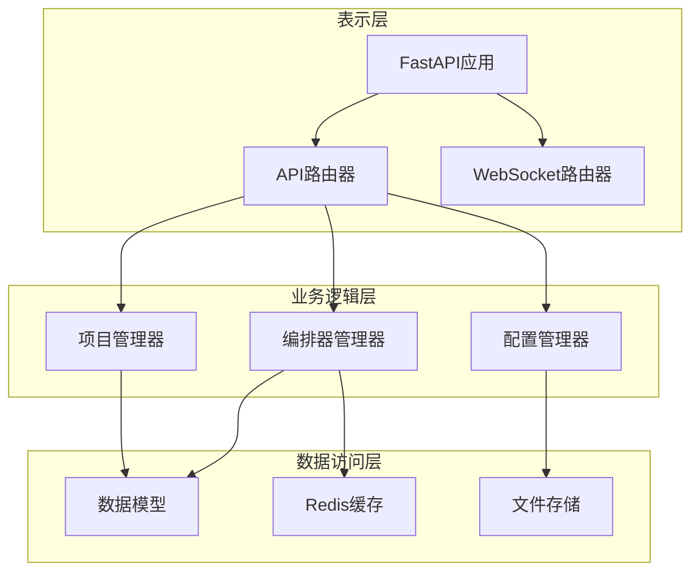
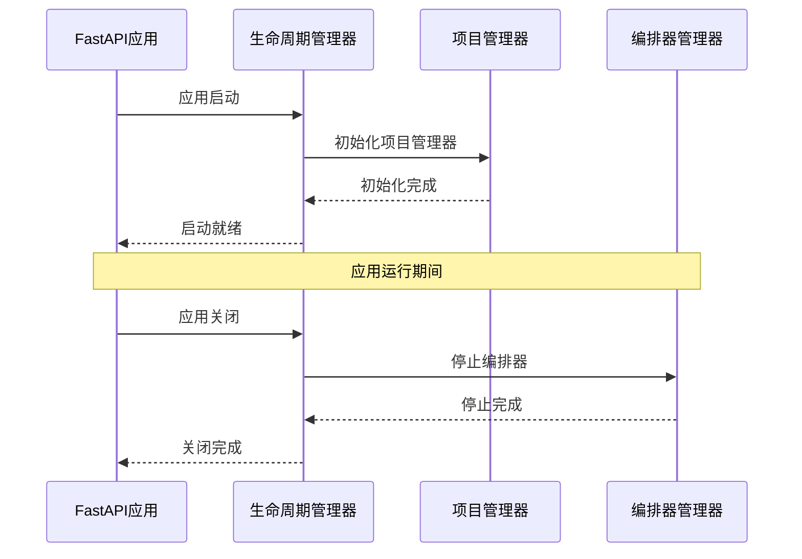
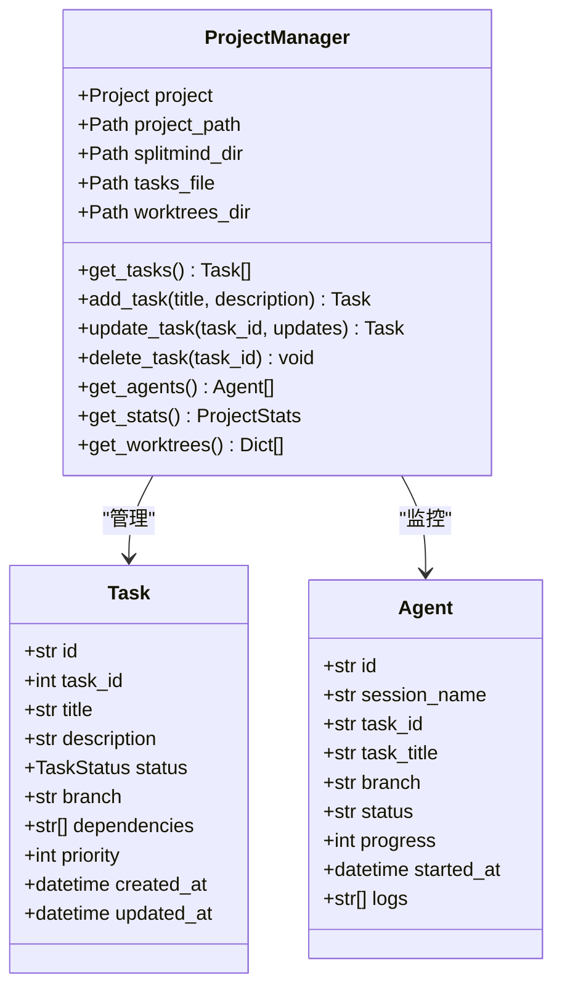
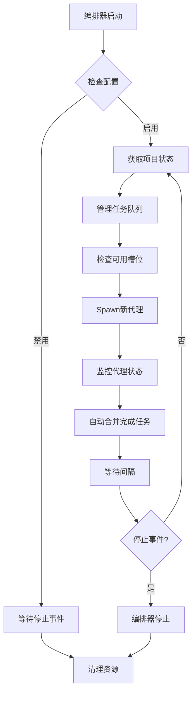
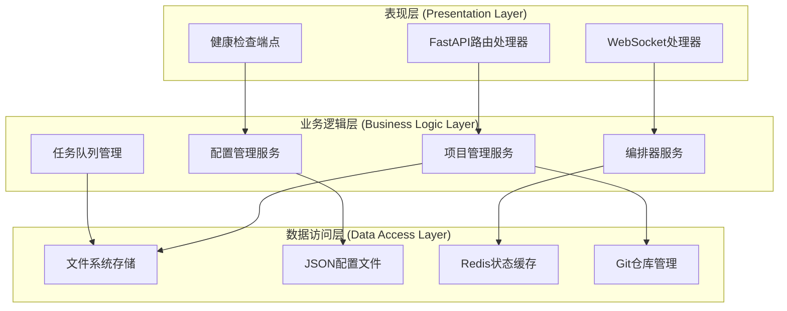
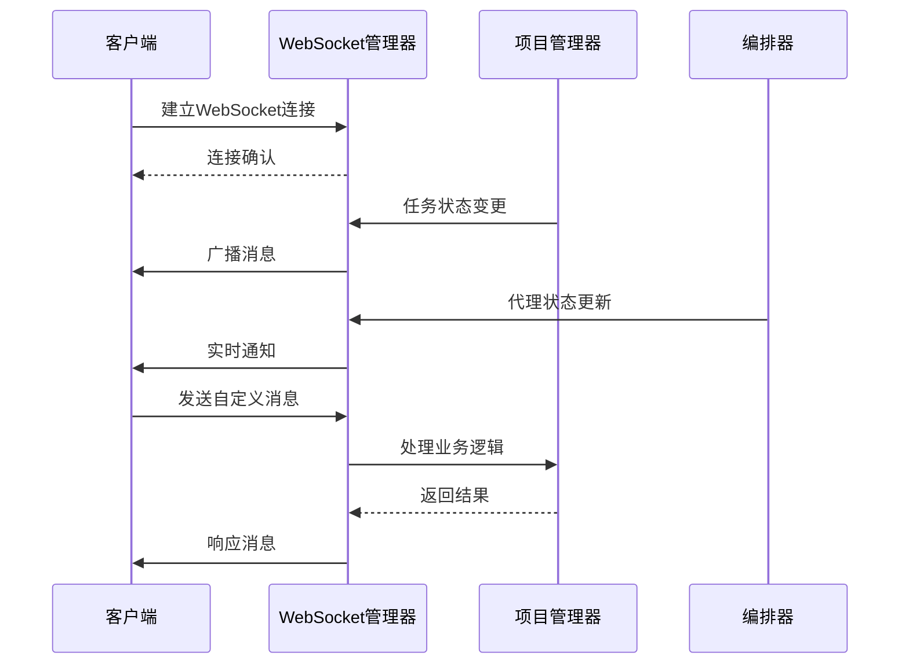
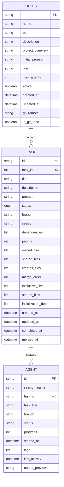
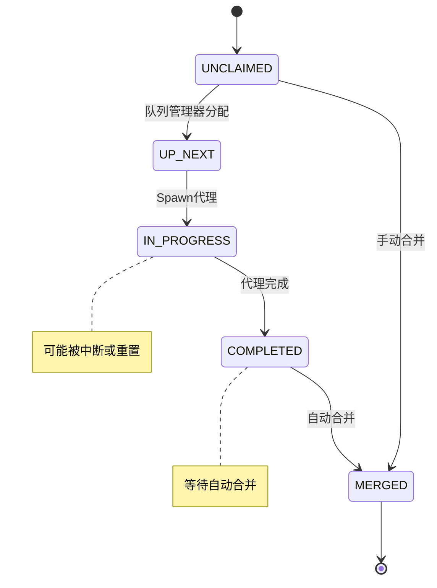
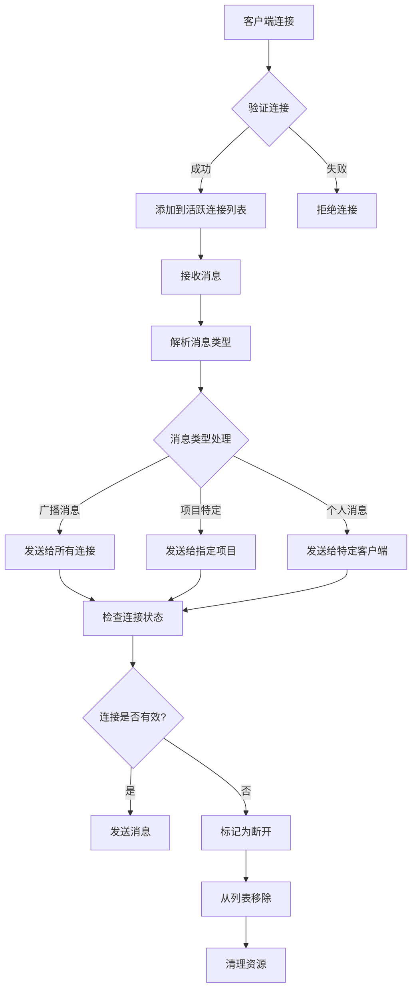
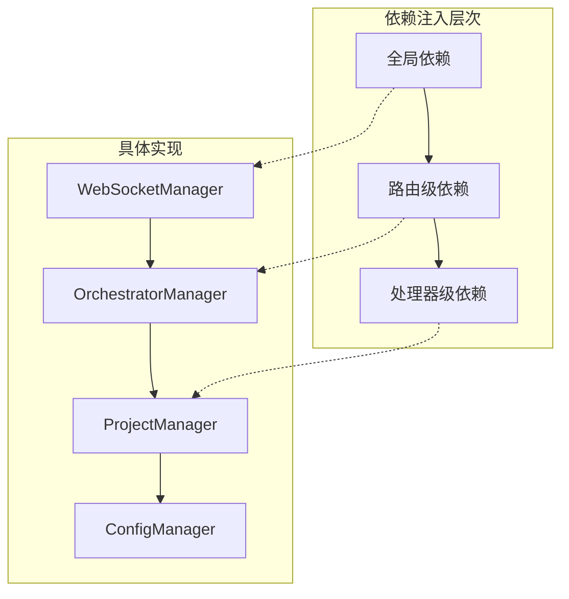

# TaskTree后端架构文档

<cite>
**本文档中引用的文件**
- [main.py](file://dashboard/backend/main.py)
- [api.py](file://dashboard/backend/api.py)
- [models.py](file://dashboard/backend/models.py)
- [websocket_manager.py](file://dashboard/backend/websocket_manager.py)
- [orchestrator.py](file://dashboard/backend/orchestrator.py)
- [project_manager.py](file://dashboard/backend/project_manager.py)
- [config.py](file://dashboard/backend/config.py)
- [requirements.txt](file://requirements.txt)
</cite>

## 目录
1. [简介](#简介)
2. [项目结构概览](#项目结构概览)
3. [核心组件分析](#核心组件分析)
4. [架构设计](#架构设计)
5. [API路由设计](#api路由设计)
6. [数据模型架构](#数据模型架构)
7. [实时通信系统](#实时通信系统)
8. [依赖注入与异步处理](#依赖注入与异步处理)
9. [性能考虑](#性能考虑)
10. [故障排除指南](#故障排除指南)
11. [总结](#总结)

## 简介

TaskTree是一个基于FastAPI构建的AI代码编排仪表板，采用现代化的分层架构设计。该系统通过智能的任务管理和AI代理协调，为开发者提供了一个强大的代码协作平台。本文档详细分析了TaskTree后端的核心架构，包括FastAPI应用初始化、生命周期管理、API路由设计、数据模型架构以及实时通信机制。

## 项目结构概览

TaskTree后端采用模块化设计，主要分为以下几个层次：



**图表来源**
- [main.py](file://dashboard/backend/main.py#L34-L56)
- [api.py](file://dashboard/backend/api.py#L72-L88)

**章节来源**
- [main.py](file://dashboard/backend/main.py#L1-L56)
- [api.py](file://dashboard/backend/api.py#L1-L800)

## 核心组件分析

### FastAPI应用初始化

TaskTree的FastAPI应用通过精心设计的生命周期管理器实现优雅的启动和关闭流程：



**图表来源**
- [main.py](file://dashboard/backend/main.py#L15-L32)
- [api.py](file://dashboard/backend/api.py#L52-L71)

### 项目管理器（ProjectManager）

项目管理器负责单个项目的所有操作，包括任务管理、Git工作树管理和状态跟踪：



**图表来源**
- [project_manager.py](file://dashboard/backend/project_manager.py#L13-L451)
- [models.py](file://dashboard/backend/models.py#L19-L61)

### 编排器管理器（OrchestratorManager）

编排器管理器是系统的核心调度组件，负责AI代理的Spawn、监控和任务队列管理：



**图表来源**
- [orchestrator.py](file://dashboard/backend/orchestrator.py#L129-L165)

**章节来源**
- [main.py](file://dashboard/backend/main.py#L15-L32)
- [project_manager.py](file://dashboard/backend/project_manager.py#L13-L451)
- [orchestrator.py](file://dashboard/backend/orchestrator.py#L25-L800)

## 架构设计

TaskTree采用经典的三层架构模式，实现了清晰的职责分离：



**图表来源**
- [main.py](file://dashboard/backend/main.py#L49-L56)
- [api.py](file://dashboard/backend/api.py#L72-L88)

### 分层设计特点

1. **表现层**：专注于HTTP请求处理和WebSocket通信
2. **业务逻辑层**：封装核心业务规则和流程控制
3. **数据访问层**：抽象数据持久化和外部系统集成

**章节来源**
- [main.py](file://dashboard/backend/main.py#L34-L56)
- [api.py](file://dashboard/backend/api.py#L72-L88)

## API路由设计

TaskTree的API路由采用模块化设计，分为RESTful API和WebSocket两个独立的路由系统：

### RESTful API路由

```mermaid
graph LR
subgraph "项目管理"
A1[GET /api/projects]
A2[POST /api/projects]
A3[GET /api/projects/{id}]
A4[PUT /api/projects/{id}]
A5[DELETE /api/projects/{id}]
end
subgraph "任务管理"
B1[GET /api/projects/{id}/tasks]
B2[POST /api/projects/{id}/tasks]
B3[PUT /api/projects/{id}/tasks/{id}]
B4[DELETE /api/projects/{id}/tasks/{id}]
B5[POST /api/projects/{id}/tasks/{id}/merge]
end
subgraph "代理管理"
C1[GET /api/projects/{id}/agents]
C2[POST /api/projects/{id}/agents/monitor]
C3[POST /api/projects/{id}/reset-agent-tasks]
end
subgraph "编排器控制"
D1[GET /api/orchestrator/config]
D2[PUT /api/orchestrator/config]
D3[POST /api/orchestrator/start]
D4[POST /api/orchestrator/stop]
end
```

**图表来源**
- [api.py](file://dashboard/backend/api.py#L94-L800)

### WebSocket路由

WebSocket路由专门处理实时通信，提供即时的状态更新和通知：



**图表来源**
- [websocket_manager.py](file://dashboard/backend/websocket_manager.py#L10-L55)

**章节来源**
- [api.py](file://dashboard/backend/api.py#L94-L800)
- [websocket_manager.py](file://dashboard/backend/websocket_manager.py#L10-L55)

## 数据模型架构

TaskTree的数据模型设计体现了复杂业务逻辑的建模需求，支持树形结构和DAG依赖关系：

### 核心数据模型



**图表来源**
- [models.py](file://dashboard/backend/models.py#L19-L80)

### 任务状态流转

任务在整个生命周期中会经历多种状态转换：



**图表来源**
- [models.py](file://dashboard/backend/models.py#L10-L17)

**章节来源**
- [models.py](file://dashboard/backend/models.py#L1-L135)

## 实时通信系统

TaskTree的实时通信系统基于WebSocket技术，提供了高效的双向通信能力：

### WebSocket消息类型

系统定义了多种WebSocket消息类型来处理不同的业务场景：

| 消息类型 | 描述 | 数据结构 |
|---------|------|----------|
| `project_created` | 项目创建通知 | `{type: "project_created", project_id: string, data: Project}` |
| `project_updated` | 项目更新通知 | `{type: "project_updated", project_id: string, data: Project}` |
| `project_deleted` | 项目删除通知 | `{type: "project_deleted", project_id: string, data: object}` |
| `task_created` | 任务创建通知 | `{type: "task_created", project_id: string, data: Task}` |
| `task_updated` | 任务更新通知 | `{type: "task_updated", project_id: string, data: Task}` |
| `task_deleted` | 任务删除通知 | `{type: "task_deleted", project_id: string, data: object}` |
| `task_status_changed` | 任务状态变更 | `{type: "task_status_changed", project_id: string, data: object}` |
| `agent_spawned` | 代理Spawn成功 | `{type: "agent_spawned", project_id: string, data: object}` |
| `task_completed` | 任务完成通知 | `{type: "task_completed", project_id: string, data: object}` |
| `task_merged` | 任务合并通知 | `{type: "task_merged", project_id: string, data: object}` |

### 连接管理策略

WebSocket管理器实现了智能的连接管理机制：



**图表来源**
- [websocket_manager.py](file://dashboard/backend/websocket_manager.py#L16-L55)

**章节来源**
- [websocket_manager.py](file://dashboard/backend/websocket_manager.py#L1-L55)

## 依赖注入与异步处理

TaskTree充分利用了FastAPI的依赖注入机制和Python的异步特性：

### FastAPI依赖注入

系统通过FastAPI的依赖注入机制实现了松耦合的设计：



**图表来源**
- [api.py](file://dashboard/backend/api.py#L36-L49)

### 异步处理机制

系统在多个层面实现了异步处理：

1. **API端点异步**：所有API处理器都使用async def定义
2. **WebSocket处理**：支持并发的WebSocket连接
3. **后台任务**：编排器使用异步循环处理
4. **数据库操作**：文件I/O操作异步化

**章节来源**
- [api.py](file://dashboard/backend/api.py#L36-L49)
- [orchestrator.py](file://dashboard/backend/orchestrator.py#L129-L165)

## 性能考虑

TaskTree在设计时充分考虑了性能优化：

### 缓存策略

1. **内存缓存**：项目配置和状态信息缓存在内存中
2. **文件缓存**：任务状态定期写入文件系统
3. **Redis缓存**：实时状态信息存储在Redis中

### 并发处理

1. **异步I/O**：文件操作和网络请求异步化
2. **多线程**：长时间运行的操作使用单独线程
3. **连接池**：数据库连接和HTTP客户端连接池化

### 资源管理

1. **连接管理**：自动清理断开的WebSocket连接
2. **进程管理**：监控和清理僵尸tmux会话
3. **内存管理**：及时释放不再使用的对象

## 故障排除指南

### 常见问题及解决方案

| 问题类型 | 症状 | 可能原因 | 解决方案 |
|---------|------|----------|----------|
| 启动失败 | 应用无法启动 | 项目路径不存在 | 检查项目配置中的路径 |
| WebSocket连接失败 | 实时更新不工作 | 端口被占用 | 检查端口监听状态 |
| 任务状态异常 | 状态显示错误 | 文件同步问题 | 重启应用并重新加载状态 |
| 编排器卡死 | 代理无法Spawn | 资源不足 | 清理未响应的tmux会话 |
| 内存泄漏 | 内存使用持续增长 | 连接未正确清理 | 检查WebSocket连接管理 |

### 监控指标

系统提供了多个监控端点：

- `/health`：健康检查
- `/api/projects/{id}/stats`：项目统计
- `/api/orchestrator/status`：编排器状态

**章节来源**
- [main.py](file://dashboard/backend/main.py#L53-L56)
- [api.py](file://dashboard/backend/api.py#L364-L372)
- [api.py](file://dashboard/backend/api.py#L774-L781)

## 总结

TaskTree后端架构展现了现代Web应用的最佳实践，通过以下关键设计原则实现了高效、可扩展的系统：

### 设计亮点

1. **模块化架构**：清晰的分层设计便于维护和扩展
2. **异步优先**：充分利用异步编程提升系统性能
3. **实时通信**：WebSocket实现实时状态同步
4. **状态管理**：完善的任务状态流转机制
5. **容错设计**：健壮的错误处理和恢复机制

### 技术优势

- **高性能**：异步I/O和缓存策略确保系统响应速度
- **可扩展性**：模块化设计支持功能扩展
- **可靠性**：多重备份和恢复机制保证系统稳定
- **易维护性**：清晰的代码结构和完善的日志记录

TaskTree后端架构为AI代码编排领域提供了一个优秀的参考实现，其设计理念和实现方式值得在类似项目中借鉴和应用。