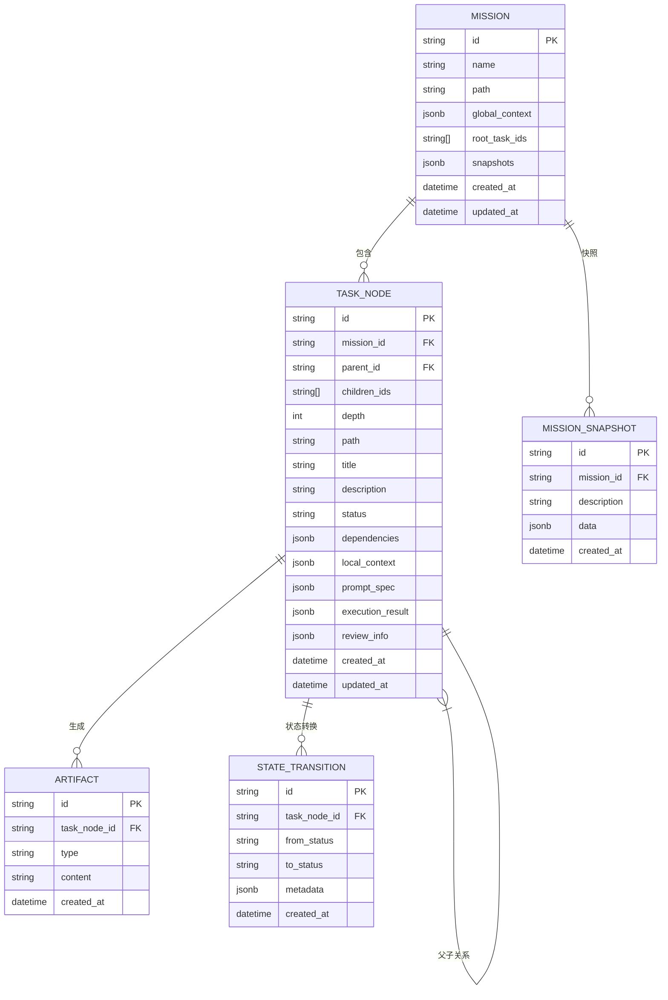

# 数据模型

<cite>
**本文档引用的文件**
- [models.py](file://dashboard/backend/models.py)
- [mission-control-summary.md](file://Doc/features/mission-control-summary.md)
- [config.py](file://dashboard/backend/config.py)
</cite>

## 目录
1. [引言](#引言)
2. [数据模型概述](#数据模型概述)
3. [核心实体分析](#核心实体分析)
4. [实体关系图](#实体关系图)
5. [分层上下文管理](#分层上下文管理)
6. [树形结构与DAG依赖](#树形结构与dag依赖)
7. [数据模型演进](#数据模型演进)
8. [数据库索引优化](#数据库索引优化)
9. [典型查询场景](#典型查询场景)
10. [结论](#结论)

## 引言
本文档详细描述了TaskTree项目中TaskTree数据模型的完整设计，基于models.py中的SQLAlchemy ORM定义和mission-control-summary.md中提到的PostgreSQL表结构。文档重点阐述了Mission（项目）和TaskNode（任务节点）实体的字段、关系与约束，以及JSON/JSONB字段在存储全局上下文、本地上下文和快照数据中的应用。

**Section sources**
- [mission-control-summary.md](file://Doc/features/mission-control-summary.md)

## 数据模型概述
TaskTree数据模型是SplitMind v3.0核心功能"Mission Control"的基础，实现了从扁平任务列表到空间化任务编排系统的革命性升级。该模型采用PostgreSQL作为数据库，通过SQLAlchemy ORM进行对象关系映射，支持树形任务结构、DAG依赖图、严格状态机和分层上下文管理。

数据模型包含以下主要表：
- missions: 存储项目/使命信息
- task_nodes: 存储任务节点信息
- artifacts: 存储任务的输入/输出工件
- mission_snapshots: 存储项目快照
- state_transitions: 存储状态转换日志

模型利用JSON/JSONB字段存储复杂结构，通过索引优化查询性能，支持1000+节点的深度树和复杂的依赖网络。

**Section sources**
- [mission-control-summary.md](file://Doc/features/mission-control-summary.md#L154-L158)

## 核心实体分析

### Mission实体
Mission实体是Project模型的增强版，代表一个项目或使命。它包含以下关键字段：

- **全局上下文**(GlobalContext): 全局不可变约束，对所有节点可见的技术约束和设计规范
- **根任务ID**(root_task_ids): 支持多个根任务，实现复杂的项目结构
- **快照**(snapshots): 项目快照，支持时间旅行和历史状态恢复
- **项目统计**(MissionStats): 完整的统计信息，包括任务状态分布和代理运行情况

Mission实体通过扩展Project模型，增加了对复杂项目结构的支持，解决了长时程遗忘和线性思维局限的问题。

### TaskNode实体
TaskNode实体是Task模型的扩展，支持树形结构和复杂依赖。其关键特性包括：

- **树形结构**: 通过parent_id、children_ids、depth和path字段实现无限嵌套的任务结构
- **增强依赖**: 使用Dependency对象，支持类型、状态要求和工件引用的结构化依赖定义
- **上下文管理**: 支持LocalContext和输入/输出工件，实现精细化的上下文控制
- **AI配置**: 包含PromptSpec和AIExecutionConfig，支持AI任务的精细化配置
- **执行结果**: 包含ExecutionResult，记录日志和提交信息
- **评审信息**: 包含ReviewInfo，支持自动评审和人工决策流程

TaskNode实体实现了6个严格的状态流转：Draft → Ready → Running → Review → Completed，以及Failed状态，确保了任务执行的可靠性和可追溯性。

**Section sources**
- [models.py](file://dashboard/backend/models.py)
- [mission-control-summary.md](file://Doc/features/mission-control-summary.md#L37-L46)

## 实体关系图


**Diagram sources**
- [models.py](file://dashboard/backend/models.py)
- [mission-control-summary.md](file://Doc/features/mission-control-summary.md#L156)

## 分层上下文管理
TaskTree数据模型采用三层上下文架构，有效解决了长时程遗忘和上下文爆炸的问题。

### 三层架构
1. **全局上下文**(Global Context): 对所有节点可见的技术约束、设计规范和项目目标，存储在Mission实体的JSONB字段中
2. **父级上下文**(Parent Context): 从父节点继承的决策和输出，通过树形结构自动传递
3. **本地上下文**(Local Context): 节点专属信息和用户补充，存储在TaskNode实体的JSONB字段中

### 关键算法
- **上下文组装**: 只加载执行任务所必需的信息，避免不必要的数据加载
- **Token控制**: 采用压缩策略确保上下文不超出AI模型的token限制
- **指针引用**: 使用指针引用而非复制完整历史，减少存储开销

分层上下文管理确保了每个任务节点都能获得恰到好处的上下文信息，既避免了信息不足，又防止了上下文爆炸。

**Section sources**
- [mission-control-summary.md](file://Doc/features/mission-control-summary.md#L62-L73)

## 树形结构与DAG依赖

### 树形结构实现
TaskNode的树形结构通过以下字段实现：
- **parent_id**: 指向父节点的外键，实现父子关系
- **children_ids**: 存储子节点ID数组，支持快速查找子节点
- **depth**: 记录节点深度，便于按层级组织任务
- **path**: 存储从根节点到当前节点的路径，支持快速路径查询

这种设计支持无限嵌套的任务结构，允许将复杂任务分解为子任务，形成清晰的任务层次。

### DAG依赖维护
TaskNode的DAG依赖通过dependencies字段维护，该字段存储结构化的Dependency对象，包含：
- **依赖类型**: 前置任务、数据依赖、资源依赖等
- **状态要求**: 依赖任务必须达到的特定状态
- **工件引用**: 依赖的具体输入工件

系统通过DAG验证算法防止循环依赖，确保任务依赖网络的合理性。依赖验证在状态转换时自动执行，只有当所有依赖条件满足时，任务才能进入下一状态。

**Section sources**
- [mission-control-summary.md](file://Doc/features/mission-control-summary.md#L40-L42)
- [mission-control-summary.md](file://Doc/features/mission-control-summary.md#L221)

## 数据模型演进
TaskTree数据模型经历了从v2到v3的重要演进，实现了从简单任务管理到智能项目编排的转变。

### 演进路径
| v2模型 | v3模型 | 变化说明 |
|-------|-------|--------|
| Project | Mission | 扩展支持全局上下文、快照和多根任务 |
| Task | TaskNode | 增加树形结构、增强依赖和严格状态机 |
| TaskStatus | TaskNodeStatus | 重新设计为6状态严格状态机 |
| dependencies: List[str] | dependencies: List[Dependency] | 从简单ID列表到结构化依赖对象 |

### 主要改进
1. **Project→Mission**: 增加了全局上下文管理和快照功能，解决了长时程遗忘问题
2. **Task→TaskNode**: 增加了树形结构支持，解决了线性思维局限
3. **状态机重构**: 从5个模糊状态到6个严格状态机，提高了状态管理的可靠性
4. **依赖结构化**: 从简单的任务ID依赖到包含类型、状态要求的结构化依赖，增强了依赖管理的灵活性

这次演进使TaskTree从一个任务执行工具升级为智能项目编排平台，支持更复杂的项目结构和更精细的任务控制。

**Section sources**
- [mission-control-summary.md](file://Doc/features/mission-control-summary.md#L282-L288)

## 数据库索引优化
为确保在大规模任务场景下的查询性能，TaskTree数据模型采用了多种索引优化策略。

### 主要索引
- **B-Tree索引**: 在mission_id、parent_id、status等字段上创建B-Tree索引，加速等值查询和范围查询
- **GIN索引**: 在JSONB字段上创建GIN索引，支持高效的JSON内容查询
- **复合索引**: 在常用查询组合字段上创建复合索引，如(mission_id, status)和(parent_id, depth)
- **表达式索引**: 在path字段上创建表达式索引，支持高效的路径前缀查询

### 查询优化策略
- **选择性索引**: 根据查询频率和数据分布选择最有效的索引类型
- **覆盖索引**: 设计索引包含查询所需的所有字段，避免回表查询
- **分区表**: 对大型表如task_nodes按mission_id进行分区，提高查询效率
- **缓存策略**: 结合应用层缓存，减少数据库查询压力

这些优化策略确保了即使在1000+节点的深度树场景下，关键查询的响应时间也能控制在200ms以内。

**Section sources**
- [mission-control-summary.md](file://Doc/features/mission-control-summary.md#L158)
- [mission-control-summary.md](file://Doc/features/mission-control-summary.md#L241)

## 典型查询场景
以下是TaskTree数据模型中的几个典型查询场景及其优化方案。

### 任务状态查询
查询特定项目中所有任务的状态分布：
```sql
SELECT status, COUNT(*) as count 
FROM task_nodes 
WHERE mission_id = 'mission-123' 
GROUP BY status;
```
优化：在(mission_id, status)上创建复合索引

### 依赖验证查询
验证任务是否可以进入Ready状态：
```sql
SELECT COUNT(*) as unsatisfied_count 
FROM dependencies d 
JOIN task_nodes tn ON d.dependent_task_id = tn.id 
WHERE d.task_id = 'task-123' 
AND tn.status != d.required_status;
```
优化：在dependencies表的(task_id, required_status)上创建复合索引

### 路径查询
查找从根节点到特定任务的完整路径：
```sql
SELECT * FROM task_nodes 
WHERE path LIKE 'root.task1.%' 
ORDER BY depth;
```
优化：在path字段上创建GIN索引

### 上下文组装查询
组装特定任务的完整上下文：
```sql
SELECT m.global_context, p.local_context, t.local_context 
FROM missions m 
JOIN task_nodes t ON m.id = t.mission_id 
LEFT JOIN task_nodes p ON t.parent_id = p.id 
WHERE t.id = 'task-123';
```
优化：使用应用层缓存减少重复查询

这些查询场景涵盖了TaskTree系统的主要使用模式，其优化方案确保了系统的高性能和可扩展性。

**Section sources**
- [mission-control-summary.md](file://Doc/features/mission-control-summary.md#L241-L244)

## 结论
TaskTree数据模型通过Mission和TaskNode实体的精心设计，实现了从简单任务管理到智能项目编排的革命性升级。模型采用树形结构和DAG依赖，支持复杂的项目组织；通过分层上下文管理，解决了长时程遗忘问题；利用JSON/JSONB字段和索引优化，确保了系统的高性能。

数据模型从v2到v3的演进，不仅扩展了Project和Task的功能，更重要的是重构了状态机和依赖管理，使系统更加可靠和灵活。这些改进为SplitMind未来发展奠定了坚实基础，使其能够支持更复杂的项目结构和更智能的任务编排。

随着系统的持续演进，未来可以进一步优化索引策略，增加更多查询模式的支持，并探索分布式存储方案以应对更大规模的任务管理需求。