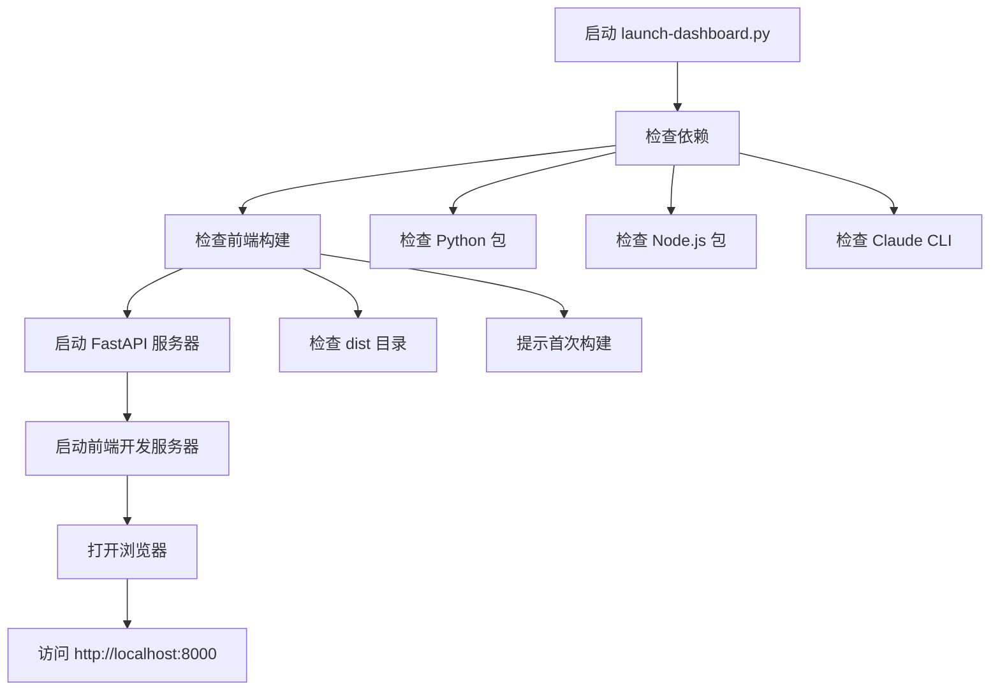
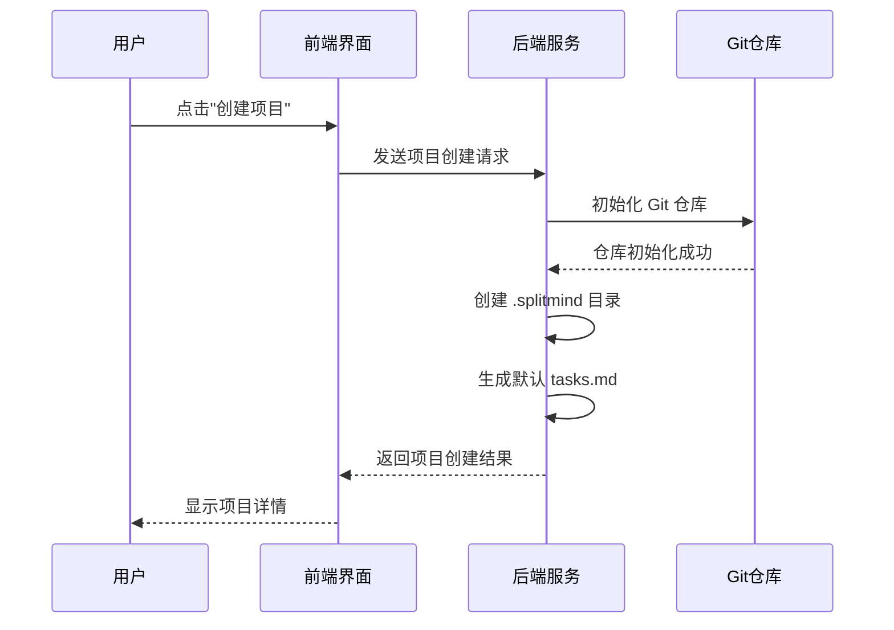

# 快速入门

<cite>
**本文档中引用的文件**
- [setup.py](file://setup.py)
- [requirements.txt](file://requirements.txt)
- [launch-dashboard.py](file://launch-dashboard.py)
- [dashboard/backend/main.py](file://dashboard/backend/main.py)
- [dashboard/backend/config.py](file://dashboard/backend/config.py)
- [dashboard/backend/models.py](file://dashboard/backend/models.py)
- [dashboard/frontend/package.json](file://dashboard/frontend/package.json)
- [dashboard/frontend/vite.config.ts](file://dashboard/frontend/vite.config.ts)
- [Readme.md](file://Readme.md)
</cite>

## 目录
1. [简介](#简介)
2. [系统要求](#系统要求)
3. [环境准备](#环境准备)
4. [克隆仓库](#克隆仓库)
5. [安装依赖](#安装依赖)
6. [配置环境变量](#配置环境变量)
7. [启动应用](#启动应用)
8. [验证安装](#验证安装)
9. [创建第一个项目](#创建第一个项目)
10. [常见问题排查](#常见问题排查)
11. [最小化示例](#最小化示例)
12. [总结](#总结)

## 简介

TaskTree是一个基于AI的多代理开发平台，通过智能任务协调和实时监控提升团队协作效率。本指南将帮助您在15分钟内完成本地环境搭建并运行起第一个项目。

## 系统要求

### 前端技术栈
- **Node.js**: 版本 18+ (推荐使用 nvm 管理版本)
- **npm**: 包管理器 (随 Node.js 自带)

### 后端技术栈
- **Python**: 版本 3.9+ (推荐使用虚拟环境)
- **pip**: Python 包管理器

### 可选工具
- **Git**: 版本控制系统
- **tmux**: 终端复用器
- **Claude CLI**: AI 代理支持 (可选但推荐)

## 环境准备

### 检查现有环境

```bash
# 检查 Node.js 版本
node --version

# 检查 npm 版本
npm --version

# 检查 Python 版本
python --version

# 检查 pip 版本
pip --version
```

### 安装必要工具

#### macOS 用户
```bash
# 使用 Homebrew 安装 Node.js 和 tmux
brew install node tmux

# 或者使用 nvm 管理 Node.js 版本
curl -o- https://raw.githubusercontent.com/nvm-sh/nvm/v0.39.0/install.sh | bash
nvm install 18
nvm use 18
```

#### Linux 用户
```bash
# Ubuntu/Debian
sudo apt update
sudo apt install nodejs npm python3 python3-pip tmux

# CentOS/RHEL
sudo yum install nodejs npm python3 python3-pip tmux
```

#### Windows 用户
- 下载并安装 [Node.js LTS](https://nodejs.org/)
- 下载并安装 [Python 3.9+](https://python.org/)
- 下载并安装 [Git for Windows](https://git-scm.com/)

## 克隆仓库

```bash
# 克隆仓库到本地
git clone https://github.com/webdevtodayjason/splitmind.git
cd splitmind
```

## 安装依赖

### 方法一：使用 setup.py 脚本 (推荐)

```bash
# 运行自动设置脚本
python setup.py
```

该脚本会自动执行以下操作：
- 检查系统前置条件
- 创建必要的目录结构
- 安装 Python 依赖包
- 设置前端依赖和构建
- 检查 Claude CLI 配置
- 创建示例任务文件

### 方法二：手动安装

#### 安装 Python 依赖
```bash
# 进入项目根目录
cd splitmind

# 安装 Python 包（包括开发依赖）
pip install -e .

# 或者指定安装特定版本
pip install -r requirements.txt
```

#### 安装前端依赖
```bash
# 进入前端目录
cd dashboard/frontend

# 安装 npm 依赖
npm install

# 构建前端应用
npm run build

# 返回项目根目录
cd ../..
```

**节来源**
- [setup.py](file://setup.py#L1-L259)
- [requirements.txt](file://requirements.txt#L1-L31)
- [dashboard/frontend/package.json](file://dashboard/frontend/package.json#L1-L54)

## 配置环境变量

### 创建 .env 文件

虽然项目没有直接使用 `.env` 文件，但需要配置 API 密钥：

```bash
# 打开配置文件进行编辑
nano config.json
```

### 配置 Anthropic API 密钥

在配置文件中添加您的 Anthropic API 密钥：

```json
{
  "orchestrator": {
    "api_key": "your-anthropic-api-key-here",
    "api_provider": "anthropic",
    "api_model": "claude-sonnet-4-20250514"
  }
}
```

### 配置选项详解

| 配置项 | 类型 | 默认值 | 说明 |
|--------|------|--------|------|
| `max_concurrent_agents` | 整数 | 5 | 最大并发 AI 代理数量 |
| `auto_merge` | 布尔 | false | 是否自动合并分支 |
| `merge_strategy` | 字符串 | "merge" | 合并策略：merge/squash/rebase |
| `api_provider` | 字符串 | "anthropic" | API 提供商：anthropic/openai |
| `api_model` | 字符串 | "claude-sonnet-4-20250514" | 使用的 AI 模型 |

**节来源**
- [dashboard/backend/config.py](file://dashboard/backend/config.py#L28-L47)
- [dashboard/backend/models.py](file://dashboard/backend/models.py#L99-L113)

## 启动应用

### 启动后端服务

```bash
# 使用 launch-dashboard.py 启动完整应用
python launch-dashboard.py

# 或者单独启动 FastAPI 服务器
cd dashboard/backend
uvicorn main:app --reload --port 8000
```

### 启动前端开发服务器

```bash
# 在新终端中启动前端
cd dashboard/frontend
npm run dev
```

### 应用启动流程



**图表来源**
- [launch-dashboard.py](file://launch-dashboard.py#L165-L290)
- [dashboard/backend/main.py](file://dashboard/backend/main.py#L1-L56)

**节来源**
- [launch-dashboard.py](file://launch-dashboard.py#L1-L290)
- [dashboard/backend/main.py](file://dashboard/backend/main.py#L1-L56)

## 验证安装

### 检查服务状态

```bash
# 检查后端服务是否运行
curl http://localhost:8000/health

# 预期响应：
# {"status": "healthy"}
```

### 浏览器访问

打开浏览器访问：
- **主界面**: http://localhost:8000
- **前端开发**: http://localhost:5173 (如果使用 npm run dev)

### 常见验证步骤

1. **后端健康检查**: 确认 `/health` 端点返回健康状态
2. **前端加载**: 检查页面是否正常加载
3. **WebSocket 连接**: 验证实时更新功能
4. **API 接口**: 测试基本的 REST API 功能

## 创建第一个项目

### 步骤 1：配置全局设置

1. 打开应用后，点击右上角的齿轮图标进入设置
2. 输入您的 Anthropic API 密钥
3. 配置 Orchestrator 设置：
   - 最大并发代理：5
   - 自动合并：启用
   - 模型选择：Claude Sonnet

### 步骤 2：创建新项目



**图表来源**
- [dashboard/backend/config.py](file://dashboard/backend/config.py#L88-L116)

### 步骤 3：添加项目概述

1. 在项目设置中输入项目描述
2. 添加初始开发目标
3. 点击 "🚀 AI Task Master" 生成智能任务分解

### 步骤 4：启动协调器

1. 点击项目侧边栏的 "启动协调器"
2. 观察 AI 代理自动分配任务
3. 监控实时进度更新

**节来源**
- [dashboard/backend/config.py](file://dashboard/backend/config.py#L88-L116)
- [dashboard/backend/models.py](file://dashboard/backend/models.py#L63-L85)

## 常见问题排查

### 端口冲突

#### 问题：端口 8000 已被占用
```bash
# 查找占用端口的进程
lsof -i :8000

# 杀死占用进程
kill -9 <PID>

# 或使用不同端口启动
python launch-dashboard.py --port 8080
```

#### 问题：前端端口 5173 冲突
```bash
# 修改 vite.config.ts 中的端口配置
# 或使用不同的端口
npm run dev -- --port 5174
```

### 依赖安装失败

#### Python 依赖问题
```bash
# 清理 pip 缓存
pip cache purge

# 升级 pip
python -m pip install --upgrade pip

# 重新安装
pip install -r requirements.txt
```

#### Node.js 依赖问题
```bash
# 清理 npm 缓存
npm cache clean --force

# 删除 node_modules 并重新安装
rm -rf node_modules package-lock.json
npm install
```

### API 密钥缺失

#### 问题：API 密钥未配置
```bash
# 检查配置文件
cat config.json

# 如果缺少 api_key 字段，手动添加
# 或在应用界面中配置
```

#### 解决方案
1. 获取 Anthropic API 密钥
2. 在设置界面或 config.json 中配置
3. 重启应用以使更改生效

### Claude CLI 问题

#### 问题：Claude CLI 未找到
```bash
# 检查 Claude CLI 是否安装
which claude

# 安装 Claude CLI
# 参考：https://docs.anthropic.com/en/docs/claude-cli
```

#### 解决方案
- 安装 Claude CLI
- 配置正确的路径
- 验证 API 密钥

### WebSocket 连接问题

#### 问题：实时更新不工作
```bash
# 检查浏览器控制台错误
# 刷新页面重试
# 检查网络连接
```

#### 解决方案
1. 刷新浏览器页面
2. 检查防火墙设置
3. 确认后端服务正在运行

**节来源**
- [launch-dashboard.py](file://launch-dashboard.py#L44-L143)
- [dashboard/backend/config.py](file://dashboard/backend/config.py#L160-L172)

## 最小化示例

### 创建最简单的项目

```bash
# 1. 克隆仓库
git clone https://github.com/webdevtodayjason/splitmind.git
cd splitmind

# 2. 安装依赖
python setup.py

# 3. 配置 API 密钥
# 编辑 config.json 添加您的 Anthropic API 密钥

# 4. 启动应用
python launch-dashboard.py

# 5. 在浏览器中访问 http://localhost:8000
# 6. 创建第一个项目并观察 UI 响应
```

### 预期效果

- 应用成功启动，显示项目列表
- 可以创建新项目
- 项目详情页面正常加载
- 实时更新功能可用
- AI 任务生成功能可用

### 性能指标

- **启动时间**: ~30秒（首次运行）
- **内存使用**: ~500MB
- **CPU 使用率**: <20%（空闲时）
- **响应时间**: <1秒（API 请求）

## 总结

通过本指南，您已经完成了 TaskTree 的完整安装和配置。现在您可以：

1. **立即开始使用**: 创建第一个项目并体验 AI 协作
2. **探索功能**: 浏览各种项目管理和监控工具
3. **集成工作流**: 将 TaskTree 集成到现有的开发流程中
4. **扩展功能**: 根据需求调整配置和设置

### 下一步建议

- 学习项目管理最佳实践
- 探索高级配置选项
- 参与社区讨论和贡献
- 关注新版本更新和功能

### 技术支持

如遇到问题，请参考：
- [官方文档](https://github.com/webdevtodayjason/splitmind)
- [GitHub Issues](https://github.com/webdevtodayjason/splitmind/issues)
- 社区论坛和讨论组

祝您使用 TaskTree 开发愉快！