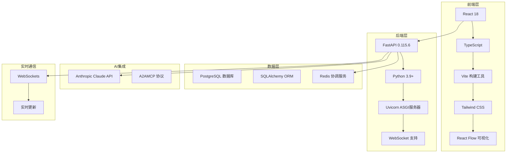
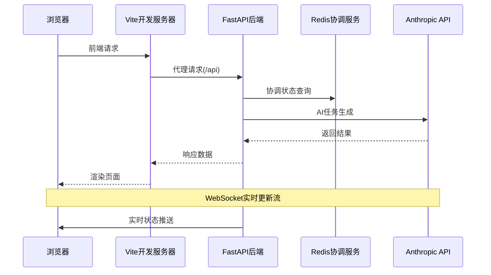
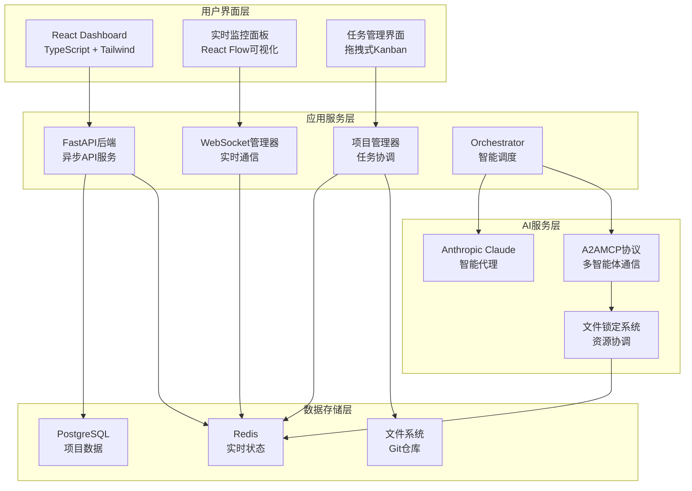
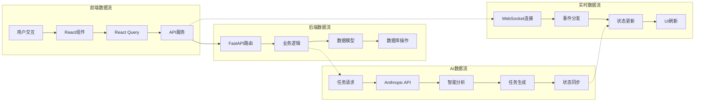
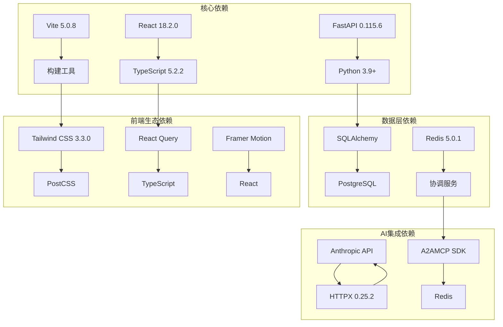

# 技术栈

<cite>
**本文档中引用的文件**
- [main.py](file://dashboard/backend/main.py)
- [package.json](file://dashboard/frontend/package.json)
- [requirements.txt](file://requirements.txt)
- [setup.py](file://setup.py)
- [vite.config.ts](file://dashboard/frontend/vite.config.ts)
- [tailwind.config.js](file://dashboard/frontend/tailwind.config.js)
- [websocket.ts](file://dashboard/frontend/src/services/websocket.ts)
- [models.py](file://dashboard/backend/models.py)
- [Readme.md](file://Readme.md)
</cite>

## 目录
1. [项目概述](#项目概述)
2. [技术栈全景](#技术栈全景)
3. [后端技术栈](#后端技术栈)
4. [前端技术栈](#前端技术栈)
5. [基础设施与服务](#基础设施与服务)
6. [技术选型分析](#技术选型分析)
7. [架构图解](#架构图解)
8. [依赖关系分析](#依赖关系分析)
9. [总结](#总结)

## 项目概述

SplitMind是一个企业级多智能体AI开发平台，采用现代化全栈技术架构，支持实时协作和智能任务编排。项目通过FastAPI构建高性能后端，React + TypeScript打造现代化前端界面，结合Redis实现实时协调服务，集成Anthropic AI提供智能代理能力。

## 技术栈全景

**图表来源**
- [main.py](file://dashboard/backend/main.py#L1-L56)
- [package.json](file://dashboard/frontend/package.json#L1-L54)
- [requirements.txt](file://requirements.txt#L1-L31)

## 后端技术栈

### 核心框架与语言

**FastAPI 0.115.6**
- 基于Python 3.9+的现代Web框架
- 异步优先的设计理念
- 自动生成OpenAPI文档
- 高性能HTTP服务器支持

**Python 3.9+**
- 现代Python语法特性
- 类型提示支持
- 异步编程原生支持

**Uvicorn ASGI服务器**
- 高性能ASGI服务器
- 支持WebSocket协议
- 生产环境部署优化

### 数据持久化

**SQLAlchemy ORM**
- 对象关系映射框架
- 类型安全的数据操作
- 支持多种数据库后端

**PostgreSQL数据库**
- 企业级关系数据库
- ACID事务保证
- 复杂查询支持

### 实时通信

**WebSocket支持**
- 实时双向通信
- 心跳机制维护连接
- 自动重连机制

**WebSockets 14.2**
- 异步WebSocket客户端
- 连接池管理
- 错误处理机制

### AI集成

**Anthropic API**
- Claude AI模型集成
- 支持多种Claude模型
- 安全的API密钥管理

**HTTPX 0.25.2**
- 现代HTTP客户端
- 异步请求支持
- 流式响应处理

### 协调服务

**Redis 5.0.1**
- 内存数据库存储
- 发布订阅模式
- 分布式锁支持

**A2AMCP SDK**
- 多智能体通信协议
- 实时状态同步
- 文件锁定机制

### 开发工具

**Pydantic 2.10.4**
- 数据验证和设置管理
- 类型转换和序列化
- 自动生成错误消息

**可选开发依赖**
- pytest 8.4.0：测试框架
- black 25.1.0：代码格式化
- ruff 0.11.12：代码检查

**节来源**
- [main.py](file://dashboard/backend/main.py#L1-L56)
- [requirements.txt](file://requirements.txt#L1-L31)
- [models.py](file://dashboard/backend/models.py#L1-L135)

## 前端技术栈

### 核心框架与语言

**React 18.2.0**
- 组件化UI开发
- 状态管理和生命周期
- 并发特性和性能优化

**TypeScript 5.2.2**
- 类型安全的JavaScript
- 编译时类型检查
- 优秀的IDE支持

### 构建工具

**Vite 5.0.8**
- 现代化的前端构建工具
- 快速热模块替换(HMR)
- ES模块原生支持

**配置特点**
- 别名路径支持（@指向src目录）
- 开发服务器代理配置
- 自动环境变量加载

### 样式系统

**Tailwind CSS 3.3.0**
- 原子化CSS框架
- 响应式设计支持
- 自定义主题配置

**Tailwind配置亮点**
- 深色模式支持
- 自定义颜色方案
- 动画效果配置
- 背景图案定制

### 状态管理

**@tanstack/react-query 5.12.2**
- React状态管理
- 服务端状态同步
- 缓存和乐观更新

### 动画与交互

**framer-motion 10.18.0**
- 高性能动画库
- 声明式动画API
- 物理动画效果

### 图标系统

**lucide-react 0.294.0**
- 现代矢量图标
- 组件化图标
- 主题适配支持

### UI组件库

**Radix UI 组件**
- 可访问性优先的组件
- 原子化设计原则
- 高度可定制

### 数据可视化

**Recharts 2.10.3**
- React图表库
- 响应式图表组件
- 丰富的图表类型

### 开发工具

**ESLint + TypeScript**
- 代码质量保证
- 自动代码修复
- 插件生态系统

**PostCSS**
- CSS后处理器
- 自动前缀添加
- 模块化CSS

**节来源**
- [package.json](file://dashboard/frontend/package.json#L1-L54)
- [vite.config.ts](file://dashboard/frontend/vite.config.ts#L1-L25)
- [tailwind.config.js](file://dashboard/frontend/tailwind.config.js#L1-L92)

## 基础设施与服务

### 实时通信架构

**图表来源**
- [websocket.ts](file://dashboard/frontend/src/services/websocket.ts#L1-L98)
- [vite.config.ts](file://dashboard/frontend/vite.config.ts#L14-L22)

### 代理配置

**开发环境代理设置**
- `/api` → `http://localhost:8000`（FastAPI后端）
- `/ws` → `ws://localhost:8000`（WebSocket连接）

### Docker容器化

**A2AMCP服务**
- Redis容器化部署
- MCP服务器运行
- 网络隔离和通信

**节来源**
- [vite.config.ts](file://dashboard/frontend/vite.config.ts#L14-L22)
- [websocket.ts](file://dashboard/frontend/src/services/websocket.ts#L1-L98)

## 技术选型分析

### FastAPI的异步性能优势

**核心优势**
- 基于Starlette的异步处理
- 自动OpenAPI文档生成
- Pydantic模型验证
- 内置WebSocket支持

**性能特点**
- 高并发连接处理
- 零拷贝数据传输
- 内存高效利用

### React Flow对DAG图的支持

**技术价值**
- 有向无环图(DAG)可视化
- 节点拖拽和连线编辑
- 实时布局计算
- 交互式图形渲染

**应用场景**
- 任务依赖关系展示
- 工作流程可视化
- 团队协作状态跟踪

### Tailwind的原子化CSS效率

**设计理念**
- 原子类命名系统
- 响应式设计内置
- JIT编译优化
- 自定义主题支持

**开发效率**
- 快速原型开发
- 减少CSS文件大小
- 维护成本低
- 团队协作友好

### Redis协调服务的价值

**功能特性**
- 实时状态共享
- 分布式锁机制
- 发布订阅模式
- 内存高性能存储

**业务价值**
- 多智能体状态同步
- 文件资源冲突预防
- 实时通信通道
- 故障恢复机制

### Anthropic AI集成的战略意义

**技术优势**
- 强大的自然语言理解
- 代码生成和分析能力
- 上下文记忆功能
- 安全的API接口

**业务应用**
- 智能任务分解
- 代码审查辅助
- 开发策略规划
- 实时问题解决

## 架构图解

### 系统整体架构

**图表来源**
- [main.py](file://dashboard/backend/main.py#L34-L56)
- [models.py](file://dashboard/backend/models.py#L1-L135)
- [Readme.md](file://Readme.md#L142-L190)

### 数据流架构

**图表来源**
- [websocket.ts](file://dashboard/frontend/src/services/websocket.ts#L1-L98)
- [models.py](file://dashboard/backend/models.py#L19-L61)

## 依赖关系分析

### 关键依赖层次结构

**图表来源**
- [requirements.txt](file://requirements.txt#L1-L31)
- [package.json](file://dashboard/frontend/package.json#L1-L54)

### 版本兼容性矩阵

| 组件类别 | 组件名称 | 版本要求 | 兼容性说明 |
|---------|---------|---------|-----------|
| 后端框架 | FastAPI | 0.115.6 | 支持Python 3.9+ |
| 后端服务器 | Uvicorn | 0.34.0 | ASGI标准兼容 |
| 前端框架 | React | 18.2.0 | TypeScript支持 |
| 构建工具 | Vite | 5.0.8 | 现代ES模块 |
| 样式框架 | Tailwind CSS | 3.3.0 | JIT编译优化 |
| WebSocket | websockets | 14.2 | 异步支持 |
| AI集成 | Anthropic | ≥0.39.0 | API密钥认证 |

**节来源**
- [requirements.txt](file://requirements.txt#L4-L19)
- [package.json](file://dashboard/frontend/package.json#L31-L35)

## 总结

SplitMind项目采用了业界领先的技术栈组合，形成了一个完整的企业级AI开发平台解决方案：

### 技术优势

1. **高性能后端**：FastAPI + Python 3.9+提供了卓越的异步处理能力和API性能
2. **现代化前端**：React 18 + TypeScript确保了类型安全和开发体验
3. **实时协作**：WebSocket + Redis架构实现了真正的实时状态同步
4. **智能集成**：Anthropic AI API为项目注入了强大的AI能力
5. **工程化实践**：完善的构建工具链和开发规范保证了项目的可维护性

### 架构特色

- **微服务化设计**：前后端分离，各司其职
- **事件驱动架构**：基于WebSocket的实时通信
- **状态管理优化**：React Query + WebSocket的双重保障
- **AI原生集成**：从设计到实现都考虑了AI能力的深度整合

### 扩展性考虑

该技术栈具有良好的扩展性：
- 新增API端点可通过FastAPI轻松实现
- 前端组件可按需引入新的React库
- Redis集群可水平扩展以支持更大规模的并发
- Anthropic API可根据需求切换不同模型

这种技术栈选择不仅满足了当前的功能需求，也为未来的功能扩展和性能优化奠定了坚实的基础。