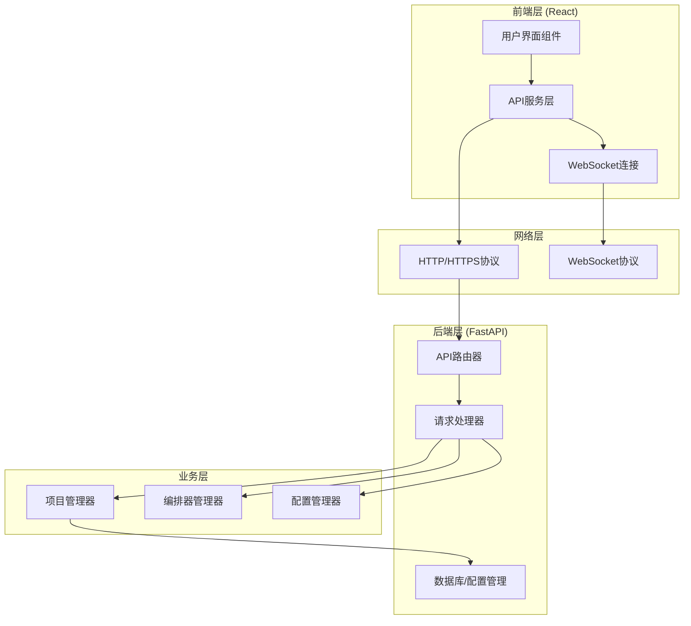
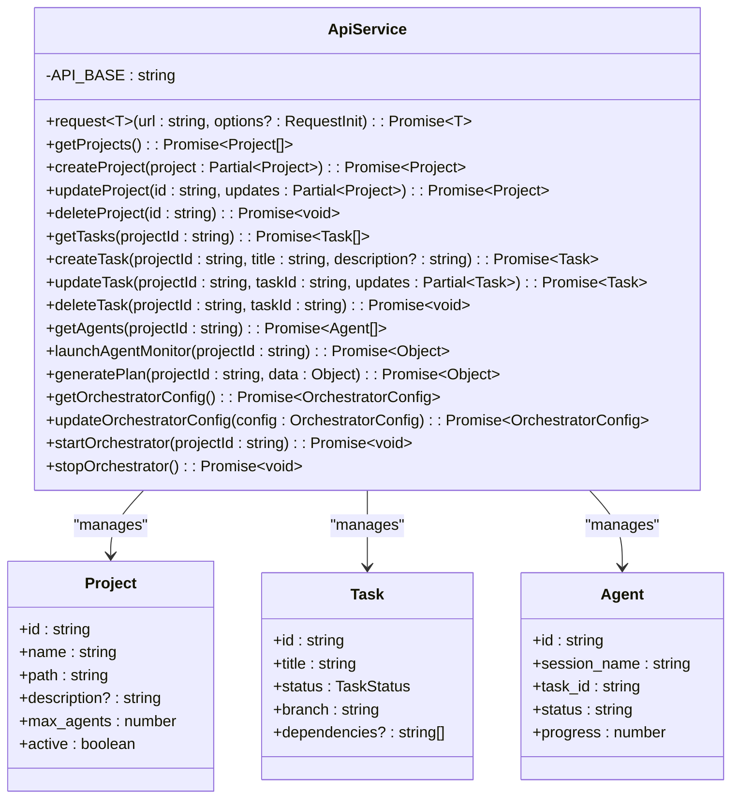
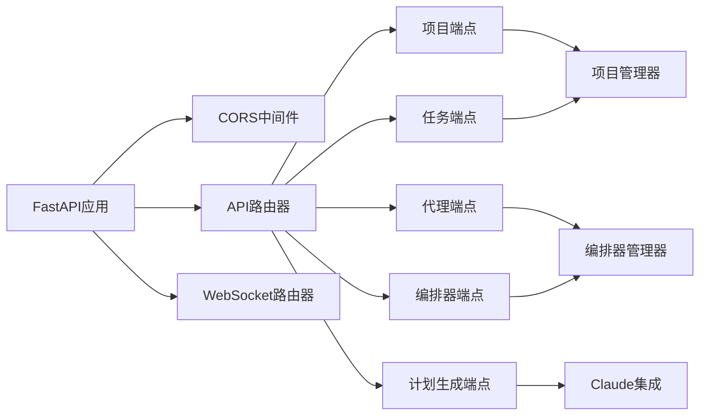
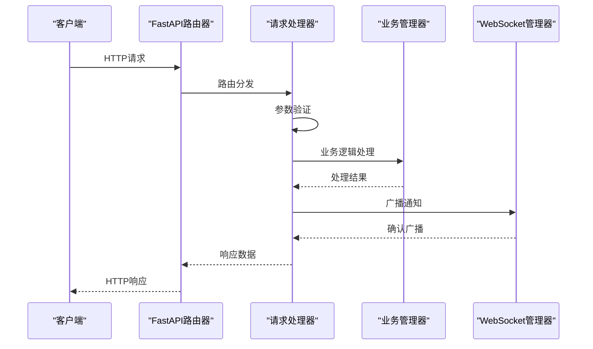
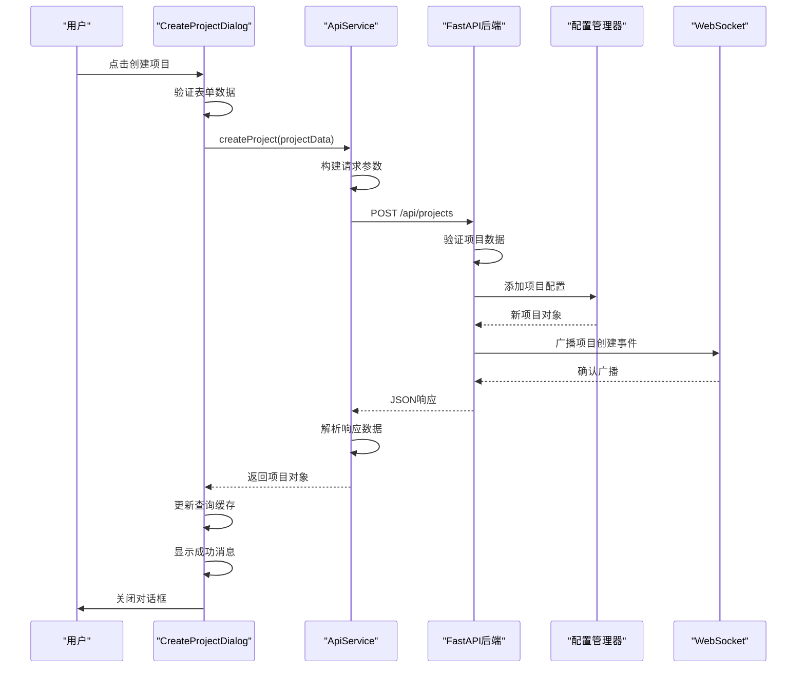
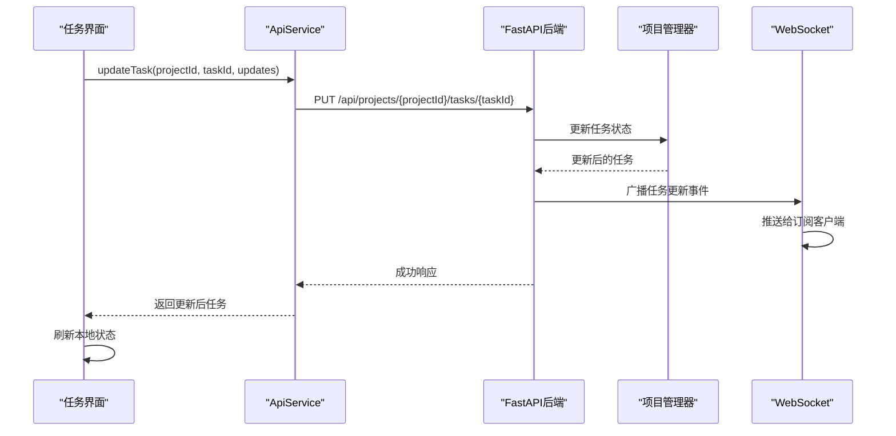
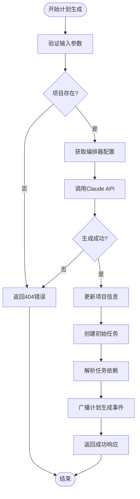
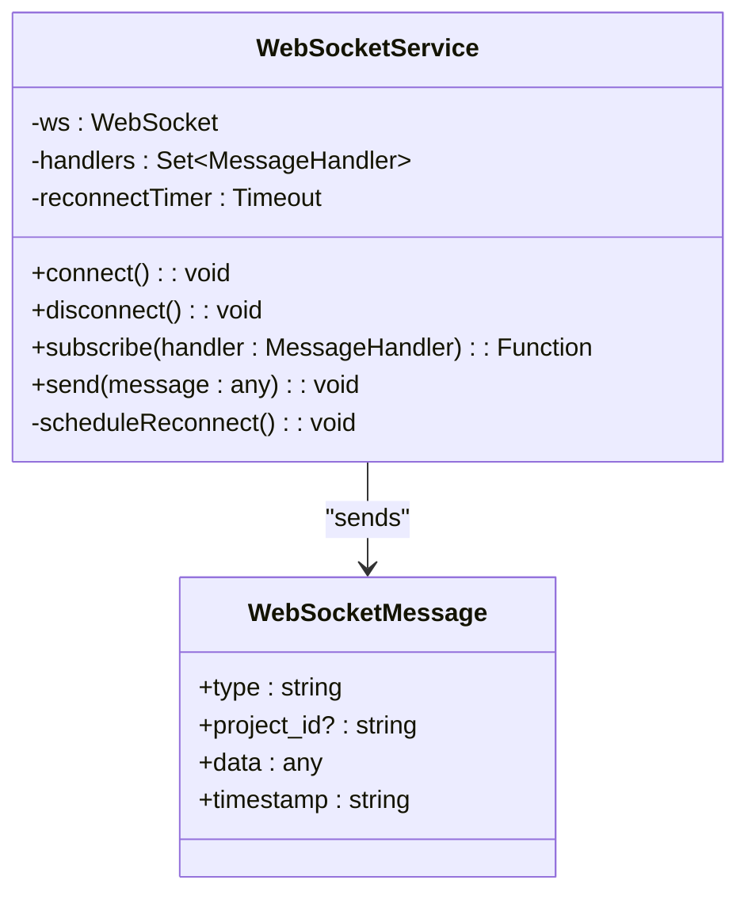

# REST API 数据流

<cite>
**本文档引用的文件**
- [api.ts](file://dashboard/frontend/src/services/api.ts)
- [main.py](file://dashboard/backend/main.py)
- [api.py](file://dashboard/backend/api.py)
- [CreateProjectDialog.tsx](file://dashboard/frontend/src/components/CreateProjectDialog.tsx)
- [useWebSocket.ts](file://dashboard/frontend/src/hooks/useWebSocket.ts)
- [websocket.ts](file://dashboard/frontend/src/services/websocket.ts)
- [index.ts](file://dashboard/frontend/src/types/index.ts)
</cite>

## 目录
1. [简介](#简介)
2. [系统架构概览](#系统架构概览)
3. [前端API服务层分析](#前端api服务层分析)
4. [后端API路由层分析](#后端api路由层分析)
5. [请求-响应数据流详解](#请求-响应数据流详解)
6. [错误处理机制](#错误处理机制)
7. [实时通信机制](#实时通信机制)
8. [API版本控制与认证](#api版本控制与认证)
9. [性能优化建议](#性能优化建议)
10. [故障排除指南](#故障排除指南)

## 简介

TaskTree系统采用前后端分离架构，通过REST API实现前端React应用与Python FastAPI后端之间的数据交互。该系统提供了完整的项目管理、任务协作、AI代理协调等功能，支持实时更新和异步操作。

## 系统架构概览



**图表来源**
- [main.py](file://dashboard/backend/main.py#L34-L56)
- [api.ts](file://dashboard/frontend/src/services/api.ts#L3-L248)

## 前端API服务层分析

### ApiService类设计

前端API服务层通过`ApiService`类封装了统一的请求处理机制，提供了类型安全的API调用接口。



**图表来源**
- [api.ts](file://dashboard/frontend/src/services/api.ts#L5-L248)
- [index.ts](file://dashboard/frontend/src/types/index.ts#L1-L84)

### 统一请求处理机制

`request`方法是所有API调用的核心，实现了以下功能：

1. **URL构建**: 自动添加API基础路径
2. **请求头设置**: 默认设置`Content-Type: application/json`
3. **错误处理**: 检查HTTP状态码并解析错误响应
4. **JSON解析**: 安全地解析服务器返回的JSON数据

**章节来源**
- [api.ts](file://dashboard/frontend/src/services/api.ts#L5-L27)

### 关键API方法分析

#### 项目管理API

| 方法名 | HTTP方法 | 端点 | 功能描述 |
|--------|----------|------|----------|
| `getProjects` | GET | `/api/projects` | 获取所有项目列表 |
| `createProject` | POST | `/api/projects` | 创建新项目 |
| `updateProject` | PUT | `/api/projects/{id}` | 更新项目信息 |
| `deleteProject` | DELETE | `/api/projects/{id}` | 删除项目 |

#### 任务管理API

| 方法名 | HTTP方法 | 端点 | 功能描述 |
|--------|----------|------|----------|
| `getTasks` | GET | `/api/projects/{projectId}/tasks` | 获取项目任务列表 |
| `createTask` | POST | `/api/projects/{projectId}/tasks` | 创建新任务 |
| `updateTask` | PUT | `/api/projects/{projectId}/tasks/{taskId}` | 更新任务状态 |
| `deleteTask` | DELETE | `/api/projects/{projectId}/tasks/{taskId}` | 删除任务 |

#### AI代理API

| 方法名 | HTTP方法 | 端点 | 功能描述 |
|--------|----------|------|----------|
| `generatePlan` | POST | `/api/projects/{projectId}/generate-plan` | 生成项目计划 |
| `generateTaskBreakdown` | POST | `/api/projects/{projectId}/generate-task-breakdown` | 生成任务分解 |
| `startOrchestrator` | POST | `/api/orchestrator/start` | 启动编排器 |
| `stopOrchestrator` | POST | `/api/orchestrator/stop` | 停止编排器 |

**章节来源**
- [api.ts](file://dashboard/frontend/src/services/api.ts#L29-L248)

## 后端API路由层分析

### FastAPI应用配置

后端使用FastAPI框架构建REST API，支持异步操作和自动API文档生成功能。



**图表来源**
- [main.py](file://dashboard/backend/main.py#L34-L56)
- [api.py](file://dashboard/backend/api.py#L1-L100)

### 核心路由结构

后端API采用模块化路由设计，主要包含以下端点组：

1. **项目管理端点** (`/api/projects`)
2. **任务管理端点** (`/api/projects/{projectId}/tasks`)
3. **代理管理端点** (`/api/projects/{projectId}/agents`)
4. **编排器控制端点** (`/api/orchestrator`)
5. **计划生成端点** (`/api/projects/{projectId}/generate-plan`)
6. **文件系统端点** (`/api/filesystem`)
7. **MCP诊断端点** (`/api/mcp`)

**章节来源**
- [api.py](file://dashboard/backend/api.py#L90-L1661)

### 请求处理流程



**图表来源**
- [api.py](file://dashboard/backend/api.py#L94-L135)
- [api.py](file://dashboard/backend/api.py#L388-L405)

## 请求-响应数据流详解

### 典型项目创建流程

以下是创建项目的完整请求-响应数据流：



**图表来源**
- [CreateProjectDialog.tsx](file://dashboard/frontend/src/components/CreateProjectDialog.tsx#L33-L66)
- [api.ts](file://dashboard/frontend/src/services/api.ts#L41-L47)
- [api.py](file://dashboard/backend/api.py#L101-L135)

### 任务状态更新流程

任务状态更新展示了实时通知机制：



**图表来源**
- [api.ts](file://dashboard/frontend/src/services/api.ts#L78-L84)
- [api.py](file://dashboard/backend/api.py#L409-L432)

### AI计划生成流程

AI计划生成展示了复杂的异步处理流程：



**图表来源**
- [api.py](file://dashboard/backend/api.py#L810-L928)

**章节来源**
- [CreateProjectDialog.tsx](file://dashboard/frontend/src/components/CreateProjectDialog.tsx#L33-L66)
- [api.ts](file://dashboard/frontend/src/services/api.ts#L41-L47)
- [api.py](file://dashboard/backend/api.py#L810-L928)

## 错误处理机制

### 前端错误处理

前端API服务实现了多层次的错误处理：

1. **HTTP状态码检查**: 检查响应状态是否为2xx
2. **JSON解析错误**: 捕获并处理JSON解析异常
3. **自定义错误消息**: 提取服务器返回的详细错误信息

```typescript
// 错误处理示例
if (!response.ok) {
  const error = await response.json().catch(() => ({ detail: 'Unknown error' }));
  throw new Error(error.detail || `HTTP ${response.status}`);
}
```

### 后端错误处理

后端使用FastAPI的HTTPException机制：

1. **400 Bad Request**: 参数验证失败
2. **404 Not Found**: 资源不存在
3. **500 Internal Server Error**: 内部服务器错误

```python
# 错误处理示例
try:
    project = config_manager.get_project(project_id)
    if not project:
        raise HTTPException(status_code=404, detail="Project not found")
except ValueError as e:
    raise HTTPException(status_code=400, detail=str(e))
```

**章节来源**
- [api.ts](file://dashboard/frontend/src/services/api.ts#L15-L26)
- [api.py](file://dashboard/backend/api.py#L111-L135)

## 实时通信机制

### WebSocket连接管理

系统使用WebSocket实现实时更新，支持以下功能：

1. **连接管理**: 自动重连机制
2. **消息广播**: 向所有订阅客户端发送更新
3. **事件类型**: 支持多种事件类型（任务更新、项目变更等）



**图表来源**
- [websocket.ts](file://dashboard/frontend/src/services/websocket.ts#L5-L98)
- [index.ts](file://dashboard/frontend/src/types/index.ts#L78-L84)

### 实时事件类型

| 事件类型 | 描述 | 数据格式 |
|----------|------|----------|
| `project_created` | 项目创建 | `{project_id, data}` |
| `project_updated` | 项目更新 | `{project_id, data}` |
| `project_deleted` | 项目删除 | `{project_id, cleanup_performed}` |
| `task_created` | 任务创建 | `{project_id, data}` |
| `task_updated` | 任务更新 | `{project_id, data}` |
| `task_deleted` | 任务删除 | `{project_id, task_id}` |
| `task_merged` | 任务合并 | `{project_id, task_id, branch}` |

**章节来源**
- [websocket.ts](file://dashboard/frontend/src/services/websocket.ts#L1-L98)
- [api.py](file://dashboard/backend/api.py#L125-L130)

## API版本控制与认证

### 版本控制策略

当前系统采用无版本前缀的设计：

- **URL模式**: `/api/{endpoint}`
- **版本管理**: 在FastAPI应用级别定义版本号
- **向后兼容**: 保持现有API接口不变

```python
# 版本控制配置
app = FastAPI(
    title="SplitMind Command Center",
    version="1.0.0",
    lifespan=lifespan
)
```

### 认证机制

目前系统暂未实现认证机制，但预留了扩展空间：

1. **认证中间件**: 可通过FastAPI中间件添加
2. **令牌验证**: 支持JWT或其他令牌机制
3. **权限控制**: 基于角色的访问控制(RBAC)

**章节来源**
- [main.py](file://dashboard/backend/main.py#L34-L38)
- [api.py](file://dashboard/backend/api.py#L80-L87)

## 性能优化建议

### 请求缓存策略

1. **查询结果缓存**: 缓存频繁访问的项目和任务数据
2. **响应时间优化**: 使用异步处理减少阻塞
3. **批量操作支持**: 批量创建/更新任务

### WebSocket优化

1. **连接池管理**: 复用WebSocket连接
2. **消息压缩**: 对大型消息进行压缩传输
3. **心跳检测**: 维护长连接的活跃状态

### 数据库优化

1. **索引优化**: 为常用查询字段建立索引
2. **连接池**: 使用数据库连接池
3. **查询优化**: 避免N+1查询问题

## 故障排除指南

### 常见问题及解决方案

#### 前端API调用失败

1. **检查网络连接**: 确保前端能够访问后端API
2. **验证CORS配置**: 检查跨域资源共享设置
3. **查看浏览器控制台**: 检查具体的错误信息

#### 后端API响应异常

1. **检查日志输出**: 查看FastAPI应用日志
2. **验证数据库连接**: 确保配置管理器正常工作
3. **测试依赖服务**: 验证AI服务和外部工具可用性

#### WebSocket连接问题

1. **检查协议支持**: 确保浏览器支持WebSocket
2. **验证防火墙设置**: 检查WebSocket端口是否开放
3. **监控连接状态**: 使用开发者工具查看连接状态

**章节来源**
- [main.py](file://dashboard/backend/main.py#L80-L87)
- [websocket.ts](file://dashboard/frontend/src/services/websocket.ts#L13-L47)

## 结论

TaskTree系统的REST API设计体现了现代Web应用的最佳实践，通过前后端分离架构实现了良好的可维护性和扩展性。统一的请求处理机制、完善的错误处理、实时通信支持以及灵活的业务逻辑抽象，为复杂AI协作场景提供了坚实的技术基础。