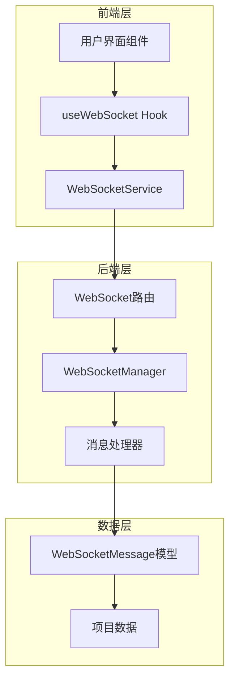
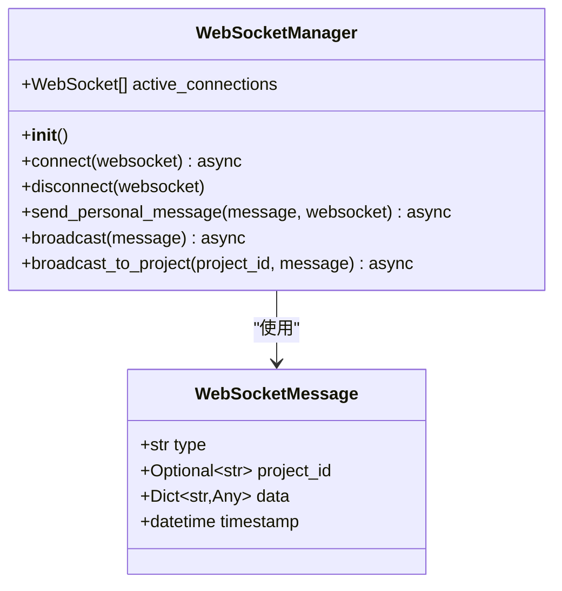
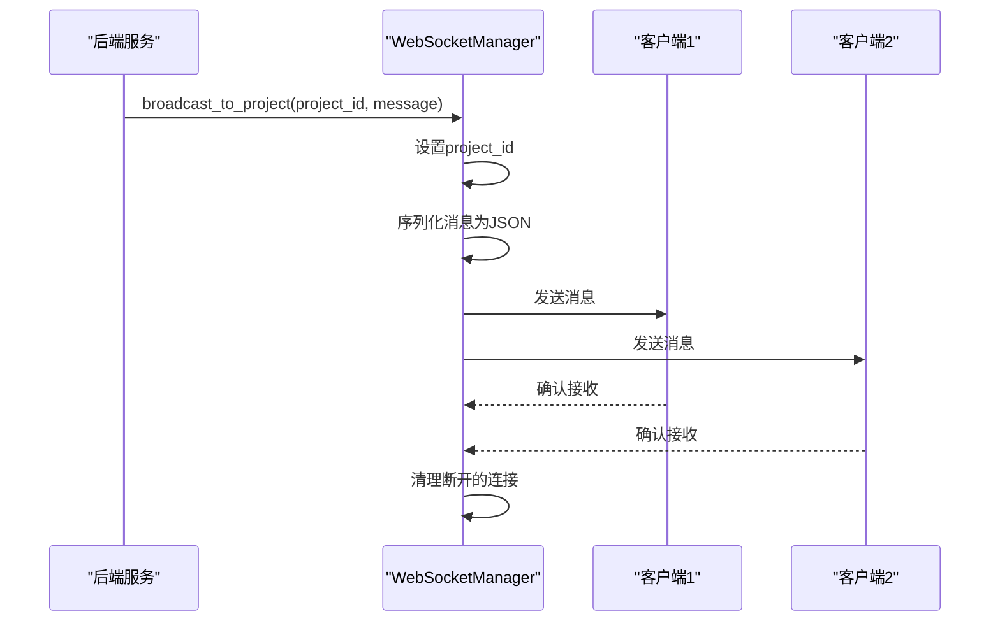
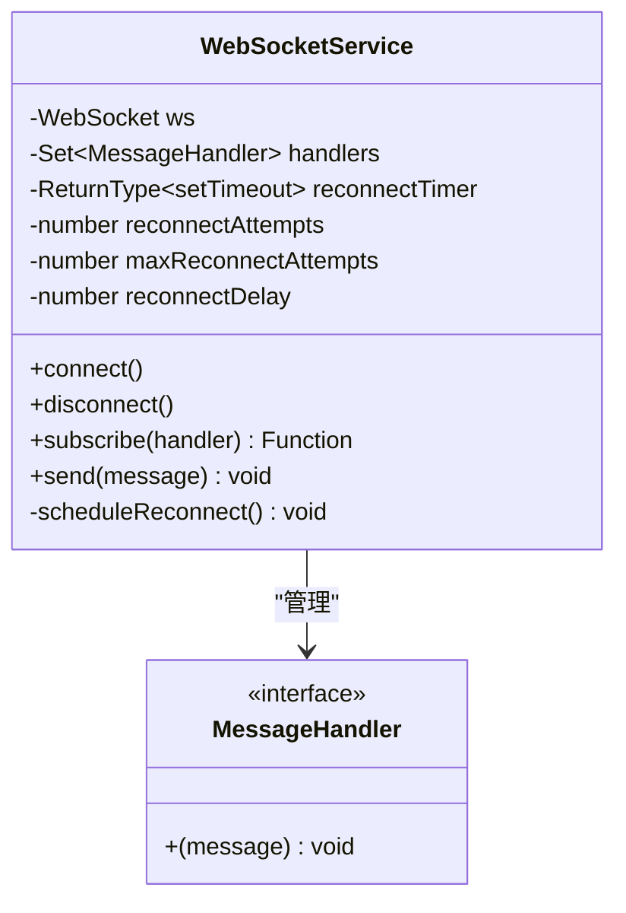
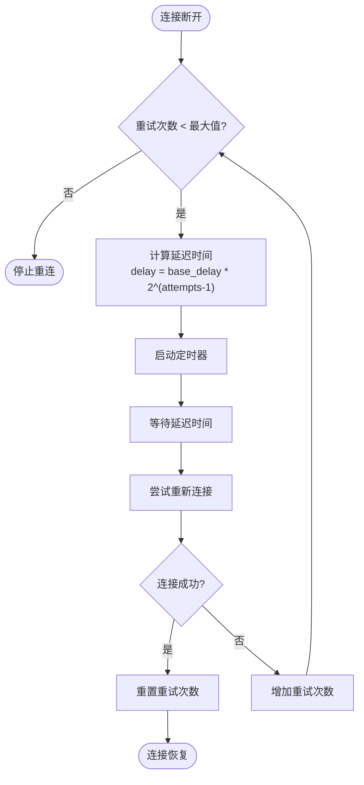
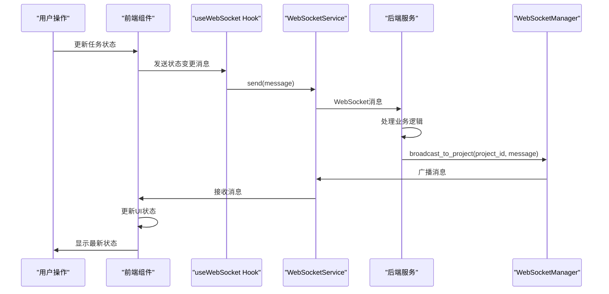
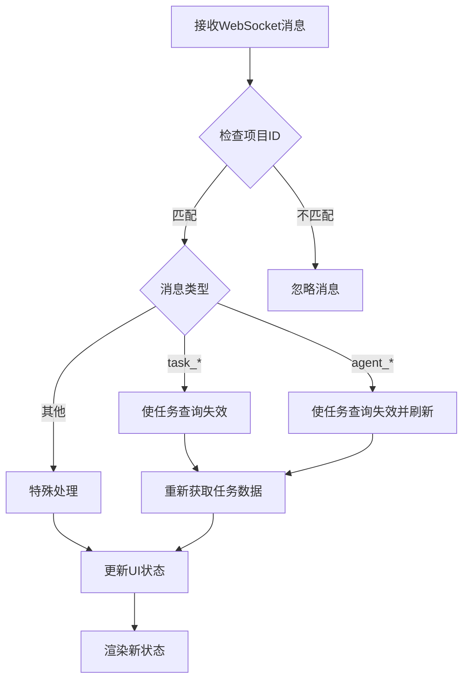

# WebSocket 实时通信流

<cite>
**本文档中引用的文件**
- [websocket_manager.py](file://dashboard/backend/websocket_manager.py)
- [websocket.ts](file://dashboard/frontend/src/services/websocket.ts)
- [useWebSocket.ts](file://dashboard/frontend/src/hooks/useWebSocket.ts)
- [index.ts](file://dashboard/frontend/src/types/index.ts)
- [models.py](file://dashboard/backend/models.py)
- [api.py](file://dashboard/backend/api.py)
- [TaskBoard.tsx](file://dashboard/frontend/src/components/TaskBoard.tsx)
- [App.tsx](file://dashboard/frontend/src/App.tsx)
</cite>

## 目录
1. [简介](#简介)
2. [系统架构概览](#系统架构概览)
3. [后端WebSocket管理器](#后端websocket管理器)
4. [前端WebSocket服务](#前端websocket服务)
5. [消息格式与类型](#消息格式与类型)
6. [实时通信链路](#实时通信链路)
7. [连接状态管理](#连接状态管理)
8. [性能优化与最佳实践](#性能优化与最佳实践)
9. [故障排除指南](#故障排除指南)
10. [总结](#总结)

## 简介

TaskTree系统采用WebSocket技术实现实时通信，为用户提供即时的任务状态更新、代理状态监控和项目进度反馈。该系统通过后端的WebSocketManager类和前端的WebSocketService组件，构建了一个高效、可靠的实时通信架构。

## 系统架构概览

TaskTree的WebSocket实时通信系统采用客户端-服务器架构，支持多项目并发通信和智能消息路由。

**图表来源**
- [websocket_manager.py](file://dashboard/backend/websocket_manager.py#L10-L55)
- [websocket.ts](file://dashboard/frontend/src/services/websocket.ts#L5-L98)
- [useWebSocket.ts](file://dashboard/frontend/src/hooks/useWebSocket.ts#L5-L24)

## 后端WebSocket管理器

### WebSocketManager类设计

WebSocketManager是系统的核心组件，负责管理所有WebSocket连接和消息广播。

**图表来源**
- [websocket_manager.py](file://dashboard/backend/websocket_manager.py#L10-L55)
- [models.py](file://dashboard/backend/models.py#L129-L135)

### 连接管理机制

WebSocketManager提供了完整的连接生命周期管理：

#### 连接建立
- 接受新的WebSocket连接并存储到活跃连接列表
- 自动记录连接状态和数量统计
- 支持并发多连接处理

#### 连接断开
- 从活跃连接列表中移除断开的连接
- 清理资源并更新连接计数
- 提供优雅的断开处理

#### 异常处理
- 检测并移除已断开的连接
- 防止因单个连接问题影响整体服务
- 自动清理无效连接

**章节来源**
- [websocket_manager.py](file://dashboard/backend/websocket_manager.py#L16-L26)

### 消息广播机制

#### 广播功能
WebSocketManager提供两种广播模式：

##### 全局广播
- 发送消息给所有活跃连接
- 自动检测并清理断开的连接
- 支持JSON序列化和错误处理

##### 项目级广播
- 将消息限制在特定项目范围内
- 自动设置project_id属性
- 提供更精确的消息路由

**图表来源**
- [websocket_manager.py](file://dashboard/backend/websocket_manager.py#L32-L55)

**章节来源**
- [websocket_manager.py](file://dashboard/backend/websocket_manager.py#L32-L55)

## 前端WebSocket服务

### WebSocketService架构

前端的WebSocketService提供了完整的WebSocket客户端功能，包括自动重连、消息订阅和异常恢复。

**图表来源**
- [websocket.ts](file://dashboard/frontend/src/services/websocket.ts#L5-L98)

### 自动重连机制

WebSocketService实现了智能重连策略，确保连接的稳定性：

#### 重连算法
- 指数退避重试：每次重试延迟翻倍
- 最大重试次数限制：防止无限重试
- 连接状态跟踪：避免重复启动重连

#### 重连流程
1. 检测连接断开或错误
2. 计算退避延迟时间
3. 启动定时器进行重连
4. 达到最大重试次数后停止

**图表来源**
- [websocket.ts](file://dashboard/frontend/src/services/websocket.ts#L50-L67)

### 消息订阅模式

WebSocketService采用发布-订阅模式管理消息处理：

#### 订阅机制
- 使用Set集合管理多个消息处理器
- 支持动态添加和移除订阅者
- 提供取消订阅的清理函数

#### 消息分发
- 接收WebSocket消息事件
- 解析JSON格式的消息内容
- 调用所有注册的处理器

**章节来源**
- [websocket.ts](file://dashboard/frontend/src/services/websocket.ts#L50-L98)

## 消息格式与类型

### WebSocketMessage结构

系统定义了统一的消息格式，确保前后端通信的一致性。

| 字段名 | 类型 | 必需 | 描述 |
|--------|------|------|------|
| type | string | 是 | 消息类型标识符 |
| project_id | string? | 否 | 关联的项目ID |
| data | object | 是 | 消息载荷数据 |
| timestamp | datetime | 是 | 消息发送时间戳 |

### 消息类型分类

#### 任务相关消息
- `task_created`: 任务创建通知
- `task_updated`: 任务更新通知  
- `task_deleted`: 任务删除通知
- `task_status_changed`: 任务状态变更
- `tasks_reset`: 任务重置通知

#### 代理相关消息
- `agent_spawned`: 代理启动通知
- `agent_status_update`: 代理状态更新
- `agent_messages`: 代理间消息传递

#### 协调相关消息
- `coordination_update`: 协调状态更新
- `file_locks_update`: 文件锁状态变更
- `plan_generated`: 计划生成完成

#### 系统消息
- `log`: 系统日志输出
- `notification`: 系统通知

**章节来源**
- [models.py](file://dashboard/backend/models.py#L129-L135)
- [index.ts](file://dashboard/frontend/src/types/index.ts#L78-L83)

## 实时通信链路

### 完整通信流程

以下是TaskTree系统中任务状态变更的完整实时通信链路：

**图表来源**
- [useWebSocket.ts](file://dashboard/frontend/src/hooks/useWebSocket.ts#L19-L21)
- [websocket.ts](file://dashboard/frontend/src/services/websocket.ts#L88-L94)
- [websocket_manager.py](file://dashboard/backend/websocket_manager.py#L52-L55)

### 前端响应机制

#### TaskBoard组件示例
TaskBoard组件展示了如何处理不同类型的任务相关消息：

**图表来源**
- [TaskBoard.tsx](file://dashboard/frontend/src/components/TaskBoard.tsx#L35-L52)

### 消息处理策略

#### 消息过滤
- 基于project_id进行消息过滤
- 只处理当前项目相关的消息
- 避免不必要的数据刷新

#### 数据同步
- 使用React Query的invalidateQueries进行数据同步
- 支持增量更新和全量刷新
- 维护数据一致性

**章节来源**
- [TaskBoard.tsx](file://dashboard/frontend/src/components/TaskBoard.tsx#L35-L52)
- [App.tsx](file://dashboard/frontend/src/App.tsx#L41-L47)

## 连接状态管理

### 前端连接状态

前端通过WebSocketService管理连接状态，并提供状态反馈：

#### 连接状态跟踪
- 当前连接状态（OPEN/CLOSED）
- 重连尝试次数
- 最近连接时间

#### 状态通知
- 连接建立时的日志记录
- 断开时的自动重连触发
- 错误状态的详细日志

### 后端连接管理

#### 连接池管理
- 动态维护活跃连接列表
- 自动清理断开的连接
- 连接数量统计和监控

#### 性能监控
- 连接建立和断开的计数
- 消息广播的性能指标
- 异常连接的识别和处理

**章节来源**
- [websocket.ts](file://dashboard/frontend/src/services/websocket.ts#L22-L43)
- [websocket_manager.py](file://dashboard/backend/websocket_manager.py#L16-L26)

### 心跳机制缺失风险

当前系统缺少显式的心跳机制，存在以下风险：

#### 连接检测风险
- 无法及时发现网络中断
- 可能导致僵尸连接占用资源
- 影响消息投递的可靠性

#### 性能影响
- 大量无效连接可能影响服务器性能
- 内存泄漏风险
- 资源浪费问题

#### 解决方案建议
- 实现定期心跳消息
- 设置连接超时检测
- 添加连接健康检查

## 性能优化与最佳实践

### 后端优化策略

#### 连接管理优化
- 批量处理消息广播
- 连接池大小限制
- 异步消息处理

#### 内存管理
- 及时清理断开的连接
- 控制消息队列长度
- 监控内存使用情况

### 前端优化策略

#### 消息处理优化
- 消息去重和合并
- 批量UI更新
- 防抖和节流处理

#### 资源管理
- 及时清理订阅
- 避免内存泄漏
- 优化重连策略

### 最佳实践建议

#### 消息设计
- 使用语义化的消息类型
- 保持消息结构简洁
- 提供充分的错误处理

#### 连接管理
- 实现优雅的断开处理
- 设置合理的重连间隔
- 监控连接质量

#### 安全考虑
- 验证消息来源
- 限制消息频率
- 实施访问控制

## 故障排除指南

### 常见问题诊断

#### 连接问题
- **症状**: WebSocket连接失败
- **原因**: 网络问题、防火墙阻拦、协议不匹配
- **解决方案**: 检查网络连接、验证URL格式、确认协议版本

#### 消息丢失
- **症状**: 任务状态更新不及时
- **原因**: 消息过滤错误、订阅未正确建立
- **解决方案**: 检查project_id匹配、验证消息订阅

#### 性能问题
- **症状**: 界面响应缓慢
- **原因**: 频繁的数据刷新、消息处理过载
- **解决方案**: 优化查询策略、减少不必要的刷新

### 调试工具

#### 日志记录
- 启用详细的WebSocket日志
- 记录消息发送和接收时间
- 监控连接状态变化

#### 性能监控
- 监控连接数量和消息频率
- 分析消息处理延迟
- 跟踪内存使用情况

**章节来源**
- [websocket.ts](file://dashboard/frontend/src/services/websocket.ts#L32-L33)
- [websocket_manager.py](file://dashboard/backend/websocket_manager.py#L43-L46)

## 总结

TaskTree系统的WebSocket实时通信机制通过精心设计的架构，实现了高效、可靠的实时数据传输。后端的WebSocketManager提供了完整的连接管理和消息广播功能，而前端的WebSocketService则实现了智能的自动重连和消息订阅机制。

### 系统优势
- **高可靠性**: 智能重连机制确保连接稳定性
- **高性能**: 异步处理和连接池管理提升性能
- **可扩展性**: 模块化设计支持功能扩展
- **易维护**: 清晰的代码结构便于维护和调试

### 改进建议
- 实现心跳机制以提高连接可靠性
- 添加消息确认机制确保消息送达
- 优化消息压缩以减少带宽使用
- 增强安全机制防止恶意连接

通过持续的优化和改进，TaskTree的WebSocket实时通信系统将继续为用户提供优质的实时协作体验。