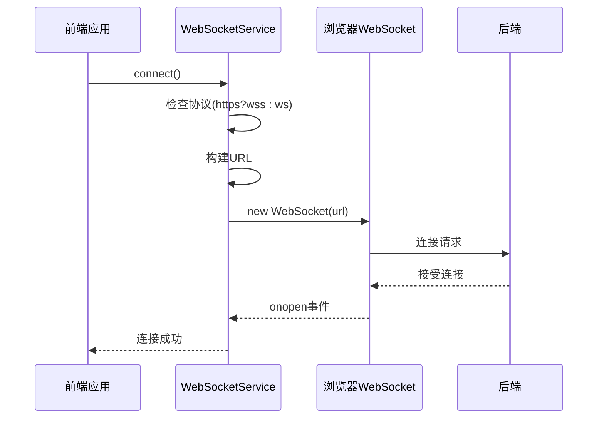
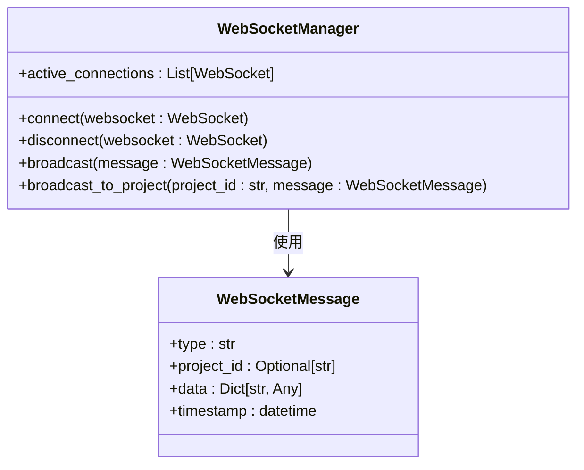
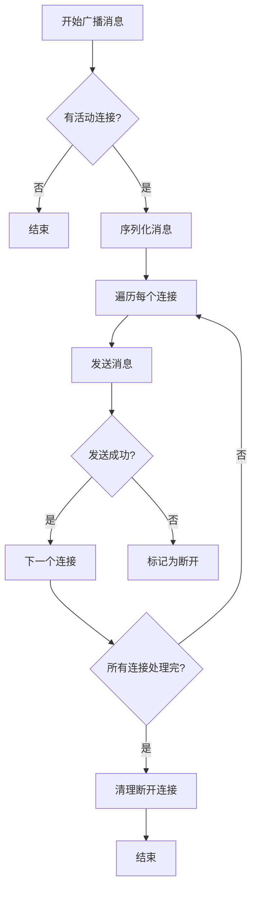
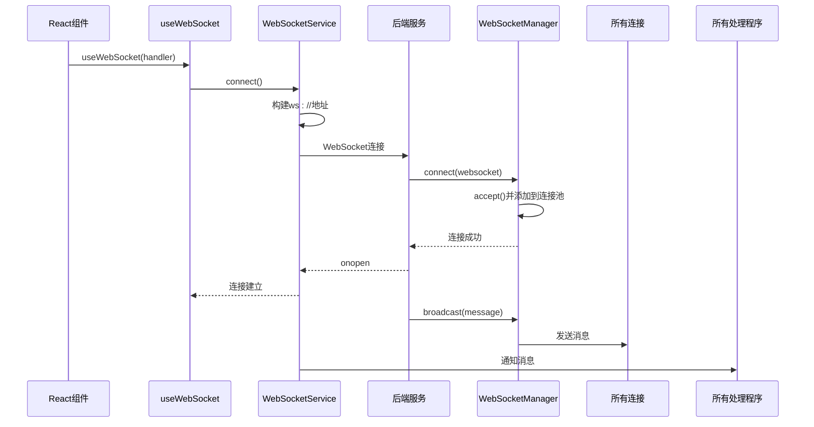

# WebSocket 连接管理

<cite>
**本文档中引用的文件**
- [websocket.ts](file://dashboard/frontend/src/services/websocket.ts)
- [websocket_manager.py](file://dashboard/backend/websocket_manager.py)
- [useWebSocket.ts](file://dashboard/frontend/src/hooks/useWebSocket.ts)
- [api.py](file://dashboard/backend/api.py)
- [main.py](file://dashboard/backend/main.py)
- [vite.config.ts](file://dashboard/frontend/vite.config.ts)
</cite>

## 目录
1. [引言](#引言)
2. [前端连接建立机制](#前端连接建立机制)
3. [后端连接管理逻辑](#后端连接管理逻辑)
4. [连接池管理与资源清理](#连接池管理与资源清理)
5. [自动重连机制](#自动重连机制)
6. [前后端连接交互流程](#前后端连接交互流程)
7. [连接泄漏风险与资源释放策略](#连接泄漏风险与资源释放策略)
8. [结论](#结论)

## 引言
TaskTree系统通过WebSocket实现前后端实时通信，支持任务状态更新、代理协调和项目监控等核心功能。本文档详细说明WebSocket连接的建立与断开机制，从前端WebSocketService的connect()方法入手，分析其如何根据当前页面协议动态构建连接地址，并结合后端WebSocketManager的连接池管理逻辑，全面解析连接生命周期管理。

**Section sources**
- [websocket.ts](file://dashboard/frontend/src/services/websocket.ts#L1-L97)
- [websocket_manager.py](file://dashboard/backend/websocket_manager.py#L1-L55)

## 前端连接建立机制
前端WebSocket连接的建立始于WebSocketService类的connect()方法。该方法首先检查当前连接状态，避免重复建立已打开的连接。连接地址的构建采用动态协议匹配策略：通过window.location.protocol判断当前页面使用的是https还是http协议，相应地选择wss或ws协议前缀，确保WebSocket连接协议与页面协议保持一致。

连接地址由协议、主机名和路径三部分组成，格式为`${protocol}//${window.location.host}/ws/updates`。这种设计实现了无缝的协议适配，无需在不同部署环境中修改配置。连接建立后，系统设置onopen、onmessage、onclose和onerror四个事件监听器，分别处理连接成功、消息接收、连接关闭和错误事件。



**Diagram sources**
- [websocket.ts](file://dashboard/frontend/src/services/websocket.ts#L13-L47)

**Section sources**
- [websocket.ts](file://dashboard/frontend/src/services/websocket.ts#L13-L47)
- [vite.config.ts](file://dashboard/frontend/vite.config.ts#L19-L22)

## 后端连接管理逻辑
后端WebSocketManager类负责管理所有活动连接。当WebSocket连接请求到达时，FastAPI的@websocket装饰器路由到websocket_endpoint处理函数，该函数调用WebSocketManager的connect()方法接受连接。connect()方法首先调用websocket.accept()完成WebSocket握手协议，然后将连接对象添加到active_connections列表中。

active_connections作为连接池的核心数据结构，存储所有当前活动的WebSocket连接。每次连接建立或断开时，系统都会打印连接总数日志，便于监控连接状态。disconnect()方法负责清理连接，从连接池中移除指定连接，并更新连接计数。这种集中式管理方式使得广播消息成为可能，系统可以向所有活动连接发送实时更新。



**Diagram sources**
- [websocket_manager.py](file://dashboard/backend/websocket_manager.py#L10-L55)
- [models.py](file://dashboard/backend/models.py#L129-L134)

**Section sources**
- [websocket_manager.py](file://dashboard/backend/websocket_manager.py#L16-L27)
- [api.py](file://dashboard/backend/api.py#L1217-L1227)

## 连接池管理与资源清理
WebSocketManager的active_connections列表作为连接池，采用列表数据结构存储WebSocket连接对象。这种设计简单高效，适合中小型应用的连接管理需求。当新连接建立时，connect()方法将其添加到列表末尾；当连接断开时，disconnect()方法从列表中移除该连接。

资源清理机制包含两个层面：主动清理和被动清理。主动清理发生在连接正常关闭时，通过disconnect()方法从连接池中移除连接。被动清理则在广播消息时进行：broadcast()方法遍历所有连接发送消息，捕获发送异常的连接，将其标记为已断开，并调用disconnect()方法进行清理。这种双重清理机制有效防止了连接泄漏。



**Diagram sources**
- [websocket_manager.py](file://dashboard/backend/websocket_manager.py#L32-L51)

**Section sources**
- [websocket_manager.py](file://dashboard/backend/websocket_manager.py#L32-L51)
- [api.py](file://dashboard/backend/api.py#L1222-L1227)

## 自动重连机制
前端WebSocketService实现了智能的自动重连机制，通过scheduleReconnect()方法实现指数退避算法。当连接断开或创建失败时，系统启动重连流程。重连延迟计算公式为：`delay = base_delay * 2^(attempt-1)`，其中基础延迟为1000毫秒，首次重连延迟1秒，第二次2秒，第三次4秒，以此类推。

该机制设置最大重连尝试次数（默认5次），防止无限重连消耗资源。每次成功连接后，reconnectAttempts计数器重置为0，确保网络恢复后的正常连接。重连定时器采用单例模式，避免多个定时器同时运行。这种指数退避策略平衡了快速恢复和服务器压力，网络短暂中断时能快速重连，持续故障时则逐渐降低重连频率。

```mermaid
flowchart TD
A[连接断开] --> B{重连次数 >= 最大值?}
B --> |是| C[停止重连]
B --> |否| D[增加重连次数]
D --> E[计算延迟时间]
E --> F[设置定时器]
F --> G[延迟期间]
G --> H[执行connect()]
H --> I{连接成功?}
I --> |是| J[重置重连次数]
I --> |否| K[再次scheduleReconnect]
```

**Diagram sources**
- [websocket.ts](file://dashboard/frontend/src/services/websocket.ts#L50-L67)

**Section sources**
- [websocket.ts](file://dashboard/frontend/src/services/websocket.ts#L50-L67)
- [useWebSocket.ts](file://dashboard/frontend/src/hooks/useWebSocket.ts#L8-L9)

## 前后端连接交互流程
WebSocket连接的完整交互流程从前端组件挂载开始。React组件通过useWebSocket钩子订阅WebSocket消息，钩子内部调用websocket.connect()发起连接。连接地址通过Vite的代理配置映射到后端服务，开发环境下/ws路径代理到ws://localhost:8000。

后端FastAPI应用通过main.py中的app.include_router(websocket_router)注册WebSocket路由。当连接请求到达/ws/updates端点时，websocket_endpoint函数调用WebSocketManager.connect()接受连接。连接建立后，后端可调用broadcast()方法向所有客户端推送WebSocketMessage格式的消息，前端onmessage事件处理程序解析JSON消息并通知所有订阅者。



**Diagram sources**
- [useWebSocket.ts](file://dashboard/frontend/src/hooks/useWebSocket.ts#L5-L17)
- [main.py](file://dashboard/backend/main.py#L50-L51)
- [api.py](file://dashboard/backend/api.py#L1217-L1227)

**Section sources**
- [useWebSocket.ts](file://dashboard/frontend/src/hooks/useWebSocket.ts#L5-L17)
- [main.py](file://dashboard/backend/main.py#L50-L51)
- [api.py](file://dashboard/backend/api.py#L1217-L1227)

## 连接泄漏风险与资源释放策略
WebSocket连接管理面临的主要风险是连接泄漏，即断开的连接未从连接池中及时清理。TaskTree系统通过多层防护策略降低此风险：首先，前端在组件卸载时调用disconnect()方法主动关闭连接；其次，后端在broadcast()方法中检测发送异常的连接并清理；最后，WebSocket协议本身的心跳机制会超时关闭长时间无响应的连接。

资源释放策略包括：前端组件使用useEffect的清理函数确保连接在组件销毁时关闭；后端连接池定期清理异常连接；设置合理的最大连接数限制。此外，系统日志记录每次连接和断开事件，便于监控连接生命周期。这种综合策略确保了连接资源的有效管理，防止内存泄漏和服务器资源耗尽。

**Section sources**
- [websocket.ts](file://dashboard/frontend/src/services/websocket.ts#L69-L81)
- [websocket_manager.py](file://dashboard/backend/websocket_manager.py#L22-L27)
- [useWebSocket.ts](file://dashboard/frontend/src/hooks/useWebSocket.ts#L14-L16)

## 结论
TaskTree的WebSocket连接管理机制设计完善，从前端协议自适应连接到后端连接池管理，再到智能重连和资源清理，形成了完整的连接生命周期管理体系。前端WebSocketService通过动态协议匹配确保连接兼容性，指数退避重连算法平衡了恢复速度和服务器压力。后端WebSocketManager采用集中式连接池管理，支持高效的广播通信。前后端协同的资源释放策略有效防止了连接泄漏，确保了系统的稳定性和可靠性。这种设计模式为实时Web应用提供了可复用的WebSocket管理范例。