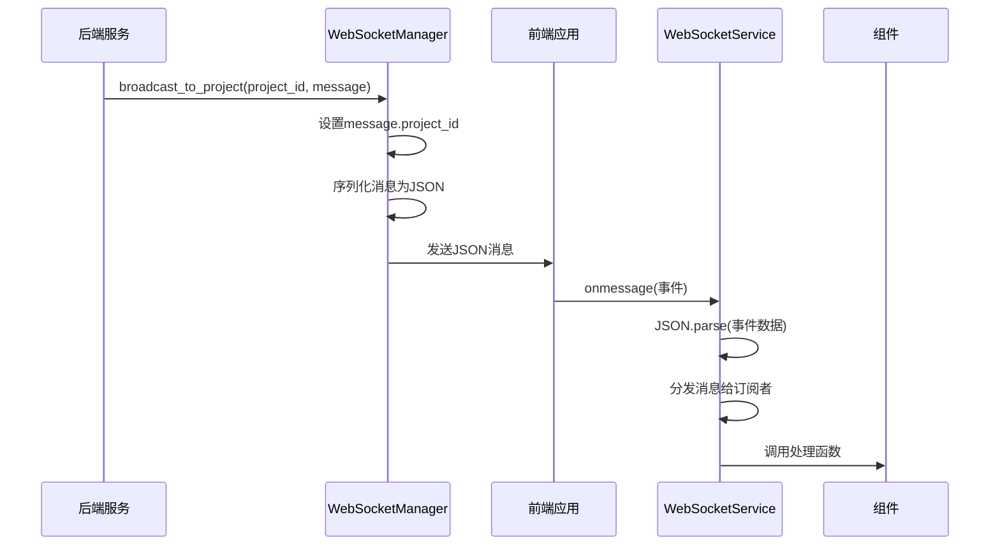

# 消息协议与数据格式

<cite>
**本文档引用的文件**
- [WebSocketMessage](file://dashboard/backend/models.py#L129-L134)
- [websocket.ts](file://dashboard/frontend/src/services/websocket.ts)
- [index.ts](file://dashboard/frontend/src/types/index.ts#L78-L83)
- [websocket_manager.py](file://dashboard/backend/websocket_manager.py#L52-L55)
- [useWebSocket.ts](file://dashboard/frontend/src/hooks/useWebSocket.ts)
- [TaskBoard.tsx](file://dashboard/frontend/src/components/TaskBoard.tsx#L35-L53)
- [api.py](file://dashboard/backend/api.py#L1583-L1617)
</cite>

## 目录
1. [引言](#引言)
2. [消息数据模型](#消息数据模型)
3. [核心字段解析](#核心字段解析)
4. [消息处理流程](#消息处理流程)
5. [典型消息示例](#典型消息示例)
6. [前后端一致性要求](#前后端一致性要求)
7. [版本兼容性与扩展设计](#版本兼容性与扩展设计)

## 引言
TaskTree系统通过WebSocket实现实时通信，为前端提供项目状态、任务更新和代理状态的实时推送。本系统采用统一的WebSocket消息协议，确保前后端在实时数据交换中保持一致性和可靠性。该协议基于WebSocketMessage数据模型，定义了标准化的消息结构，支持多种事件类型，包括任务更新、代理状态变化和计划生成等场景。消息协议的设计兼顾了灵活性和可扩展性，为系统的实时协作功能提供了基础支持。

## 消息数据模型
TaskTree系统的WebSocket通信基于统一的WebSocketMessage数据模型，该模型在前后端代码中保持一致。消息模型采用JSON格式进行序列化传输，确保跨平台兼容性。模型定义了消息的基本结构，包括事件类型、负载数据、时间戳和可选的项目标识符等核心字段。这种结构化设计使得消息既能够携带丰富的上下文信息，又保持了足够的灵活性以适应不同的应用场景。

**Section sources**
- [WebSocketMessage](file://dashboard/backend/models.py#L129-L134)
- [index.ts](file://dashboard/frontend/src/types/index.ts#L78-L83)

## 核心字段解析
WebSocket消息包含四个核心字段，共同构成了完整的通信协议：

- **type**: 消息事件类型，标识消息的类别和用途，如"task_created"、"agent_status_update"等
- **project_id**: 可选字段，指定消息关联的项目ID，用于多项目环境下的消息路由和过滤
- **data**: 负载字段，携带具体的数据内容，其结构根据事件类型而变化
- **timestamp**: 消息生成的时间戳，采用ISO 8601格式的字符串表示

这些字段共同构成了消息的元数据和有效载荷，使得接收方能够准确理解消息的上下文和内容。其中，type字段作为消息的分类标识，是消息路由和处理逻辑的关键依据；project_id字段实现了项目级别的消息隔离，确保用户只接收到与其当前项目相关的更新；data字段则提供了事件的具体细节，其灵活的结构设计支持不同类型事件的数据需求。

**Section sources**
- [WebSocketMessage](file://dashboard/backend/models.py#L129-L134)
- [index.ts](file://dashboard/frontend/src/types/index.ts#L78-L83)

## 消息处理流程
WebSocket消息的处理流程从前端的onmessage事件解析开始，到后端的broadcast_to_project消息注入结束，形成了完整的通信闭环。

前端WebSocketService通过onmessage事件处理器接收原始消息，使用JSON.parse将接收到的字符串数据反序列化为WebSocketMessage对象。解析后的消息通过订阅机制分发给所有注册的处理函数，实现了消息的广播式分发。前端的useWebSocket钩子函数封装了这一复杂性，为组件提供了简洁的API来订阅和处理消息。

后端通过WebSocketManager的broadcast_to_project方法注入消息，该方法首先将项目ID注入消息对象，然后调用broadcast方法将消息序列化为JSON字符串并发送给所有活跃连接。消息的序列化过程使用Pydantic模型的dict()方法，确保了数据结构的完整性和一致性。整个流程体现了发布-订阅模式的设计思想，实现了松耦合的实时通信架构。



**Diagram sources**
- [websocket_manager.py](file://dashboard/backend/websocket_manager.py#L52-L55)
- [websocket.ts](file://dashboard/frontend/src/services/websocket.ts#L27-L34)

**Section sources**
- [websocket.ts](file://dashboard/frontend/src/services/websocket.ts)
- [websocket_manager.py](file://dashboard/backend/websocket_manager.py#L52-L55)
- [useWebSocket.ts](file://dashboard/frontend/src/hooks/useWebSocket.ts)

## 典型消息示例
不同事件类型的消息具有不同的数据结构，以下为几种典型场景的JSON示例：

**任务创建消息**
```json
{
  "type": "task_created",
  "project_id": "proj-123",
  "data": {
    "task": {
      "id": "task-456",
      "title": "实现用户认证功能",
      "status": "unclaimed",
      "created_at": "2025-01-15T10:30:00Z"
    }
  },
  "timestamp": "2025-01-15T10:30:01Z"
}
```

**代理状态更新消息**
```json
{
  "type": "agent_status_update",
  "project_id": "proj-123",
  "data": {
    "agent": {
      "id": "agent-789",
      "status": "running",
      "progress": 65,
      "task_title": "实现用户认证功能"
    }
  },
  "timestamp": "2025-01-15T10:35:20Z"
}
```

**计划生成消息**
```json
{
  "type": "plan_generated",
  "project_id": "proj-123",
  "data": {
    "plan": "项目开发计划...",
    "suggested_tasks": [
      {
        "title": "搭建项目框架",
        "description": "初始化项目结构和依赖"
      },
      {
        "title": "设计数据库模型",
        "description": "定义核心数据实体和关系"
      }
    ]
  },
  "timestamp": "2025-01-15T09:15:30Z"
}
```

这些示例展示了不同类型事件的数据结构差异，体现了消息协议的灵活性和表达能力。从任务管理到代理协调，再到项目规划，统一的消息格式支持了系统多样化的实时通信需求。

**Section sources**
- [TaskBoard.tsx](file://dashboard/frontend/src/components/TaskBoard.tsx#L35-L53)
- [api.py](file://dashboard/backend/api.py#L1583-L1617)

## 前后端一致性要求
WebSocketMessage类型在前后端必须保持严格的一致性，这是系统稳定运行的基础。前端TypeScript接口和后端Python Pydantic模型在字段名称、类型和结构上完全对应，确保了序列化和反序列化的正确性。这种一致性要求体现在三个方面：首先是字段命名的一致性，所有字段使用相同的命名约定；其次是数据类型的一致性，如字符串、可选字段和嵌套对象的处理；最后是结构定义的一致性，确保消息的层次结构在两端完全匹配。

为维护这种一致性，系统采用共享的类型定义理念，尽管技术栈不同，但通过严格的约定和文档化，确保了两端的实现同步。任何对消息结构的修改都必须同时更新前后端代码，并经过充分的测试验证。这种设计避免了因类型不匹配导致的运行时错误，提高了系统的可靠性和可维护性。

**Section sources**
- [WebSocketMessage](file://dashboard/backend/models.py#L129-L134)
- [index.ts](file://dashboard/frontend/src/types/index.ts#L78-L83)

## 版本兼容性与扩展设计
消息协议的设计充分考虑了版本兼容性和未来扩展需求。通过采用可选字段和灵活的data负载结构，系统能够在不破坏现有客户端的情况下引入新功能。project_id字段的可选性设计支持了从单项目到多项目的平滑过渡，而data字段的任意对象类型允许在不修改消息框架的情况下添加新的数据内容。

扩展设计遵循开放-封闭原则，对扩展开放，对修改封闭。新增事件类型无需修改现有消息结构，只需定义新的type值和相应的data结构即可。这种设计支持系统的渐进式演进，使得功能扩展不会影响已有的通信逻辑。同时，时间戳字段的标准化格式为消息的排序和去重提供了基础，增强了系统的健壮性。

**Section sources**
- [WebSocketMessage](file://dashboard/backend/models.py#L129-L134)
- [index.ts](file://dashboard/frontend/src/types/index.ts#L78-L83)