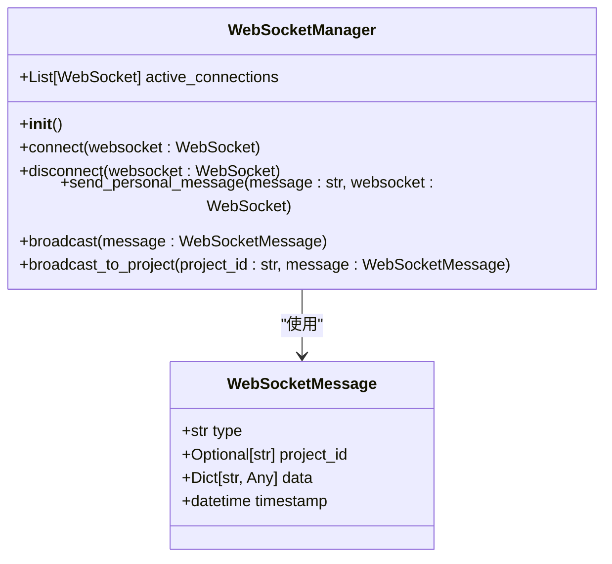
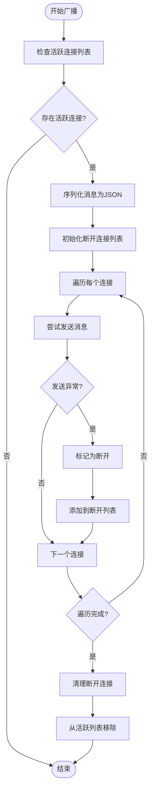
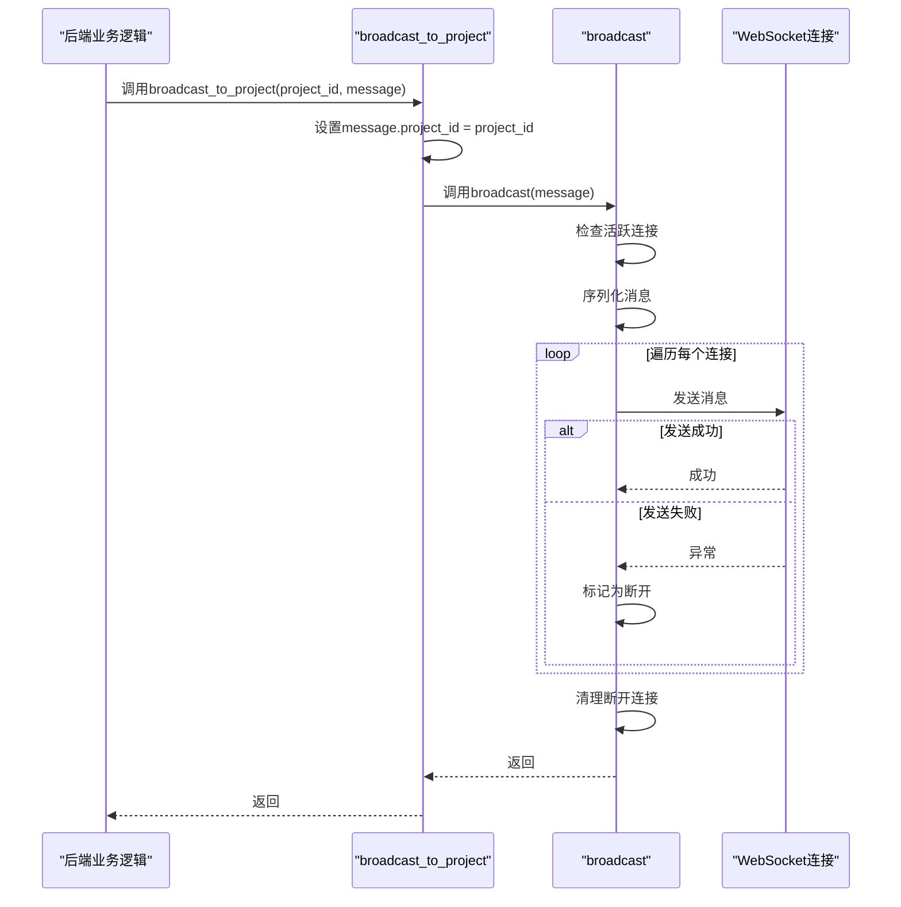
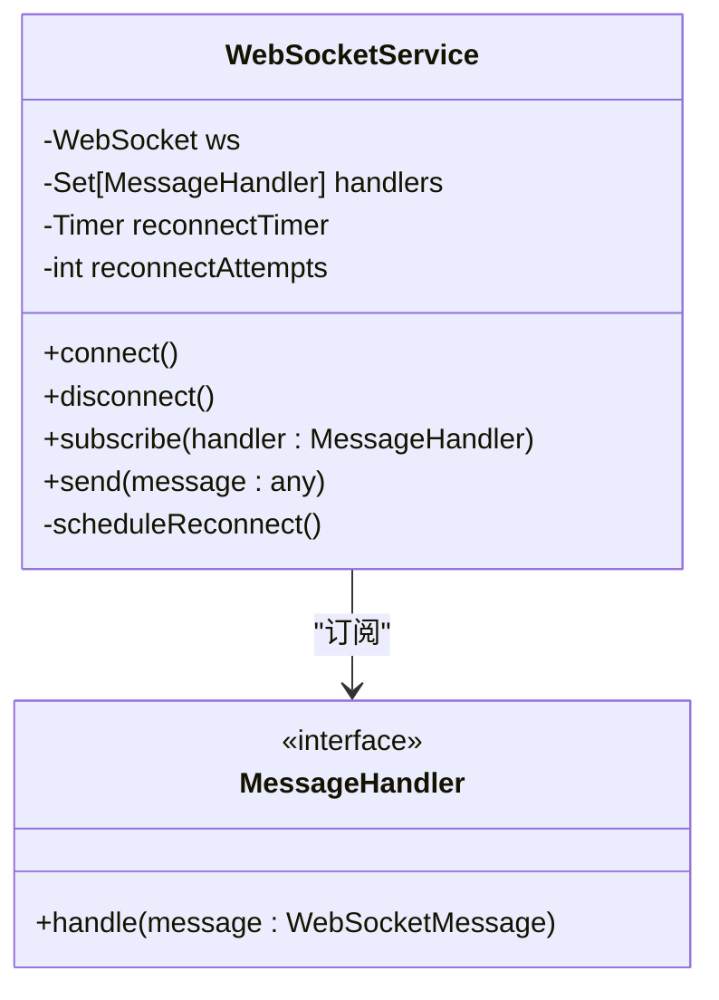
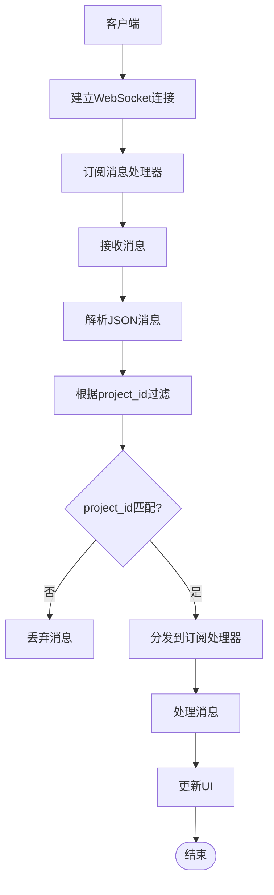
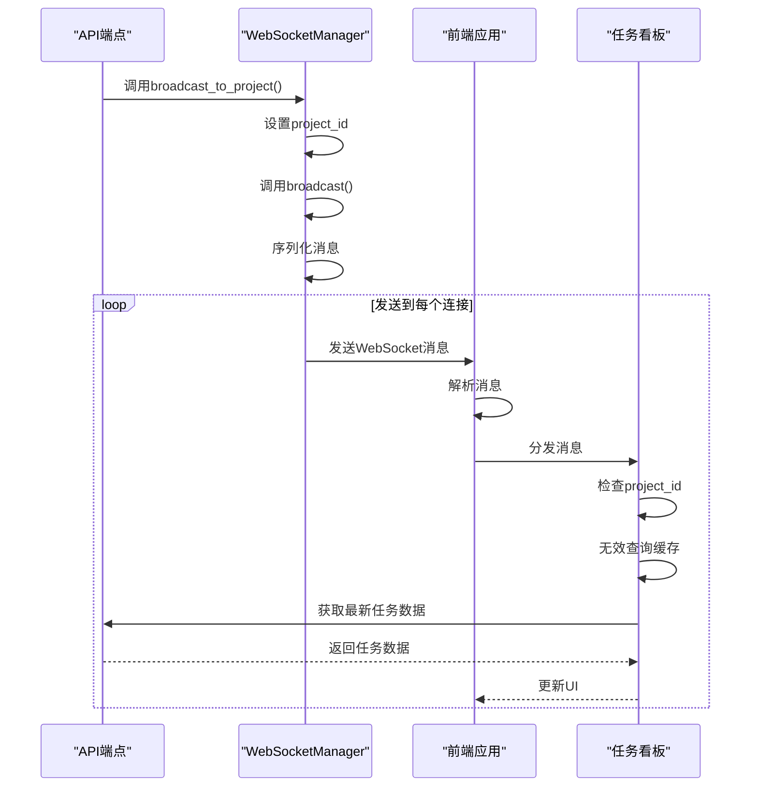
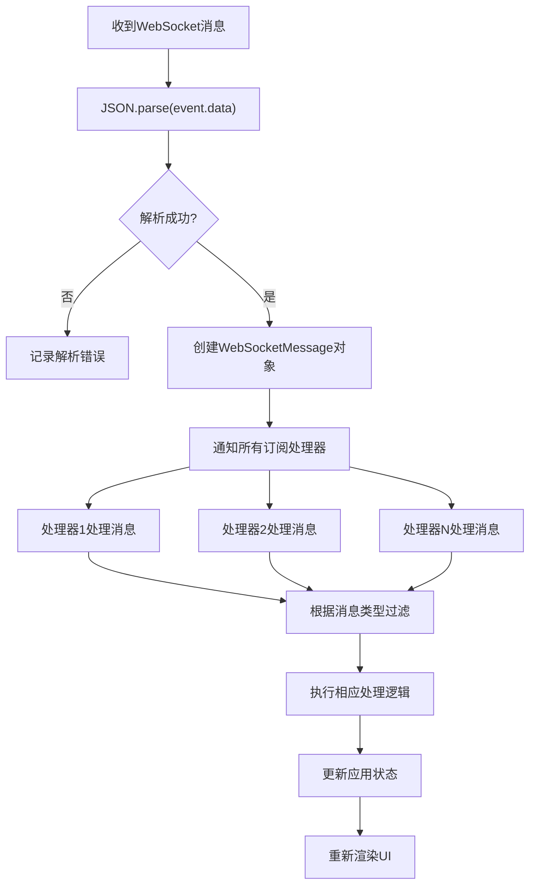

# 消息广播机制

<cite>
**本文档中引用的文件**   
- [websocket_manager.py](file://dashboard/backend/websocket_manager.py)
- [models.py](file://dashboard/backend/models.py)
- [main.py](file://dashboard/backend/main.py)
- [api.py](file://dashboard/backend/api.py)
- [websocket.ts](file://dashboard/frontend/src/services/websocket.ts)
- [useWebSocket.ts](file://dashboard/frontend/src/hooks/useWebSocket.ts)
- [TaskBoard.tsx](file://dashboard/frontend/src/components/TaskBoard.tsx)
- [App.tsx](file://dashboard/frontend/src/App.tsx)
</cite>

## 目录
1. [消息广播机制概述](#消息广播机制概述)
2. [WebSocketManager核心组件分析](#websocketmanager核心组件分析)
3. [广播机制实现细节](#广播机制实现细节)
4. [前端WebSocket消息处理](#前端websocket消息处理)
5. [完整消息流分析](#完整消息流分析)
6. [性能优化建议](#性能优化建议)

## 消息广播机制概述

本系统采用WebSocket实现实时消息推送，通过WebSocketManager管理所有连接并实现消息广播功能。系统支持全局广播和项目级广播两种模式，确保消息能够高效、准确地传递给相关客户端。后端通过FastAPI实现WebSocket路由，前端通过WebSocketService处理连接和消息分发，形成完整的实时通信链路。

## WebSocketManager核心组件分析

WebSocketManager是消息广播的核心组件，负责管理所有WebSocket连接并实现广播功能。该组件维护一个活跃连接列表，通过connect和disconnect方法管理连接的生命周期。

**Diagram sources**
- [websocket_manager.py](file://dashboard/backend/websocket_manager.py#L10-L55)
- [models.py](file://dashboard/backend/models.py#L129-L135)

**Section sources**
- [websocket_manager.py](file://dashboard/backend/websocket_manager.py#L1-L55)
- [models.py](file://dashboard/backend/models.py#L129-L135)

## 广播机制实现细节

### broadcast方法实现

broadcast方法实现了向所有活跃连接广播消息的核心逻辑。该方法首先检查是否存在活跃连接，然后将WebSocketMessage对象序列化为JSON字符串，遍历所有连接并尝试发送消息。

**Diagram sources**
- [websocket_manager.py](file://dashboard/backend/websocket_manager.py#L32-L51)

**Section sources**
- [websocket_manager.py](file://dashboard/backend/websocket_manager.py#L32-L51)

### broadcast_to_project方法实现

broadcast_to_project方法实现了项目级消息路由功能。该方法接收项目ID和消息对象，将项目ID注入消息对象的project_id字段，然后调用broadcast方法进行广播。

**Diagram sources**
- [websocket_manager.py](file://dashboard/backend/websocket_manager.py#L52-L55)

**Section sources**
- [websocket_manager.py](file://dashboard/backend/websocket_manager.py#L52-L55)

## 前端WebSocket消息处理

### WebSocketService实现

前端WebSocketService负责管理WebSocket连接和消息处理。该服务实现了自动重连机制，确保连接的可靠性。当连接断开时，服务会按照指数退避策略进行重连尝试。

**Diagram sources**
- [websocket.ts](file://dashboard/frontend/src/services/websocket.ts#L5-L97)

**Section sources**
- [websocket.ts](file://dashboard/frontend/src/services/websocket.ts#L5-L97)

### 消息分发机制

前端通过useWebSocket Hook实现消息分发机制。组件通过订阅WebSocket消息，根据消息类型和项目ID进行过滤和处理，实现针对性的UI更新。

**Diagram sources**
- [useWebSocket.ts](file://dashboard/frontend/src/hooks/useWebSocket.ts#L5-L24)
- [TaskBoard.tsx](file://dashboard/frontend/src/components/TaskBoard.tsx#L34-L53)

**Section sources**
- [useWebSocket.ts](file://dashboard/frontend/src/hooks/useWebSocket.ts#L5-L24)
- [TaskBoard.tsx](file://dashboard/frontend/src/components/TaskBoard.tsx#L34-L53)

## 完整消息流分析

### 任务状态更新场景

以任务状态更新为例，展示消息从后端触发到前端UI响应的完整路径：

**Diagram sources**
- [api.py](file://dashboard/backend/api.py#L419-L423)
- [TaskBoard.tsx](file://dashboard/frontend/src/components/TaskBoard.tsx#L44-L46)

**Section sources**
- [api.py](file://dashboard/backend/api.py#L419-L423)
- [TaskBoard.tsx](file://dashboard/frontend/src/components/TaskBoard.tsx#L44-L46)

### 消息处理链路

从前端WebSocketService的onmessage事件处理器出发，消息解析、类型校验及分发至订阅处理器的完整链路如下：

**Diagram sources**
- [websocket.ts](file://dashboard/frontend/src/services/websocket.ts#L27-L34)

**Section sources**
- [websocket.ts](file://dashboard/frontend/src/services/websocket.ts#L27-L34)

## 性能优化建议

### 广播性能瓶颈

当前广播机制存在以下性能瓶颈：
- 同步遍历所有连接，可能阻塞事件循环
- 每个连接独立发送，缺乏批量处理机制
- 缺乏消息优先级和限流机制

### 消息积压处理

建议实现以下消息积压处理机制：
- 实现消息队列，避免大量消息同时发送
- 添加消息优先级，确保关键消息优先送达
- 实现消息去重，避免重复消息占用带宽

### 大规模连接优化

针对大规模连接场景，建议以下优化措施：
- 使用连接池管理WebSocket连接
- 实现消息压缩，减少网络传输量
- 采用分片广播策略，将大消息分批发送
- 实现连接健康检查，及时清理无效连接

**Section sources**
- [websocket_manager.py](file://dashboard/backend/websocket_manager.py#L32-L55)
- [websocket.ts](file://dashboard/frontend/src/services/websocket.ts#L5-L97)