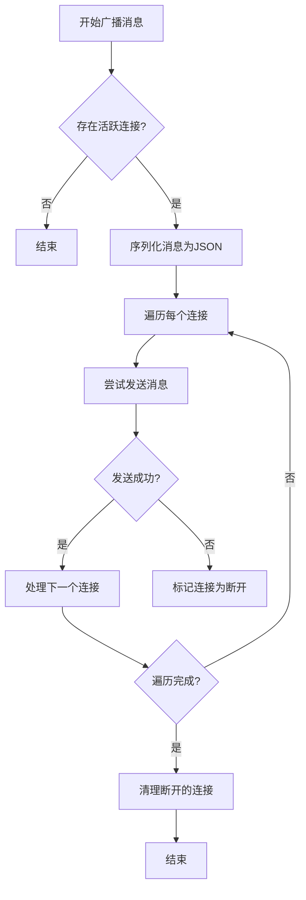
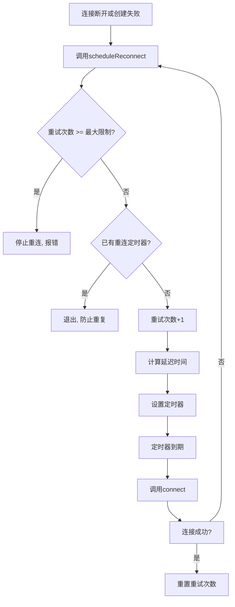

# 错误处理与恢复策略

<cite>
**本文档引用文件**  
- [websocket_manager.py](file://dashboard/backend/websocket_manager.py)
- [websocket.ts](file://dashboard/frontend/src/services/websocket.ts)
- [useWebSocket.ts](file://dashboard/frontend/src/hooks/useWebSocket.ts)
- [main.py](file://dashboard/backend/main.py)
- [api.py](file://dashboard/backend/api.py)
- [models.py](file://dashboard/backend/models.py)
- [index.ts](file://dashboard/frontend/src/types/index.ts)
- [vite.config.ts](file://dashboard/frontend/vite.config.ts)
</cite>

## 目录
1. [引言](#引言)
2. [后端连接管理与广播错误处理](#后端连接管理与广播错误处理)
3. [前端WebSocket错误监听与重连机制](#前端websocket错误监听与重连机制)
4. [连接状态预判与发送保护](#连接状态预判与发送保护)
5. [实际错误场景与系统恢复能力](#实际错误场景与系统恢复能力)
6. [心跳机制缺失风险与改进建议](#心跳机制缺失风险与改进建议)
7. [总结](#总结)

## 引言
本系统采用WebSocket实现前后端实时通信，确保任务状态、代理进度等关键信息的即时同步。为保障通信的可靠性与稳定性，系统在前后端均实现了完善的错误处理与恢复机制。本文将深入分析后端连接池管理、前端重连策略、连接状态预判等核心机制，并评估系统在实际故障场景下的恢复能力。

## 后端连接管理与广播错误处理

系统后端通过`WebSocketManager`类集中管理所有WebSocket连接。该类维护一个`active_connections`列表，存储所有活跃的WebSocket实例。当新连接建立时，`connect`方法将其加入列表；当连接关闭时，`disconnect`方法将其移除。

在广播消息时，系统采用健壮的异常捕获机制。`broadcast`方法遍历所有活跃连接，尝试发送消息。若发送过程中抛出异常（通常表示连接已断开），该连接会被加入`disconnected`临时列表。广播完成后，系统遍历`disconnected`列表，调用`disconnect`方法从`active_connections`中安全移除这些失效连接，从而保持连接池的清洁与健壮性。

**图示来源**
- [websocket_manager.py](file://dashboard/backend/websocket_manager.py#L32-L51)

**本节来源**
- [websocket_manager.py](file://dashboard/backend/websocket_manager.py#L10-L55)
- [api.py](file://dashboard/backend/api.py#L1217-L1227)

## 前端WebSocket错误监听与重连机制

前端通过`WebSocketService`类封装WebSocket功能，实现了全面的错误处理与自动重连逻辑。

### 错误事件监听
`WebSocketService`通过`onerror`事件处理器监听连接错误。当发生网络问题或服务器拒绝连接时，该处理器会将错误信息输出到控制台，便于调试。

### 重连调度机制
系统实现了智能的重连调度机制`scheduleReconnect`，以应对连接中断。该机制包含以下关键特性：

- **最大重试次数限制**：通过`maxReconnectAttempts`属性（默认为5次）限制重连尝试次数，防止在网络永久中断时无限重试。
- **指数退避延迟**：重连延迟采用指数退避算法计算，公式为`reconnectDelay * 2^(reconnectAttempts - 1)`。初始延迟为1000ms，每次重试后延迟翻倍，避免对服务器造成过大压力。
- **定时器管理**：使用`reconnectTimer`变量存储`setTimeout`的返回值。在发起新重连前会检查定时器是否存在，防止重复调度。当成功连接或手动断开时，会清除定时器。

**图示来源**
- [websocket.ts](file://dashboard/frontend/src/services/websocket.ts#L50-L67)

**本节来源**
- [websocket.ts](file://dashboard/frontend/src/services/websocket.ts#L5-L47)
- [websocket.ts](file://dashboard/frontend/src/services/websocket.ts#L50-L67)

## 连接状态预判与发送保护

为避免在无效连接上发送数据导致错误，`WebSocketService`的`send`方法实现了连接状态预判。

该方法首先检查`this.ws`是否存在且其`readyState`是否为`WebSocket.OPEN`。只有当连接处于打开状态时，才会执行`send`操作。否则，系统会向控制台输出警告信息“WebSocket not connected”，提示开发者当前无法发送消息，但不会抛出异常中断程序执行。

这种设计模式确保了系统的健壮性，即使在未连接状态下调用`send`方法，也不会导致应用崩溃，而是优雅地处理该情况。

**本节来源**
- [websocket.ts](file://dashboard/frontend/src/services/websocket.ts#L88-L93)

## 实际错误场景与系统恢复能力

### 网络中断场景
当用户网络暂时中断时，前端WebSocket连接会触发`onclose`事件。此时，`scheduleReconnect`机制被激活，系统将按指数退避策略尝试重新连接。一旦网络恢复，前端将自动重新建立连接并恢复实时更新功能。

### 服务重启场景
当后端服务重启时，所有现有WebSocket连接会被强制关闭。前端检测到连接断开后，同样会启动重连流程。由于重连地址基于当前页面的协议和主机名动态生成，服务重启后前端能自动连接到新的服务实例。

### 系统恢复能力总结
结合前后端的错误处理机制，系统展现出强大的恢复能力：
1.  **后端健壮性**：通过异常捕获和连接清理，确保广播操作不会因个别连接故障而失败，连接池始终保持有效状态。
2.  **前端韧性**：自动重连机制使用户在短暂网络波动或服务重启后能无缝恢复，提升了用户体验。
3.  **状态隔离**：前端重连后，通过`useWebSocket`钩子，组件会自动重新订阅消息，确保UI状态与后端同步。

**本节来源**
- [websocket_manager.py](file://dashboard/backend/websocket_manager.py#L40-L51)
- [websocket.ts](file://dashboard/frontend/src/services/websocket.ts#L36-L38)
- [useWebSocket.ts](file://dashboard/frontend/src/hooks/useWebSocket.ts#L5-L16)

## 心跳机制缺失风险与改进建议

### 潜在风险
当前系统实现中存在一个显著风险：缺乏心跳（Ping/Pong）机制。这可能导致以下问题：
- **连接假死**：在某些网络环境下（如NAT超时），连接可能在不触发`onclose`或`onerror`的情况下悄然断开。此时，前端认为连接仍有效，但实际已无法接收消息，导致用户界面停滞。
- **资源浪费**：后端无法及时感知这种“假连接”，会继续尝试向其广播消息，浪费服务器资源和网络带宽。

### 改进建议
为解决此问题，建议在前后端实现心跳机制：
1.  **后端**：在`websocket_endpoint`的循环中，定期（如每30秒）向客户端发送一个Ping消息。
2.  **前端**：监听Ping消息，并立即回复Pong消息。
3.  **超时检测**：后端设置一个计时器，若在规定时间内未收到Pong回复，则主动关闭该连接。
4.  **前端超时**：前端也应设置超时，若长时间未收到任何消息（包括心跳），可主动断开并重连。

此改进将显著提升系统对网络异常的检测能力，确保连接状态的真实性和服务端资源的高效利用。

**本节来源**
- [websocket_manager.py](file://dashboard/backend/websocket_manager.py#L1217-L1227)
- [websocket.ts](file://dashboard/frontend/src/services/websocket.ts#L22-L39)

## 总结
本系统通过前后端协同的错误处理机制，构建了一个相对可靠的实时通信架构。后端通过异常捕获和连接清理维护了连接池的健壮性，前端通过指数退避重连和连接状态预判保证了用户体验的连续性。然而，缺少心跳机制是当前实现的一个关键短板，可能导致连接假死问题。建议尽快引入心跳机制，以全面提升系统的稳定性和资源利用效率。