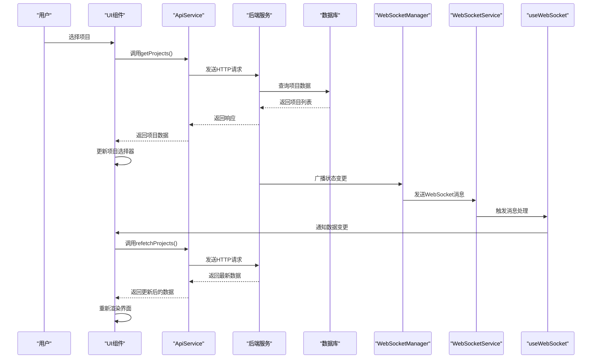
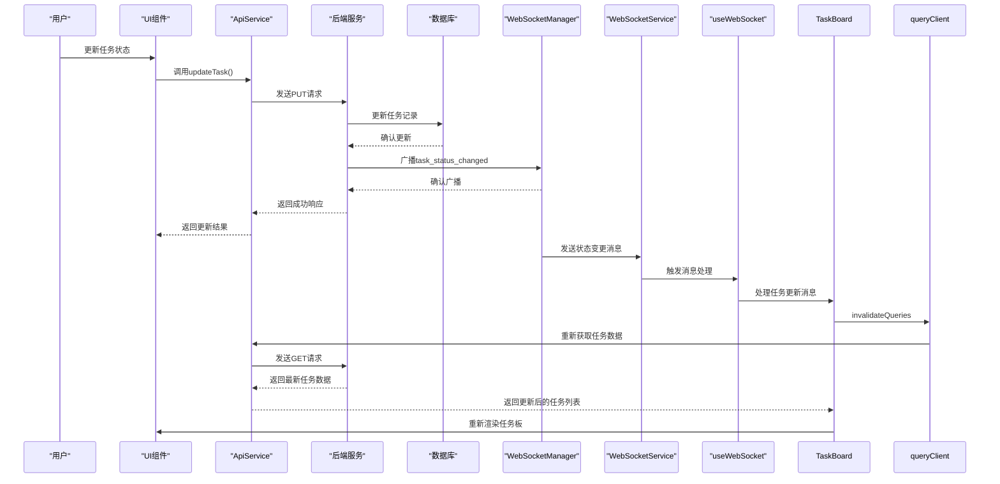

# 数据流

<cite>
**本文档中引用的文件**   
- [api.ts](file://dashboard/frontend/src/services/api.ts)
- [websocket.ts](file://dashboard/frontend/src/services/websocket.ts)
- [useWebSocket.ts](file://dashboard/frontend/src/hooks/useWebSocket.ts)
- [websocket_manager.py](file://dashboard/backend/websocket_manager.py)
- [ProjectSelector.tsx](file://dashboard/frontend/src/components/ProjectSelector.tsx)
- [CommandCenter.tsx](file://dashboard/frontend/src/components/CommandCenter.tsx)
- [TaskBoard.tsx](file://dashboard/frontend/src/components/TaskBoard.tsx)
- [App.tsx](file://dashboard/frontend/src/App.tsx)
- [main.py](file://dashboard/backend/main.py)
- [models.py](file://dashboard/backend/models.py)
</cite>

## 目录
1. [数据流概述](#数据流概述)
2. [前端用户操作到API调用](#前端用户操作到api调用)
3. [后端处理与数据库更新](#后端处理与数据库更新)
4. [WebSocket实时通信机制](#websocket实时通信机制)
5. [前端WebSocket消息处理](#前端websocket消息处理)
6. [数据一致性保证机制](#数据一致性保证机制)
7. [关键场景序列图](#关键场景序列图)

## 数据流概述

TaskTree系统实现了从前端用户界面到后端服务的完整数据流闭环，通过REST API和WebSocket技术实现了请求-响应与实时推送相结合的通信模式。系统从前端用户操作开始，经过API调用、后端处理、数据库更新，再到WebSocket广播和前端消息接收，形成了一套高效的数据流转机制。

该数据流设计确保了用户操作的即时响应和系统状态的实时同步，特别是在项目选择、任务状态更新等关键场景下，通过WebSocket实现了毫秒级的状态变更通知，大大提升了用户体验。

**Section sources**
- [App.tsx](file://dashboard/frontend/src/App.tsx#L27-L68)
- [main.py](file://dashboard/backend/main.py#L1-L56)

## 前端用户操作到API调用

当用户在UI界面触发操作（如选择项目）时，系统通过`api.ts`文件中的`ApiService`类调用相应的REST API。该服务封装了所有与后端通信的HTTP请求，提供了类型安全的接口方法。

`ApiService`类实现了统一的请求处理逻辑，包括请求头设置、错误处理和JSON解析。每个API方法都对应特定的业务功能，如获取项目列表、创建项目、更新任务等。这些方法使用fetch API与后端进行通信，确保了跨平台兼容性和现代浏览器支持。

当用户选择项目时，系统会调用`getProjects`方法获取项目列表，或调用`getProject`方法获取特定项目详情。这些请求通过`/api/projects`端点与后端交互，返回的数据将用于更新前端状态。

**Section sources**
- [api.ts](file://dashboard/frontend/src/services/api.ts#L1-L248)
- [ProjectSelector.tsx](file://dashboard/frontend/src/components/ProjectSelector.tsx#L1-L67)

## 后端处理与数据库更新

后端使用FastAPI框架处理API请求，通过`main.py`文件中的路由配置将请求分发到相应的处理函数。系统在启动时初始化项目管理器和协调器管理器，确保服务的可用性。

当接收到API请求时，后端会执行相应的业务逻辑，包括数据验证、业务规则检查和数据库操作。处理完成后，系统会更新数据库中的相关记录，并准备响应数据返回给前端。

对于需要实时通知的操作，后端会通过WebSocket管理器广播状态变更消息。这种设计将请求处理与状态通知分离，确保了系统的响应性和可扩展性。

**Section sources**
- [main.py](file://dashboard/backend/main.py#L1-L56)
- [models.py](file://dashboard/backend/models.py#L99-L135)

## WebSocket实时通信机制

WebSocket实时通信机制是TaskTree系统的核心特性之一，通过`websocket_manager.py`文件中的`WebSocketManager`类实现。该管理器负责维护所有活跃的WebSocket连接，并提供广播功能。

后端定义了多种事件类型，包括`task_update`、`agent_status`、`plan_generated`等，每种类型对应不同的系统状态变更。当系统状态发生变化时，后端会创建相应的`WebSocketMessage`对象，并通过`broadcast_to_project`方法将其发送给所有订阅了该项目的客户端。

`WebSocketMessage`包含类型、项目ID、数据负载和时间戳四个关键字段，确保了消息的完整性和可追溯性。管理器会自动处理连接的建立、断开和异常情况，确保通信的可靠性。

**Section sources**
- [websocket_manager.py](file://dashboard/backend/websocket_manager.py#L1-L55)
- [models.py](file://dashboard/backend/models.py#L129-L134)

## 前端WebSocket消息处理

前端通过`websocket.ts`文件中的`WebSocketService`类管理WebSocket连接。该服务实现了自动重连机制，使用指数退避算法在连接失败时进行重试，最大重试次数为5次。

`useWebSocket.ts`文件中的`useWebSocket`钩子函数提供了React组件与WebSocket服务的集成接口。组件可以通过该钩子订阅消息，当收到消息时，根据消息类型决定是否需要刷新数据。

在`App.tsx`中，系统全局订阅WebSocket消息，当收到包含"task"、"agent"、"project"关键字或"plan_generated"类型的消息时，会触发`refetchProjects`，确保项目数据的实时更新。

**Section sources**
- [websocket.ts](file://dashboard/frontend/src/services/websocket.ts#L1-L98)
- [useWebSocket.ts](file://dashboard/frontend/src/hooks/useWebSocket.ts#L1-L24)
- [App.tsx](file://dashboard/frontend/src/App.tsx#L40-L48)

## 数据一致性保证机制

系统通过多种机制保证数据一致性。首先，`ProjectSelector`组件依赖`useQuery`的缓存机制，在5秒内认为数据是新鲜的，避免了频繁的API调用。其次，`CommandCenter`组件在项目变更时会重新渲染，确保显示最新的项目状态。

`TaskBoard`组件使用`queryClient.invalidateQueries`方法在收到相关WebSocket消息时立即刷新任务数据，确保任务状态的实时性。这种基于事件的缓存失效策略，既保证了数据的新鲜度，又避免了不必要的网络请求。

全局的`refetchProjects`调用确保了项目列表在关键事件发生时能够及时更新，而`staleTime`和`gcTime`配置则平衡了性能和数据一致性。

**Section sources**
- [App.tsx](file://dashboard/frontend/src/App.tsx#L28-L33)
- [TaskBoard.tsx](file://dashboard/frontend/src/components/TaskBoard.tsx#L34-L53)
- [CommandCenter.tsx](file://dashboard/frontend/src/components/CommandCenter.tsx#L1-L98)

## 关键场景序列图

**Diagram sources**
- [api.ts](file://dashboard/frontend/src/services/api.ts#L30-L35)
- [websocket_manager.py](file://dashboard/backend/websocket_manager.py#L32-L55)
- [websocket.ts](file://dashboard/frontend/src/services/websocket.ts#L27-L34)
- [useWebSocket.ts](file://dashboard/frontend/src/hooks/useWebSocket.ts#L5-L24)

**Diagram sources**
- [api.ts](file://dashboard/frontend/src/services/api.ts#L78-L84)
- [websocket_manager.py](file://dashboard/backend/websocket_manager.py#L52-L55)
- [TaskBoard.tsx](file://dashboard/frontend/src/components/TaskBoard.tsx#L35-L53)
- [websocket.ts](file://dashboard/frontend/src/services/websocket.ts#L27-L34)