# 状态同步与一致性机制

<cite>
**本文档引用的文件**
- [App.tsx](file://dashboard/frontend/src/App.tsx)
- [useWebSocket.ts](file://dashboard/frontend/src/hooks/useWebSocket.ts)
- [websocket.ts](file://dashboard/frontend/src/services/websocket.ts)
- [api.ts](file://dashboard/frontend/src/services/api.ts)
- [ProjectSelector.tsx](file://dashboard/frontend/src/components/ProjectSelector.tsx)
- [CommandCenter.tsx](file://dashboard/frontend/src/components/CommandCenter.tsx)
- [TaskBoard.tsx](file://dashboard/frontend/src/components/TaskBoard.tsx)
- [ProjectManager.tsx](file://dashboard/frontend/src/components/ProjectManager.tsx)
- [websocket_manager.py](file://dashboard/backend/websocket_manager.py)
- [index.ts](file://dashboard/frontend/src/types/index.ts)
</cite>

## 目录
1. [系统概述](#系统概述)
2. [架构设计](#架构设计)
3. [REST API层](#rest-api层)
4. [WebSocket通信层](#websocket通信层)
5. [前端状态管理](#前端状态管理)
6. [项目切换机制](#项目切换机制)
7. [实时状态同步](#实时状态同步)
8. [数据一致性保障](#数据一致性保障)
9. [性能优化策略](#性能优化策略)
10. [故障处理与重连](#故障处理与重连)
11. [最佳实践建议](#最佳实践建议)

## 系统概述

TaskTree系统采用前后端分离架构，通过REST API和WebSocket技术实现高效的状态同步与一致性保障。系统的核心设计理念是"事件驱动"和"实时响应"，确保用户界面能够及时反映后端状态变化，同时避免不必要的轮询操作。

### 核心特性

- **双向实时通信**：基于WebSocket的全双工通信
- **智能缓存策略**：React Query提供智能缓存和自动刷新
- **事件驱动更新**：基于消息类型的精确状态更新
- **优雅降级**：REST API作为WebSocket的备份方案
- **状态一致性**：多层验证确保数据完整性

## 架构设计

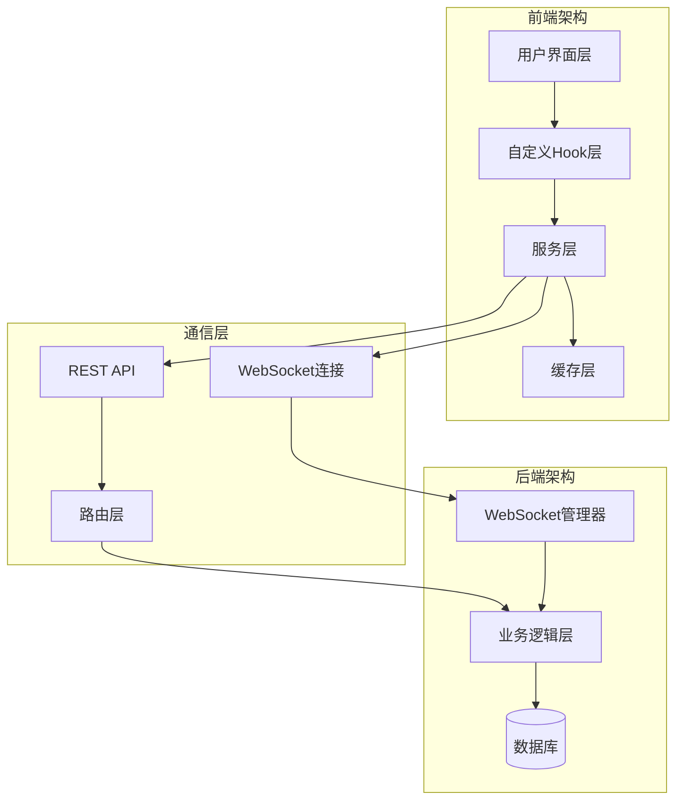

**图表来源**
- [App.tsx](file://dashboard/frontend/src/App.tsx#L1-L197)
- [websocket.ts](file://dashboard/frontend/src/services/websocket.ts#L1-L98)
- [api.ts](file://dashboard/frontend/src/services/api.ts#L1-L248)

## REST API层

### API服务架构

REST API层提供标准的HTTP接口，支持项目的增删改查、任务管理和代理控制等功能。API服务采用统一的错误处理和响应格式，确保前端能够正确处理各种异常情况。

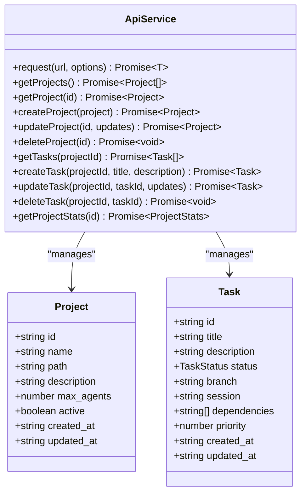

**图表来源**
- [api.ts](file://dashboard/frontend/src/services/api.ts#L5-L248)
- [index.ts](file://dashboard/frontend/src/types/index.ts#L1-L84)

### API调用模式

系统中的API调用遵循以下模式：

1. **查询操作**：使用`GET`方法获取数据，支持缓存和分页
2. **变更操作**：使用`POST`、`PUT`、`DELETE`方法修改数据
3. **批量操作**：支持批量创建、更新和删除操作
4. **错误处理**：统一的错误响应格式和状态码

**章节来源**
- [api.ts](file://dashboard/frontend/src/services/api.ts#L1-L248)

## WebSocket通信层

### WebSocket服务架构

WebSocket服务提供实时双向通信能力，支持消息广播、连接管理和自动重连功能。

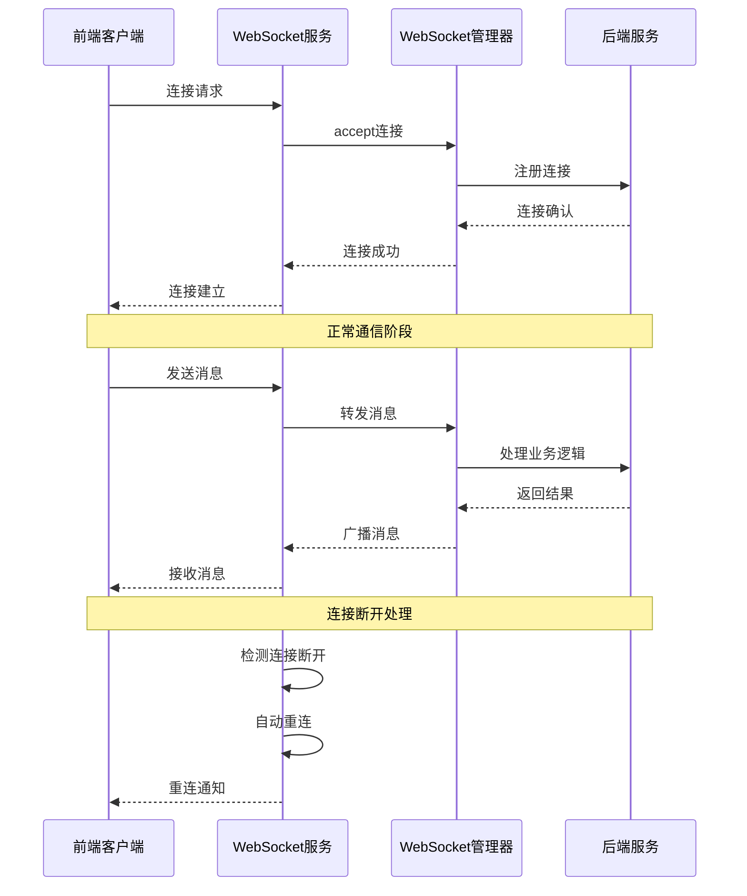

**图表来源**
- [websocket.ts](file://dashboard/frontend/src/services/websocket.ts#L14-L98)
- [websocket_manager.py](file://dashboard/backend/websocket_manager.py#L10-L55)

### 消息类型系统

WebSocket消息采用结构化格式，包含类型标识、项目ID、数据载荷和时间戳。

| 消息类型 | 描述 | 触发条件 | 更新范围 |
|---------|------|----------|----------|
| `task_created` | 任务创建 | 新建任务完成 | 任务列表 |
| `task_updated` | 任务更新 | 修改任务属性 | 任务详情 |
| `task_deleted` | 任务删除 | 删除任务完成 | 任务列表 |
| `task_status_changed` | 状态变更 | 任务状态改变 | 单个任务 |
| `agent_status_update` | 代理状态更新 | 代理状态变化 | 代理监控 |
| `agent_spawned` | 代理启动 | 新代理创建 | 代理列表 |
| `project_updated` | 项目更新 | 项目配置变更 | 项目列表 |
| `plan_generated` | 计划生成 | 自动生成计划 | 项目统计 |

**章节来源**
- [websocket.ts](file://dashboard/frontend/src/services/websocket.ts#L1-L98)
- [websocket_manager.py](file://dashboard/backend/websocket_manager.py#L1-L55)

## 前端状态管理

### React Query缓存策略

系统使用React Query进行状态管理，提供智能缓存、自动刷新和错误恢复功能。

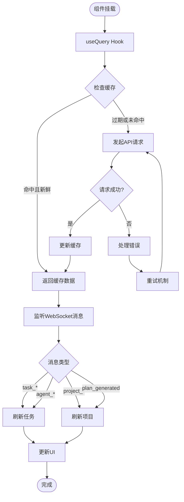

**图表来源**
- [App.tsx](file://dashboard/frontend/src/App.tsx#L27-L68)
- [TaskBoard.tsx](file://dashboard/frontend/src/components/TaskBoard.tsx#L65-L71)

### ProjectSelector组件设计

ProjectSelector组件使用useQuery缓存项目列表，提供项目选择和管理功能。

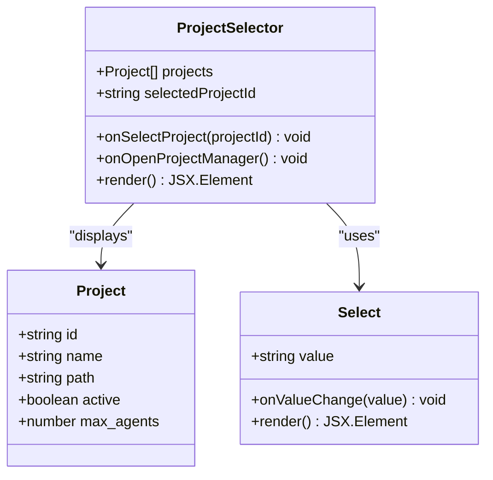

**图表来源**
- [ProjectSelector.tsx](file://dashboard/frontend/src/components/ProjectSelector.tsx#L12-L67)

**章节来源**
- [ProjectSelector.tsx](file://dashboard/frontend/src/components/ProjectSelector.tsx#L1-L67)
- [App.tsx](file://dashboard/frontend/src/App.tsx#L27-L68)

## 项目切换机制

### CommandCenter组件与项目订阅

CommandCenter组件在项目切换时需要重新订阅WebSocket流，确保接收正确的实时更新。

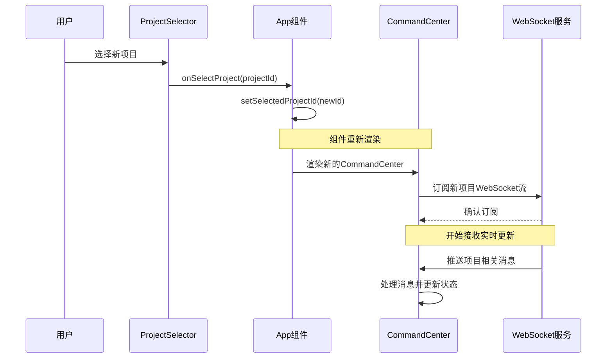

**图表来源**
- [App.tsx](file://dashboard/frontend/src/App.tsx#L82-L98)
- [CommandCenter.tsx](file://dashboard/frontend/src/components/CommandCenter.tsx#L18-L98)

### useWebSocket钩子设计

useWebSocket钩子提供简洁的WebSocket订阅接口，支持自动连接和清理。

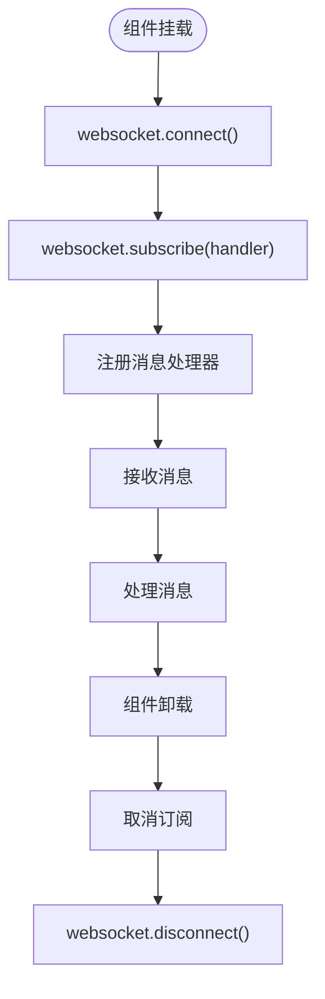

**图表来源**
- [useWebSocket.ts](file://dashboard/frontend/src/hooks/useWebSocket.ts#L5-L24)

**章节来源**
- [useWebSocket.ts](file://dashboard/frontend/src/hooks/useWebSocket.ts#L1-L24)
- [App.tsx](file://dashboard/frontend/src/App.tsx#L40-L48)

## 实时状态同步

### TaskBoard组件的实时更新机制

TaskBoard组件实现了复杂的实时状态同步逻辑，能够处理多种消息类型并做出相应的状态更新。

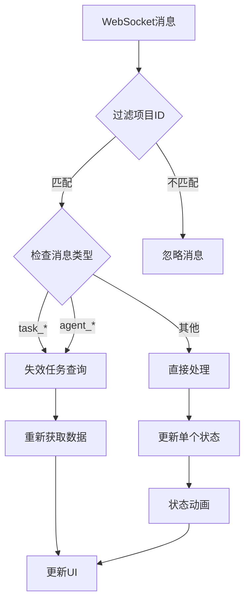

**图表来源**
- [TaskBoard.tsx](file://dashboard/frontend/src/components/TaskBoard.tsx#L34-L53)

### 消息处理策略

不同类型的WebSocket消息采用不同的处理策略：

| 消息类型 | 处理策略 | 性能影响 | 用户体验 |
|---------|----------|----------|----------|
| `task_created` | 立即失效查询 | 中等 | 即时显示新任务 |
| `task_updated` | 立即失效查询 | 中等 | 即时更新任务详情 |
| `task_status_changed` | 状态动画+局部更新 | 低 | 流畅的状态转换 |
| `agent_status_update` | 立即失效查询 | 中等 | 即时更新代理状态 |
| `project_updated` | 全局刷新 | 高 | 完整页面更新 |

**章节来源**
- [TaskBoard.tsx](file://dashboard/frontend/src/components/TaskBoard.tsx#L34-L53)

## 数据一致性保障

### 多层一致性检查

系统通过多层机制确保数据一致性：

1. **API层面**：REST API提供原子性操作和事务支持
2. **WebSocket层面**：消息确认和重传机制
3. **前端层面**：React Query的乐观更新和回滚
4. **UI层面**：状态动画和视觉反馈

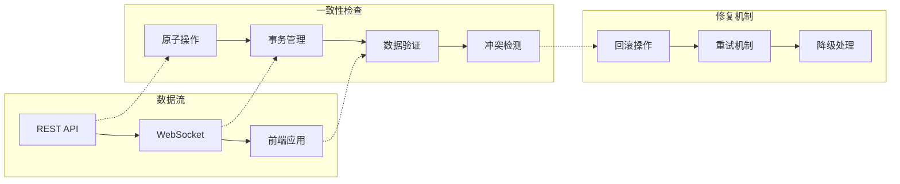

### 状态冲突处理

当出现状态冲突时，系统采用以下策略：

1. **优先级规则**：WebSocket消息具有最高优先级
2. **时间戳比较**：较新的时间戳覆盖旧数据
3. **版本控制**：使用版本号检测并发修改
4. **用户确认**：对于重要变更要求用户确认

**章节来源**
- [TaskBoard.tsx](file://dashboard/frontend/src/components/TaskBoard.tsx#L215-L226)

## 性能优化策略

### 缓存策略优化

系统采用多层次缓存策略：

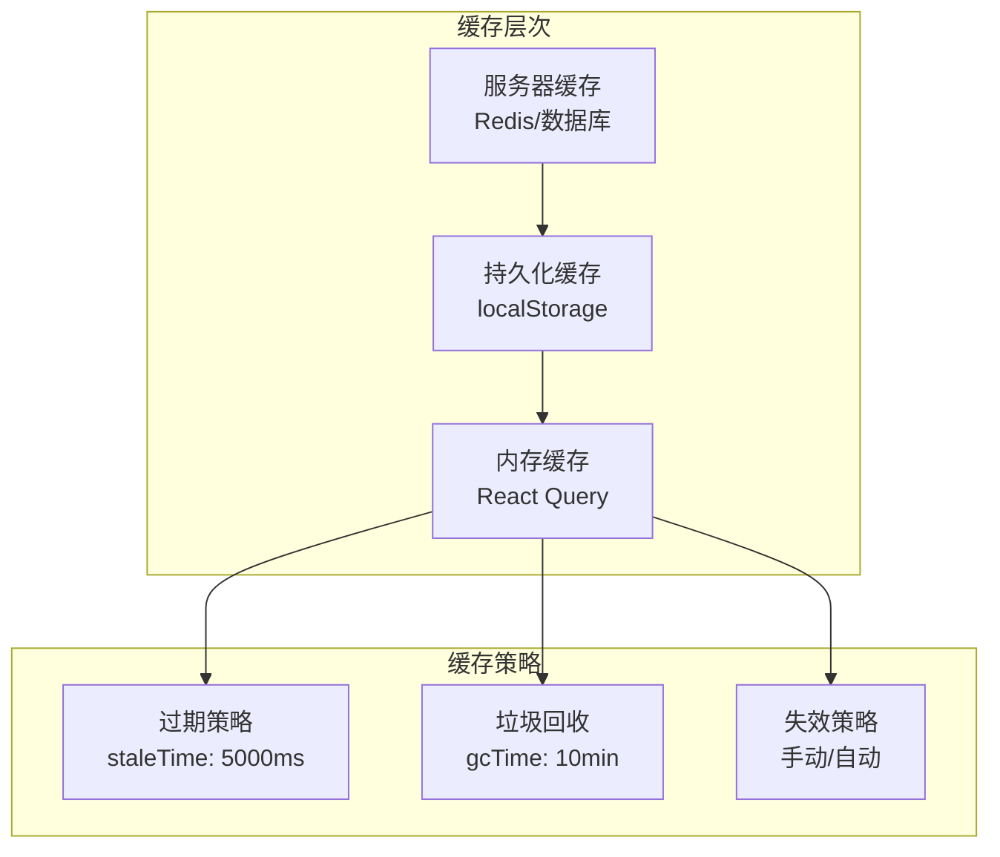

### 查询优化

1. **智能查询**：只查询必要的数据字段
2. **批量操作**：合并多个小请求为批量请求
3. **防抖节流**：限制高频操作的执行频率
4. **懒加载**：按需加载非关键数据

**章节来源**
- [App.tsx](file://dashboard/frontend/src/App.tsx#L28-L33)
- [TaskBoard.tsx](file://dashboard/frontend/src/components/TaskBoard.tsx#L65-L71)

## 故障处理与重连

### WebSocket重连机制

WebSocket服务实现了智能重连机制，能够处理网络中断和服务器重启等情况。

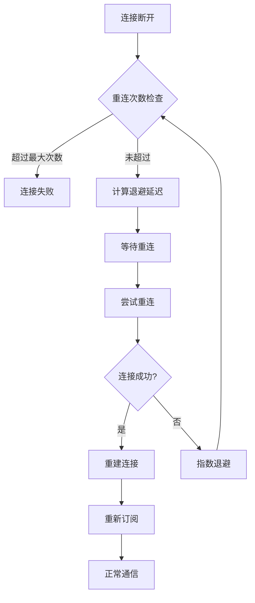

**图表来源**
- [websocket.ts](file://dashboard/frontend/src/services/websocket.ts#L50-L67)

### 错误恢复策略

系统提供多层次的错误恢复机制：

1. **自动重试**：对临时性错误自动重试
2. **降级处理**：WebSocket不可用时使用轮询
3. **状态标记**：明确标识网络连接状态
4. **用户提示**：友好的错误信息和恢复建议

**章节来源**
- [websocket.ts](file://dashboard/frontend/src/services/websocket.ts#L50-L67)

## 最佳实践建议

### 开发建议

1. **消息类型设计**：保持消息类型的语义清晰和稳定
2. **错误处理**：实现完善的错误边界和用户提示
3. **性能监控**：监控WebSocket连接质量和消息处理延迟
4. **测试覆盖**：编写充分的单元测试和集成测试

### 运维建议

1. **监控告警**：设置WebSocket连接状态和消息丢失告警
2. **日志记录**：详细记录消息流转和错误信息
3. **容量规划**：根据用户数量规划WebSocket连接数
4. **安全防护**：实施消息认证和访问控制

### 用户体验优化

1. **即时反馈**：对用户操作提供即时的视觉反馈
2. **状态指示**：清晰显示网络连接状态
3. **离线支持**：在网络不可用时提供基本功能
4. **数据同步**：在网络恢复后自动同步数据

通过以上机制，TaskTree系统实现了高效、可靠的状态同步与一致性保障，为用户提供流畅的实时协作体验。