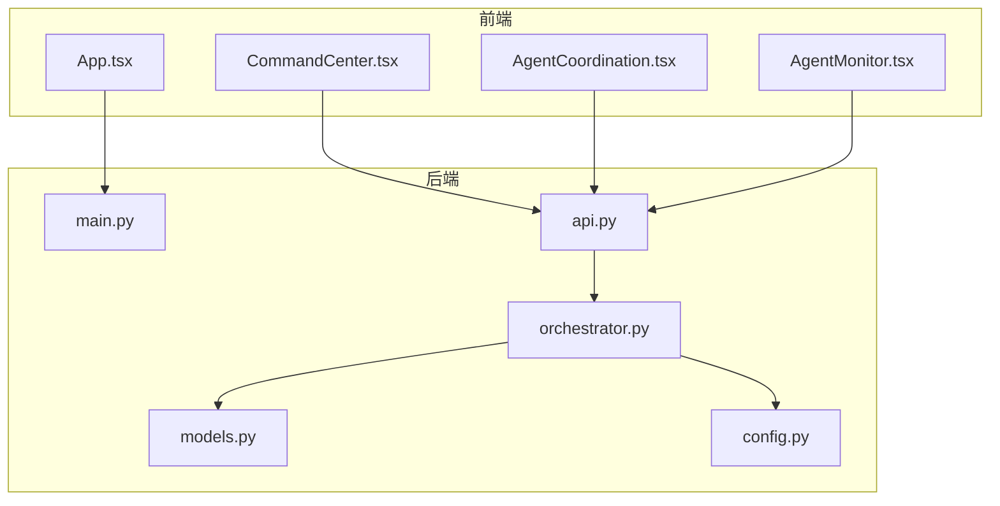

# 系统概述

<cite>
**本文档引用的文件**  
- [mission-control-summary.md](file://Doc/features/mission-control-summary.md)
- [main.py](file://dashboard/backend/main.py)
- [api.py](file://dashboard/backend/api.py)
- [orchestrator.py](file://dashboard/backend/orchestrator.py)
- [models.py](file://dashboard/backend/models.py)
- [config.py](file://dashboard/backend/config.py)
- [App.tsx](file://dashboard/frontend/src/App.tsx)
- [CommandCenter.tsx](file://dashboard/frontend/src/components/CommandCenter.tsx)
- [AgentCoordination.tsx](file://dashboard/frontend/src/components/AgentCoordination.tsx)
- [AgentMonitor.tsx](file://dashboard/frontend/src/components/AgentMonitor.tsx)
</cite>

## 目录
1. [引言](#引言)
2. [核心功能演进](#核心功能演进)
3. [Mission Control核心架构](#mission-control核心架构)
4. [任务节点与树形结构](#任务节点与树形结构)
5. [严格状态机](#严格状态机)
6. [分层上下文管理](#分层上下文管理)
7. [快照与时间旅行](#快照与时间旅行)
8. [AI协作与Co-Pilot](#ai协作与co-pilot)
9. [评审流程](#评审流程)
10. [用户界面](#用户界面)
11. [技术实现](#技术实现)
12. [成功指标](#成功指标)
13. [与现有系统的对比](#与现有系统的对比)
14. [未来展望](#未来展望)

## 引言

Mission Control是TaskTree项目v3.0版本的核心功能，标志着从传统的线性任务管理向空间化任务编排系统的革命性升级。该系统旨在解决AI代理在长时程任务执行中面临的长时程遗忘、状态模糊、缺乏回滚机制等核心痛点。通过引入树形任务结构、DAG依赖图、严格状态机、分层上下文管理和快照系统等关键技术，Mission Control为多AI代理的并行开发、任务调度、代码合并和实时监控提供了一个企业级的协调与管理平台。

**Section sources**
- [mission-control-summary.md](file://Doc/features/mission-control-summary.md#L1-L363)

## 核心功能演进

Mission Control代表了TaskTree从v2.0到v3.0的重大架构演进。这一演进不仅仅是功能的增加，更是任务管理范式的根本性转变。

### 从线性到空间化

在v2.0版本中，任务管理采用扁平化的列表结构，任务之间仅有简单的依赖数组，状态流转也相对简单。这种线性模型在处理复杂项目时显得力不从心，难以表达任务间的复杂关系和层次结构。

v3.0的Mission Control则引入了空间化的任务编排理念。任务不再是简单的列表项，而是可以无限嵌套的树形节点，形成一个复杂的任务网络。这种转变使得系统能够更好地模拟现实世界中项目的复杂性和层次性。

### 关键升级

v3.0的核心升级包括：
- **树形任务结构**：支持任务的无限嵌套，形成父子关系，使项目结构更加清晰。
- **DAG依赖图**：将简单的依赖数组升级为有向无环图，可以精确表达任务间的复杂依赖关系。
- **严格状态机**：从5个状态扩展到6个状态，并引入严格的转换规则，确保任务状态的准确性和一致性。
- **分层上下文管理**：引入全局、父级和本地三层上下文，有效解决了长时程遗忘问题。
- **快照系统**：支持创建项目快照并恢复到任意历史状态，提供了强大的回滚能力。

**Section sources**
- [mission-control-summary.md](file://Doc/features/mission-control-summary.md#L11-L24)

## Mission Control核心架构

Mission Control的架构设计旨在支持复杂的任务编排和AI代理协调。其核心由后端服务、前端界面和数据模型三大部分组成。

### 后端服务

后端采用FastAPI框架构建，提供了RESTful API和WebSocket实时通信。`main.py`文件定义了应用的入口，配置了CORS和生命周期管理。`api.py`文件包含了所有API端点，负责处理项目、任务、代理的增删改查操作。

`orchestrator.py`是系统的核心协调器，负责管理AI代理的生命周期。它通过定期检查任务状态、管理任务队列、启动和监控代理来实现自动化调度。协调器与`ProjectManager`交互，获取项目和任务信息，并通过`WebSocketManager`向客户端广播状态更新。

### 前端界面

前端采用React 18 + TypeScript技术栈，使用TanStack Query进行状态管理。`App.tsx`是应用的主组件，负责路由和全局状态管理。`CommandCenter.tsx`是项目的核心控制面板，集成了任务板、代理监控、协调中心等多个功能模块。

### 数据模型

数据模型是Mission Control的基础。`models.py`文件定义了`Project`、`Task`、`Agent`等核心数据结构。`config.py`文件中的`ConfigManager`负责管理配置和项目数据，使用JSON文件进行持久化存储。



**Diagram sources**
- [main.py](file://dashboard/backend/main.py#L1-L56)
- [api.py](file://dashboard/backend/api.py#L1-L800)
- [orchestrator.py](file://dashboard/backend/orchestrator.py#L1-L800)
- [models.py](file://dashboard/backend/models.py#L1-L135)
- [config.py](file://dashboard/backend/config.py#L1-L151)
- [App.tsx](file://dashboard/frontend/src/App.tsx#L1-L197)
- [CommandCenter.tsx](file://dashboard/frontend/src/components/CommandCenter.tsx#L1-L98)

**Section sources**
- [main.py](file://dashboard/backend/main.py#L1-L56)
- [api.py](file://dashboard/backend/api.py#L1-L800)
- [orchestrator.py](file://dashboard/backend/orchestrator.py#L1-L800)
- [models.py](file://dashboard/backend/models.py#L1-L135)
- [config.py](file://dashboard/backend/config.py#L1-L151)
- [App.tsx](file://dashboard/frontend/src/App.tsx#L1-L197)
- [CommandCenter.tsx](file://dashboard/frontend/src/components/CommandCenter.tsx#L1-L98)

## 任务节点与树形结构

任务节点（TaskNode）是Mission Control的核心数据单元，它在v2.0的Task模型基础上进行了大幅扩展，以支持更复杂的任务编排需求。

### 树形结构

任务节点引入了树形结构，通过`parent_id`和`children_ids`字段建立父子关系。每个节点都有`depth`和`path`属性，用于表示其在任务树中的位置。这种结构使得任务可以无限嵌套，形成复杂的层次结构，更好地组织大型项目。

### 增强依赖

传统的依赖数组被升级为结构化的`Dependency`对象。每个依赖可以指定类型、状态要求和工件引用，使得依赖关系更加精确和灵活。系统通过DAG（有向无环图）算法验证依赖关系，防止出现循环依赖。

### AI配置

任务节点还包含了AI配置信息，如`PromptSpec`和`AIExecutionConfig`，用于指导AI代理如何执行任务。这使得每个任务都可以拥有定制化的执行策略，提高了任务执行的灵活性和准确性。

**Section sources**
- [mission-control-summary.md](file://Doc/features/mission-control-summary.md#L37-L46)
- [models.py](file://dashboard/backend/models.py#L19-L46)

## 严格状态机

Mission Control引入了严格的6状态状态机，以确保任务状态的准确性和一致性。

### 状态流转

任务节点的6个状态及其流转关系如下：
```
Draft → Ready → Running → Review → Completed
                    ↓
                  Failed
```

- **Draft**：任务草稿状态，尚未准备好执行。
- **Ready**：任务已准备好，可以被代理领取。
- **Running**：任务正在被代理执行。
- **Review**：任务执行完成，等待评审。
- **Completed**：任务通过评审，已成功完成。
- **Failed**：任务执行失败，需要重新处理。

### 状态转换约束

状态机引入了严格的转换约束矩阵，确保状态转换的合法性。例如，只有在所有依赖任务都完成后，任务才能从`Draft`转换到`Ready`。每次状态转换都会记录事件日志，并触发相应的副作用处理器，如发送通知、更新统计信息等。

WebSocket实时广播机制确保所有客户端都能及时收到状态更新，保持界面同步。

**Section sources**
- [mission-control-summary.md](file://Doc/features/mission-control-summary.md#L47-L61)

## 分层上下文管理

分层上下文管理是解决长时程遗忘问题的关键技术。

### 三层架构

上下文管理采用三层架构：
1. **全局上下文（Global Context）**：对所有节点可见的技术约束和设计规范，如编码标准、架构决策等。
2. **父级上下文（Parent Context）**：从父节点继承的决策和输出，确保子任务与父任务的一致性。
3. **本地上下文（Local Context）**：节点专属的信息和用户补充，用于指导当前任务的执行。

### 上下文组装

系统采用智能的上下文组装算法，只加载执行当前任务所必需的信息，避免上下文爆炸。通过Token控制和压缩策略，确保上下文大小在AI模型的处理能力范围内。指针引用机制避免了完整历史的复制，提高了效率。

**Section sources**
- [mission-control-summary.md](file://Doc/features/mission-control-summary.md#L62-L73)

## 快照与时间旅行

快照系统为项目提供了强大的版本控制和回滚能力。

### 功能特性

- **手动/自动快照**：用户可以手动创建快照，系统也可以在关键节点自动创建。
- **时间旅行**：可以恢复到任意历史快照状态，方便回滚错误操作。
- **快照对比**：支持快照间的差异对比，清晰展示变化内容。
- **自动备份**：定期创建备份快照，防止数据丢失。

### 技术实现

快照功能借鉴了Git的快照机制，将项目在某一时刻的状态完整保存。通过增量存储和压缩技术，减少存储开销。快照管理器负责快照的创建、存储、恢复和对比操作。

**Section sources**
- [mission-control-summary.md](file://Doc/features/mission-control-summary.md#L74-L81)

## AI协作与Co-Pilot

AI协作（Co-Pilot）是Mission Control的智能助手，为用户提供全方位的支持。

### 核心能力

- **任务拆解**：AI可以自动将复杂任务分解为更小的子任务，降低任务复杂度。
- **Prompt优化**：建议改进任务指令，提高任务执行的准确性和效率。
- **Token预估**：准确预测任务执行所需的Token消耗，帮助用户规划资源。
- **热替换（Hot-Swap）**：当全局上下文变更时，自动重新规划受影响的任务。

### 实现方式

Co-Pilot通过与Claude等AI模型集成，利用其强大的语言理解和生成能力。前端的Co-Pilot侧边栏提供聊天界面和快捷操作，用户可以随时与AI助手交互。

**Section sources**
- [mission-control-summary.md](file://Doc/features/mission-control-summary.md#L82-L88)
- [orchestrator.py](file://dashboard/backend/orchestrator.py#L25-L888)

## 评审流程

评审流程确保了任务执行的质量和可靠性。

### 流程步骤

```
AI执行完成 → Review状态
    ↓
自动评审（可选）
    ↓
人工决策: 批准/驳回/请求修改
    ↓
Completed或回到Running
```

### 自动评审标准

自动评审基于以下标准：
- 代码规范检查
- 单元测试覆盖
- 文档完整性
- 成功标准匹配

评审面板（ReviewPanel）提供详细的评审信息，包括执行结果、日志和提交记录，帮助用户做出决策。

**Section sources**
- [mission-control-summary.md](file://Doc/features/mission-control-summary.md#L89-L107)

## 用户界面

Mission Control提供了现代化的用户界面，支持双视图系统和丰富的交互功能。

### 双视图系统

#### 看板视图（Kanban视图）
- 6列对应6个状态
- 增强的任务卡片，显示父子关系、依赖状态、Token消耗和实时进度
- 支持拖拽状态转换

#### 节点图视图（Node Graph视图）
- 使用React Flow库可视化DAG依赖图
- 节点根据状态着色
- 依赖边支持动画效果
- 支持递归展开子任务

### Co-Pilot侧边栏

始终可见的AI助手，提供聊天界面和快捷操作，如任务拆解、Prompt优化和Token预估。

### 其他关键界面

- **节点详情面板（NodeDetailsPanel）**：用于编辑任务节点的详细信息。
- **全局上下文编辑器（GlobalContextEditor）**：管理全局上下文。
- **快照管理器（SnapshotManager）**：管理快照和对比。
- **评审面板（ReviewPanel）**：进行任务评审。

**Section sources**
- [mission-control-summary.md](file://Doc/features/mission-control-summary.md#L111-L147)
- [CommandCenter.tsx](file://dashboard/frontend/src/components/CommandCenter.tsx#L1-L98)
- [AgentCoordination.tsx](file://dashboard/frontend/src/components/AgentCoordination.tsx#L1-L220)
- [AgentMonitor.tsx](file://dashboard/frontend/src/components/AgentMonitor.tsx#L1-L283)

## 技术实现

Mission Control的技术实现融合了多种先进技术和设计模式。

### 后端技术栈

- **数据库**：PostgreSQL + SQLAlchemy ORM，使用JSONB字段存储复杂结构。
- **API**：RESTful设计，支持向后兼容的API v2和v3。
- **核心类**：`StateTransitionHandler`（状态机管理）、`ContextBuilder`（上下文组装）、`SnapshotManager`（快照管理）、`DependencyValidator`（依赖验证）。

### 前端技术栈

- **框架**：React 18 + TypeScript
- **可视化**：React Flow（节点图）
- **状态管理**：TanStack Query
- **动画**：Framer Motion

### 核心算法

- **DAG调度算法**：用于验证和调度任务依赖。
- **上下文窗口管理**：借鉴LangChain的上下文管理策略。
- **状态机设计模式**：确保状态转换的正确性。

**Section sources**
- [mission-control-summary.md](file://Doc/features/mission-control-summary.md#L150-L190)

## 成功指标

Mission Control的成功通过一系列性能、用户体验和业务价值指标来衡量。

### 性能目标

- 状态转换响应时间 < 200ms
- 上下文组装时间 < 500ms
- 快照创建时间 < 2s
- 节点图渲染（100节点） < 1s
- Token预估误差 < 10%

### 用户体验

- 学习曲线 < 30分钟
- 任务拆解准确率 > 80%
- 自动评审准确率 > 70%
- UI响应流畅（60fps）

### 业务价值

- 项目管理效率提升 50%
- 减少任务冲突 80%
- 解决上下文遗忘问题 90%
- 支持更复杂的项目结构

**Section sources**
- [mission-control-summary.md](file://Doc/features/mission-control-summary.md#L237-L259)

## 与现有系统的对比

Mission Control在设计上借鉴了Linear、GitHub Projects等系统的优点，同时进行了创新。

### 与Linear的异同

- **相同点**：都强调简洁的界面和流畅的用户体验。
- **不同点**：Linear专注于线性任务流，而Mission Control支持复杂的空间化任务编排。

### 与GitHub Projects的异同

- **相同点**：都支持看板视图和任务管理。
- **不同点**：GitHub Projects主要用于项目跟踪，而Mission Control集成了AI代理协调和自动化执行。

### 与Figma的异同

- **相同点**：都支持实时协作和可视化编辑。
- **不同点**：Figma是设计工具，而Mission Control是开发和任务管理平台。

**Section sources**
- [mission-control-summary.md](file://Doc/features/mission-control-summary.md#L326-L334)

## 未来展望

Mission Control的未来规划包括多个版本的迭代和功能扩展。

### v3.1计划

- 时间线视图（甘特图）
- 资源池管理（Agent资源调度）
- 批量操作（批量状态转换）
- 模板系统（项目模板、任务模板）

### v3.2计划

- 多人协作（实时协同编辑）
- 权限管理（节点级别权限）
- 审批流程（多级审批）
- 数据分析（项目效率分析）

### v4.0愿景

- 可视化编程（拖拽生成代码）
- 自适应调度（AI自动优化执行顺序）
- 跨项目依赖（Mission间依赖）
- 分布式执行（多机器并行）

**Section sources**
- [mission-control-summary.md](file://Doc/features/mission-control-summary.md#L300-L323)