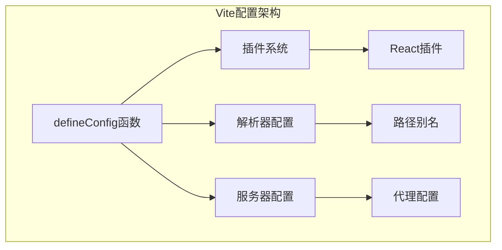
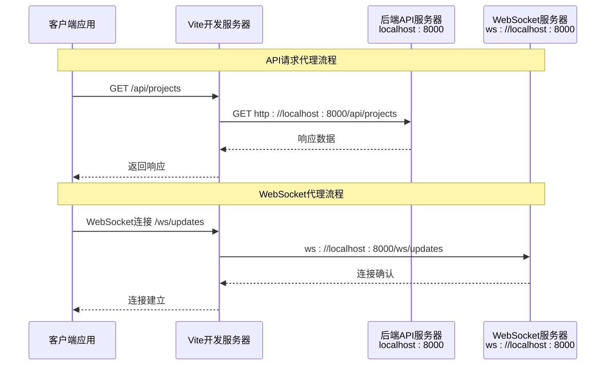
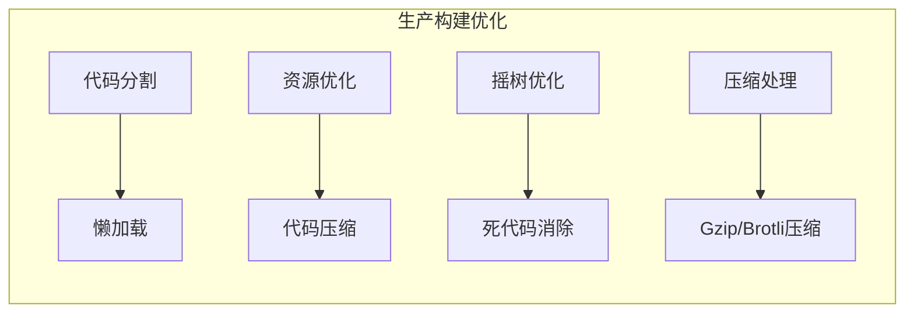

# TaskTree前端构建配置详细文档

<cite>
**本文档引用的文件**
- [vite.config.ts](file://dashboard/frontend/vite.config.ts)
- [package.json](file://dashboard/frontend/package.json)
- [api.ts](file://dashboard/frontend/src/services/api.ts)
- [websocket.ts](file://dashboard/frontend/src/services/websocket.ts)
- [useWebSocket.ts](file://dashboard/frontend/src/hooks/useWebSocket.ts)
- [App.tsx](file://dashboard/frontend/src/App.tsx)
- [index.ts](file://dashboard/frontend/src/types/index.ts)
- [tsconfig.json](file://dashboard/frontend/tsconfig.json)
- [tailwind.config.js](file://dashboard/frontend/tailwind.config.js)
</cite>

## 目录
1. [项目概述](#项目概述)
2. [Vite构建配置详解](#vite构建配置详解)
3. [路径别名配置](#路径别名配置)
4. [服务器代理配置](#服务器代理配置)
5. [TypeScript配置集成](#typescript配置集成)
6. [实际使用示例](#实际使用示例)
7. [环境差异与优化](#环境差异与优化)
8. [性能优化建议](#性能优化建议)
9. [可扩展性设计](#可扩展性设计)
10. [故障排除指南](#故障排除指南)

## 项目概述

TaskTree是一个基于React和TypeScript的现代化前端项目，采用Vite作为构建工具。该项目实现了任务树管理系统的用户界面，支持实时数据更新、项目管理和任务协调等功能。前端构建配置通过Vite提供了高效的开发体验和优化的生产构建。

### 技术栈概览
- **构建工具**: Vite 5.0.8
- **框架**: React 18.2.0
- **语言**: TypeScript 5.2.2
- **样式**: Tailwind CSS 3.3.0
- **状态管理**: TanStack React Query 5.12.2
- **UI组件库**: Radix UI + 自定义组件

## Vite构建配置详解

### defineConfig基础结构

Vite配置采用现代JavaScript语法，通过`defineConfig`函数提供类型安全的配置体验。配置导出的是一个标准的Vite配置对象，包含了插件、解析器、服务器等核心功能模块。



**图表来源**
- [vite.config.ts](file://dashboard/frontend/vite.config.ts#L1-L25)

### React插件集成

React插件是Vite配置的核心组成部分，负责处理JSX转换、热模块替换和开发时的React特性支持。插件配置简洁高效，无需额外参数即可实现完整的React开发体验。

**章节来源**
- [vite.config.ts](file://dashboard/frontend/vite.config.ts#L1-L25)
- [package.json](file://dashboard/frontend/package.json#L43)

## 路径别名配置

### @别名的实现机制

路径别名配置通过`resolve.alias`实现，将`@`符号映射到项目根目录下的`src`目录。这种配置方式显著简化了模块导入路径，提高了代码的可读性和维护性。

```mermaid
flowchart LR
subgraph "路径解析流程"
ImportStatement[导入语句<br/>import { api } from '@/services/api']
AliasResolver[别名解析器]
PathResolver[路径解析器]
FileSystem[文件系统]
ImportStatement --> AliasResolver
AliasResolver --> PathResolver
PathResolver --> FileSystem
FileSystem --> Module[模块实例]
end
subgraph "配置映射"
AtSymbol["@符号"]
SrcDirectory["src目录"]
AtSymbol -.-> SrcDirectory
end
```

**图表来源**
- [vite.config.ts](file://dashboard/frontend/vite.config.ts#L8-L11)
- [tsconfig.json](file://dashboard/frontend/tsconfig.json#L25-L27)

### 别名配置的具体实现

别名配置使用Node.js的`path`模块进行绝对路径解析，确保在不同操作系统环境下的一致性。配置中的`path.resolve(__dirname, "./src")`确保了从项目根目录开始的正确路径解析。

### TypeScript集成

TypeScript配置通过`tsconfig.json`中的`paths`字段与Vite的别名保持同步，确保开发工具能够正确识别和解析别名路径。这种双重配置保证了编译时和运行时的一致性。

**章节来源**
- [vite.config.ts](file://dashboard/frontend/vite.config.ts#L8-L11)
- [tsconfig.json](file://dashboard/frontend/tsconfig.json#L25-L27)

## 服务器代理配置

### 代理配置架构

Vite的服务器代理功能为开发环境提供了强大的跨域解决方案。配置包含两个主要代理规则：API请求代理和WebSocket代理。



**图表来源**
- [vite.config.ts](file://dashboard/frontend/vite.config.ts#L14-L23)
- [api.ts](file://dashboard/frontend/src/services/api.ts#L3)
- [websocket.ts](file://dashboard/frontend/src/services/websocket.ts#L16-L17)

### API请求代理配置

API代理规则将所有以`/api`开头的请求转发到后端API服务器。关键配置参数包括：

- **target**: 目标服务器地址`http://localhost:8000`
- **changeOrigin**: 设置为`true`，确保请求头中的Host字段被修改为目标服务器的主机名

这种配置解决了开发环境下的CORS（跨域资源共享）问题，使前端应用能够无缝访问后端API。

### WebSocket代理配置

WebSocket代理专门处理实时通信需求，配置特点：

- **target**: 使用`ws://`协议前缀
- **ws**: 设置为`true`，启用WebSocket代理功能

WebSocket代理确保实时数据流能够通过Vite开发服务器进行透明转发，维持低延迟的双向通信。

**章节来源**
- [vite.config.ts](file://dashboard/frontend/vite.config.ts#L14-L23)
- [api.ts](file://dashboard/frontend/src/services/api.ts#L3)
- [websocket.ts](file://dashboard/frontend/src/services/websocket.ts#L16-L17)

## TypeScript配置集成

### 路径映射同步

TypeScript配置通过`baseUrl`和`paths`字段实现与Vite别名的完全同步。这种集成确保了：

1. **开发工具支持**: IDE和编辑器能够正确解析别名路径
2. **编译时检查**: TypeScript编译器能够识别别名导入
3. **运行时兼容**: 构建后的代码仍然能够正确解析路径

### 模块解析策略

配置采用了现代的模块解析策略，支持ES模块格式和TypeScript扩展名导入。这种策略提高了构建效率并减少了打包体积。

**章节来源**
- [tsconfig.json](file://dashboard/frontend/tsconfig.json#L24-L27)

## 实际使用示例

### 组件中的别名使用

在实际项目中，`@`别名广泛应用于各种模块导入场景：

```typescript
// API服务导入示例
import { api } from '@/services/api';

// WebSocket服务导入示例  
import { websocket } from '@/services/websocket';

// 类型定义导入示例
import { Project, Task } from '@/types';

// UI组件导入示例
import { Button } from '@/components/ui/button';
```

### 代理配置的影响

代理配置对前后端通信产生以下影响：

1. **统一的API入口**: 所有API请求都通过`/api`前缀，便于管理和维护
2. **透明的WebSocket连接**: WebSocket连接自动通过代理转发，无需特殊处理
3. **开发环境隔离**: 代理确保前端开发环境与后端服务的独立性

**章节来源**
- [App.tsx](file://dashboard/frontend/src/App.tsx#L1-L197)
- [api.ts](file://dashboard/frontend/src/services/api.ts#L1-L248)
- [useWebSocket.ts](file://dashboard/frontend/src/hooks/useWebSocket.ts#L1-L24)

## 环境差异与优化

### 开发环境特性

开发环境配置专注于提升开发体验：

- **热模块替换(HMR)**: 实时更新组件而无需刷新页面
- **源码映射**: 保留原始源码信息，便于调试
- **代理服务**: 自动处理跨域请求和WebSocket连接

### 生产环境优化

生产环境构建包含多项优化措施：



### 性能配置考虑

虽然当前配置主要关注开发体验，但Vite的生产构建能力提供了多种优化选项：

1. **代码分割**: 自动将vendor代码和应用代码分离
2. **资源预加载**: 智能预加载关键资源
3. **缓存策略**: 利用浏览器缓存提高加载速度

## 性能优化建议

### 代码分割策略

针对大型应用，建议实施以下代码分割策略：

1. **路由级分割**: 按页面路由进行代码分割
2. **组件级分割**: 将大型组件拆分为独立模块
3. **功能级分割**: 按业务功能进行模块化分割

### 资源优化配置

```typescript
// 推荐的性能优化配置
export default defineConfig({
  build: {
    rollupOptions: {
      output: {
        manualChunks: {
          vendor: ['react', 'react-dom', 'react-router-dom'],
          ui: ['@radix-ui/react-*'],
          utils: ['lodash', 'date-fns']
        }
      }
    },
    minify: 'terser',
    sourcemap: true
  }
})
```

### 缓存优化

利用Vite的内置缓存机制：
- **依赖缓存**: 缓存第三方依赖的解析结果
- **模块缓存**: 缓存模块的编译结果
- **持久化缓存**: 在磁盘上保存缓存数据

## 可扩展性设计

### 添加新的代理规则

根据项目需求，可以轻松添加新的代理规则：

```typescript
// 示例：添加新的API代理规则
export default defineConfig({
  server: {
    proxy: {
      '/api': {
        target: 'http://localhost:8000',
        changeOrigin: true,
      },
      '/ws': {
        target: 'ws://localhost:8000',
        ws: true,
      },
      '/admin': {
        target: 'http://localhost:9000',
        changeOrigin: true,
        rewrite: (path) => path.replace(/^\/admin/, ''),
      }
    },
  }
})
```

### 插件生态系统

Vite拥有丰富的插件生态系统，可以根据需要添加：

1. **CSS预处理器**: 支持Sass、Less等
2. **代码质量工具**: ESLint、Prettier集成
3. **测试框架**: Vitest、Jest支持
4. **部署工具**: 部署脚本集成

### 多环境配置

建议实施多环境配置管理：

```typescript
// vite.config.prod.ts
export default defineConfig({
  // 生产环境特定配置
  build: {
    // 生产优化配置
  }
})

// vite.config.dev.ts  
export default defineConfig({
  // 开发环境特定配置
  server: {
    // 开发服务器配置
  }
})
```

## 故障排除指南

### 常见问题及解决方案

#### 1. 别名无法解析

**症状**: 导入语句出现"Cannot resolve module"错误

**解决方案**:
- 检查`vite.config.ts`中的别名配置
- 确认`tsconfig.json`中的路径映射同步
- 验证文件是否存在且命名正确

#### 2. 代理连接失败

**症状**: API请求返回404或连接超时

**解决方案**:
- 检查后端服务是否正常运行
- 验证代理目标URL配置
- 确认防火墙和网络设置

#### 3. WebSocket连接中断

**症状**: 实时数据更新失效

**解决方案**:
- 检查WebSocket代理配置
- 验证后端WebSocket服务状态
- 确认网络连接稳定性

### 调试技巧

1. **启用详细日志**: 在开发环境中启用Vite的详细日志输出
2. **网络面板监控**: 使用浏览器开发者工具监控网络请求
3. **控制台调试**: 利用console.log进行关键节点调试

### 性能监控

建议实施以下性能监控措施：

- **构建时间监控**: 跟踪构建过程的时间消耗
- **包大小分析**: 使用bundle analyzer分析最终包大小
- **运行时性能**: 监控应用启动时间和内存使用

通过本文档的详细解析，开发者可以深入理解TaskTree项目的前端构建配置，并能够根据项目需求进行相应的调整和优化。配置的模块化设计和良好的可扩展性为项目的长期发展奠定了坚实的基础。