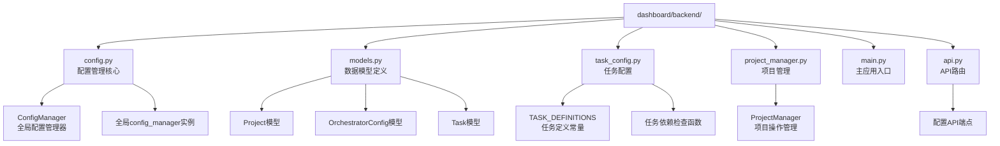
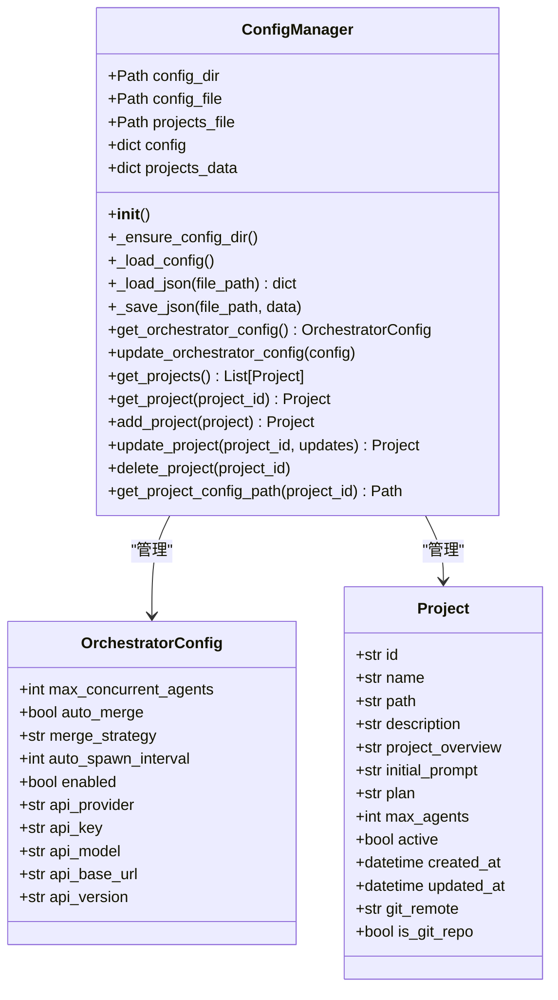
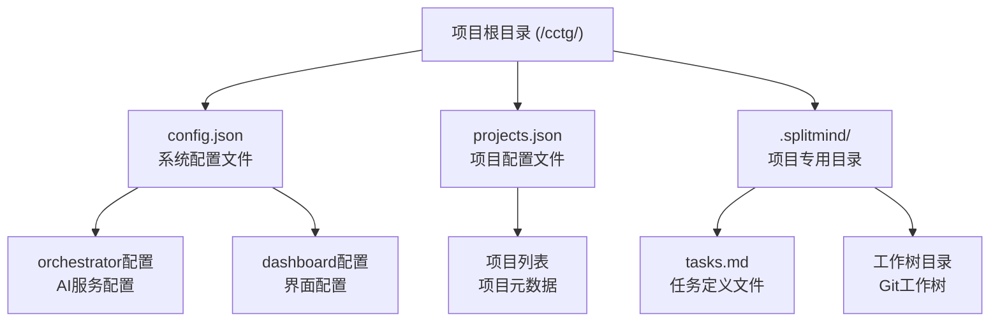
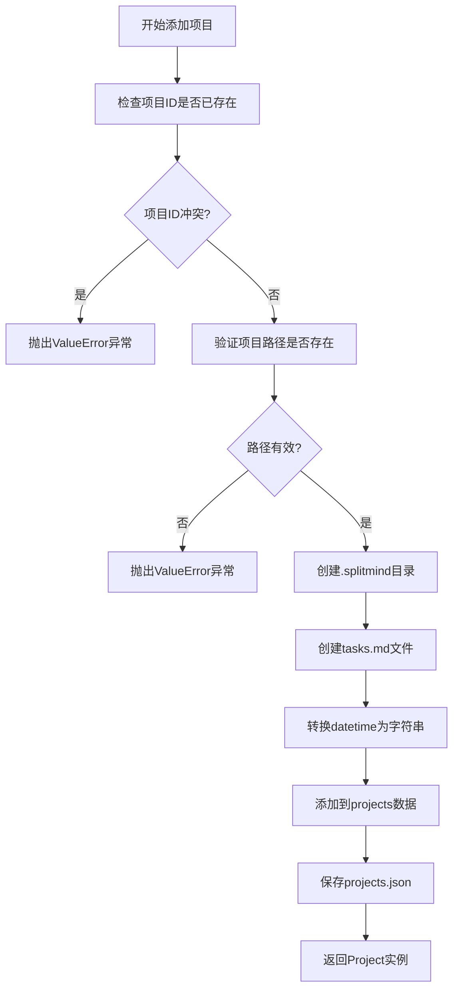
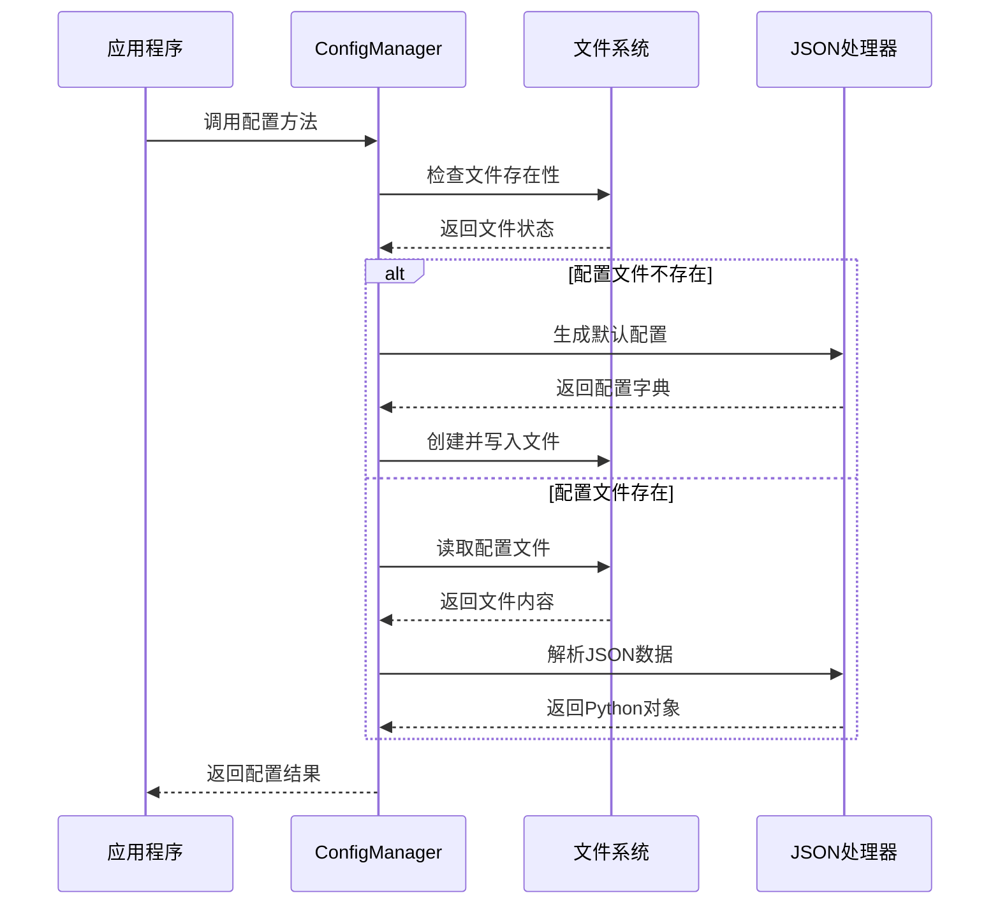
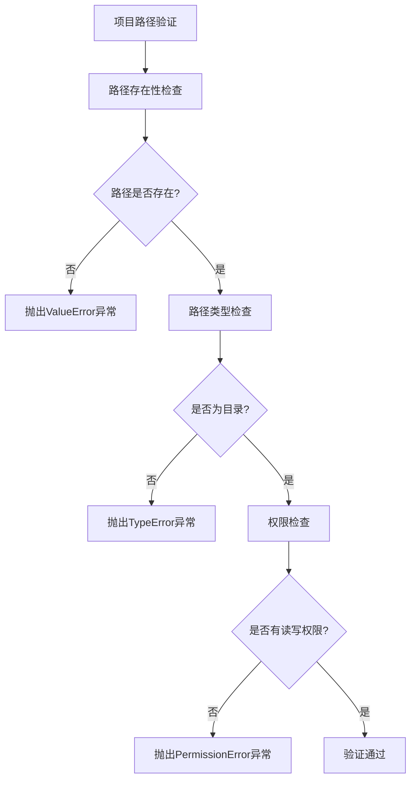

# TaskTree后端配置管理详细文档

<cite>
**本文档中引用的文件**
- [config.py](file://dashboard/backend/config.py)
- [models.py](file://dashboard/backend/models.py)
- [task_config.py](file://dashboard/backend/task_config.py)
- [project_manager.py](file://dashboard/backend/project_manager.py)
- [main.py](file://dashboard/backend/main.py)
- [api.py](file://dashboard/backend/api.py)
</cite>

## 目录
1. [简介](#简介)
2. [项目结构概览](#项目结构概览)
3. [ConfigManager核心类分析](#configmanager核心类分析)
4. [配置文件系统](#配置文件系统)
5. [OrchestratorConfig配置详解](#orchestratorconfig配置详解)
6. [项目管理功能](#项目管理功能)
7. [配置加载与更新流程](#配置加载与更新流程)
8. [安全最佳实践](#安全最佳实践)
9. [依赖关系与约束条件](#依赖关系与约束条件)
10. [实际使用示例](#实际使用示例)
11. [故障排除指南](#故障排除指南)
12. [总结](#总结)

## 简介

TaskTree是一个基于AI的项目管理和任务协调系统，其后端配置管理系统负责维护整个应用的核心配置、项目设置和运行时参数。该系统采用全局单例设计模式，确保配置的一致性和可靠性，同时提供了完整的配置持久化机制来保证数据的安全存储。

配置管理系统的核心组件是`ConfigManager`类，它作为全局单例存在，统一管理所有配置相关的操作。系统支持两种主要的配置文件格式：JSON格式的配置文件和项目定义文件，分别用于存储系统级配置和项目级配置。

## 项目结构概览

TaskTree后端配置管理系统的文件组织结构如下：



**图表来源**
- [config.py](file://dashboard/backend/config.py#L1-L151)
- [models.py](file://dashboard/backend/models.py#L1-L135)
- [task_config.py](file://dashboard/backend/task_config.py#L1-L267)
- [project_manager.py](file://dashboard/backend/project_manager.py#L1-L451)

**章节来源**
- [config.py](file://dashboard/backend/config.py#L1-L151)
- [models.py](file://dashboard/backend/models.py#L1-L135)

## ConfigManager核心类分析

### 设计模式：全局单例

ConfigManager采用全局单例设计模式，确保在整个应用程序生命周期中只有一个配置管理实例存在。这种设计模式的优势在于：

- **一致性保证**：所有模块共享同一份配置数据，避免配置不一致问题
- **性能优化**：减少重复的配置加载开销
- **简化管理**：集中化的配置管理降低了维护复杂度



**图表来源**
- [config.py](file://dashboard/backend/config.py#L11-L151)
- [models.py](file://dashboard/backend/models.py#L99-L114)
- [models.py](file://dashboard/backend/models.py#L63-L85)

### 初始化逻辑

ConfigManager的初始化过程包含以下关键步骤：

1. **路径解析**：确定配置文件的存储位置
2. **目录确保**：创建必要的配置目录
3. **默认配置生成**：在首次运行时生成默认配置
4. **配置文件加载**：从磁盘加载现有配置

**章节来源**
- [config.py](file://dashboard/backend/config.py#L14-L22)

## 配置文件系统

### 存储路径结构

配置文件系统采用层次化的存储结构，所有配置文件都存储在项目根目录下：



**图表来源**
- [config.py](file://dashboard/backend/config.py#L17-L18)

### 默认配置生成

当系统首次启动时，ConfigManager会自动生成默认配置：

#### Orchestrator配置默认值

| 参数名 | 类型 | 默认值 | 描述 |
|--------|------|--------|------|
| max_concurrent_agents | int | 5 | 最大并发代理数量 |
| auto_merge | bool | False | 是否启用自动合并 |
| merge_strategy | str | "merge" | 合并策略（merge/squash/ff） |
| auto_spawn_interval | int | 60 | 自动生成间隔（秒） |
| enabled | bool | False | 是否启用AI协调器 |
| api_provider | str | "anthropic" | AI服务提供商 |
| api_key | str | None | API密钥 |
| api_model | str | "claude-sonnet-4-20250514" | 使用的AI模型 |
| api_base_url | str | None | API基础URL |
| api_version | str | None | API版本 |

#### Dashboard配置默认值

| 参数名 | 类型 | 默认值 | 描述 |
|--------|------|--------|------|
| theme | str | "dark" | 界面主题 |
| notifications | bool | True | 是否启用通知 |

**章节来源**
- [config.py](file://dashboard/backend/config.py#L28-L47)

## OrchestratorConfig配置详解

### 核心参数说明

OrchestratorConfig是系统的核心配置对象，控制着AI协调器的所有行为：

#### 并发控制参数

- **max_concurrent_agents**：控制同时运行的最大AI代理数量，防止资源过度消耗
- **auto_spawn_interval**：自动创建新代理的时间间隔，平衡任务处理效率和资源使用

#### 合并策略配置

- **auto_merge**：启用后，完成的任务会自动合并到主分支
- **merge_strategy**：支持三种合并策略：
  - `merge`：标准合并提交
  - `squash`：压缩合并，将多个提交合并为一个
  - `ff`：快进合并，仅在可快进时合并

#### API集成配置

- **api_provider**：支持多种AI服务提供商
- **api_key**：用于身份验证的API密钥
- **api_model**：指定使用的AI模型
- **api_base_url**：自定义API端点URL
- **api_version**：API版本号或特殊标识

**章节来源**
- [models.py](file://dashboard/backend/models.py#L99-L114)

## 项目管理功能

### add_project方法实现

`add_project`方法负责创建新的项目，执行以下操作：



**图表来源**
- [config.py](file://dashboard/backend/config.py#L88-L117)

### update_project时间戳更新机制

`update_project`方法实现了智能的时间戳管理：

- **自动更新**：如果未指定`updated_at`字段，系统会自动设置当前时间
- **数据转换**：将Python datetime对象转换为ISO格式字符串以确保JSON兼容性
- **原子性更新**：一次性更新所有指定字段，保证数据一致性

**章节来源**
- [config.py](file://dashboard/backend/config.py#L118-L131)

## 配置加载与更新流程

### JSON序列化处理

ConfigManager使用专门的JSON处理方法来确保数据的正确序列化：

#### _load_json方法
- **功能**：从文件系统加载JSON配置
- **实现**：直接使用标准库json.load()进行反序列化
- **错误处理**：保持标准的Python异常处理机制

#### _save_json方法
- **功能**：将配置数据保存到文件系统
- **实现**：使用json.dump()，并传入default=str参数处理datetime对象
- **格式化**：启用indent=2参数提供可读的JSON格式



**图表来源**
- [config.py](file://dashboard/backend/config.py#L58-L67)

**章节来源**
- [config.py](file://dashboard/backend/config.py#L58-L67)

## 安全最佳实践

### 敏感信息保护

配置管理系统采用了多层次的安全保护措施：

#### 环境变量注入方式

虽然当前实现直接在配置文件中存储API密钥，但系统设计支持通过环境变量注入敏感信息：

- **API密钥管理**：建议通过环境变量传递API密钥，避免硬编码
- **配置优先级**：环境变量可以覆盖配置文件中的敏感信息
- **运行时注入**：在应用启动时动态注入配置参数

#### 配置文件权限控制

- **文件权限**：配置文件应设置适当的文件权限，限制访问范围
- **备份策略**：定期备份配置文件，防止数据丢失
- **审计日志**：记录配置变更历史，便于问题追踪

### 数据验证机制

系统实现了多层数据验证：

- **类型验证**：Pydantic模型自动验证数据类型
- **范围验证**：数值参数有明确的取值范围
- **格式验证**：字符串参数遵循特定格式要求

**章节来源**
- [models.py](file://dashboard/backend/models.py#L63-L85)

## 依赖关系与约束条件

### 项目路径验证

系统对项目路径实施严格的验证机制：



**图表来源**
- [config.py](file://dashboard/backend/config.py#L95-L98)

### 配置项依赖关系

不同配置项之间存在复杂的依赖关系：

#### OrchestratorConfig内部依赖

- **api_key**：需要api_provider确定认证方式
- **api_model**：依赖于具体的api_provider支持
- **api_base_url** 和 **api_version**：通常一起使用，用于自定义API端点

#### 项目配置约束

- **max_agents**：不能超过系统资源限制
- **auto_merge**：需要Git仓库支持
- **merge_strategy**：需要有效的合并策略值

**章节来源**
- [config.py](file://dashboard/backend/config.py#L95-L98)

## 实际使用示例

### 基本配置读取

通过全局config_manager实例可以轻松访问各种配置：

```python
# 获取Orchestrator配置
orch_config = config_manager.get_orchestrator_config()

# 获取项目列表
projects = config_manager.get_projects()

# 获取特定项目
project = config_manager.get_project(project_id)
```

### 配置更新操作

配置更新通过统一的接口进行：

```python
# 更新Orchestrator配置
new_config = OrchestratorConfig(
    max_concurrent_agents=10,
    auto_merge=True,
    api_key="your-api-key"
)
config_manager.update_orchestrator_config(new_config)

# 更新项目配置
updates = {
    "description": "Updated project description",
    "max_agents": 8
}
updated_project = config_manager.update_project(project_id, updates)
```

### 项目管理操作

项目管理提供了完整的CRUD操作：

```python
# 创建新项目
new_project = Project(
    id="my-project",
    name="My Project",
    path="/path/to/project"
)
created_project = config_manager.add_project(new_project)

# 删除项目
config_manager.delete_project(project_id)
```

**章节来源**
- [config.py](file://dashboard/backend/config.py#L68-L150)
- [api.py](file://dashboard/backend/api.py#L95-L169)

## 故障排除指南

### 常见配置问题

#### 配置文件损坏

**症状**：应用启动时出现JSON解析错误
**解决方案**：
1. 备份当前配置文件
2. 删除损坏的配置文件
3. 系统会自动生成新的默认配置

#### 权限问题

**症状**：无法创建或修改配置文件
**解决方案**：
1. 检查项目根目录的写入权限
2. 确保用户对.config目录有适当权限
3. 考虑使用sudo或调整文件权限

#### 路径验证失败

**症状**：添加项目时提示路径无效
**解决方案**：
1. 验证项目路径确实存在且可访问
2. 确保路径不是符号链接（可能引起权限问题）
3. 检查路径权限设置

### 性能优化建议

#### 配置缓存策略

- **内存缓存**：ConfigManager实例本身充当内存缓存
- **延迟加载**：非关键配置按需加载
- **批量操作**：尽量减少频繁的配置文件I/O操作

#### 并发控制

- **线程安全**：ConfigManager设计考虑了多线程环境
- **锁机制**：重要配置更新使用适当的同步机制
- **异步处理**：非阻塞的配置读取操作

**章节来源**
- [config.py](file://dashboard/backend/config.py#L14-L22)

## 总结

TaskTree的后端配置管理系统是一个设计精良、功能完备的配置管理解决方案。通过全局单例模式的ConfigManager类，系统实现了统一的配置管理，确保了配置的一致性和可靠性。

### 主要特性

1. **全局单例设计**：确保配置管理的一致性
2. **持久化存储**：可靠的JSON文件存储机制
3. **类型安全**：基于Pydantic的数据模型验证
4. **灵活扩展**：支持多种AI服务提供商和配置选项
5. **项目管理**：完整的项目生命周期管理功能

### 技术优势

- **模块化设计**：清晰的职责分离和接口定义
- **错误处理**：完善的异常处理和验证机制
- **性能优化**：合理的缓存策略和I/O优化
- **安全性**：多层次的安全保护措施

### 发展方向

配置管理系统为TaskTree提供了坚实的基础，未来可以考虑以下改进方向：

- **配置热重载**：支持运行时配置更新而无需重启
- **配置版本控制**：跟踪配置变更历史
- **远程配置**：支持分布式配置存储
- **可视化管理**：提供图形化的配置管理界面

这个配置管理系统不仅满足了当前的功能需求，还为未来的扩展和发展奠定了良好的基础。