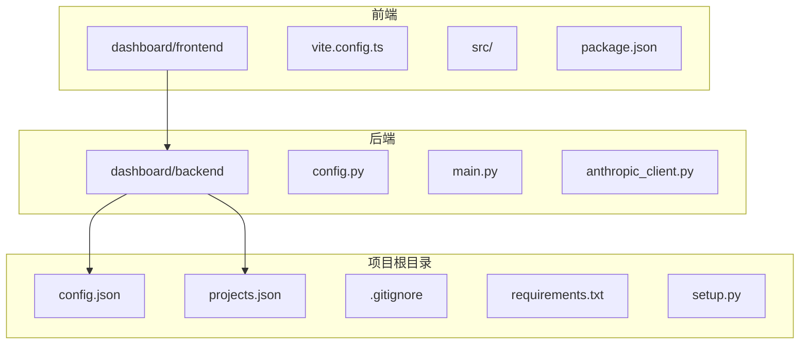
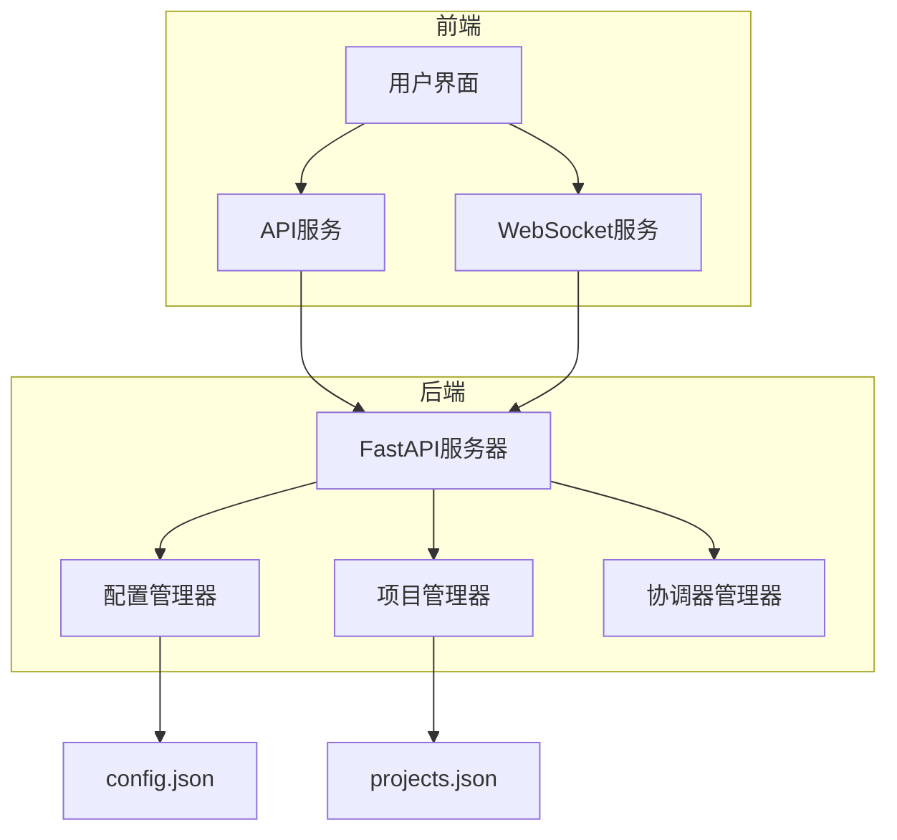
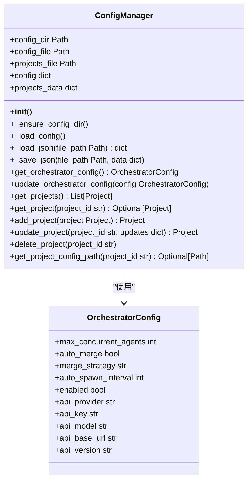
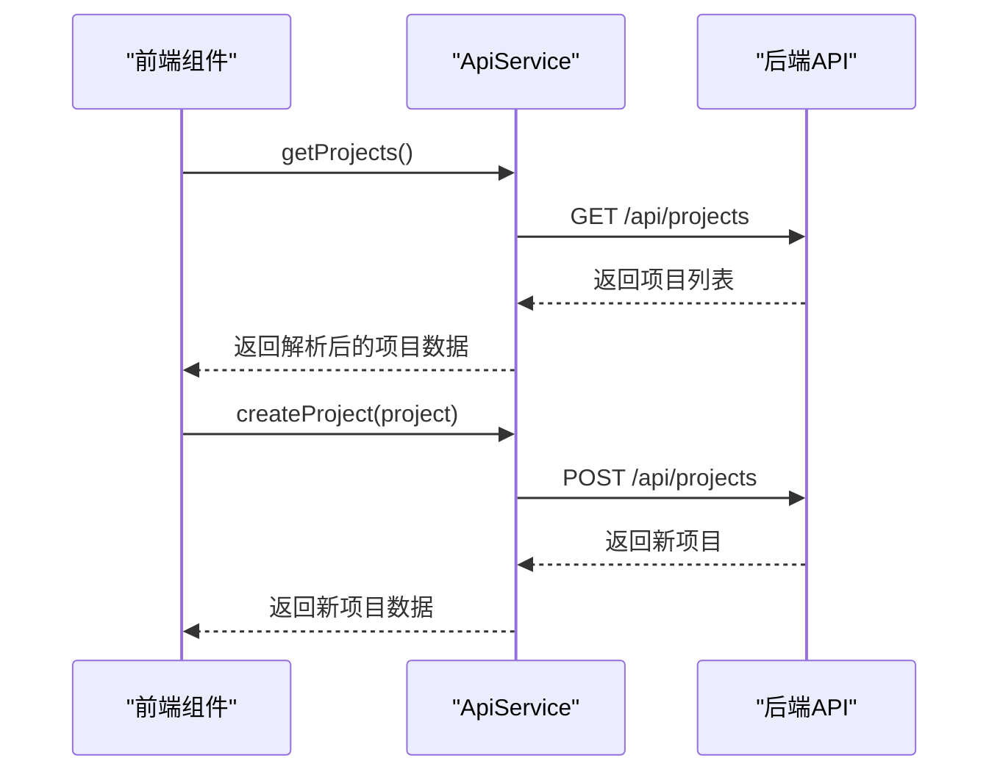
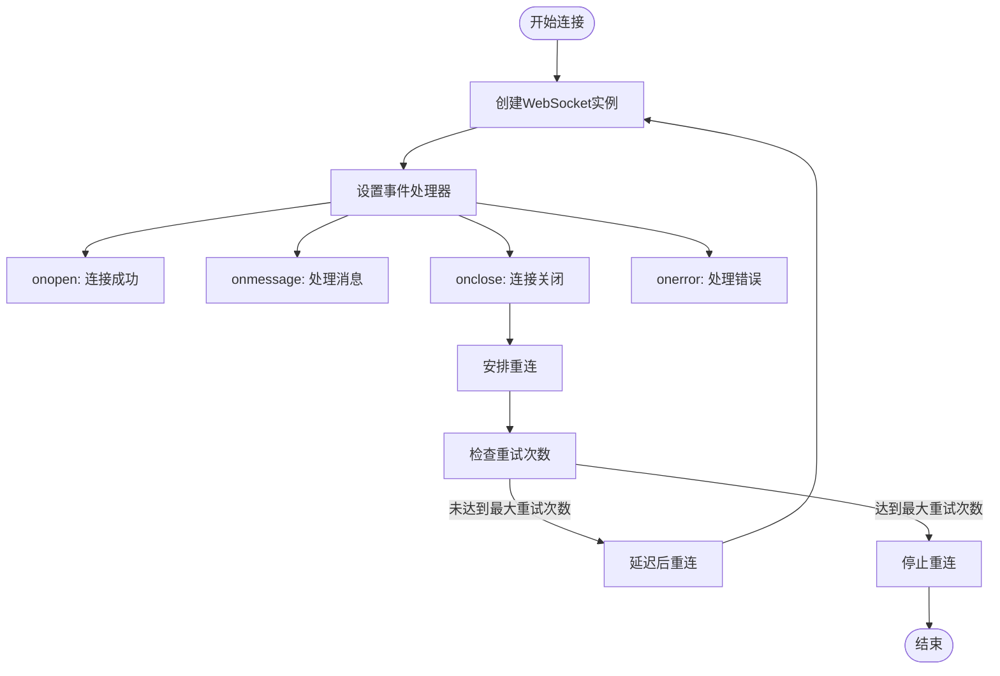
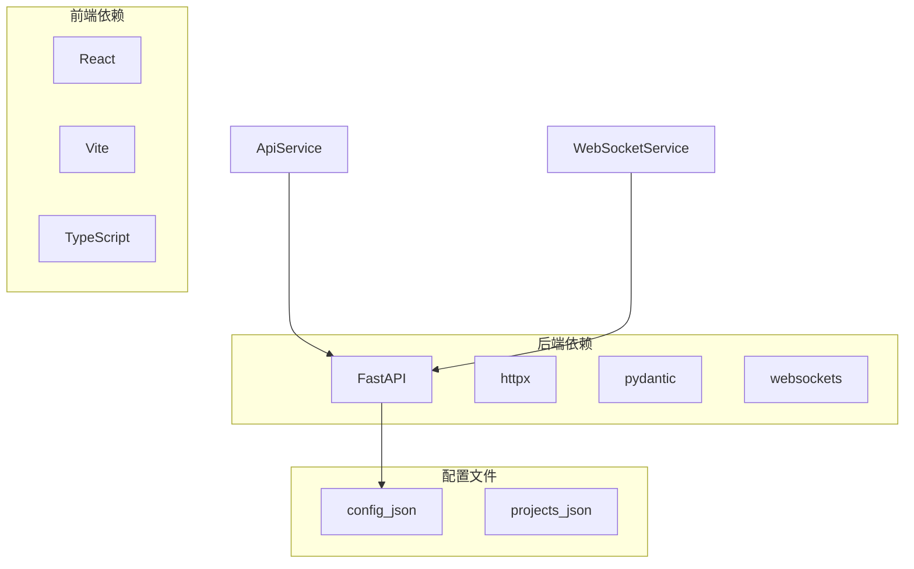

# 环境管理与安全策略

<cite>
**本文档引用的文件**   
- [config.py](file://dashboard/backend/config.py)
- [vite.config.ts](file://dashboard/frontend/vite.config.ts)
- [anthropic_client.py](file://dashboard/backend/anthropic_client.py)
- [.gitignore](file://.gitignore)
- [api.ts](file://dashboard/frontend/src/services/api.ts)
- [websocket.ts](file://dashboard/frontend/src/services/websocket.ts)
- [main.py](file://dashboard/backend/main.py)
</cite>

## 目录
1. [简介](#简介)
2. [项目结构](#项目结构)
3. [核心组件](#核心组件)
4. [架构概述](#架构概述)
5. [详细组件分析](#详细组件分析)
6. [依赖分析](#依赖分析)
7. [性能考虑](#性能考虑)
8. [故障排除指南](#故障排除指南)
9. [结论](#结论)

## 简介
本文档全面阐述了TaskTree项目的环境管理与安全策略。文档整合了前后端配置，描述了多环境（开发、测试、生产）的配置管理策略，并详细说明了环境变量的使用规范。文档还解释了敏感信息保护机制，包括API密钥的安全存储和访问控制，以及配置文件的版本控制策略。通过提供实际的部署配置示例和安全审计清单，本文档为项目的安全性和可维护性提供了全面的指导。

## 项目结构
TaskTree项目采用前后端分离的架构，前端位于`dashboard/frontend`目录，后端位于`dashboard/backend`目录。项目根目录包含配置文件和依赖管理文件。这种结构清晰地分离了用户界面和业务逻辑，便于独立开发和部署。

**图源**
- [config.py](file://dashboard/backend/config.py#L1-L150)
- [vite.config.ts](file://dashboard/frontend/vite.config.ts#L1-L25)

**本节来源**
- [config.py](file://dashboard/backend/config.py#L1-L150)
- [vite.config.ts](file://dashboard/frontend/vite.config.ts#L1-L25)

## 核心组件
TaskTree的核心组件包括后端的`ConfigManager`类和前端的`ApiService`类。`ConfigManager`负责管理项目的配置和项目数据，包括加载和保存配置文件。`ApiService`则封装了所有前端与后端API的交互，提供了统一的接口供前端组件调用。

**本节来源**
- [config.py](file://dashboard/backend/config.py#L11-L150)
- [api.ts](file://dashboard/frontend/src/services/api.ts#L5-L248)

## 架构概述
TaskTree采用典型的前后端分离架构，前端通过Vite构建，后端使用FastAPI框架。前端通过API和WebSocket与后端通信，后端负责业务逻辑处理和数据持久化。配置管理通过JSON文件实现，敏感信息通过环境变量保护。

**图源**
- [main.py](file://dashboard/backend/main.py#L1-L56)
- [config.py](file://dashboard/backend/config.py#L11-L150)

## 详细组件分析

### 配置管理器分析
`ConfigManager`类是后端配置管理的核心，负责加载和保存`config.json`和`projects.json`文件。它在初始化时确保配置目录存在，并创建默认配置文件。

#### 配置管理器类图

**图源**
- [config.py](file://dashboard/backend/config.py#L11-L150)

**本节来源**
- [config.py](file://dashboard/backend/config.py#L11-L150)

### API服务分析
前端的`ApiService`类封装了所有与后端API的交互，提供了类型安全的接口供前端组件使用。它处理HTTP请求的发送和响应的解析。

#### API服务调用序列图

**图源**
- [api.ts](file://dashboard/frontend/src/services/api.ts#L5-L248)

**本节来源**
- [api.ts](file://dashboard/frontend/src/services/api.ts#L5-L248)

### WebSocket服务分析
WebSocket服务负责处理前端与后端之间的实时通信，支持自动重连机制，确保连接的稳定性。

#### WebSocket连接流程图

**图源**
- [websocket.ts](file://dashboard/frontend/src/services/websocket.ts#L5-L98)

**本节来源**
- [websocket.ts](file://dashboard/frontend/src/services/websocket.ts#L5-L98)

## 依赖分析
项目依赖通过`requirements.txt`和`package.json`文件管理。后端依赖FastAPI、httpx等库，前端依赖React、Vite等库。配置文件通过`.gitignore`排除敏感信息。

**图源**
- [requirements.txt](file://requirements.txt#L1-L10)
- [package.json](file://dashboard/frontend/package.json#L1-L54)

**本节来源**
- [requirements.txt](file://requirements.txt#L1-L10)
- [package.json](file://dashboard/frontend/package.json#L1-L54)

## 性能考虑
项目在性能方面考虑了配置文件的缓存、WebSocket的自动重连机制以及API调用的错误处理。前端使用React的组件化架构和Vite的快速热重载，后端使用FastAPI的异步处理能力。

## 故障排除指南
当遇到配置问题时，首先检查`config.json`和`projects.json`文件是否存在且格式正确。对于API连接问题，检查后端服务是否运行，以及Vite代理配置是否正确。WebSocket连接问题通常与网络或后端服务状态有关。

**本节来源**
- [config.py](file://dashboard/backend/config.py#L23-L52)
- [vite.config.ts](file://dashboard/frontend/vite.config.ts#L13-L23)

## 结论
TaskTree项目通过清晰的配置管理策略和安全机制，实现了高效的环境管理和安全保障。通过环境变量覆盖敏感配置、前后端协同工作流程以及严格的版本控制策略，项目确保了配置的安全性和可维护性。建议在生产环境中使用环境变量管理所有敏感信息，并定期进行安全审计。