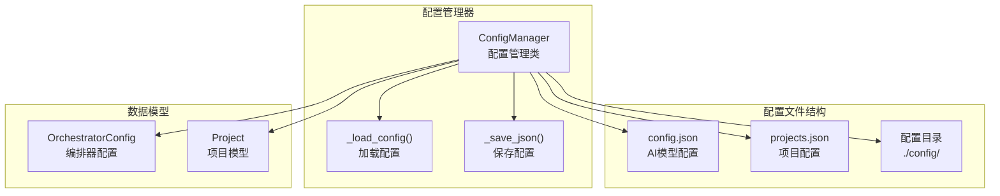
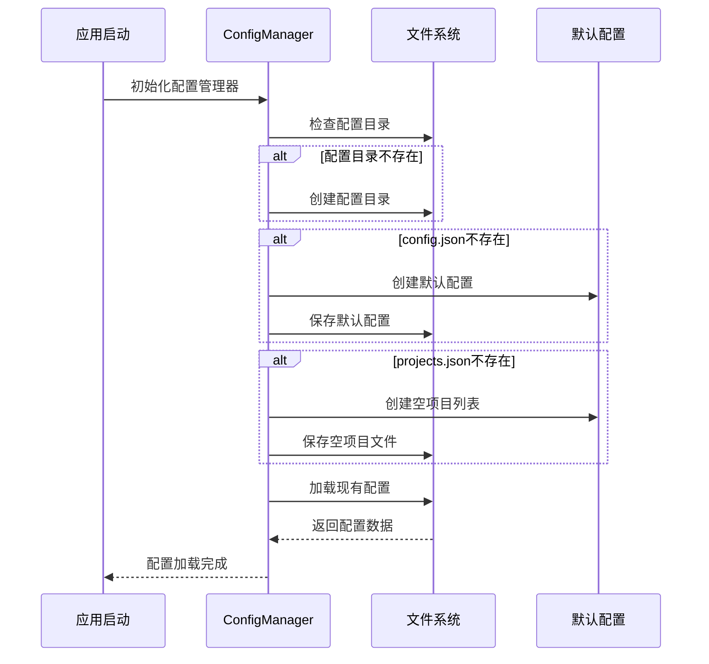
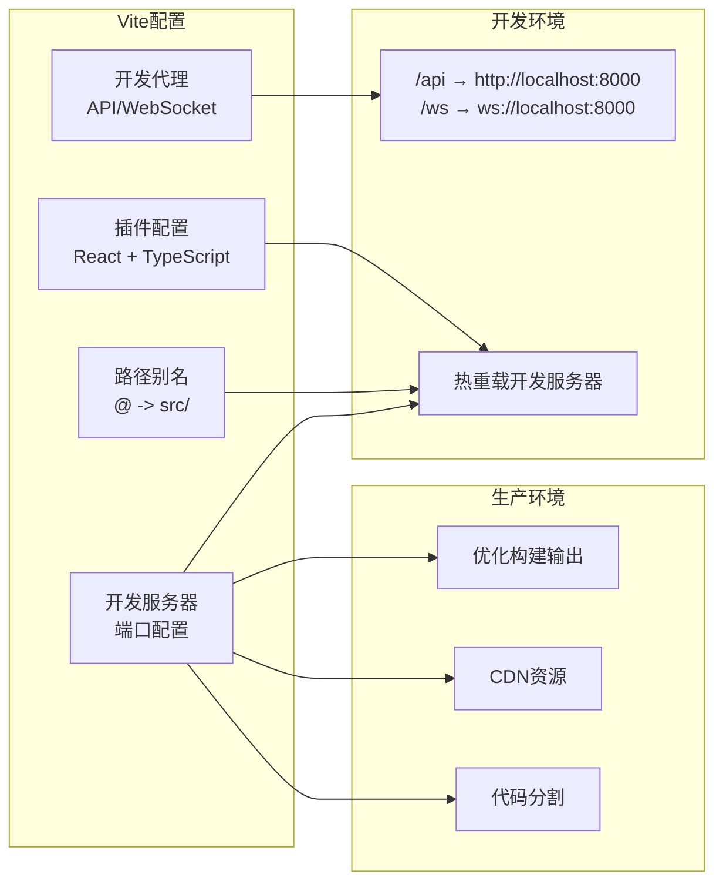
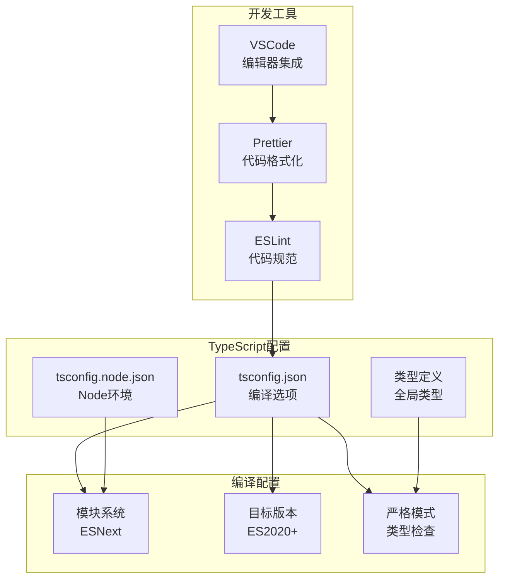
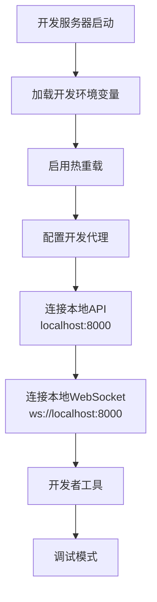
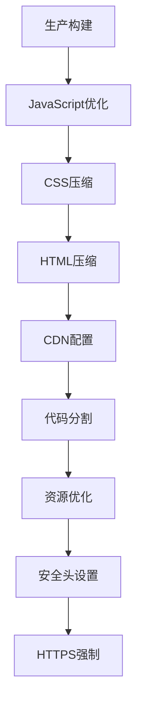
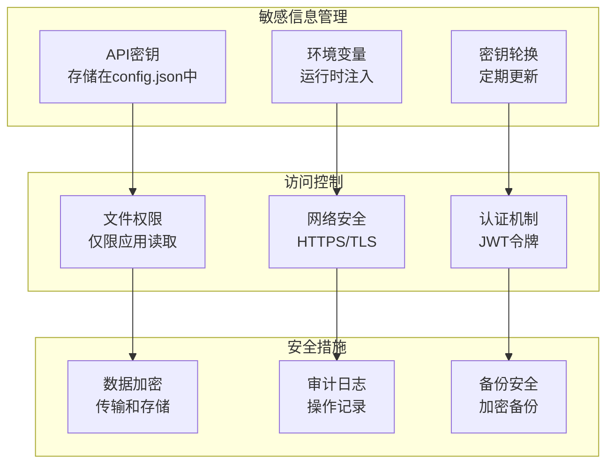
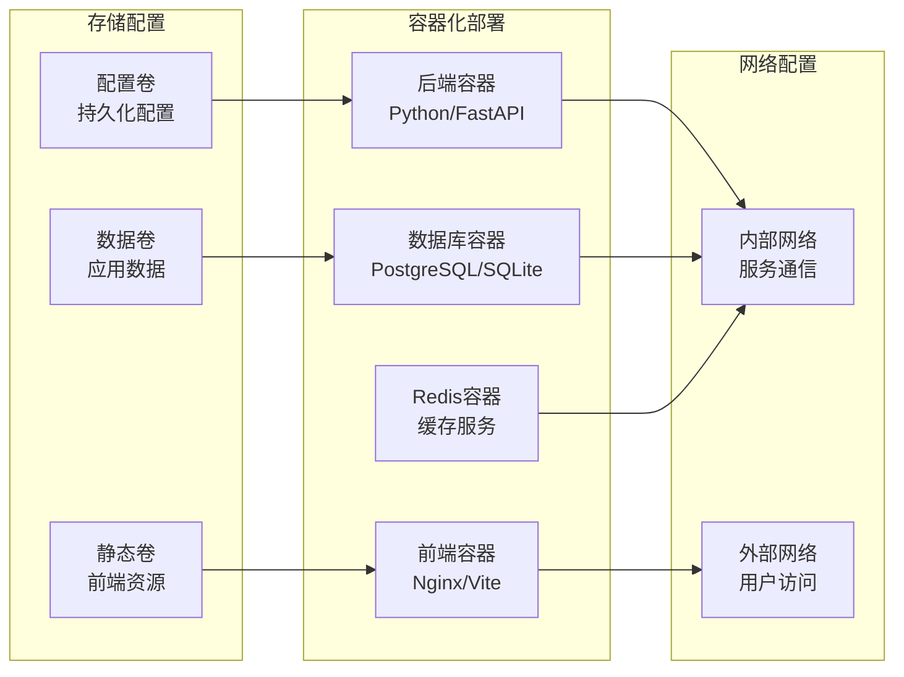
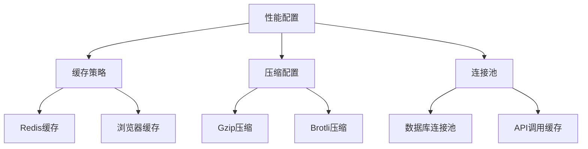
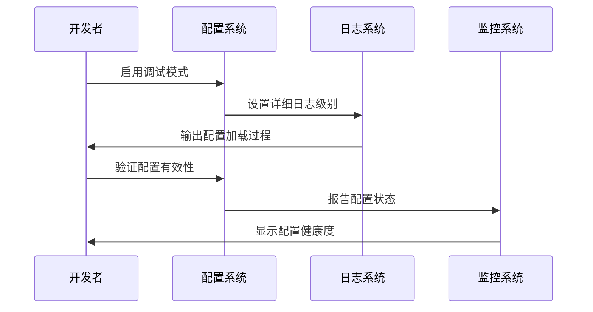

# 配置管理

<cite>
**本文档中引用的文件**
- [config.py](file://dashboard/backend/config.py)
- [vite.config.ts](file://dashboard/frontend/vite.config.ts)
- [package.json](file://dashboard/frontend/package.json)
- [main.py](file://dashboard/backend/main.py)
- [models.py](file://dashboard/backend/models.py)
- [websocket.ts](file://dashboard/frontend/src/services/websocket.ts)
- [useWebSocket.ts](file://dashboard/frontend/src/hooks/useWebSocket.ts)
- [api.ts](file://dashboard/frontend/src/services/api.ts)
- [requirements.txt](file://requirements.txt)
- [tailwind.config.js](file://dashboard/frontend/tailwind.config.js)
- [postcss.config.js](file://dashboard/frontend/postcss.config.js)
</cite>

## 目录
1. [项目概述](#项目概述)
2. [后端配置管理](#后端配置管理)
3. [前端构建配置](#前端构建配置)
4. [环境配置策略](#环境配置策略)
5. [配置项清单](#配置项清单)
6. [安全最佳实践](#安全最佳实践)
7. [部署配置](#部署配置)
8. [故障排除指南](#故障排除指南)

## 项目概述

TaskTree是一个基于AI的任务管理和项目协调系统，采用前后端分离架构。后端使用Python FastAPI框架，前端使用React TypeScript技术栈。项目通过统一的配置管理系统来管理各种环境参数和运行时设置。

## 后端配置管理

### 配置结构设计

后端配置系统采用分层设计，主要包含两个核心配置文件：

**图表来源**
- [config.py](file://dashboard/backend/config.py#L11-L151)

### 核心配置组件

#### AI模型配置

配置系统支持多种AI提供商的集成，主要参数包括：

| 配置项 | 类型 | 默认值 | 描述 |
|--------|------|--------|------|
| `max_concurrent_agents` | int | 5 | 最大并发AI代理数量 |
| `auto_merge` | bool | false | 是否自动合并任务结果 |
| `merge_strategy` | str | "merge" | 合并策略：merge/squash/ff |
| `api_provider` | str | "anthropic" | AI提供商：anthropic/openai/azure |
| `api_key` | str | None | API密钥（敏感信息） |
| `api_model` | str | "claude-sonnet-4-20250514" | 使用的AI模型 |
| `api_base_url` | str | None | 自定义API基础URL |
| `api_version` | str | None | API版本号 |

#### 仪表板配置

| 配置项 | 类型 | 默认值 | 描述 |
|--------|------|--------|------|
| `theme` | str | "dark" | 界面主题：dark/light |
| `notifications` | bool | true | 是否启用通知 |

**章节来源**
- [config.py](file://dashboard/backend/config.py#L28-L46)
- [models.py](file://dashboard/backend/models.py#L99-L114)

### 配置加载机制

配置系统实现了智能的配置加载机制：

**图表来源**
- [config.py](file://dashboard/backend/config.py#L14-L52)

**章节来源**
- [config.py](file://dashboard/backend/config.py#L14-L52)

## 前端构建配置

### Vite构建配置

前端使用Vite作为构建工具，配置文件定义了开发和生产环境的关键设置：

**图表来源**
- [vite.config.ts](file://dashboard/frontend/vite.config.ts#L6-L24)

### 关键配置项

#### 路径别名配置
- `@`: 映射到项目根目录下的`src/`路径
- 提供统一的模块导入路径，简化文件引用

#### 开发服务器代理
- `/api`: 代理到后端API服务器 `http://localhost:8000`
- `/ws`: 代理到WebSocket服务器 `ws://localhost:8000`
- `changeOrigin: true`: 改变请求源，解决跨域问题

#### 构建优化配置

| 配置项 | 开发环境 | 生产环境 | 描述 |
|--------|----------|----------|------|
| 代理目标 | localhost:8000 | CDN/远程服务器 | API和WebSocket代理 |
| 资源路径 | 相对路径 | 绝对CDN路径 | 静态资源优化 |
| 代码分割 | 按需加载 | 动态导入 | 性能优化 |
| 压缩混淆 | 可选 | 必须 | 生产环境安全 |

**章节来源**
- [vite.config.ts](file://dashboard/frontend/vite.config.ts#L6-L24)

### TypeScript配置

前端使用严格的TypeScript配置确保类型安全：

**图表来源**
- [package.json](file://dashboard/frontend/package.json#L38-L51)

**章节来源**
- [package.json](file://dashboard/frontend/package.json#L38-L51)

## 环境配置策略

### 开发环境配置

开发环境专注于快速迭代和调试功能：

**图表来源**
- [vite.config.ts](file://dashboard/frontend/vite.config.ts#L13-L23)

#### 开发环境特性
- **热重载**: 实时更新前端代码
- **源码映射**: 调试时显示原始源码
- **开发代理**: 自动转发API请求到后端
- **错误边界**: 提供详细的错误信息

### 生产环境配置

生产环境注重性能、安全性和稳定性：

#### 生产环境特性
- **代码压缩**: 减少文件大小
- **资源缓存**: 利用浏览器缓存
- **CDN集成**: 静态资源分发
- **安全配置**: HTTPS和安全头

**章节来源**
- [vite.config.ts](file://dashboard/frontend/vite.config.ts#L13-L23)

## 配置项清单

### 后端关键配置参数

| 参数名称 | 类型 | 默认值 | 环境变量 | 安全级别 | 描述 |
|----------|------|--------|----------|----------|------|
| `api_key` | str | None | `ANTHROPIC_API_KEY` | 高 | Anthropic API密钥 |
| `api_model` | str | "claude-sonnet-4-20250514" | `ANTHROPIC_MODEL` | 中 | 使用的AI模型 |
| `max_concurrent_agents` | int | 5 | `MAX_AGENTS` | 低 | 并发代理数量限制 |
| `auto_merge` | bool | false | `AUTO_MERGE` | 低 | 自动合并开关 |
| `api_base_url` | str | None | `API_BASE_URL` | 中 | 自定义API端点 |
| `theme` | str | "dark" | `DASHBOARD_THEME` | 低 | 界面主题 |

### 前端关键配置参数

| 参数名称 | 类型 | 默认值 | 环境变量 | 描述 |
|----------|------|--------|----------|------|
| `proxy.api` | str | "http://localhost:8000" | `VITE_API_URL` | API服务器地址 |
| `proxy.ws` | str | "ws://localhost:8000" | `VITE_WS_URL` | WebSocket服务器地址 |
| `port` | int | 5173 | `VITE_PORT` | 开发服务器端口 |
| `target` | str | "src/" | - | TypeScript路径别名 |

### 数据库和连接配置

| 参数名称 | 类型 | 默认值 | 描述 |
|----------|------|--------|------|
| `database_url` | str | "sqlite:///./splitmind.db" | 数据库连接字符串 |
| `redis_url` | str | "redis://localhost:6379" | Redis连接地址 |
| `websocket_port` | int | 8000 | WebSocket服务器端口 |

**章节来源**
- [config.py](file://dashboard/backend/config.py#L28-L46)
- [models.py](file://dashboard/backend/models.py#L99-L114)

## 安全最佳实践

### 敏感信息保护

### 配置安全原则

1. **不硬编码敏感信息**
   - 所有API密钥存储在配置文件中
   - 避免在代码中直接写入敏感数据

2. **最小权限原则**
   - 为不同环境使用不同的API密钥
   - 限制数据库和网络访问权限

3. **定期轮换**
   - 建立API密钥轮换流程
   - 监控异常访问行为

4. **加密存储**
   - 敏感配置文件使用适当的文件权限
   - 传输过程使用TLS加密

**章节来源**
- [config.py](file://dashboard/backend/config.py#L28-L46)

## 部署配置

### Docker部署配置

### 环境变量配置

| 环境变量 | 必需 | 默认值 | 描述 |
|----------|------|--------|------|
| `ANTHROPIC_API_KEY` | 是 | - | AI服务API密钥 |
| `DATABASE_URL` | 否 | sqlite:///./splitmind.db | 数据库连接字符串 |
| `REDIS_URL` | 否 | redis://localhost:6379 | Redis连接地址 |
| `LOG_LEVEL` | 否 | INFO | 日志级别 |
| `DEBUG` | 否 | false | 调试模式 |

### 性能优化配置

**章节来源**
- [requirements.txt](file://requirements.txt#L1-L31)

## 故障排除指南

### 常见配置问题

#### 后端配置问题

| 问题症状 | 可能原因 | 解决方案 |
|----------|----------|----------|
| API密钥验证失败 | 密钥格式错误或过期 | 检查`config.json`中的`api_key`字段 |
| 数据库连接失败 | 数据库URL配置错误 | 验证`DATABASE_URL`环境变量 |
| 项目加载失败 | 项目路径不存在 | 检查项目配置中的`path`字段 |
| WebSocket连接失败 | 端口被占用或防火墙阻止 | 检查端口配置和网络设置 |

#### 前端配置问题

| 问题症状 | 可能原因 | 解决方案 |
|----------|----------|----------|
| 开发服务器无法启动 | 端口冲突 | 修改`vite.config.ts`中的端口配置 |
| API请求失败 | 代理配置错误 | 检查`vite.config.ts`中的代理设置 |
| 路径解析错误 | 别名配置问题 | 验证`@`别名是否正确指向`src/` |
| 热重载失效 | 文件监听问题 | 检查文件系统权限和IDE设置 |

### 调试配置

### 配置验证工具

建议使用以下工具验证配置：

1. **JSON Schema验证**: 验证配置文件格式
2. **环境变量检查**: 确保所有必需变量已设置
3. **网络连通性测试**: 验证API和服务连接
4. **权限检查**: 确认文件和目录权限正确

**章节来源**
- [main.py](file://dashboard/backend/main.py#L11-L13)
- [websocket.ts](file://dashboard/frontend/src/services/websocket.ts#L16-L46)

## 结论

TaskTree项目采用了完善的配置管理体系，通过分层的配置结构、灵活的加载机制和严格的安全措施，确保了系统的可维护性和安全性。后端的Python配置管理器提供了强大的配置存储和管理功能，而前端的Vite配置则确保了开发和生产的高效构建。

通过遵循本文档中的配置最佳实践和安全指导，可以确保TaskTree系统在各种环境中稳定运行，并为用户提供优质的体验。