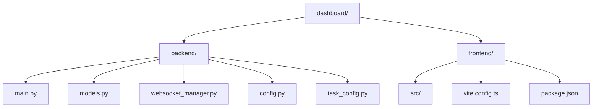

# 项目结构

<cite>
**本文档引用的文件**  
- [setup.py](file://setup.py)
- [requirements.txt](file://requirements.txt)
- [Doc/features/mission-control-summary.md](file://Doc/features/mission-control-summary.md)
- [dashboard/backend/main.py](file://dashboard/backend/main.py)
- [dashboard/backend/models.py](file://dashboard/backend/models.py)
- [dashboard/backend/websocket_manager.py](file://dashboard/backend/websocket_manager.py)
- [dashboard/backend/config.py](file://dashboard/backend/config.py)
- [dashboard/backend/task_config.py](file://dashboard/backend/task_config.py)
- [dashboard/frontend/vite.config.ts](file://dashboard/frontend/vite.config.ts)
- [dashboard/frontend/package.json](file://dashboard/frontend/package.json)
- [dashboard/frontend/src/App.tsx](file://dashboard/frontend/src/App.tsx)
- [dashboard/frontend/src/services/api.ts](file://dashboard/frontend/src/services/api.ts)
- [dashboard/frontend/src/hooks/useWebSocket.ts](file://dashboard/frontend/src/hooks/useWebSocket.ts)
</cite>

## 目录

1. [项目结构](#项目结构)
2. [根目录分析](#根目录分析)
3. [核心应用目录](#核心应用目录)
4. [后端架构](#后端架构)
5. [前端架构](#前端架构)
6. [功能文档](#功能文档)

## 根目录分析

TaskTree项目的根目录包含了项目的基础配置和依赖管理文件，是整个项目的入口点。

**Section sources**
- [setup.py](file://setup.py#L1-L259)
- [requirements.txt](file://requirements.txt#L1-L31)

### setup.py

`setup.py` 是项目的首次设置脚本，负责自动配置运行SplitMind Dashboard所需的所有环境。该脚本执行以下关键任务：
- 检查先决条件（Python、Node.js、npm、Git、tmux等）
- 创建必要的目录结构
- 安装Python依赖
- 设置前端环境
- 构建前端应用
- 创建示例任务文件

此脚本确保新开发者能够快速启动和运行项目，通过自动化处理复杂的环境配置过程。

### requirements.txt

`requirements.txt` 文件定义了项目后端的Python依赖项，包括：
- **FastAPI**: 现代、快速的Web框架
- **Uvicorn**: ASGI服务器
- **WebSockets**: 实时通信支持
- **Pydantic**: 数据验证
- **Anthropic SDK**: 与Claude AI集成
- **Redis**: 协调和状态管理
- **A2AMCP SDK**: 代理协调协议

这些依赖项为项目提供了强大的后端功能，支持API服务、实时通信和AI集成。

## 核心应用目录

核心应用位于 `dashboard/` 目录下，采用前后端分离的架构设计，分为 `backend/` 和 `frontend/` 两个主要部分。

**Diagram sources**
- [dashboard/backend/main.py](file://dashboard/backend/main.py#L1-L56)
- [dashboard/frontend/vite.config.ts](file://dashboard/frontend/vite.config.ts#L1-L25)

**Section sources**
- [dashboard/backend/main.py](file://dashboard/backend/main.py#L1-L56)
- [dashboard/frontend/vite.config.ts](file://dashboard/frontend/vite.config.ts#L1-L25)

## 后端架构

后端采用FastAPI框架构建，提供了高性能的API服务和实时通信功能。

### main.py

`main.py` 是FastAPI应用的入口文件，负责：
- 创建FastAPI应用实例
- 配置CORS（跨域资源共享）
- 定义生命周期管理器（lifespan）
- 包含API和WebSocket路由器
- 提供健康检查端点

该文件是后端服务的核心，协调所有API请求和应用程序的生命周期事件。

### models.py

`models.py` 定义了项目的所有数据模型，使用Pydantic进行数据验证和序列化。关键模型包括：
- **Task**: 任务模型，包含任务ID、标题、描述、状态、分支等属性
- **Agent**: AI代理模型，跟踪代理的运行状态和进度
- **Project**: 项目模型，管理项目的基本信息和配置
- **OrchestratorConfig**: 编排器配置，控制AI代理的并发和行为
- **WebSocketMessage**: WebSocket消息格式，用于实时通信

这些模型为前后端之间的数据交换提供了类型安全的接口。

### websocket_manager.py

`websocket_manager.py` 实现了WebSocket连接管理器，支持实时更新功能。主要功能包括：
- 管理活跃的WebSocket连接
- 广播消息到所有连接的客户端
- 向特定项目发送消息
- 处理连接和断开连接事件

该模块是实现前端实时更新的关键组件，确保用户界面能够即时反映后端状态变化。

### config.py

`config.py` 提供了配置管理功能，负责：
- 管理项目配置和持久化
- 处理项目数据的加载和保存
- 提供全局配置管理器实例
- 确保配置目录和文件的存在

`ConfigManager` 类封装了配置操作，为其他模块提供统一的配置访问接口。

### task_config.py

`task_config.py` 定义了任务配置和文件所有权规则，包括：
- 任务定义的静态配置
- 任务并发性检查（基于文件所有权）
- 任务配置获取
- 工作树初始化脚本生成

该模块实现了复杂的任务协调逻辑，确保多个AI代理在处理不同任务时不会发生文件冲突。

**Section sources**
- [dashboard/backend/main.py](file://dashboard/backend/main.py#L1-L56)
- [dashboard/backend/models.py](file://dashboard/backend/models.py#L1-L135)
- [dashboard/backend/websocket_manager.py](file://dashboard/backend/websocket_manager.py#L1-L55)
- [dashboard/backend/config.py](file://dashboard/backend/config.py#L1-L151)
- [dashboard/backend/task_config.py](file://dashboard/backend/task_config.py#L1-L267)

## 前端架构

前端采用React框架构建，遵循现代前端开发的最佳实践。

### vite.config.ts

`vite.config.ts` 是Vite构建工具的配置文件，定义了：
- 使用React插件
- 路径别名（@指向src目录）
- 开发服务器代理配置，将 `/api` 请求代理到 `http://localhost:8000`
- WebSocket代理配置，将 `/ws` 请求代理到 `ws://localhost:8000`

此配置确保开发服务器能够正确处理API请求和WebSocket连接。

### package.json

`package.json` 定义了前端的依赖关系和脚本命令，包括：
- **React和React DOM**: 核心UI库
- **Radix UI**: 可访问的UI组件
- **Tailwind CSS**: 实用优先的CSS框架
- **Framer Motion**: 动画库
- **Lucide React**: 图标库
- **TanStack Query**: 数据获取和状态管理

开发依赖包括TypeScript、Vite、ESLint和Prettier，确保代码质量和开发体验。

### App.tsx

`App.tsx` 是前端应用的主组件，负责：
- 管理应用状态（选中的项目、模态框状态等）
- 使用React Query获取项目数据
- 通过WebSocket接收实时更新
- 渲染主界面布局，包括头部、主要内容区域和全局页脚
- 管理各种模态框（入职引导、帮助中心、项目管理器等）

该组件作为应用的中心枢纽，协调各个功能模块的交互。

### services/api.ts

`api.ts` 定义了与后端API交互的服务类，提供了类型安全的API调用方法，包括：
- 项目管理（获取、创建、更新、删除）
- 任务管理（获取、创建、更新、合并）
- 代理管理（获取、启动终端、重置）
- 编排器管理（启动、停止、获取状态）
- 计划生成（生成项目计划和任务分解）
- Git管理（获取状态、初始化仓库）
- MCP诊断（检查Claude CLI、列出MCPs）

`ApiService` 类封装了所有API请求，为前端组件提供统一的数据访问接口。

### hooks/useWebSocket.ts

`useWebSocket.ts` 实现了自定义的WebSocket Hook，提供：
- WebSocket连接管理
- 消息订阅和处理
- 发送消息功能
- 自动连接和清理

该Hook简化了WebSocket的使用，使组件能够轻松地处理实时通信。

**Section sources**
- [dashboard/frontend/vite.config.ts](file://dashboard/frontend/vite.config.ts#L1-L25)
- [dashboard/frontend/package.json](file://dashboard/frontend/package.json#L1-L54)
- [dashboard/frontend/src/App.tsx](file://dashboard/frontend/src/App.tsx#L1-L197)
- [dashboard/frontend/src/services/api.ts](file://dashboard/frontend/src/services/api.ts#L1-L248)
- [dashboard/frontend/src/hooks/useWebSocket.ts](file://dashboard/frontend/src/hooks/useWebSocket.ts#L1-L24)

## 功能文档

`Doc/` 目录包含了项目的核心功能文档，为开发者提供了详细的系统设计和功能规划。

### mission-control-summary.md

`mission-control-summary.md` 是Mission Control功能的详细规划文档，概述了从v2.0到v3.0的重大升级。文档内容包括：

**核心设计理念**：从线性任务管理向空间化任务编排系统的转变，引入树形任务结构、DAG依赖图和严格状态机。

**核心功能模块**：
- **Mission（使命/项目）**：扩展项目模型，支持全局上下文、根任务ID和项目快照
- **TaskNode（任务节点）**：扩展任务模型，支持树形结构、增强依赖和上下文管理
- **严格状态机**：定义6个状态（Draft、Ready、Running、Review、Completed、Failed）和状态转换规则
- **分层上下文管理**：三层架构（全局、父级、本地）确保上下文信息的有效传递
- **快照与时间旅行**：支持创建和恢复项目快照，实现版本控制和回滚
- **AI协作（Co-Pilot）**：AI自动分解任务、优化提示、预估Token消耗
- **Review流程**：自动和人工评审相结合，确保任务质量

**用户界面**：双视图系统（看板视图和节点图视图）、Co-Pilot侧边栏和其他关键界面组件。

**技术架构**：后端使用PostgreSQL和SQLAlchemy，前端使用React Flow实现节点图，通过WebSocket实现实时通信。

**迁移计划**：10周的分阶段迁移路径，确保平滑升级。

该文档为新开发者提供了系统的整体架构和未来发展方向的全面理解。

**Section sources**
- [Doc/features/mission-control-summary.md](file://Doc/features/mission-control-summary.md#L1-L363)