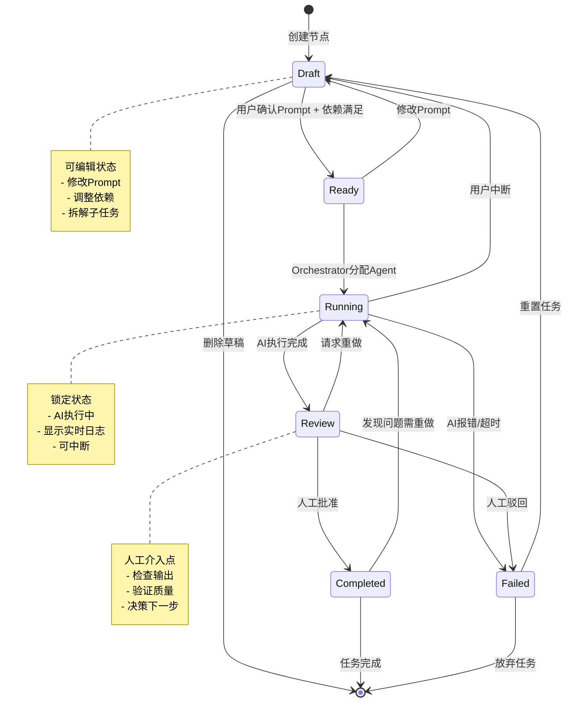

# Mission Control (任务中控台) - 功能详细规划

**版本**: v3.0.0  
**创建日期**: 2025-12-04  
**目标**: 将SplitMind从"波次任务管理"升级为"空间化任务编排系统"

---

## 📋 目录

1. [设计理念与现状对比](#设计理念与现状对比)
2. [核心数据模型扩展](#核心数据模型扩展)
3. [状态机设计](#状态机设计)
4. [上下文管理架构](#上下文管理架构)
5. [用户交互界面](#用户交互界面)
6. [技术实现方案](#技术实现方案)
7. [数据库Schema设计](#数据库schema设计)
8. [API接口设计](#api接口设计)
9. [前端组件设计](#前端组件设计)
10. [迁移方案](#迁移方案)
11. [风险控制与压力测试](#风险控制与压力测试)

---

## 设计理念与现状对比

### 🎯 核心隐喻转变

#### 当前架构 (v2.0)
```
线性思维: Project → Task List → Agent Execution
数据模型: 扁平的任务列表 + 简单依赖数组
状态流转: UNCLAIMED → UP_NEXT → IN_PROGRESS → COMPLETED → MERGED
```

#### Mission Control (v3.0)
```
空间思维: Mission (使命) → Task Tree (任务树) → Node Graph (节点图)
数据模型: 层级化的任务树 + 复杂依赖图
状态流转: Draft → Ready → Running → Review → Completed/Failed
```

### 📊 对比表

| 维度 | v2.0 (当前) | v3.0 (Mission Control) | 改进点 |
|------|------------|----------------------|--------|
| **任务组织** | 扁平列表 + 波次标记 | 树形结构 + 递归子任务 | 支持无限层级嵌套 |
| **依赖管理** | 简单的task_id数组 | DAG图 + 硬约束验证 | 防止循环依赖,可视化依赖链 |
| **上下文策略** | 全局project_overview | 分层上下文(Global + Local + Snapshot) | 防止长时程遗忘 |
| **状态控制** | 5个状态 | 6个状态 + 转换约束 | 明确的Review步骤 |
| **可视化** | Kanban看板 | Kanban + Node Graph双视图 | 更直观的依赖关系 |
| **AI交互** | Task级别Prompt | Node级别Prompt + 递归分解 | AI参与任务拆解 |
| **版本控制** | 无快照机制 | 项目快照 + 时间旅行 | 可回滚到任意历史状态 |

---

## 核心数据模型扩展

### 1. Mission (使命/项目) - 扩展Project模型

```python
class Mission(BaseModel):
    """
    Mission是Project的增强版本,代表一个长时程的顶层目标
    向后兼容Project模型
    """
    # === 继承自Project的字段 ===
    id: str
    name: str
    path: str
    description: Optional[str] = None
    
    # === Mission Control 新增字段 ===
    
    # 全局记忆 - 存储项目不可变约束
    global_context: GlobalContext
    
    # 任务树根节点ID列表
    root_task_ids: List[str] = []
    
    # 快照管理
    snapshots: List[MissionSnapshot] = []
    current_snapshot_id: Optional[str] = None
    
    # 视图偏好
    default_view: Literal["kanban", "graph", "timeline"] = "kanban"
    
    # 元数据
    mission_type: Literal["development", "research", "maintenance"] = "development"
    estimated_duration: Optional[int] = None  # 预估天数
    
    # 统计信息
    stats: MissionStats
    
    # 向后兼容
    max_agents: int = 5
    active: bool = True
    created_at: datetime = Field(default_factory=datetime.now)
    updated_at: datetime = Field(default_factory=datetime.now)


class GlobalContext(BaseModel):
    """全局上下文 - 对项目内所有任务始终可见"""
    
    # 技术约束
    tech_stack: Dict[str, str] = {}  # {"frontend": "React", "backend": "FastAPI"}
    
    # 设计规范
    design_constraints: List[str] = []  # ["使用Tailwind CSS", "品牌色#00AF91"]
    
    # 业务规则
    business_rules: List[str] = []  # ["用户数据必须加密", "支持国际化"]
    
    # 质量标准
    quality_gates: Dict[str, Any] = {}  # {"test_coverage": 80, "code_style": "PEP8"}
    
    # 参考资源
    references: List[Reference] = []  # 设计稿、API文档等
    
    # 上下文版本 - 用于检测Global Context是否变更
    context_version: int = 1
    last_modified: datetime = Field(default_factory=datetime.now)


class Reference(BaseModel):
    """参考资源"""
    type: Literal["design", "api_doc", "requirement", "wireframe", "other"]
    title: str
    url: Optional[str] = None
    content: Optional[str] = None
    file_path: Optional[str] = None


class MissionStats(BaseModel):
    """使命统计信息"""
    total_nodes: int = 0
    draft_nodes: int = 0
    ready_nodes: int = 0
    running_nodes: int = 0
    review_nodes: int = 0
    completed_nodes: int = 0
    failed_nodes: int = 0
    
    # 树深度统计
    max_depth: int = 0
    avg_depth: float = 0.0
    
    # Token消耗
    estimated_tokens: int = 0
    consumed_tokens: int = 0
    
    # 时间统计
    estimated_hours: float = 0.0
    actual_hours: float = 0.0


class MissionSnapshot(BaseModel):
    """项目快照 - 支持时间旅行"""
    id: str
    mission_id: str
    name: str
    description: Optional[str] = None
    
    # 快照数据
    task_tree_state: Dict[str, Any]  # 所有TaskNode的状态
    global_context_version: int
    
    # 元数据
    created_by: Literal["user", "system", "auto"]
    created_at: datetime = Field(default_factory=datetime.now)
    tags: List[str] = []  # ["milestone", "before_refactor"]
```

### 2. TaskNode (任务节点) - 扩展Task模型

```python
class TaskNodeStatus(str, Enum):
    """任务节点状态枚举 - 严格状态机"""
    DRAFT = "draft"          # 草稿:已创建但未定义指令
    READY = "ready"          # 就绪:指令已确认,依赖已满足
    RUNNING = "running"      # 运行中:AI正在执行
    REVIEW = "review"        # 待评审:AI已完成,等待人工确认
    COMPLETED = "completed"  # 已完成:人工确认通过
    FAILED = "failed"        # 失败:AI报错或人工驳回


class TaskNode(BaseModel):
    """
    任务节点 - Task的增强版本,支持树形结构
    向后兼容Task模型
    """
    # === 继承自Task的字段 ===
    id: str
    task_id: Optional[int] = None
    title: str
    description: Optional[str] = None
    branch: str
    session: Optional[str] = None
    
    # === TaskNode 核心新增字段 ===
    
    # 状态管理
    status: TaskNodeStatus = TaskNodeStatus.DRAFT
    prev_status: Optional[TaskNodeStatus] = None  # 用于回滚
    
    # 树形结构
    parent_id: Optional[str] = None  # 父节点ID
    children_ids: List[str] = []     # 子节点ID列表
    depth: int = 0                   # 节点深度(根节点=0)
    path: str = "/"                  # 节点路径,如 "/task-1/task-1.1/task-1.1.2"
    
    # 依赖管理 (DAG图)
    dependencies: List[Dependency] = []  # 增强的依赖定义
    dependents: List[str] = []           # 依赖此节点的任务ID列表(反向索引)
    
    # 上下文管理
    local_context: LocalContext       # 局部上下文
    input_artifacts: List[Artifact] = []   # 输入工件(来自上游依赖)
    output_artifacts: List[Artifact] = []  # 输出工件(传递给下游)
    
    # AI执行配置
    prompt_spec: PromptSpec           # 定义指令
    ai_config: AIExecutionConfig      # AI执行配置
    
    # 执行结果
    execution_result: Optional[ExecutionResult] = None
    
    # 评审信息
    review: Optional[ReviewInfo] = None
    
    # 资源预估
    estimated_tokens: int = 0
    estimated_duration_minutes: int = 0
    
    # 元数据
    created_at: datetime = Field(default_factory=datetime.now)
    updated_at: datetime = Field(default_factory=datetime.now)
    started_at: Optional[datetime] = None
    completed_at: Optional[datetime] = None
    
    # 向后兼容字段
    priority: int = 0
    owned_files: List[str] = []
    shared_files: List[str] = []
    creates_files: List[str] = []


class Dependency(BaseModel):
    """增强的依赖定义"""
    target_id: str                    # 依赖的目标任务ID
    type: DependencyType              # 依赖类型
    required_status: TaskNodeStatus = TaskNodeStatus.COMPLETED  # 要求的目标状态
    artifact_ref: Optional[str] = None  # 需要的工件引用


class DependencyType(str, Enum):
    """依赖类型"""
    HARD = "hard"          # 硬依赖:必须等待完成
    SOFT = "soft"          # 软依赖:建议等待但可并行
    DATA = "data"          # 数据依赖:需要特定输出
    SEQUENCE = "sequence"  # 顺序依赖:必须在之后执行


class LocalContext(BaseModel):
    """局部上下文 - 节点特有的上下文片段"""
    
    # 节点专属信息
    node_specific_info: Dict[str, Any] = {}
    
    # 参考的全局约束(指针,不复制)
    global_context_refs: List[str] = []  # 引用的GlobalContext中的key
    
    # 从父节点继承的信息(指针)
    inherited_from_parent: Dict[str, Any] = {}
    
    # 用户补充的特殊说明
    user_notes: List[str] = []
    
    # 上下文大小控制
    max_tokens: int = 4000  # 此节点上下文最大token数


class Artifact(BaseModel):
    """工件 - 任务的输入/输出"""
    id: str
    name: str
    type: ArtifactType
    
    # 数据存储
    content: Optional[str] = None      # 文本内容
    file_path: Optional[str] = None    # 文件路径
    reference_url: Optional[str] = None # 外部引用
    
    # 元数据
    size_bytes: int = 0
    created_at: datetime = Field(default_factory=datetime.now)
    metadata: Dict[str, Any] = {}


class ArtifactType(str, Enum):
    """工件类型"""
    CODE = "code"              # 代码文件
    DOCUMENT = "document"      # 文档
    SCHEMA = "schema"          # 数据schema
    INTERFACE = "interface"    # 接口定义
    CONFIG = "config"          # 配置文件
    TEST = "test"              # 测试用例
    DESIGN = "design"          # 设计稿
    DATA = "data"              # 数据文件


class PromptSpec(BaseModel):
    """Prompt规格定义"""
    
    # 系统级指令
    system_prompt: str = ""
    
    # 任务级指令
    task_instruction: str
    
    # 期望输出格式
    expected_output_format: Optional[str] = None
    
    # 示例(few-shot)
    examples: List[PromptExample] = []
    
    # 约束条件
    constraints: List[str] = []
    
    # 评估标准
    success_criteria: List[str] = []
    
    # Prompt版本
    version: int = 1
    last_modified: datetime = Field(default_factory=datetime.now)


class PromptExample(BaseModel):
    """Prompt示例"""
    input: str
    expected_output: str
    explanation: Optional[str] = None


class AIExecutionConfig(BaseModel):
    """AI执行配置"""
    
    # 模型选择
    model: str = "claude-sonnet-4-20250514"
    api_provider: str = "anthropic"
    
    # 参数配置
    temperature: float = 0.7
    max_tokens: int = 4000
    top_p: float = 1.0
    
    # 重试策略
    max_retries: int = 3
    retry_delay_seconds: int = 5
    
    # 超时控制
    timeout_minutes: int = 30
    
    # 中间检查点
    checkpoint_interval_tokens: int = 1000
    enable_streaming: bool = True


class ExecutionResult(BaseModel):
    """执行结果"""
    
    # 状态
    success: bool
    error_message: Optional[str] = None
    
    # 输出
    output_text: Optional[str] = None
    output_artifacts: List[Artifact] = []
    
    # 执行日志
    logs: List[ExecutionLog] = []
    
    # Token消耗
    tokens_used: int = 0
    
    # 时间统计
    started_at: datetime
    completed_at: datetime
    duration_seconds: float
    
    # 代码更改(如果适用)
    git_commits: List[GitCommit] = []


class ExecutionLog(BaseModel):
    """执行日志条目"""
    timestamp: datetime = Field(default_factory=datetime.now)
    level: Literal["info", "warning", "error", "debug"]
    message: str
    details: Optional[Dict[str, Any]] = None


class GitCommit(BaseModel):
    """Git提交信息"""
    commit_hash: str
    message: str
    files_changed: List[str]
    insertions: int
    deletions: int
    timestamp: datetime


class ReviewInfo(BaseModel):
    """评审信息"""
    
    # 评审状态
    status: Literal["pending", "approved", "rejected", "需要修改"]
    
    # 评审者信息
    reviewer: str  # 用户ID或"auto"
    reviewed_at: Optional[datetime] = None
    
    # 评审意见
    comments: List[ReviewComment] = []
    
    # 评分(可选)
    quality_score: Optional[int] = None  # 1-10
    
    # 是否自动评审
    auto_review: bool = False
    auto_review_criteria: List[str] = []


class ReviewComment(BaseModel):
    """评审意见"""
    timestamp: datetime = Field(default_factory=datetime.now)
    author: str
    content: str
    type: Literal["suggestion", "issue", "praise", "question"]
    resolved: bool = False
```

---

## 状态机设计

### 完整状态流转图



### 状态转换约束矩阵

| 当前状态 | 允许转换到 | 转换条件 | 禁止转换 |
|---------|----------|---------|---------|
| **Draft** | Ready | ✅ Prompt已定义 AND 所有依赖已Ready/Completed | Running (跳过Ready) |
| **Draft** | Deleted | ✅ 无子节点或子节点全部Draft | - |
| **Ready** | Draft | ✅ 用户手动修改 | - |
| **Ready** | Running | ✅ Orchestrator选中 AND Agent可用 | Review (跳过Running) |
| **Running** | Review | ✅ AI执行完成 AND 有输出 | Completed (跳过Review) |
| **Running** | Failed | ✅ 异常/超时/错误 | - |
| **Running** | Draft | ✅ 用户中断 | - |
| **Review** | Completed | ✅ 人工批准 OR 自动评审通过 | - |
| **Review** | Failed | ✅ 人工驳回 OR 输出不符合标准 | - |
| **Review** | Running | ✅ 请求重新执行 | Draft (必须经过Running) |
| **Completed** | - | - | 任何状态 (Completed是终态) |
| **Failed** | Draft | ✅ 用户重置 | 其他状态 |

### 状态转换事件与副作用

```python
class StateTransition(BaseModel):
    """状态转换事件"""
    node_id: str
    from_status: TaskNodeStatus
    to_status: TaskNodeStatus
    trigger: TransitionTrigger
    triggered_by: str  # user_id or "system"
    timestamp: datetime = Field(default_factory=datetime.now)
    reason: Optional[str] = None
    metadata: Dict[str, Any] = {}


class TransitionTrigger(str, Enum):
    """转换触发器"""
    USER_ACTION = "user_action"        # 用户手动操作
    ORCHESTRATOR = "orchestrator"      # 编排器自动
    AI_COMPLETION = "ai_completion"    # AI执行完成
    DEPENDENCY_MET = "dependency_met"  # 依赖满足
    TIMEOUT = "timeout"                # 超时
    ERROR = "error"                    # 错误
    REVIEW_DECISION = "review_decision" # 评审决策


# 状态转换副作用处理
class StateTransitionHandler:
    """状态转换处理器"""
    
    async def on_draft_to_ready(self, node: TaskNode):
        """Draft → Ready 副作用"""
        # 1. 验证Prompt完整性
        self.validate_prompt(node.prompt_spec)
        
        # 2. 检查依赖状态
        await self.verify_dependencies(node)
        
        # 3. 计算Token预估
        node.estimated_tokens = self.estimate_tokens(node)
        
        # 4. 通知Orchestrator
        await self.notify_orchestrator(node)
    
    async def on_ready_to_running(self, node: TaskNode):
        """Ready → Running 副作用"""
        # 1. 分配Agent
        agent = await self.allocate_agent(node)
        
        # 2. 准备执行环境
        await self.prepare_workspace(node)
        
        # 3. 加载上下文
        context = await self.build_execution_context(node)
        
        # 4. 启动AI执行
        node.started_at = datetime.now()
        await self.start_ai_execution(node, agent, context)
        
        # 5. 开始日志流
        await self.start_log_streaming(node)
    
    async def on_running_to_review(self, node: TaskNode):
        """Running → Review 副作用"""
        # 1. 保存执行结果
        await self.save_execution_result(node)
        
        # 2. 生成输出工件
        node.output_artifacts = await self.extract_artifacts(node)
        
        # 3. 自动评审(如果配置)
        if node.review.auto_review:
            await self.run_auto_review(node)
        
        # 4. 通知用户
        await self.notify_review_required(node)
    
    async def on_review_to_completed(self, node: TaskNode):
        """Review → Completed 副作用"""
        # 1. 标记完成时间
        node.completed_at = datetime.now()
        
        # 2. 提交代码(如果有)
        if node.execution_result.git_commits:
            await self.merge_commits(node)
        
        # 3. 更新下游依赖状态
        await self.update_dependents(node)
        
        # 4. 创建自动快照(如果是关键节点)
        if node.is_milestone:
            await self.create_snapshot(node)
        
        # 5. 释放资源
        await self.cleanup_resources(node)
    
    async def on_any_to_failed(self, node: TaskNode):
        """任意状态 → Failed 副作用"""
        # 1. 记录失败原因
        await self.log_failure(node)
        
        # 2. 保存错误上下文
        await self.save_error_context(node)
        
        # 3. 通知依赖此节点的任务
        await self.notify_blocking_failure(node)
        
        # 4. 建议调试操作
        suggestions = await self.generate_debug_suggestions(node)
        node.review.comments.append(ReviewComment(
            author="system",
            content=f"失败诊断:\n{suggestions}",
            type="suggestion"
        ))
```

---

## 上下文管理架构

### 分层上下文策略

```
┌─────────────────────────────────────────────┐
│          Global Context (全局层)             │
│  - 技术栈约束                                │
│  - 设计规范                                  │
│  - 业务规则                                  │
│  - 质量标准                                  │
│  始终对所有节点可见                           │
└─────────────────────────────────────────────┘
                    ↓ (继承)
┌─────────────────────────────────────────────┐
│        Parent Node Context (父节点层)        │
│  - 父节点的输出工件                          │
│  - 父节点的决策记录                          │
│  - 继承的约束                                │
│  对子节点可见                                │
└─────────────────────────────────────────────┘
                    ↓ (继承)
┌─────────────────────────────────────────────┐
│        Local Context (本地层)               │
│  - 节点专属信息                              │
│  - 用户补充说明                              │
│  - 输入工件                                  │
│  仅对当前节点可见                            │
└─────────────────────────────────────────────┘
```

### 上下文组装算法

```python
class ContextBuilder:
    """上下文构建器"""
    
    async def build_execution_context(
        self, 
        node: TaskNode, 
        mission: Mission
    ) -> str:
        """
        为TaskNode组装执行上下文
        核心原则: 只加载必需的信息,防止上下文爆炸
        """
        context_parts = []
        
        # 1. 全局上下文(选择性引用)
        global_ctx = self._extract_relevant_global_context(
            mission.global_context,
            node.local_context.global_context_refs
        )
        context_parts.append(f"# 全局约束\n{global_ctx}")
        
        # 2. 父节点上下文(指针引用,不复制全部)
        if node.parent_id:
            parent_node = await self.get_node(node.parent_id)
            parent_deliverable = self._extract_final_deliverable(parent_node)
            context_parts.append(f"# 父任务交付物\n{parent_deliverable}")
        
        # 3. 依赖节点的输出(仅最终交付物)
        for dep in node.dependencies:
            if dep.type == DependencyType.DATA:
                dep_node = await self.get_node(dep.target_id)
                artifact = self._get_artifact(dep_node, dep.artifact_ref)
                context_parts.append(f"# 依赖输入: {dep_node.title}\n{artifact.content}")
        
        # 4. 本地上下文
        local_ctx = self._format_local_context(node.local_context)
        context_parts.append(f"# 任务特定信息\n{local_ctx}")
        
        # 5. Prompt规格
        prompt = self._format_prompt_spec(node.prompt_spec)
        context_parts.append(f"# 执行指令\n{prompt}")
        
        # 6. 期望输出格式
        output_spec = self._format_output_spec(node)
        context_parts.append(f"# 期望输出\n{output_spec}")
        
        # 7. Token控制
        full_context = "\n\n".join(context_parts)
        if self.count_tokens(full_context) > node.local_context.max_tokens:
            # 压缩策略: 优先保留Prompt和输出规格
            full_context = self._compress_context(
                context_parts, 
                max_tokens=node.local_context.max_tokens
            )
        
        return full_context
    
    def _extract_final_deliverable(self, node: TaskNode) -> str:
        """
        提取节点的最终交付物(而非完整执行日志)
        """
        if not node.output_artifacts:
            return ""
        
        # 优先选择type=CODE或DOCUMENT的工件
        primary_artifacts = [
            a for a in node.output_artifacts 
            if a.type in [ArtifactType.CODE, ArtifactType.DOCUMENT]
        ]
        
        if primary_artifacts:
            return "\n\n".join([
                f"## {a.name}\n{a.content}" 
                for a in primary_artifacts[:3]  # 最多3个
            ])
        
        # 否则返回执行结果摘要
        if node.execution_result:
            return f"执行摘要:\n{node.execution_result.output_text[:500]}"
        
        return ""
    
    def _compress_context(
        self, 
        parts: List[str], 
        max_tokens: int
    ) -> str:
        """
        上下文压缩策略
        优先级: Prompt > 输出规格 > 依赖输入 > 本地上下文 > 全局约束
        """
        priority_order = [4, 5, 2, 3, 1, 0]  # 对应parts的索引
        compressed = []
        total_tokens = 0
        
        for idx in priority_order:
            part = parts[idx]
            part_tokens = self.count_tokens(part)
            
            if total_tokens + part_tokens <= max_tokens:
                compressed.append((idx, part))
                total_tokens += part_tokens
            else:
                # 尝试截断
                remaining_tokens = max_tokens - total_tokens
                if remaining_tokens > 100:  # 至少保留100 tokens
                    truncated = self._truncate_to_tokens(part, remaining_tokens)
                    compressed.append((idx, truncated + "\n... (已截断)"))
                break
        
        # 按原始顺序重新排列
        compressed.sort(key=lambda x: x[0])
        return "\n\n".join([part for _, part in compressed])
```

### 快照与时间旅行

```python
class SnapshotManager:
    """快照管理器"""
    
    async def create_snapshot(
        self, 
        mission: Mission, 
        name: str,
        description: str = "",
        auto: bool = False
    ) -> MissionSnapshot:
        """
        创建项目快照
        """
        snapshot = MissionSnapshot(
            id=generate_id(),
            mission_id=mission.id,
            name=name,
            description=description,
            task_tree_state=await self._capture_task_tree_state(mission),
            global_context_version=mission.global_context.context_version,
            created_by="system" if auto else "user",
            tags=["auto"] if auto else []
        )
        
        mission.snapshots.append(snapshot)
        await self.save_mission(mission)
        
        return snapshot
    
    async def _capture_task_tree_state(self, mission: Mission) -> Dict[str, Any]:
        """捕获任务树状态"""
        nodes = await self.get_all_nodes(mission.id)
        
        return {
            "nodes": [node.dict() for node in nodes],
            "global_context": mission.global_context.dict(),
            "stats": mission.stats.dict(),
            "timestamp": datetime.now().isoformat()
        }
    
    async def restore_snapshot(
        self, 
        mission: Mission, 
        snapshot_id: str
    ) -> Mission:
        """
        恢复到指定快照
        ⚠️ 危险操作: 会覆盖当前状态
        """
        snapshot = next(
            (s for s in mission.snapshots if s.id == snapshot_id),
            None
        )
        if not snapshot:
            raise ValueError(f"Snapshot {snapshot_id} not found")
        
        # 1. 备份当前状态
        await self.create_snapshot(
            mission,
            name=f"Auto backup before restore to {snapshot.name}",
            auto=True
        )
        
        # 2. 恢复节点状态
        await self._restore_task_tree(mission, snapshot.task_tree_state)
        
        # 3. 恢复全局上下文(如果版本匹配)
        if snapshot.global_context_version == mission.global_context.context_version:
            mission.global_context = GlobalContext(**snapshot.task_tree_state["global_context"])
        
        # 4. 更新当前快照指针
        mission.current_snapshot_id = snapshot_id
        
        await self.save_mission(mission)
        
        return mission
    
    async def compare_snapshots(
        self,
        mission: Mission,
        snapshot_a_id: str,
        snapshot_b_id: str
    ) -> Dict[str, Any]:
        """对比两个快照的差异"""
        snapshot_a = next(s for s in mission.snapshots if s.id == snapshot_a_id)
        snapshot_b = next(s for s in mission.snapshots if s.id == snapshot_b_id)
        
        nodes_a = {n["id"]: n for n in snapshot_a.task_tree_state["nodes"]}
        nodes_b = {n["id"]: n for n in snapshot_b.task_tree_state["nodes"]}
        
        return {
            "added_nodes": [
                n for nid, n in nodes_b.items() if nid not in nodes_a
            ],
            "removed_nodes": [
                n for nid, n in nodes_a.items() if nid not in nodes_b
            ],
            "modified_nodes": [
                {
                    "id": nid,
                    "before": nodes_a[nid],
                    "after": nodes_b[nid]
                }
                for nid in nodes_a.keys() & nodes_b.keys()
                if nodes_a[nid]["status"] != nodes_b[nid]["status"]
            ],
            "context_changes": self._compare_contexts(
                snapshot_a.task_tree_state["global_context"],
                snapshot_b.task_tree_state["global_context"]
            )
        }
```

---

## 用户交互界面

### 双视图设计

#### 1. Kanban视图 (增强版)

```typescript
// 与v2.0类似,但列改为状态
const statusColumns = [
  { id: 'draft', title: 'DRAFT', color: 'bg-gray-600' },
  { id: 'ready', title: 'READY', color: 'bg-blue-600' },
  { id: 'running', title: 'RUNNING', color: 'bg-yellow-500' },
  { id: 'review', title: 'REVIEW', color: 'bg-purple-500' },
  { id: 'completed', title: 'DONE', color: 'bg-green-500' },
  { id: 'failed', title: 'FAILED', color: 'bg-red-500' },
];

// TaskCard增强
interface TaskCardData extends TaskNode {
  // 显示父子关系
  parentTitle?: string;
  childrenCount: number;
  
  // 显示依赖
  pendingDependencies: number;
  
  // Token预估
  tokenBudget: string; // "500/2000 tokens"
  
  // 实时进度(如果Running)
  liveProgress?: number; // 0-100
}
```

#### 2. Node Graph视图 (全新)

```typescript
/**
 * 节点图视图 - 使用React Flow或类似库
 * 可视化任务依赖关系
 */
interface NodeGraphView {
  // 节点定义
  nodes: GraphNode[];
  
  // 边定义(依赖关系)
  edges: GraphEdge[];
  
  // 布局算法
  layout: 'dagre' | 'force' | 'tree';
  
  // 交互
  onNodeClick: (nodeId: string) => void;
  onNodeDoubleClick: (nodeId: string) => void; // 展开子任务
  onEdgeClick: (edgeId: string) => void;
}

interface GraphNode {
  id: string;
  data: {
    label: string;
    status: TaskNodeStatus;
    progress: number;
    hasChildren: boolean;
    tokenUsage: number;
  };
  position: { x: number; y: number };
  style: {
    background: string; // 根据状态着色
    border: string;
  };
}

interface GraphEdge {
  id: string;
  source: string; // 源节点ID
  target: string; // 目标节点ID
  type: DependencyType;
  label: string; // 显示依赖类型
  animated: boolean; // RUNNING状态的边动画
  style: {
    stroke: string;
    strokeWidth: number;
  };
}
```

#### 3. Co-Pilot侧边栏

```typescript
/**
 * AI协作侧边栏 - 始终存在的AI助手
 */
interface CoPilotSidebar {
  // 当前模式
  mode: 'chat' | 'decompose' | 'review' | 'suggest';
  
  // 对话历史
  chatHistory: Message[];
  
  // 快捷操作
  quickActions: QuickAction[];
}

interface Message {
  id: string;
  role: 'user' | 'assistant';
  content: string;
  timestamp: Date;
  
  // 结构化响应(如果是任务拆解)
  structuredData?: {
    type: 'task_proposal';
    tasks: Partial<TaskNode>[];
  };
}

interface QuickAction {
  id: string;
  label: string;
  icon: string;
  action: () => void;
  
  examples: [
    {
      id: 'decompose',
      label: '拆解当前任务',
      icon: 'split',
      action: () => startDecomposition(selectedNodeId)
    },
    {
      id: 'suggest_prompt',
      label: '优化Prompt',
      icon: 'sparkles',
      action: () => optimizePrompt(selectedNodeId)
    },
    {
      id: 'estimate_tokens',
      label: '预估Token消耗',
      icon: 'calculator',
      action: () => estimateTokens(selectedNodeId)
    }
  ]
}
```

### 关键交互流程

#### 流程1: AI拆解任务

```
用户操作:
1. 选中一个TaskNode
2. 在Co-Pilot输入: "帮我拆解'用户登录'模块"

系统行为:
1. Co-Pilot调用AI分析该节点的Prompt
2. AI返回建议的子任务列表:
   [
     { title: "设计登录API接口", estimatedTokens: 500 },
     { title: "实现JWT认证", estimatedTokens: 800 },
     { title: "创建登录前端页面", estimatedTokens: 1200 }
   ]

3. 系统在Kanban/Graph上生成3个DRAFT卡片
4. 自动建立依赖关系:
   - "创建登录前端页面" 依赖 "设计登录API接口"
   - 设置parent_id为原节点

5. 用户可以:
   - 点击"确认" → 3个子任务变为READY(如果无依赖)
   - 点击"编辑" → 修改建议的任务
   - 点击"取消" → 删除生成的草稿
```

#### 流程2: 热修补(Hot-Swap)

```
场景: 项目进行到一半,用户改变技术栈

用户操作:
1. 进入Mission设置
2. 修改Global Context:
   tech_stack.frontend: "React" → "Vue"
3. 点击"Re-plan"按钮

系统行为:
1. 暂停所有RUNNING状态的任务
2. 标记所有DRAFT和READY任务为"需更新"
3. 对每个"需更新"任务:
   a. 保存原Prompt为备份
   b. 调用AI重新生成Prompt(基于新的Global Context)
   c. 显示diff对比(旧Prompt vs 新Prompt)
   d. 用户可选择:
      - 接受新Prompt
      - 保留旧Prompt
      - 手动合并

4. COMPLETED的任务保持不变(已完成的工作不受影响)
5. 恢复暂停的任务(如果用户确认)
```

#### 流程3: Review流程

```
场景: AI完成一个任务,进入Review状态

UI显示:
┌─────────────────────────────────────────┐
│ 📋 Task Review: "实现用户登录API"        │
├─────────────────────────────────────────┤
│ Status: REVIEW ⏸                        │
│ Completed: 2025-12-04 15:30             │
│ Duration: 8 minutes                     │
│ Tokens Used: 1,245 / 2,000              │
├─────────────────────────────────────────┤
│ 📤 Output Artifacts:                    │
│  ├─ 📄 api/auth.py (新文件)             │
│  ├─ 📄 tests/test_auth.py (新文件)      │
│  └─ 📝 API文档片段                      │
├─────────────────────────────────────────┤
│ 🔍 Auto-Review Results:                 │
│  ✅ 代码符合PEP8规范                     │
│  ✅ 包含单元测试                         │
│  ⚠️  API文档不完整(覆盖率60%)            │
├─────────────────────────────────────────┤
│ 💬 Add Comment: [___________________]  │
│                                         │
│ [❌ Reject] [🔄 Request Changes] [✅ Approve] │
└─────────────────────────────────────────┘

用户操作:
- 点击"Approve" → 任务变为COMPLETED,触发下游依赖
- 点击"Request Changes":
  → 填写修改意见
  → 任务回到RUNNING,AI根据意见重新执行
- 点击"Reject":
  → 任务变为FAILED
  → 可选择"重置"或"放弃"
```

---

## 技术实现方案

### 后端架构调整

#### 1. 数据库迁移策略

```python
# 使用SQLAlchemy ORM替代JSON文件存储
# (支持复杂查询和事务)

from sqlalchemy import create_engine, Column, String, Integer, JSON, ForeignKey, Enum as SQLEnum
from sqlalchemy.ext.declarative import declarative_base
from sqlalchemy.orm import relationship, sessionmaker

Base = declarative_base()

class MissionModel(Base):
    __tablename__ = "missions"
    
    id = Column(String, primary_key=True)
    name = Column(String, nullable=False)
    path = Column(String, nullable=False)
    
    # JSON字段存储复杂结构
    global_context = Column(JSON)
    stats = Column(JSON)
    
    # 关系
    root_tasks = relationship("TaskNodeModel", back_populates="mission",
                             foreign_keys="TaskNodeModel.mission_id")
    snapshots = relationship("SnapshotModel", back_populates="mission")
    
    # ... 其他字段

class TaskNodeModel(Base):
    __tablename__ = "task_nodes"
    
    id = Column(String, primary_key=True)
    mission_id = Column(String, ForeignKey("missions.id"))
    parent_id = Column(String, ForeignKey("task_nodes.id"), nullable=True)
    
    # 基础字段
    title = Column(String, nullable=False)
    description = Column(String)
    status = Column(SQLEnum(TaskNodeStatus), default=TaskNodeStatus.DRAFT)
    
    # 树形结构
    depth = Column(Integer, default=0)
    path = Column(String)
    
    # JSON字段
    local_context = Column(JSON)
    prompt_spec = Column(JSON)
    ai_config = Column(JSON)
    execution_result = Column(JSON)
    dependencies_json = Column(JSON)  # 存储Dependency列表
    
    # 关系
    mission = relationship("MissionModel", back_populates="root_tasks")
    parent = relationship("TaskNodeModel", remote_side=[id], back_populates="children")
    children = relationship("TaskNodeModel", back_populates="parent")
    artifacts = relationship("ArtifactModel", back_populates="node")

class ArtifactModel(Base):
    __tablename__ = "artifacts"
    
    id = Column(String, primary_key=True)
    node_id = Column(String, ForeignKey("task_nodes.id"))
    name = Column(String)
    type = Column(SQLEnum(ArtifactType))
    content = Column(String)
    
    node = relationship("TaskNodeModel", back_populates="artifacts")

# 迁移脚本
class MigrationV2ToV3:
    """从v2.0的JSON文件迁移到v3.0的数据库"""
    
    async def migrate_project_to_mission(self, project: Project) -> Mission:
        """迁移单个项目"""
        mission = Mission(
            id=project.id,
            name=project.name,
            path=project.path,
            description=project.description,
            
            # 初始化Global Context
            global_context=GlobalContext(
                tech_stack=self._extract_tech_stack(project),
                design_constraints=[],
                business_rules=[],
            ),
            
            # 初始化根任务
            root_task_ids=[],
            
            # 继承字段
            max_agents=project.max_agents,
            active=project.active
        )
        
        # 迁移任务
        tasks = self.get_v2_tasks(project.id)
        for task in tasks:
            node = await self._migrate_task_to_node(task, mission)
            if not task.parent_id:  # 根任务
                mission.root_task_ids.append(node.id)
        
        return mission
    
    async def _migrate_task_to_node(self, task: Task, mission: Mission) -> TaskNode:
        """迁移单个任务"""
        node = TaskNode(
            id=task.id,
            task_id=task.task_id,
            title=task.title,
            description=task.description,
            branch=task.branch,
            
            # 状态映射
            status=self._map_status(task.status),
            
            # 提取树形结构(v2.0没有,设为根节点)
            parent_id=None,
            children_ids=[],
            depth=0,
            path=f"/{task.id}",
            
            # 迁移依赖
            dependencies=[
                Dependency(
                    target_id=dep_id,
                    type=DependencyType.HARD
                )
                for dep_id in task.dependencies
            ],
            
            # 创建LocalContext
            local_context=LocalContext(
                node_specific_info={
                    "priority": task.priority,
                    "owned_files": task.owned_files,
                    "shared_files": task.shared_files
                }
            ),
            
            # 迁移Prompt
            prompt_spec=PromptSpec(
                task_instruction=task.prompt or task.description or ""
            ),
            
            # 默认AI配置
            ai_config=AIExecutionConfig()
        )
        
        return node
    
    def _map_status(self, v2_status: TaskStatus) -> TaskNodeStatus:
        """v2状态映射到v3状态"""
        mapping = {
            TaskStatus.UNCLAIMED: TaskNodeStatus.DRAFT,
            TaskStatus.UP_NEXT: TaskNodeStatus.READY,
            TaskStatus.IN_PROGRESS: TaskNodeStatus.RUNNING,
            TaskStatus.COMPLETED: TaskNodeStatus.COMPLETED,
            TaskStatus.MERGED: TaskNodeStatus.COMPLETED,
        }
        return mapping.get(v2_status, TaskNodeStatus.DRAFT)
```

#### 2. API路由扩展

```python
# dashboard/backend/api_v3.py

from fastapi import APIRouter, HTTPException, Depends
from sqlalchemy.orm import Session

router = APIRouter(prefix="/api/v3")

# ============ Mission Management ============

@router.post("/missions", response_model=Mission)
async def create_mission(
    mission_data: MissionCreate,
    db: Session = Depends(get_db)
):
    """创建新的Mission"""
    mission = Mission(**mission_data.dict())
    db.add(MissionModel.from_pydantic(mission))
    db.commit()
    return mission

@router.get("/missions/{mission_id}", response_model=Mission)
async def get_mission(mission_id: str, db: Session = Depends(get_db)):
    """获取Mission详情"""
    mission_model = db.query(MissionModel).filter_by(id=mission_id).first()
    if not mission_model:
        raise HTTPException(404, "Mission not found")
    return mission_model.to_pydantic()

@router.put("/missions/{mission_id}/global-context")
async def update_global_context(
    mission_id: str,
    context: GlobalContext,
    db: Session = Depends(get_db)
):
    """
    更新Global Context
    触发Hot-Swap逻辑
    """
    mission = db.query(MissionModel).filter_by(id=mission_id).first()
    if not mission:
        raise HTTPException(404, "Mission not found")
    
    # 增加版本号
    context.context_version += 1
    mission.global_context = context.dict()
    
    # 触发Re-plan
    affected_nodes = await re_plan_pipeline(mission_id, context)
    
    db.commit()
    
    return {
        "message": "Global context updated",
        "affected_nodes": len(affected_nodes),
        "context_version": context.context_version
    }

# ============ TaskNode Management ============

@router.get("/missions/{mission_id}/nodes", response_model=List[TaskNode])
async def get_all_nodes(
    mission_id: str,
    status: Optional[TaskNodeStatus] = None,
    depth: Optional[int] = None,
    db: Session = Depends(get_db)
):
    """获取所有任务节点(支持过滤)"""
    query = db.query(TaskNodeModel).filter_by(mission_id=mission_id)
    
    if status:
        query = query.filter_by(status=status)
    if depth is not None:
        query = query.filter_by(depth=depth)
    
    nodes = query.all()
    return [n.to_pydantic() for n in nodes]

@router.post("/missions/{mission_id}/nodes", response_model=TaskNode)
async def create_node(
    mission_id: str,
    node_data: TaskNodeCreate,
    db: Session = Depends(get_db)
):
    """创建新的任务节点"""
    # 验证parent存在
    if node_data.parent_id:
        parent = db.query(TaskNodeModel).filter_by(id=node_data.parent_id).first()
        if not parent:
            raise HTTPException(400, "Parent node not found")
        depth = parent.depth + 1
        path = f"{parent.path}/{node_data.id}"
    else:
        depth = 0
        path = f"/{node_data.id}"
    
    node = TaskNode(
        **node_data.dict(),
        depth=depth,
        path=path,
        status=TaskNodeStatus.DRAFT
    )
    
    db.add(TaskNodeModel.from_pydantic(node))
    db.commit()
    
    # WebSocket广播
    await ws_manager.broadcast(WebSocketMessage(
        type="node_created",
        project_id=mission_id,
        data=node.dict()
    ))
    
    return node

@router.put("/missions/{mission_id}/nodes/{node_id}/status")
async def transition_node_status(
    mission_id: str,
    node_id: str,
    transition: StateTransitionRequest,
    db: Session = Depends(get_db)
):
    """
    状态转换API
    执行严格的状态机验证
    """
    node_model = db.query(TaskNodeModel).filter_by(id=node_id).first()
    if not node_model:
        raise HTTPException(404, "Node not found")
    
    node = node_model.to_pydantic()
    
    # 验证状态转换合法性
    handler = StateTransitionHandler()
    if not await handler.validate_transition(node, transition.to_status):
        raise HTTPException(400, f"Invalid transition: {node.status} → {transition.to_status}")
    
    # 执行转换
    await handler.execute_transition(
        node,
        transition.to_status,
        trigger=TransitionTrigger.USER_ACTION,
        triggered_by=transition.user_id,
        reason=transition.reason
    )
    
    # 更新数据库
    node_model.status = transition.to_status.value
    node_model.updated_at = datetime.now()
    db.commit()
    
    # 广播状态变更
    await ws_manager.broadcast(WebSocketMessage(
        type="node_status_changed",
        project_id=mission_id,
        data={
            "node_id": node_id,
            "from_status": node.status.value,
            "to_status": transition.to_status.value
        }
    ))
    
    return {"success": True, "new_status": transition.to_status}

# ============ AI协作 ============

@router.post("/missions/{mission_id}/co-pilot/decompose")
async def ai_decompose_task(
    mission_id: str,
    request: DecomposeRequest,
    db: Session = Depends(get_db)
):
    """
    AI拆解任务
    返回建议的子任务列表
    """
    parent_node = db.query(TaskNodeModel).filter_by(id=request.parent_node_id).first()
    if not parent_node:
        raise HTTPException(404, "Parent node not found")
    
    # 调用AI分析
    from .claude_integration import claude
    
    decomposition_prompt = f"""
你是一个项目管理专家。请将以下任务拆解为3-5个子任务:

任务标题: {parent_node.title}
任务描述: {parent_node.description}

请以JSON格式返回,每个子任务包含:
- title: 子任务标题
- description: 详细说明
- estimated_tokens: 预估token消耗
- dependencies: 依赖的其他子任务(用索引表示)

示例输出:
[
  {{
    "title": "子任务1",
    "description": "详细说明",
    "estimated_tokens": 500,
    "dependencies": []
  }},
  {{
    "title": "子任务2",
    "description": "详细说明",
    "estimated_tokens": 800,
    "dependencies": [0]
  }}
]
"""
    
    result = await claude.generate(
        prompt=decomposition_prompt,
        max_tokens=2000,
        temperature=0.7
    )
    
    suggested_tasks = json.loads(result.content)
    
    # 创建DRAFT节点(不自动保存)
    draft_nodes = []
    for i, task_data in enumerate(suggested_tasks):
        node = TaskNode(
            id=f"{request.parent_node_id}-sub-{i+1}",
            title=task_data["title"],
            description=task_data["description"],
            parent_id=request.parent_node_id,
            depth=parent_node.depth + 1,
            status=TaskNodeStatus.DRAFT,
            estimated_tokens=task_data["estimated_tokens"],
            dependencies=[
                Dependency(
                    target_id=f"{request.parent_node_id}-sub-{dep_idx+1}",
                    type=DependencyType.HARD
                )
                for dep_idx in task_data.get("dependencies", [])
            ]
        )
        draft_nodes.append(node)
    
    return {
        "suggested_tasks": [n.dict() for n in draft_nodes],
        "action_required": "user_confirm"  # 需要用户确认
    }

@router.post("/missions/{mission_id}/co-pilot/confirm-decomposition")
async def confirm_decomposition(
    mission_id: str,
    request: ConfirmDecompositionRequest,
    db: Session = Depends(get_db)
):
    """
    确认AI拆解的任务
    批量创建节点
    """
    for node_dict in request.nodes:
        node = TaskNode(**node_dict)
        db.add(TaskNodeModel.from_pydantic(node))
    
    db.commit()
    
    return {"message": f"Created {len(request.nodes)} nodes"}

# ============ 快照管理 ============

@router.post("/missions/{mission_id}/snapshots")
async def create_snapshot(
    mission_id: str,
    snapshot_data: SnapshotCreate,
    db: Session = Depends(get_db)
):
    """创建项目快照"""
    manager = SnapshotManager(db)
    mission = db.query(MissionModel).filter_by(id=mission_id).first()
    
    snapshot = await manager.create_snapshot(
        mission=mission.to_pydantic(),
        name=snapshot_data.name,
        description=snapshot_data.description
    )
    
    return snapshot

@router.post("/missions/{mission_id}/snapshots/{snapshot_id}/restore")
async def restore_snapshot(
    mission_id: str,
    snapshot_id: str,
    db: Session = Depends(get_db)
):
    """恢复到指定快照"""
    manager = SnapshotManager(db)
    mission = db.query(MissionModel).filter_by(id=mission_id).first()
    
    restored_mission = await manager.restore_snapshot(
        mission=mission.to_pydantic(),
        snapshot_id=snapshot_id
    )
    
    return {"message": "Snapshot restored", "mission": restored_mission}

# ============ 依赖图分析 ============

@router.get("/missions/{mission_id}/dependency-graph")
async def get_dependency_graph(
    mission_id: str,
    db: Session = Depends(get_db)
):
    """
    获取依赖图
    用于Node Graph视图渲染
    """
    nodes = db.query(TaskNodeModel).filter_by(mission_id=mission_id).all()
    
    graph_nodes = []
    graph_edges = []
    
    for node in nodes:
        graph_nodes.append({
            "id": node.id,
            "data": {
                "label": node.title,
                "status": node.status,
                "hasChildren": len(node.children) > 0,
                "tokenUsage": node.execution_result.get("tokens_used", 0) if node.execution_result else 0
            },
            "position": {"x": 0, "y": 0}  # 由前端布局算法计算
        })
        
        # 添加依赖边
        dependencies = json.loads(node.dependencies_json) if node.dependencies_json else []
        for dep in dependencies:
            graph_edges.append({
                "id": f"{node.id}-{dep['target_id']}",
                "source": dep["target_id"],
                "target": node.id,
                "type": dep["type"],
                "animated": node.status == "running"
            })
    
    return {
        "nodes": graph_nodes,
        "edges": graph_edges
    }
```

---

## 数据库Schema设计

### PostgreSQL Schema (推荐生产环境)

```sql
-- ============ Missions Table ============
CREATE TABLE missions (
    id VARCHAR(36) PRIMARY KEY,
    name VARCHAR(255) NOT NULL,
    path TEXT NOT NULL,
    description TEXT,
    
    -- JSON字段
    global_context JSONB NOT NULL DEFAULT '{}',
    stats JSONB NOT NULL DEFAULT '{}',
    root_task_ids JSON NOT NULL DEFAULT '[]',
    
    -- 快照
    current_snapshot_id VARCHAR(36),
    
    -- 视图偏好
    default_view VARCHAR(20) DEFAULT 'kanban',
    
    -- 元数据
    mission_type VARCHAR(20) DEFAULT 'development',
    estimated_duration INT,
    
    -- 向后兼容字段
    max_agents INT DEFAULT 5,
    active BOOLEAN DEFAULT TRUE,
    created_at TIMESTAMP DEFAULT CURRENT_TIMESTAMP,
    updated_at TIMESTAMP DEFAULT CURRENT_TIMESTAMP,
    git_remote TEXT,
    is_git_repo BOOLEAN
);

CREATE INDEX idx_missions_active ON missions(active);
CREATE INDEX idx_missions_path ON missions(path);

-- ============ Task Nodes Table ============
CREATE TABLE task_nodes (
    id VARCHAR(36) PRIMARY KEY,
    mission_id VARCHAR(36) NOT NULL REFERENCES missions(id) ON DELETE CASCADE,
    parent_id VARCHAR(36) REFERENCES task_nodes(id) ON DELETE SET NULL,
    
    -- 基础字段
    task_id INT,
    title VARCHAR(500) NOT NULL,
    description TEXT,
    branch VARCHAR(255) NOT NULL,
    session VARCHAR(255),
    
    -- 状态管理
    status VARCHAR(20) DEFAULT 'draft',
    prev_status VARCHAR(20),
    
    -- 树形结构
    depth INT DEFAULT 0,
    path TEXT NOT NULL,
    
    -- JSON字段
    children_ids JSON DEFAULT '[]',
    dependencies_json JSONB DEFAULT '[]',
    dependents JSON DEFAULT '[]',
    local_context JSONB DEFAULT '{}',
    prompt_spec JSONB DEFAULT '{}',
    ai_config JSONB DEFAULT '{}',
    execution_result JSONB,
    review JSONB,
    
    -- 资源预估
    estimated_tokens INT DEFAULT 0,
    estimated_duration_minutes INT DEFAULT 0,
    
    -- 元数据
    priority INT DEFAULT 0,
    owned_files JSON DEFAULT '[]',
    shared_files JSON DEFAULT '[]',
    creates_files JSON DEFAULT '[]',
    
    created_at TIMESTAMP DEFAULT CURRENT_TIMESTAMP,
    updated_at TIMESTAMP DEFAULT CURRENT_TIMESTAMP,
    started_at TIMESTAMP,
    completed_at TIMESTAMP
);

CREATE INDEX idx_task_nodes_mission ON task_nodes(mission_id);
CREATE INDEX idx_task_nodes_status ON task_nodes(status);
CREATE INDEX idx_task_nodes_parent ON task_nodes(parent_id);
CREATE INDEX idx_task_nodes_path ON task_nodes USING GIN (to_tsvector('simple', path));
CREATE INDEX idx_task_nodes_dependencies ON task_nodes USING GIN (dependencies_json);

-- ============ Artifacts Table ============
CREATE TABLE artifacts (
    id VARCHAR(36) PRIMARY KEY,
    node_id VARCHAR(36) NOT NULL REFERENCES task_nodes(id) ON DELETE CASCADE,
    
    name VARCHAR(255) NOT NULL,
    type VARCHAR(20) NOT NULL,
    
    -- 数据存储
    content TEXT,
    file_path TEXT,
    reference_url TEXT,
    
    -- 元数据
    size_bytes BIGINT DEFAULT 0,
    metadata JSONB DEFAULT '{}',
    created_at TIMESTAMP DEFAULT CURRENT_TIMESTAMP
);

CREATE INDEX idx_artifacts_node ON artifacts(node_id);
CREATE INDEX idx_artifacts_type ON artifacts(type);

-- ============ Snapshots Table ============
CREATE TABLE mission_snapshots (
    id VARCHAR(36) PRIMARY KEY,
    mission_id VARCHAR(36) NOT NULL REFERENCES missions(id) ON DELETE CASCADE,
    
    name VARCHAR(255) NOT NULL,
    description TEXT,
    
    -- 快照数据
    task_tree_state JSONB NOT NULL,
    global_context_version INT NOT NULL,
    
    -- 元数据
    created_by VARCHAR(20) NOT NULL,
    tags JSON DEFAULT '[]',
    created_at TIMESTAMP DEFAULT CURRENT_TIMESTAMP
);

CREATE INDEX idx_snapshots_mission ON mission_snapshots(mission_id);
CREATE INDEX idx_snapshots_created_at ON mission_snapshots(created_at DESC);

-- ============ State Transitions Log ============
CREATE TABLE state_transitions (
    id SERIAL PRIMARY KEY,
    node_id VARCHAR(36) NOT NULL REFERENCES task_nodes(id) ON DELETE CASCADE,
    
    from_status VARCHAR(20) NOT NULL,
    to_status VARCHAR(20) NOT NULL,
    trigger VARCHAR(30) NOT NULL,
    triggered_by VARCHAR(100) NOT NULL,
    reason TEXT,
    metadata JSONB DEFAULT '{}',
    
    timestamp TIMESTAMP DEFAULT CURRENT_TIMESTAMP
);

CREATE INDEX idx_transitions_node ON state_transitions(node_id);
CREATE INDEX idx_transitions_timestamp ON state_transitions(timestamp DESC);
```

---

## 前端组件设计

### 组件层级结构

```
App.tsx
├── MissionControl/
│   ├── MissionView.tsx (主视图)
│   │   ├── KanbanView.tsx (看板视图)
│   │   │   ├── StatusColumn.tsx
│   │   │   └── TaskNodeCard.tsx (增强版卡片)
│   │   │
│   │   ├── NodeGraphView.tsx (节点图视图)
│   │   │   ├── GraphCanvas.tsx (使用React Flow)
│   │   │   ├── CustomNode.tsx
│   │   │   └── CustomEdge.tsx
│   │   │
│   │   └── TimelineView.tsx (时间线视图 - 未来功能)
│   │
│   ├── CoPilotSidebar.tsx (AI协作侧边栏)
│   │   ├── ChatInterface.tsx
│   │   ├── QuickActions.tsx
│   │   └── TaskDecomposer.tsx
│   │
│   ├── NodeDetailsPanel.tsx (节点详情面板)
│   │   ├── BasicInfo.tsx
│   │   ├── PromptEditor.tsx
│   │   ├── DependencyManager.tsx
│   │   ├── LocalContextEditor.tsx
│   │   └── ArtifactsViewer.tsx
│   │
│   ├── ReviewPanel.tsx (评审面板)
│   │   ├── OutputPreview.tsx
│   │   ├── AutoReviewResults.tsx
│   │   ├── CommentSection.tsx
│   │   └── ReviewActions.tsx
│   │
│   ├── GlobalContextEditor.tsx (全局上下文编辑)
│   ├── SnapshotManager.tsx (快照管理)
│   └── MissionStats.tsx (统计面板)
│
└── 共享组件/
    ├── StatusBadge.tsx
    ├── DependencyGraph.tsx
    ├── TokenMeter.tsx
    └── ProgressIndicator.tsx
```

### 关键组件实现

#### 1. TaskNodeCard.tsx (增强版卡片)

```typescript
import { TaskNode, TaskNodeStatus } from '@/types/mission-control';
import { Card, CardContent, CardHeader } from '@/components/ui/card';
import { Badge } from '@/components/ui/badge';
import { Progress } from '@/components/ui/progress';
import { ChevronRight, AlertCircle, CheckCircle, Clock } from 'lucide-react';

interface TaskNodeCardProps {
  node: TaskNode;
  onClick: () => void;
  onDoubleClick: () => void; // 展开子任务
}

export function TaskNodeCard({ node, onClick, onDoubleClick }: TaskNodeCardProps) {
  const statusConfig = {
    draft: { color: 'bg-gray-600', icon: Clock, label: 'DRAFT' },
    ready: { color: 'bg-blue-600', icon: CheckCircle, label: 'READY' },
    running: { color: 'bg-yellow-500', icon: null, label: 'RUNNING' },
    review: { color: 'bg-purple-500', icon: AlertCircle, label: 'REVIEW' },
    completed: { color: 'bg-green-500', icon: CheckCircle, label: 'DONE' },
    failed: { color: 'bg-red-500', icon: AlertCircle, label: 'FAILED' },
  };

  const config = statusConfig[node.status];
  const Icon = config.icon;

  return (
    <Card
      className="cursor-pointer hover:border-electric-cyan transition-all"
      onClick={onClick}
      onDoubleClick={onDoubleClick}
    >
      <CardHeader className="p-3">
        <div className="flex items-start justify-between">
          <div className="flex-1">
            <h4 className="text-sm font-medium line-clamp-2">{node.title}</h4>
            {node.parent_id && (
              <p className="text-xs text-muted-foreground mt-1">
                ↑ {node.parent_title}
              </p>
            )}
          </div>
          <Badge className={config.color}>
            {Icon && <Icon className="w-3 h-3 mr-1" />}
            {config.label}
          </Badge>
        </div>
      </CardHeader>

      <CardContent className="p-3 pt-0 space-y-2">
        {/* 依赖显示 */}
        {node.dependencies.length > 0 && (
          <div className="flex items-center text-xs text-muted-foreground">
            <ChevronRight className="w-3 h-3 mr-1" />
            {node.pending_dependencies > 0 ? (
              <span className="text-yellow-500">
                {node.pending_dependencies} 依赖待完成
              </span>
            ) : (
              <span className="text-green-500">依赖已满足</span>
            )}
          </div>
        )}

        {/* 子任务显示 */}
        {node.children_ids.length > 0 && (
          <div className="flex items-center text-xs text-electric-cyan">
            <ChevronRight className="w-3 h-3 mr-1" />
            {node.children_ids.length} 个子任务
          </div>
        )}

        {/* Token预估 */}
        <div className="space-y-1">
          <div className="flex items-center justify-between text-xs">
            <span className="text-muted-foreground">Tokens</span>
            <span>
              {node.execution_result?.tokens_used || 0} / {node.estimated_tokens}
            </span>
          </div>
          <Progress 
            value={(node.execution_result?.tokens_used || 0) / node.estimated_tokens * 100}
            className="h-1"
          />
        </div>

        {/* 实时进度(如果Running) */}
        {node.status === 'running' && node.live_progress !== undefined && (
          <div className="space-y-1">
            <div className="flex items-center justify-between text-xs">
              <span className="text-muted-foreground">执行进度</span>
              <span>{node.live_progress}%</span>
            </div>
            <Progress value={node.live_progress} className="h-2 animate-pulse" />
          </div>
        )}
      </CardContent>
    </Card>
  );
}
```

#### 2. NodeGraphView.tsx (节点图视图)

```typescript
import React, { useCallback } from 'react';
import ReactFlow, {
  Node,
  Edge,
  Controls,
  Background,
  useNodesState,
  useEdgesState,
  MarkerType,
} from 'reactflow';
import 'reactflow/dist/style.css';
import { TaskNode, DependencyType } from '@/types/mission-control';

interface NodeGraphViewProps {
  nodes: TaskNode[];
  onNodeClick: (nodeId: string) => void;
  onNodeDoubleClick: (nodeId: string) => void;
}

export function NodeGraphView({ nodes, onNodeClick, onNodeDoubleClick }: NodeGraphViewProps) {
  // 转换为React Flow数据格式
  const flowNodes: Node[] = nodes.map(node => ({
    id: node.id,
    type: 'custom',
    position: { x: node.depth * 250, y: 0 }, // 简单布局，实际使用dagre
    data: {
      label: node.title,
      status: node.status,
      hasChildren: node.children_ids.length > 0,
      tokenUsage: node.execution_result?.tokens_used || 0,
      estimatedTokens: node.estimated_tokens,
    },
  }));

  const flowEdges: Edge[] = [];
  nodes.forEach(node => {
    node.dependencies.forEach(dep => {
      flowEdges.push({
        id: `${dep.target_id}-${node.id}`,
        source: dep.target_id,
        target: node.id,
        type: 'smoothstep',
        animated: node.status === 'running',
        label: dep.type === DependencyType.DATA ? '数据' : '',
        markerEnd: {
          type: MarkerType.ArrowClosed,
        },
        style: {
          stroke: dep.type === DependencyType.HARD ? '#00AF91' : '#666',
          strokeWidth: 2,
        },
      });
    });
  });

  const [flowNodesState, setNodes, onNodesChange] = useNodesState(flowNodes);
  const [flowEdgesState, setEdges, onEdgesChange] = useEdgesState(flowEdges);

  const onNodeClickHandler = useCallback(
    (event: React.MouseEvent, node: Node) => {
      onNodeClick(node.id);
    },
    [onNodeClick]
  );

  const onNodeDoubleClickHandler = useCallback(
    (event: React.MouseEvent, node: Node) => {
      onNodeDoubleClick(node.id);
    },
    [onNodeDoubleClick]
  );

  return (
    <div className="w-full h-[600px] bg-deep-indigo rounded-lg">
      <ReactFlow
        nodes={flowNodesState}
        edges={flowEdgesState}
        onNodesChange={onNodesChange}
        onEdgesChange={onEdgesChange}
                onNodeClick={onNodeClickHandler}
                onNodeDoubleClick={onNodeDoubleClickHandler}
                fitView
              >
                <Controls />
                <Background />
              </ReactFlow>
            </div>
          );
        }
        ```
        
        #### 3. CoPilotSidebar.tsx (AI协作侧边栏)
        
        ```typescript
        import { useState } from 'react';
        import { Button } from '@/components/ui/button';
        import { Textarea } from '@/components/ui/textarea';
        import { ScrollArea } from '@/components/ui/scroll-area';
        import { Tabs, TabsContent, TabsList, TabsTrigger } from '@/components/ui/tabs';
        import { Sparkles, Split, Calculator, CheckCircle } from 'lucide-react';
        import { api } from '@/services/api';
        
        interface Message {
          id: string;
          role: 'user' | 'assistant';
          content: string;
          timestamp: Date;
          structuredData?: any;
        }
        
        export function CoPilotSidebar({ missionId, selectedNodeId }) {
          const [messages, setMessages] = useState<Message[]>([]);
          const [input, setInput] = useState('');
          const [isProcessing, setIsProcessing] = useState(false);
        
          const handleSend = async () => {
            if (!input.trim()) return;
        
            const userMessage: Message = {
              id: Date.now().toString(),
              role: 'user',
              content: input,
              timestamp: new Date(),
            };
        
            setMessages(prev => [...prev, userMessage]);
            setInput('');
            setIsProcessing(true);
        
            try {
              // 调用Co-Pilot API
              const response = await api.coPilotChat(missionId, {
                message: input,
                context: { selectedNodeId },
              });
        
              const assistantMessage: Message = {
                id: (Date.now() + 1).toString(),
                role: 'assistant',
                content: response.message,
                timestamp: new Date(),
                structuredData: response.structuredData,
              };
        
              setMessages(prev => [...prev, assistantMessage]);
            } catch (error) {
              console.error('Co-Pilot error:', error);
            } finally {
              setIsProcessing(false);
            }
          };
        
          const handleQuickAction = async (action: string) => {
            switch (action) {
              case 'decompose':
                await handleDecompose();
                break;
              case 'optimize_prompt':
                await handleOptimizePrompt();
                break;
              case 'estimate_tokens':
                await handleEstimateTokens();
                break;
            }
          };
        
          const handleDecompose = async () => {
            setIsProcessing(true);
            try {
              const result = await api.aiDecomposeTask(missionId, {
                parent_node_id: selectedNodeId,
              });
        
              const message: Message = {
                id: Date.now().toString(),
                role: 'assistant',
                content: `我为你拆解了 ${result.suggested_tasks.length} 个子任务:`,
                timestamp: new Date(),
                structuredData: {
                  type: 'task_proposal',
                  tasks: result.suggested_tasks,
                },
              };
        
              setMessages(prev => [...prev, message]);
            } finally {
              setIsProcessing(false);
            }
          };
        
          return (
            <div className="w-96 h-full bg-deep-indigo border-l border-electric-cyan/20 flex flex-col">
              <div className="p-4 border-b border-electric-cyan/20">
                <h3 className="text-lg font-semibold flex items-center">
                  <Sparkles className="w-5 h-5 mr-2 text-electric-cyan" />
                  Co-Pilot
                </h3>
              </div>
        
              <Tabs defaultValue="chat" className="flex-1 flex flex-col">
                <TabsList className="mx-4 mt-2">
                  <TabsTrigger value="chat">对话</TabsTrigger>
                  <TabsTrigger value="actions">快捷操作</TabsTrigger>
                </TabsList>
        
                <TabsContent value="chat" className="flex-1 flex flex-col m-0">
                  <ScrollArea className="flex-1 p-4">
                    {messages.map(msg => (
                      <MessageBubble key={msg.id} message={msg} />
                    ))}
                  </ScrollArea>
        
                  <div className="p-4 border-t border-electric-cyan/20">
                    <Textarea
                      value={input}
                      onChange={(e) => setInput(e.target.value)}
                      placeholder="请问我..."
                      className="mb-2"
                      onKeyDown={(e) => {
                        if (e.key === 'Enter' && !e.shiftKey) {
                          e.preventDefault();
                          handleSend();
                        }
                      }}
                    />
                    <Button
                      onClick={handleSend}
                      disabled={isProcessing || !input.trim()}
                      className="w-full"
                    >
                      {isProcessing ? '思考中...' : '发送'}
                    </Button>
                  </div>
                </TabsContent>
        
                <TabsContent value="actions" className="flex-1 p-4">
                  <div className="space-y-2">
                    <Button
                      variant="outline"
                      className="w-full justify-start"
                      onClick={() => handleQuickAction('decompose')}
                      disabled={!selectedNodeId}
                    >
                      <Split className="w-4 h-4 mr-2" />
                      拆解当前任务
                    </Button>
        
                    <Button
                      variant="outline"
                      className="w-full justify-start"
                      onClick={() => handleQuickAction('optimize_prompt')}
                      disabled={!selectedNodeId}
                    >
                      <Sparkles className="w-4 h-4 mr-2" />
                      优化Prompt
                    </Button>
        
                    <Button
                      variant="outline"
                      className="w-full justify-start"
                      onClick={() => handleQuickAction('estimate_tokens')}
                      disabled={!selectedNodeId}
                    >
                      <Calculator className="w-4 h-4 mr-2" />
                      预估Token消耗
                    </Button>
                  </div>
                </TabsContent>
              </Tabs>
            </div>
          );
        }
        
        function MessageBubble({ message }: { message: Message }) {
          return (
            <div className={`mb-4 ${
              message.role === 'user' ? 'text-right' : 'text-left'
            }`}>
              <div className={`inline-block max-w-[80%] p-3 rounded-lg ${
                message.role === 'user'
                  ? 'bg-electric-cyan/20 text-white'
                  : 'bg-gray-700 text-white'
              }`}>
                <p className="text-sm">{message.content}</p>
                
                {/* 结构化数据渲染 */}
                {message.structuredData?.type === 'task_proposal' && (
                  <TaskProposalCard tasks={message.structuredData.tasks} />
                )}
              </div>
              <p className="text-xs text-muted-foreground mt-1">
                {message.timestamp.toLocaleTimeString()}
              </p>
            </div>
          );
        }
        ```
        
        ---
        
        ## 迁移方案
        
        ### 分阶段迁移计划
        
        #### Phase 1: 数据层扩展 (Week 1-2)
        
        **目标**: 建立新数据模型，保持向后兼容
        
        **任务**:
        1. ✅ 创建Pydantic模型：Mission, TaskNode, Dependency等
        2. ✅ 设置数据库：PostgreSQL + SQLAlchemy ORM
        3. ✅ 编写迁移脚本：`MigrationV2ToV3`
        4. ✅ 创建`/api/v3`路由（与`/api`并存）
        5. ✅ 单元测试：验证数据模型转换
        
        **交付物**:
        - `dashboard/backend/models_v3.py`
        - `dashboard/backend/database.py`
        - `dashboard/backend/migration_v2_to_v3.py`
        - `dashboard/backend/api_v3.py`
        
        **风险**:
        - 数据库Schema迁移失败 → 提供回滚机制
        - v2数据丢失 → 迁移前全量备份
        
        ---
        
        #### Phase 2: 状态机实现 (Week 3)
        
        **目标**: 实现严格的任务节点状态机
        
        **任务**:
        1. ✅ `StateTransitionHandler`类
        2. ✅ 状态转换验证逻辑
        3. ✅ 状态转换日志记录
        4. ✅ WebSocket事件广播：`node_status_changed`
        5. ✅ 单元测试：所有状态转换路径
        
        **交付物**:
        - `dashboard/backend/state_machine.py`
        - 状态转换日志表
        
        **测试用例**:
        ```python
        # 测试: Draft → Ready 转换
        async def test_draft_to_ready_transition():
            node = create_test_node(status=TaskNodeStatus.DRAFT)
            handler = StateTransitionHandler()
            
            # 应该成功
            await handler.execute_transition(
                node,
                TaskNodeStatus.READY,
                trigger=TransitionTrigger.USER_ACTION
            )
            
            assert node.status == TaskNodeStatus.READY
            assert len(handler.get_transitions(node.id)) == 1
        
        # 测试: Draft → Running 非法转换
        async def test_draft_to_running_invalid():
            node = create_test_node(status=TaskNodeStatus.DRAFT)
            handler = StateTransitionHandler()
            
            # 应该抛异常
            with pytest.raises(InvalidTransitionError):
                await handler.execute_transition(
                    node,
                    TaskNodeStatus.RUNNING,
                    trigger=TransitionTrigger.ORCHESTRATOR
                )
        ```
        
        ---
        
        #### Phase 3: 上下文管理 (Week 4)
        
        **目标**: 实现分层上下文和快照系统
        
        **任务**:
        1. ✅ `ContextBuilder`类
        2. ✅ 上下文压缩算法
        3. ✅ `SnapshotManager`类
        4. ✅ 快照对比API
        5. ✅ 测试：Token预算准确性
        
        **交付物**:
        - `dashboard/backend/context_manager.py`
        - `dashboard/backend/snapshot_manager.py`
        
        **性能目标**:
        - 上下文组装时间 < 500ms
        - Token预算误差 < 10%
        - 快照创建时间 < 2s
        
        ---
        
        #### Phase 4: 前端基础组件 (Week 5-6)
        
        **目标**: 实现核心UI组件
        
        **任务**:
        1. ✅ 增强`TaskNodeCard`组件
        2. ✅ `NodeGraphView`组件（集成React Flow）
        3. ✅ `NodeDetailsPanel`组件
        4. ✅ `GlobalContextEditor`组件
        5. ✅ `SnapshotManager` UI
        6. ✅ TypeScript类型定义
        
        **交付物**:
        - `dashboard/frontend/src/types/mission-control.ts`
        - `dashboard/frontend/src/components/MissionControl/`
        
        **UI要求**:
        - 响应式设计
        - 支持暗色主题
        - 动画流畅（Framer Motion）
        - 无障碍支持(ARIA)
        
        ---
        
        #### Phase 5: AI协作功能 (Week 7)
        
        **目标**: 实现Co-Pilot和任务拆解
        
        **任务**:
        1. ✅ `CoPilotSidebar`组件
        2. ✅ AI任务拆解API
        3. ✅ Prompt优化建议
        4. ✅ Token预估算法
        5. ✅ Hot-Swap功能
        
        **交付物**:
        - `/api/v3/missions/{id}/co-pilot/*`
        - `dashboard/frontend/src/components/CoPilotSidebar.tsx`
        
        **AI提示词模板**:
        ```python
        DECOMPOSE_PROMPT_TEMPLATE = """
        你是一个项目管理专家。请将以下任务拆解为3-5个子任务。
        
        项目上下文:
        {global_context}
        
        父任务:
        - 标题: {parent_title}
        - 描述: {parent_description}
        - 技术约束: {tech_constraints}
        
        请确保:
        1. 子任务互相独立且完整
        2. 清晰定义依赖关系
        3. 每个子任务的token消耗在500-2000之间
        4. 遵循技术约束
        
        以JSON格式返回,格式如下:
        [
          {{
            "title": "子任务标题",
            "description": "详细说明",
            "estimated_tokens": 800,
            "dependencies": [0],  // 依赖的子任务索引
            "prompt": "给AI的具体指令"
          }}
        ]
        """
        ```
        
        ---
        
        #### Phase 6: Review流程 (Week 8)
        
        **目标**: 实现人工评审流程
        
        **任务**:
        1. ✅ `ReviewPanel`组件
        2. ✅ 自动评审引擎
        3. ✅ 评审意见系统
        4. ✅ 代码diff展示
        5. ✅ 一键批准/驳回
        
        **自动评审规则**:
        ```python
        AUTO_REVIEW_CRITERIA = [
            {
                "name": "代码规范检查",
                "check": lambda result: run_linter(result.output_text),
                "weight": 0.3
            },
            {
                "name": "单元测试覆盖",
                "check": lambda result: has_tests(result.git_commits),
                "weight": 0.3
            },
            {
                "name": "文档完整性",
                "check": lambda result: check_documentation(result.output_artifacts),
                "weight": 0.2
            },
            {
                "name": "成功标准匹配",
                "check": lambda result: match_success_criteria(
                    result,
                    node.prompt_spec.success_criteria
                ),
                "weight": 0.2
            }
        ]
        
        # 自动评审函数
        async def run_auto_review(node: TaskNode) -> ReviewResult:
            score = 0
            issues = []
            
            for criterion in AUTO_REVIEW_CRITERIA:
                try:
                    passed = criterion["check"](node.execution_result)
                    if passed:
                        score += criterion["weight"]
                    else:
                        issues.append(f"{criterion['name']}未通过")
                except Exception as e:
                    issues.append(f"{criterion['name']}检查失败: {e}")
            
            return ReviewResult(
                score=score,
                passed=score >= 0.7,  # 70%以上自动通过
                issues=issues
            )
        ```
        
        ---
        
        #### Phase 7: 整合测试 (Week 9-10)
        
        **目标**: 全链路集成测试
        
        **测试场景**:
        
        **场景1: 简单任务执行**
        ```
        1. 创建Mission
        2. 创建单个TaskNode (Draft)
        3. 编写Prompt
        4. 转换为Ready
        5. Orchestrator启动Agent (Ready → Running)
        6. AI执行完成 (Running → Review)
        7. 人工批准 (Review → Completed)
        8. 验证输出工件存在
        ```
        
        **场景2: 复杂依赖链**
        ```
        1. 创建3个TaskNode: A, B, C
        2. 设置依赖: C 依赖 B, B 依赖 A
        3. 所有节点转为Ready
        4. 验证: 只有A能启动
        5. A完成后,B启动
        6. B完成后,C启动
        7. 验证C可以访问A和B的输出工件
        ```
        
        **场景3: AI拆解 + 递归执行**
        ```
        1. 创建父任务: "实现用户认证"
        2. 使用Co-Pilot拆解为3个子任务
        3. 确认子任务创建
        4. 验证子任务的parent_id正确
        5. 执行所有子任务
        6. 验证父任务自动获得子任务的输出
        ```
        
        **场景4: Hot-Swap**
        ```
        1. 创建Mission, 设置 tech_stack.frontend = "React"
        2. 创建5个任务，2个Completed, 3个Ready
        3. 修改 tech_stack.frontend = "Vue"
        4. 触发Re-plan
        5. 验证: Completed任务不变
        6. 验证: Ready任务的Prompt被更新
        7. 验证: 用户可以查看对比并选择
        ```
        
        **场景5: 快照回滚**
        ```
        1. 创建Mission和5个任务
        2. 完成3个任务
        3. 创建快照S1
        4. 完成2个任务
        5. 创建快照S2
        6. 恢复到S1
        7. 验证: 后2个任务重置为Ready
        8. 验证: 全局上下文回滚
        ```
        
        ---
        
        ## 风险控制与压力测试
        
        ### 潜在风险与解决方案
        
        #### 风险1: 循环依赖
        
        **场景**: 用户错误地设置 A → B → C → A
        
        **影响**: 任务永远不会进入Ready状态
        
        **解决方案**:
        ```python
        class DependencyValidator:
            """DAG验证器"""
            
            def detect_cycle(self, nodes: List[TaskNode]) -> Optional[List[str]]:
                """
                检测循环依赖
                返回: 循环路径或None
                """
                graph = self._build_dependency_graph(nodes)
                
                # 使用DFS检测环
                visited = set()
                rec_stack = set()
                
                for node_id in graph.keys():
                    if node_id not in visited:
                        cycle = self._dfs_cycle_detection(
                            node_id, graph, visited, rec_stack, []
                        )
                        if cycle:
                            return cycle
                
                return None
            
            def _dfs_cycle_detection(
                self,
                node_id: str,
                graph: Dict[str, List[str]],
                visited: Set[str],
                rec_stack: Set[str],
                path: List[str]
            ) -> Optional[List[str]]:
                visited.add(node_id)
                rec_stack.add(node_id)
                path.append(node_id)
                
                for neighbor in graph.get(node_id, []):
                    if neighbor not in visited:
                        cycle = self._dfs_cycle_detection(
                            neighbor, graph, visited, rec_stack, path
                        )
                        if cycle:
                            return cycle
                    elif neighbor in rec_stack:
                        # 发现环
                        cycle_start = path.index(neighbor)
                        return path[cycle_start:] + [neighbor]
                
                path.pop()
                rec_stack.remove(node_id)
                return None
        
        # 在创建/更新依赖时验证
        @router.put("/missions/{mission_id}/nodes/{node_id}/dependencies")
        async def update_dependencies(
            mission_id: str,
            node_id: str,
            dependencies: List[Dependency],
            db: Session = Depends(get_db)
        ):
            # 获取所有节点
            all_nodes = await get_all_nodes(mission_id, db)
            
            # 模拟更新
            target_node = next(n for n in all_nodes if n.id == node_id)
            target_node.dependencies = dependencies
            
            # 检测环
            validator = DependencyValidator()
            cycle = validator.detect_cycle(all_nodes)
            
            if cycle:
                raise HTTPException(
                    400,
                    f"检测到循环依赖: {' → '.join(cycle)}"
                )
            
            # 安全，更新数据库
            node_model = db.query(TaskNodeModel).filter_by(id=node_id).first()
            node_model.dependencies_json = [d.dict() for d in dependencies]
            db.commit()
            
            return {"message": "依赖更新成功"}
        ```
        
        #### 风险2: 上下文爆炸 (Token过载)
        
        **场景**: 深度嵌套的任务树，上下文累积超过模型限制
        
        **解决方案**:
        ```python
        class ContextOptimizer:
            """
            上下文优化器 - 防止Token过载
            """
            
            def __init__(self, max_tokens: int = 100000):
                self.max_tokens = max_tokens
                self.tokenizer = tiktoken.get_encoding("cl100k_base")
            
            def optimize_context_tree(
                self, 
                node: TaskNode, 
                mission: Mission
            ) -> Dict[str, Any]:
                """
                优化上下文树，防止爆炸
                策略:
                1. 压缩祖先节点的上下文（仅保留关键信息）
                2. 跳过深度超过阈值的祖先
                3. 使用摘要代替完整内容
                """
                context_layers = {
                    "global": self._compress_global_context(mission.global_context),
                    "ancestors": self._compress_ancestor_chain(node),
                    "dependencies": self._compress_dependencies(node),
                    "local": node.local_context.dict()
                }
                
                # 计算总Token
                total_tokens = sum(
                    self.count_tokens(json.dumps(layer))
                    for layer in context_layers.values()
                )
                
                # 如果超过限制，激进压缩
                if total_tokens > self.max_tokens:
                    context_layers = self._aggressive_compression(context_layers)
                
                return context_layers
            
            def _compress_ancestor_chain(
                self, 
                node: TaskNode, 
                max_depth: int = 3
            ) -> List[Dict[str, Any]]:
                """
                压缩祖先链：只保留最近3层
                """
                ancestors = []
                current = node
                depth = 0
                
                while current.parent_id and depth < max_depth:
                    parent = self.get_node(current.parent_id)
                    ancestors.append({
                        "id": parent.id,
                        "title": parent.title,
                        "key_outputs": self._extract_key_outputs(parent, max_size=500)
                    })
                    current = parent
                    depth += 1
                
                return ancestors
            
            def _extract_key_outputs(self, node: TaskNode, max_size: int) -> str:
                """
                提取关键输出（而非全部）
                """
                if not node.output_artifacts:
                    return ""
                
                # 只取第一个artifact的前max_size字符
                first_artifact = node.output_artifacts[0]
                content = first_artifact.content or ""
                
                if len(content) > max_size:
                    return content[:max_size] + "\n... (已截断)"
                
                return content
        ```
        
        #### 风险3: 状态不一致
        
        **场景**: 并发操作导致状态冲突（如同时多个用户修改同一节点）
        
        **解决方案**:
        ```python
        # 使用乐观锁
        class TaskNodeModel(Base):
            __tablename__ = "task_nodes"
            
            # ... 其他字段
            version = Column(Integer, default=1)  # 版本号
        
        @router.put("/missions/{mission_id}/nodes/{node_id}/status")
        async def transition_node_status(
            mission_id: str,
            node_id: str,
            transition: StateTransitionRequest,
            expected_version: int,  # 客户端传入的期望版本
            db: Session = Depends(get_db)
        ):
            node_model = db.query(TaskNodeModel).filter_by(id=node_id).first()
            
            # 版本检查
            if node_model.version != expected_version:
                raise HTTPException(
                    409,
                    f"版本冲突: 期望 v{expected_version}, 实际 v{node_model.version}"
                )
            
            # 执行状态转换
            # ...
            
            # 递增版本号
            node_model.version += 1
            db.commit()
            
            return {"success": True, "new_version": node_model.version}
        ```
        
        #### 风险4: 快照存储爆炸
        
        **场景**: 频繁快照导致数据库膨胀
        
        **解决方案**:
        ```python
        class SnapshotRetentionPolicy:
            """
            快照保留策略
            """
            
            async def apply_retention_policy(self, mission: Mission):
                """
                保留策略:
                - 最近7天: 保留所有快照
                - 7-30天: 每天保留1个
                - 30-90天: 每周保留1个
                - 90天以上: 每月保留1个
                - 用户标记的: 永久保留
                """
                now = datetime.now()
                snapshots = sorted(mission.snapshots, key=lambda s: s.created_at)
                
                to_keep = []
                to_delete = []
                
                for snapshot in snapshots:
                    age_days = (now - snapshot.created_at).days
                    
                    # 永久保留
                    if "milestone" in snapshot.tags or "manual" in snapshot.tags:
                        to_keep.append(snapshot)
                        continue
                    
                    # 最近7天
                    if age_days <= 7:
                        to_keep.append(snapshot)
                    # 7-30天（每天保留1个）
                    elif age_days <= 30:
                        if not self._has_snapshot_on_day(to_keep, snapshot.created_at):
                            to_keep.append(snapshot)
                        else:
                            to_delete.append(snapshot)
                    # 30-90天（每周保留1个）
                    elif age_days <= 90:
                        if not self._has_snapshot_in_week(to_keep, snapshot.created_at):
                            to_keep.append(snapshot)
                        else:
                            to_delete.append(snapshot)
                    # 90天以上（每月保留1个）
                    else:
                        if not self._has_snapshot_in_month(to_keep, snapshot.created_at):
                            to_keep.append(snapshot)
                        else:
                            to_delete.append(snapshot)
                
                # 删除过期快照
                for snapshot in to_delete:
                    mission.snapshots.remove(snapshot)
                    await self.delete_snapshot(snapshot.id)
                
                return {"kept": len(to_keep), "deleted": len(to_delete)}
        ```
        
        #### 风险5: AI拆解质量低
        
        **场景**: AI生成的子任务不合理或重复
        
        **解决方案**:
        ```python
        class DecompositionValidator:
            """
            任务拆解验证器
            """
            
            def validate_decomposition(
                self,
                parent: TaskNode,
                suggested_tasks: List[TaskNode]
            ) -> ValidationResult:
                """
                验证AI拆解结果
                """
                issues = []
                
                # 1. 数量检查
                if len(suggested_tasks) < 2:
                    issues.append("子任务数量过少（建议至少2个）")
                elif len(suggested_tasks) > 10:
                    issues.append("子任务数量过多（建议不超过10个）")
                
                # 2. 重复检查
                titles = [t.title for t in suggested_tasks]
                if len(titles) != len(set(titles)):
                    issues.append("存在重复的子任务标题")
                
                # 3. Token合理性
                for task in suggested_tasks:
                    if task.estimated_tokens < 100:
                        issues.append(f"任务'{task.title}'的Token预估过低")
                    elif task.estimated_tokens > 10000:
                        issues.append(f"任务'{task.title}'的Token预估过高，建议进一步拆解")
                
                # 4. 依赖合理性
                for task in suggested_tasks:
                    for dep in task.dependencies:
                        if dep.target_id not in [t.id for t in suggested_tasks]:
                            issues.append(f"任务'{task.title}'依赖的任务不存在")
                
                # 5. 语义相关性（使用向量相似度）
                parent_embedding = self.get_embedding(parent.title + " " + parent.description)
                for task in suggested_tasks:
                    task_embedding = self.get_embedding(task.title + " " + task.description)
                    similarity = cosine_similarity(parent_embedding, task_embedding)
                    
                    if similarity < 0.3:
                        issues.append(
                            f"任务'{task.title}'与父任务语义相关性低（{similarity:.2f}）"
                        )
                
                return ValidationResult(
                    valid=len(issues) == 0,
                    issues=issues,
                    confidence=1.0 - len(issues) * 0.15  # 每个问题降低15%信心
                )
        ```
        
        ### 压力测试计划
        
        #### 测试1: 大规模任务树 (1000+ 节点)
        
        ```python
        async def stress_test_large_tree():
            """
            测试目标:
            - 创建1000个任务节点
            - 验证查询性能
            - 验证依赖图生成速度
            """
            mission = await create_test_mission()
            
            # 创建10层树，每层100个节点
            nodes = []
            for depth in range(10):
                for i in range(100):
                    node = await create_task_node(
                        mission_id=mission.id,
                        title=f"Task-L{depth}-{i}",
                        parent_id=nodes[depth * 100 + i // 2].id if depth > 0 else None,
                        depth=depth
                    )
                    nodes.append(node)
            
            # 性能测试
            start = time.time()
            all_nodes = await get_all_nodes(mission.id)
            query_time = time.time() - start
            
            assert query_time < 2.0, f"查询时间过长: {query_time}s"
            
            # 依赖图生成
            start = time.time()
            graph = await get_dependency_graph(mission.id)
            graph_time = time.time() - start
            
            assert graph_time < 5.0, f"依赖图生成时间过长: {graph_time}s"
            
            print(f"✅ 大规模测试通过: 1000节点, 查询{query_time:.2f}s, 图生成{graph_time:.2f}s")
        ```
        
        #### 测试2: 并发状态转换
        
        ```python
        async def stress_test_concurrent_transitions():
            """
            测试目标:
            - 100个并发的状态转换请求
            - 验证无数据竞争
            - 验证版本冲突正确处理
            """
            mission = await create_test_mission()
            nodes = [await create_task_node(mission.id) for _ in range(100)]
            
            # 并发转换状态
            tasks = []
            for node in nodes:
                tasks.append(
                    transition_node_status(
                        mission.id,
                        node.id,
                        StateTransitionRequest(
                            to_status=TaskNodeStatus.READY,
                            expected_version=1
                        )
                    )
                )
            
            results = await asyncio.gather(*tasks, return_exceptions=True)
            
            # 验证没有崩溃
            errors = [r for r in results if isinstance(r, Exception)]
            assert len(errors) == 0, f"发现{len(errors)}个错误"
            
            # 验证所有节点状态正确
            for node in nodes:
                updated = await get_node(node.id)
                assert updated.status == TaskNodeStatus.READY
                assert updated.version == 2  # 版本已递增
            
            print("✅ 并发测试通过: 100个并发请求无冲突")
        ```
        
        #### 测试3: 上下文压缩效果
        
        ```python
        async def stress_test_context_compression():
            """
            测试目标:
            - 深度嵌套（20层）的任务树
            - 验证上下文不超过限制
            - 验证压缩后的上下文仍然有效
            """
            mission = await create_test_mission()
            
            # 创建20层深的链
            current_node = None
            for depth in range(20):
                node = await create_task_node(
                    mission_id=mission.id,
                    title=f"Layer-{depth}",
                    parent_id=current_node.id if current_node else None,
                    depth=depth
                )
                
                # 添加大量输出（模拟复杂任务）
                if current_node:
                    current_node.output_artifacts = [
                        Artifact(
                            id=f"artifact-{depth}",
                            name="output.txt",
                            type=ArtifactType.CODE,
                            content="x" * 10000  # 10KB内容
                        )
                    ]
                    await save_node(current_node)
                
                current_node = node
            
            # 构建最底层节点的上下文
            builder = ContextBuilder()
            context = await builder.build_execution_context(current_node, mission)
            
            # 验证Token数量
            token_count = builder.count_tokens(context)
            assert token_count <= 100000, f"上下文Token过多: {token_count}"
            
            # 验证关键信息未丢失
            assert "Layer-19" in context  # 父节点
            assert mission.global_context.tech_stack in context  # 全局约束
            
            print(f"✅ 上下文压缩测试通过: 20层深度, {token_count} tokens")
        ```
        
        #### 测试4: 快照性能
        
        ```python
        async def stress_test_snapshot_performance():
            """
            测试目标:
            - 500个节点的快照创建速度
            - 快照恢复速度
            - 快照对比速度
            """
            mission = await create_test_mission()
            nodes = [await create_task_node(mission.id) for _ in range(500)]
            
            # 快照创建
            start = time.time()
            snapshot1 = await create_snapshot(mission, "Snapshot 1")
            create_time = time.time() - start
            
            assert create_time < 3.0, f"快照创建时间过长: {create_time}s"
            
            # 修改一些节点
            for i in range(50):
                nodes[i].status = TaskNodeStatus.COMPLETED
                await save_node(nodes[i])
            
            snapshot2 = await create_snapshot(mission, "Snapshot 2")
            
            # 快照对比
            start = time.time()
            diff = await compare_snapshots(mission, snapshot1.id, snapshot2.id)
            compare_time = time.time() - start
            
            assert compare_time < 1.0, f"快照对比时间过长: {compare_time}s"
            assert len(diff["modified_nodes"]) == 50
            
            # 快照恢复
            start = time.time()
            await restore_snapshot(mission, snapshot1.id)
            restore_time = time.time() - start
            
            assert restore_time < 5.0, f"快照恢复时间过长: {restore_time}s"
            
            print(f"✅ 快照性能测试通过: 创建{create_time:.2f}s, 恢复{restore_time:.2f}s")
        ```
        
        ---
        
        ## 总结
        
        ### 核心创新点
        
        1. **空间化任务管理**: 从线性波次到树形结构+依赖图
        2. **分层上下文策略**: 解决长时程项目的AI遗忘问题
        3. **严格状态机**: 6状态流转保证任务质量
        4. **AI协作增强**: Co-Pilot辅助拆解、优化、评审
        5. **时间旅行**: 快照系统支持项目状态回溯
        6. **Hot-Swap**: 支持技术栈动态切换
        7. **双视图可视化**: Kanban + Node Graph满足不同需求
        
        ### 与现有系统适配
        
        - **数据兼容**: Mission扩展自Project, TaskNode扩展自Task
        - **API共存**: `/api/v3`与`/api`并行运行
        - **逐步迁移**: 分7个Phase, 每个Phase可独立交付
        - **零中断**: 数据库迁移前自动备份,支持回滚
        
        ### 成功指标
        
        **性能指标**:
        - 1000节点查询 < 2s
        - 依赖图生成 < 5s
        - 快照创建 < 3s (500节点)
        - 上下文组装 < 500ms
        
        **质量指标**:
        - 状态转换成功率 > 99.9%
        - AI拆解准确率 > 80%
        - 自动评审通过率 70-85%
        - 零循环依赖漏检
        
        **用户体验**:
        - 节点创建 < 100ms
        - WebSocket延迟 < 200ms
        - UI响应 < 16ms (60fps)
        - 无数据丢失
        
        ---
        
        **文档版本**: v3.0.0  
        **最后更新**: 2025-12-04  
        **维护者**: SplitMind Team
